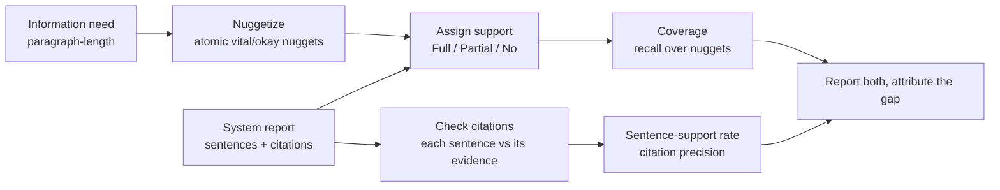

# Nugget-based evaluation

> Concept note. About 11 minutes to read. Runnable companion: [`labs/64-nugget-based-evaluation/`](../../labs/64-nugget-based-evaluation/). Math: [`math-foundations/19`](../../math-foundations/19-nugget-coverage-metrics.md).

The RAG evaluation in the earlier modules scored short, factoid-style answers. Long-form and report-generation RAG — the queries that now dominate the TREC RAG track are paragraph-length, multi-aspect information needs — break those metrics: there is no single gold string to match, and "the answer" is a multi-sentence report that should cover several facts and cite each one. The approach that has become the 2026 standard for this is **nugget-based evaluation**, and this note explains what it is, why coverage and citation are separate axes, and what the latest TREC results say about which one is hard.

## Nuggets: an old idea, refactored with LLMs

A *nugget* is an atomic fact that a good answer to an information need should contain. The methodology dates to the TREC Question Answering track in 2003; what is new is automating it. The AutoNuggetizer framework ([Pradeep et al., 2024](https://arxiv.org/abs/2411.09607)) uses an LLM to both **create** nuggets from an information need and **assign** them against a system answer, calibrated against human assessors. TREC RAGTIME 2026 adds *auto-nuggetization* (request decomposition) as an explicit task: given a report request, generate the list of single-sentence questions a report should answer.

Two scoring steps run off this. **Support assignment** is listwise: the judge reads the report and labels each nugget Full, Partial, or No support (in TREC 2025 the judge was an LLM such as GPT-4.1, calibrated against human-edited nuggets). **Coverage** then aggregates those labels — weighted by whether a nugget is *vital* (must appear) or *okay* (bonus) — into a recall-like score. Separately, **citation** is checked at the sentence level: Auto-ARGUE ([2025](https://arxiv.org/abs/2509.26184)) evaluates a report through a tree of binary judgments about each sentence's content and whether its cited evidence actually supports it, yielding a sentence-support rate.

## Coverage and citation are orthogonal

This is the part worth internalizing, because it changes what you do when a report scores poorly. **Coverage is recall**: of the nuggets that should appear, how many did the report support? **Citation (sentence-support rate) is precision**: of the sentences the report wrote, how many are actually backed by the evidence they cite? A report can be perfect on one and broken on the other:

- It can cite every sentence impeccably and still miss half the vital nuggets — high citation, low coverage. The fix is almost always **retrieval**: the system never retrieved the diverse evidence the missing nuggets needed.
- It can cover every nugget and cite the wrong document for each — high coverage, zero citation. The fix is almost always **generation**: the model is not grounding its sentences in what it cited.

[Lab 64](../../labs/64-nugget-based-evaluation/) puts three reports at these corners and shows that a single quality score cannot tell them apart — which is the same lesson the multimodal modules taught for retrieval/grounding/OCR, now for long-form reports. You report coverage and citation separately and attribute the gap.

## What the latest TREC results say

The TREC 2025 RAG and RAGTIME overviews report a clear split: **citation accuracy is quickly becoming a solved problem** as long as systems include reasonable checks (verify each sentence against its cited passage before emitting it), while **nugget coverage continues to be a work in progress**. The same overviews note that retrieval has an outsized role here and that retrieving *diverse* information — not just the top-k most similar passages, which tend to be near-duplicates — is where the headroom is. In other words, the hard, open problem in long-form RAG evaluation right now is recall of the full set of facts a report needs, not the faithfulness of the sentences a system already writes.

This also explains why agentic RAG — decompose the request into sub-questions, retrieve and answer each, assemble — is the dominant 2026 architecture for these tasks: sub-question decomposition is a direct attack on coverage, pulling in evidence a single top-k retrieval would miss.

## Building a nugget eval that holds up

- **Calibrate the nuggetizer.** Auto-generated nuggets are only trustworthy when checked against human-edited ones; report the calibration, and keep vital/okay weights explicit.
- **Judge citations at the sentence level**, against the specific passage cited, not the whole retrieved set — that is what makes the sentence-support rate a precision measure.
- **Never average coverage and citation into one number.** If you must summarize, an F-style combination ([math-foundations/19](../../math-foundations/19-nugget-coverage-metrics.md)) keeps both visible; a plain mean hides the axis that is failing.
- **Track coverage against retrieval changes**, since that is where the 2026 gains are; track citation against generation/prompting changes.

## See also

- 🧪 [Lab 64: Nugget-based coverage and citation](../../labs/64-nugget-based-evaluation/).
- 📐 [math-foundations/19: Nugget coverage metrics](../../math-foundations/19-nugget-coverage-metrics.md).
- 📖 [Grounding and OCR-reading](./grounding-and-ocr.md) — the same report-both-axes discipline for multimodal RAG.
- [TREC RAG](https://trec-rag.github.io/) / [TREC RAGTIME](https://trec-ragtime.github.io/) (2026); AutoNuggetizer [arXiv:2411.09607](https://arxiv.org/abs/2411.09607); Auto-ARGUE [arXiv:2509.26184](https://arxiv.org/abs/2509.26184).
