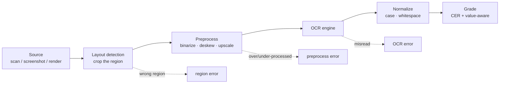

# OCR on real images

> Concept note. About 9 minutes to read. Runnable companion: [`labs/63-ocr-on-real-images/`](../../labs/63-ocr-on-real-images/). Math: [`math-foundations/18`](../../math-foundations/18-edit-distance-alignment.md).

[Grounding and OCR-reading](./grounding-and-ocr.md) argued that OCR-reading is its own evaluation axis. This note is about doing it on real images instead of a stand-in reader: what the pipeline actually looks like, how real images fail, and why you must measure rather than assume.

## The real pipeline

A multimodal RAG system does not OCR a whole page. It finds the region that matters, cleans it up, reads it, normalizes the text, and only then grades.

Each box can cost you the answer, and they fail in ways you cannot predict from the text alone - which is the whole reason [Lab 63](../../labs/63-ocr-on-real-images/) renders real pixels and runs a real engine rather than simulating the reader.

## How real images fail

Real OCR errors are driven by image quality, and the [S/I/D decomposition](../../math-foundations/18-edit-distance-alignment.md) tells you which kind you have:

- **Resolution.** Below a glyph height the engine cannot resolve strokes; small text blurs into substitutions and deletions. Upscaling before OCR often helps.
- **Noise.** Sensor or compression noise gets read as punctuation and stray marks - insertions - or, past a threshold, defeats the recognizer entirely and you get a blank read (a read failure, not a misread).
- **Blur and skew.** Defocus and rotation smear glyph boundaries, producing look-alike substitutions; deskew is a cheap, large win.
- **Compression.** Aggressive JPEG adds ringing around edges that the engine reads as speckle.

In Lab 63 these are not hypothetical: tesseract reads the clean and mildly-blurred images perfectly, returns a blank on heavy sensor noise, garbles a small blurred line into nonsense, and - the case that matters - misreads "9.4 billion" as "94 bien", deleting the decimal point. That last one is a moderate CER and a tenfold value error, which is why the answer span gets a value-aware check on top of CER.

## Preprocessing helps, and can hurt

Binarization (Otsu or adaptive thresholding), deskew, denoise, and upscaling routinely turn an unreadable region into a clean read. But each is a lever that can be pulled too far: aggressive binarization erodes thin strokes into deletions, and denoising can smear adjacent digits together. Treat the preprocessing chain as part of the system under test - version it, and measure CER with and without each step rather than assuming it helps.

## Why measure on real images

The argument for real pixels over synthetic text is the same as for any eval: the failures are emergent. You cannot list the misreads in advance - they depend on the engine version, the font, the resolution, and the degradation in combination. A synthetic stand-in can show you *that* OCR-reading is a separate axis (Labs 61-62); only real images tell you *how* your engine fails on *your* documents, and by how much. Build the eval set from representative real captures, record the engine version (OCR output drifts across versions), and keep the ground-truth text and the answer value for each item so you can grade legibility and correctness separately.

## See also

- 🧪 [Lab 63: OCR-reading on real rendered images](../../labs/63-ocr-on-real-images/) and [Lab 62: OCR-reading quality](../../labs/62-ocr-reading-quality/).
- 📖 [Grounding and OCR-reading](./grounding-and-ocr.md) — the three-axis view this fits into.
- 📐 [math-foundations/18: Edit-distance alignment](../../math-foundations/18-edit-distance-alignment.md) — the S/I/D decomposition that classifies these failures.
