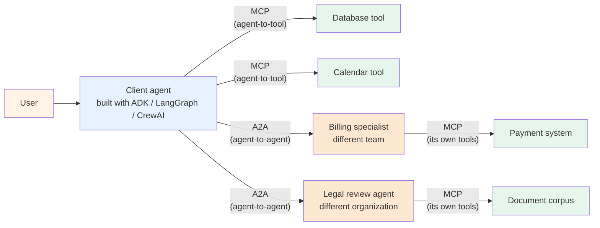

# A2A foundations

> ⏱ ~14 min · 🟡 Fast-changing protocol (v1.2 stable as of March 2026; SDK still on 1.0). Prerequisites: [Path 04 Modules 1+2+3+4 (the MCP build-consume-secure trio)](../../learning-paths/04-tool-protocols-mcp-a2a/) for the contrast with MCP — A2A's design choices make most sense once you've seen the tool-protocol side. Helpful: [Pattern 12 — A2A federation](../../patterns/12-a2a-federation.md) for the architectural framing.

A2A (Agent-to-Agent) is the protocol layer for *agent-to-agent* delegation, just as MCP is the protocol layer for *agent-to-tool* access. After completing Modules 1-4 on MCP, the natural next question is: how do agents talk to *other agents* across organizational and framework boundaries? A2A is the 2026 answer.

This module covers what A2A is at the spec level: the three primitives (Agent Cards, Tasks, Transport); the v1.0 → v1.2 evolution; how A2A and MCP compose rather than compete; the Linux Foundation governance shift; what the protocol gets right and where it strains. Lab 28 walks through actually building an A2A endpoint end-to-end with the official Python SDK.

## The problem A2A solves

By April 2026 the agentic landscape consisted of multiple competing frameworks (LangGraph, CrewAI, AutoGen, Semantic Kernel, Google ADK) running across multiple cloud platforms (AWS Bedrock, Azure AI Foundry, Google Vertex). A Salesforce Agentforce agent needs to delegate a sub-task to a ServiceNow Now Assist agent. An Adobe agent needs to coordinate with a Google Cloud agent. Without a standard, every pair needs custom integration code.

Per [Galileo January 2026](https://galileo.ai/blog/google-agent2agent-a2a-protocol-guide): "your agents built with different frameworks, deployed on different clouds, and operated by different organizations need to collaborate on complex workflows without requiring custom integration code for each connection." Per [Stellagent April 2026](https://stellagent.ai/insights/a2a-protocol-google-agent-to-agent): "for any operator designing inter-agent integration today, there is essentially no alternative to A2A as of April 2026."

A2A reduces the **N×M integration explosion** (N client agents times M remote agents) to **N+M** (each agent publishes its capabilities once via an Agent Card; any A2A-compliant peer can discover and delegate to it). This is the same architectural payoff MCP delivers for tools, applied one layer up.

## The three primitives

Per the [official A2A protocol documentation](https://a2a-protocol.org/latest/):

### 1. Agent Cards

A JSON document served at `/.well-known/agent-card.json` advertising what the agent can do, what auth it requires, and where to reach it. Per [Rapid Claw April 2026](https://rapidclaw.dev/blog/a2a-protocol-complete-guide-2026): it's "the OpenAPI for Agents."

Minimal Agent Card structure (as served by the SDK 1.0.3):

```json
{
  "name": "billing-specialist",
  "description": "Handles refunds and subscriptions",
  "version": "1.0.0",
  "protocolVersion": "1.0",
  "url": "https://billing.example.com",
  "preferredTransport": "JSONRPC",
  "capabilities": {
    "streaming": true,
    "pushNotifications": false
  },
  "defaultInputModes": ["text/plain", "application/json"],
  "defaultOutputModes": ["application/json"],
  "skills": [
    {
      "id": "refund.process",
      "name": "Process Refund",
      "description": "Process a refund with a payment ID",
      "tags": ["refund", "billing"],
      "inputModes": ["application/json"],
      "outputModes": ["application/json"]
    }
  ]
}
```

The v1.0 release in early 2026 added **Signed Agent Cards** — a cryptographic signature lets a receiving agent verify that the card was issued by the domain owner. Per [Stellagent April 2026](https://stellagent.ai/insights/a2a-protocol-google-agent-to-agent): "v1.0 is the version that met the enterprise production bar." Signed cards prevent the card-forgery class of attack (a malicious party claiming to be a trusted agent).

### 2. Tasks

A2A's first-class abstraction for the work being delegated. Per [n1n.ai May 2026](https://explore.n1n.ai/blog/google-adk-1-0-a2a-protocol-multi-agent-standard-2026-05-04): "instead of waiting for a single response (which may time out with LLMs), the client sends a task and receives a `task_id`. Progress is monitored via Server-Sent Events (SSE)." This allows token-by-token streaming and long-running operations that survive network disconnects.

Tasks have an explicit lifecycle. Per the SDK 1.0.3 `TaskState` enum and the [A2A Python guide March 2026](https://aiworkflowlab.dev/article/how-to-build-a2a-agents-python-production-guide), the states are:

| State | Meaning |
|---|---|
| `submitted` | Task received, not yet started |
| `working` | Task in progress |
| `input-required` | Agent needs more input from the client |
| `auth-required` | Agent needs authentication from the client |
| `completed` | Task finished successfully |
| `failed` | Task failed (terminal) |
| `canceled` | Task canceled (terminal) |
| `rejected` | Agent refused the task (terminal) |

The terminal states (`completed`, `failed`, `canceled`, `rejected`) are the four ways a task can permanently end. The non-terminal states (`submitted`, `working`, `input-required`, `auth-required`) are the four ways it can be alive but waiting.

A Task contains an `id`, `context_id` (for multi-task conversations), `status`, `artifacts` (the typed results), and `history` (the messages exchanged).

### 3. Transport — JSON-RPC 2.0 over HTTP+SSE

Per the [A2A protocol docs](https://a2a-protocol.org/latest/) and [atlan.com April 2026](https://atlan.com/know/google-a2a-protocol/): "HTTP + SSE + JSON-RPC 2.0 — no new protocol layer required." A2A explicitly reuses existing web infrastructure rather than inventing transport from scratch. The same pragmatic choice MCP made.

The JSON-RPC method names use gRPC-style PascalCase: `SendMessage`, `GetTask`, `ListTasks`, `CancelTask`, `SubscribeToTask`, `CreateTaskPushNotificationConfig`, `GetExtendedAgentCard`. A v0.3-compatibility layer exists in the SDK for legacy clients that still use slash-style names (`message/send`, `tasks/get`).

Streaming uses Server-Sent Events; non-streaming requests use plain JSON responses. Push notifications (via `CreateTaskPushNotificationConfig`) let a remote agent notify the client when a long-running task completes asynchronously — useful for tasks that may take minutes or hours.

## A2A and MCP are complementary, not competing

The single most-cited misunderstanding about A2A in 2026: that it competes with MCP. It doesn't. Per [Stellagent April 2026](https://stellagent.ai/insights/a2a-protocol-google-agent-to-agent): "A2A and MCP are complementary layers, not competitors." Per the [A2A protocol homepage](https://a2a-protocol.org/latest/): "Build with ADK (or any framework), equip with MCP (or any tool), and communicate with A2A, to remote agents, local agents, and humans."

The clearest way to see the distinction:



Each agent uses MCP internally for its own tools; the orchestrator uses A2A to coordinate across agent boundaries. Per [AI Workflow Lab March 2026](https://aiworkflowlab.dev/article/how-to-build-a2a-agents-python-production-guide): "this separation is really nice because you can swap out agents independently, scale them separately, and even replace the LLM framework behind one agent without touching the others."

Picking the wrong protocol means building the wrong abstraction. Per [dev.to April 2026](https://dev.to/agentsindex/googles-a2a-protocol-how-ai-agents-communicate-across-frameworks-52jj): confusing MCP with A2A is "frequently observed and has consequences."

## v1.0 → v1.2 evolution (the first year)

Per [Rapid Claw April 2026](https://rapidclaw.dev/blog/a2a-protocol-complete-guide-2026), the spec evolved through public RFCs:

- **April 9, 2025** — Google launches A2A at Cloud Next with 50+ partners (Accenture, Atlassian, Box, Cohere, Deloitte, Elastic, LangChain, MongoDB, PayPal, Salesforce, SAP, ServiceNow, UiPath).
- **June 23, 2025** — Google donates the protocol, specification, and Python/TypeScript SDKs to the Linux Foundation. Per the [Linux Foundation announcement](https://www.linuxfoundation.org/press/linux-foundation-launches-the-agent2agent-protocol-project-to-enable-secure-intelligent-communication-between-ai-agents): vendor-neutral governance under the Agent2Agent Protocol Project.
- **August 2025** — IBM's ACP (Agent Communication Protocol) merges into A2A under LF AI & Data. Per Stellagent: "A2A's largest potential competitor joined it voluntarily."
- **Early 2026** — v1.0 with Signed Agent Cards lands.
- **March 2026** — v1.2 lands as the current stable.
- **April 9, 2026** — One-year mark. Per the [Linux Foundation press release](https://www.linuxfoundation.org/press/a2a-protocol-surpasses-150-organizations-lands-in-major-cloud-platforms-and-sees-enterprise-production-use-in-first-year): 150+ organizations supporting the standard; deep integrations across Google (Vertex AI), Microsoft (Azure AI Foundry), AWS (Bedrock AgentCore); active production deployments across supply chain, financial services, insurance, and IT operations.
- **April 2026 (Google Cloud Next 2026)** — ADK 1.0 GA across Python, Go, Java, TypeScript. Per [n1n.ai May 2026](https://explore.n1n.ai/blog/google-adk-1-0-a2a-protocol-multi-agent-standard-2026-05-04): "this convergence, alongside Anthropic's Model Context Protocol (MCP), has solidified a new architectural blueprint for enterprise AI."

The Python SDK lags the spec slightly: it's on v1.0.3 while the spec is at v1.2. The SDK maintains a `v0_3` compatibility mode for legacy clients per [github.com/a2aproject/a2a-python](https://github.com/a2aproject/a2a-python).

## Framework support (April 2026)

Native A2A is built into:

- **Google ADK** (1.0 GA across four languages April 2026)
- **LangGraph** (one of the launch partners)
- **CrewAI**
- **LlamaIndex Agents**
- **Microsoft Semantic Kernel**
- **AutoGen**

Per [Rapid Claw](https://rapidclaw.dev/blog/a2a-protocol-complete-guide-2026): production examples include Salesforce Agentforce exposing every custom agent as an A2A endpoint; SAP's Joule orchestrator delegating subtasks (legal review, finance checks) to partner A2A agents across S/4HANA; ServiceNow Now Assist registering A2A agents as skills with incident triage fanning out to specialized agents.

## What the Python SDK gives you

The official [`a2a-sdk`](https://github.com/a2aproject/a2a-python) package (Python 3.10+) provides:

1. **Protobuf-based types** (`AgentCard`, `AgentSkill`, `AgentCapabilities`, `Task`, `Message`, `Part`, `Role`, `TaskState`) — protocol-buffer schemas at the wire level. Note: this is a 2026 architectural shift; pre-1.0 versions used Pydantic.
2. **`AgentExecutor` abstract class** — subclass and implement `execute()` and `cancel()`. The execute method gets a `RequestContext` (the incoming message + task state) and an `EventQueue` (for publishing the response lifecycle).
3. **`TaskUpdater`** — convenience class for publishing `submitted` → `working` → terminal state transitions plus artifact deliveries.
4. **`DefaultRequestHandler`** — wires together the executor, task store, and agent card. Routes incoming JSON-RPC calls to the right methods.
5. **`InMemoryTaskStore`** + persistent stores — `DatabaseTaskStore` backed by PostgreSQL, MySQL, or SQLite for production deployments. Per [AI Workflow Lab](https://aiworkflowlab.dev/article/how-to-build-a2a-agents-python-production-guide): "InMemoryTaskStore is fine for development but loses all state on restart. For production, pick a persistent backend."
6. **Route factory** — `create_agent_card_routes` + `create_jsonrpc_routes` produce Starlette `Route` objects you mount on Starlette or FastAPI. The pre-1.0 SDK had an `A2AStarletteApplication` wrapper; the 1.0 route factory is more composable.
7. **OpenTelemetry integration** — built-in tracing across A2A calls per [AI Workflow Lab](https://aiworkflowlab.dev/article/how-to-build-a2a-agents-python-production-guide). The trace context propagates through delegations, giving distributed tracing across an agent mesh.
8. **Client side** — `Client`, `ClientFactory`, `A2ACardResolver` for fetching Agent Cards, validating signatures, and sending JSON-RPC requests.

Lab 28 builds a working A2A endpoint with this exact SDK surface.

## When to use A2A

The four canonical cases from [Pattern 12 — A2A federation](../../patterns/12-a2a-federation.md):

1. **Cross-vendor agent coordination.** A Salesforce agent delegates to a ServiceNow agent. A Google Vertex agent coordinates with an AWS Bedrock agent. Without A2A, each pair needs custom integration code.
2. **Cross-organizational delegation with auth boundaries.** A2A is the protocol-layer expression of *one agent delegates to another agent's authority*. The remote agent runs in its own environment with its own permissions; a bespoke integration would require sharing credentials.
3. **Long-running tasks with progress streaming.** The task lifecycle plus SSE streaming makes A2A the right shape for tasks that run minutes-to-hours. A2A supports sync, streaming, and asynchronous push-notification patterns.
4. **Version negotiation across heterogeneous agents.** A v0.3 client can talk to a v1.0 server (via the SDK's compat layer) — compatibility a bespoke integration rarely gets right.

## When NOT to use A2A

- **In-process multi-agent systems.** Your supervisor + workers in one Python process don't need HTTP. Use the in-process supervisor-worker pattern from [Path 03 Module 1](../../learning-paths/03-multi-agent-systems/) instead. A2A's payoff is across process and organizational boundaries.
- **Agent-to-tool access.** That's MCP. Pattern 11 (MCP integration) — not Pattern 12. Mixing them up is the most common A2A misunderstanding.
- **Delegating to one specific known agent.** For a single dedicated downstream service, a typed REST API or gRPC is simpler. A2A's payoff scales with the *number* of remote agents you'd plausibly call.
- **Sub-100ms task delegation.** A2A adds Agent Card discovery + JSON-RPC + HTTP round-trip latency. For snappy interactive flows, in-process supervisor-worker is the right shape.

## What A2A doesn't yet do well

Two practical limitations as of A2A v1.2 / SDK 1.0.3 (April-May 2026):

1. **The SDK lags the spec.** Spec at v1.2 (March 2026); SDK at v1.0.3 (April 2026). Some v1.2 features (advanced security extensions, the AP2 commerce extension) aren't fully wired in the Python SDK yet. The compat-mode `enable_v0_3_compat` flag handles legacy clients but adds complexity.
2. **Production task-store ergonomics are early.** `DatabaseTaskStore` exists for PostgreSQL/MySQL/SQLite but the migration story (running `alembic`-style migrations as the protocol evolves) isn't yet smooth. For now, treat the task store as an append-mostly persistence layer and expect to do some manual schema management.

These aren't reasons to avoid A2A — they're reasons to expect rough edges in production deployments. The protocol itself is solid; the tooling around it will mature through 2026.

## What's next

- 🧪 [Lab 28 — A2A endpoint from scratch](../../labs/28-a2a-endpoint-from-scratch/) — build a working `hello-agent` A2A server with the SDK 1.0.3; serve its Agent Card; respond to a real JSON-RPC `SendMessage` request; observe the full Task lifecycle (`submitted` → `working` → `completed`) end-to-end. No mock servers — actual uvicorn + actual HTTP roundtrip.
- 🧠 [A2A foundations quiz](../../quizzes/foundations/a2a-foundations.md) — 8 questions covering this page + Lab 28
- 📖 **Future Module 6** — Building an A2A endpoint at production depth (auth, signed Agent Cards, persistent task stores, error handling, push notifications)
- 📖 **Future Module 7** — MCP + A2A composition (the hybrid workflow pattern: agents use MCP for their own tools while using A2A to coordinate with each other)

## References

**Primary sources**:
- [A2A Protocol official documentation](https://a2a-protocol.org/latest/) — Linux Foundation governed; the canonical spec reference
- [github.com/a2aproject/a2a-python](https://github.com/a2aproject/a2a-python) — Python SDK 1.0.3; v0.3 → v1.0 migration guide
- [Linux Foundation A2A Protocol Project (June 2025 launch)](https://www.linuxfoundation.org/press/linux-foundation-launches-the-agent2agent-protocol-project-to-enable-secure-intelligent-communication-between-ai-agents)
- [Linux Foundation one-year announcement (April 9, 2026)](https://www.linuxfoundation.org/press/a2a-protocol-surpasses-150-organizations-lands-in-major-cloud-platforms-and-sees-enterprise-production-use-in-first-year) — 150+ orgs; production milestones
- [Google A2A launch (April 9, 2025)](https://developers.googleblog.com/en/a2a-a-new-era-of-agent-interoperability/)
- [Google Cloud A2A v0.3 announcement (July 2025)](https://cloud.google.com/blog/products/ai-machine-learning/agent2agent-protocol-is-getting-an-upgrade)
- [Google Codelabs — Purchasing Concierge A2A tutorial](https://codelabs.developers.google.com/intro-a2a-purchasing-concierge) — working SDK example

**2026 industry grounding**:
- Stellagent (April 10, 2026), [*A2A Protocol Explained: How Google's Agent-to-Agent Standard Grew to 150+ Organizations in One Year*](https://stellagent.ai/insights/a2a-protocol-google-agent-to-agent) — v1.0 Signed Agent Cards; AP2 commerce extension
- Rapid Claw (April 20, 2026), [*Google's A2A Protocol — The Complete Guide*](https://rapidclaw.dev/blog/a2a-protocol-complete-guide-2026) — v1.2 in March 2026; framework support; Salesforce/SAP/ServiceNow production examples
- atlan.com (April 2026), [*Google A2A Protocol: How Agent-to-Agent Coordination Works*](https://atlan.com/know/google-a2a-protocol/) — Azure AI Foundry, AWS Bedrock AgentCore, Google Cloud native integrations
- Galileo (January 2026), [*Google's Agent2Agent Protocol Explained*](https://galileo.ai/blog/google-agent2agent-a2a-protocol-guide) — Apache-2.0; Linux Foundation governance
- n1n.ai (May 2026), [*Google ADK 1.0 and A2A Protocol: Defining the 2026 Multi-Agent Standard*](https://explore.n1n.ai/blog/google-adk-1-0-a2a-protocol-multi-agent-standard-2026-05-04) — Google Cloud Next 2026 ADK 1.0 GA across Python/Go/Java/TypeScript
- AI Workflow Lab (March 3, 2026), [*A2A Agents in Python Guide (2026)*](https://aiworkflowlab.dev/article/how-to-build-a2a-agents-python-production-guide) — Python 3.10+; OpenTelemetry; persistent task stores (PostgreSQL/MySQL/SQLite)
- Towards Data Science, [*Multi-Agent Communication with the A2A Python SDK*](https://towardsdatascience.com/multi-agent-communication-with-the-a2a-python-sdk/) — `Direct Configuration` strategy; multi-agent fan-out
- dev.to (April 2026), [*Google's A2A Protocol: How AI Agents Communicate Across Frameworks*](https://dev.to/agentsindex/googles-a2a-protocol-how-ai-agents-communicate-across-frameworks-52jj) — the MCP-vs-A2A distinction

**Adjacent repo content**:
- 📖 [MCP foundations](./mcp-foundations.md) — Module 1; the agent-to-tool counterpart
- 📖 [Building an MCP server](./building-an-mcp-server.md) — Module 2; analogous "build the server side" pattern
- 📖 [Building an MCP client](./building-an-mcp-client.md) — Module 3; analogous "build the client side" pattern
- 📖 [MCP security threat model](./mcp-security-threat-model.md) — Module 4; A2A's analogous threat model (Signed Agent Cards, capability attestation) is a future module
- 🏛 [Pattern 12 — A2A federation](../../patterns/12-a2a-federation.md) — the architecture-level companion authored Batch 44
- 🏛 [Pattern 11 — MCP integration](../../patterns/11-mcp-integration.md) — Pattern 12's companion; together they describe the full 2026 interoperability stack
- 🛣 [Path 04 README](../../learning-paths/04-tool-protocols-mcp-a2a/) — the path Module 5 lives in
