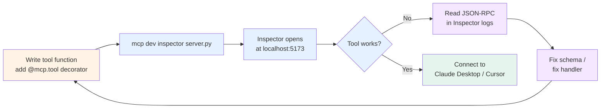

# Building an MCP server

> ⏱ ~13 min · 🟡 Intermediate · Prerequisites: [MCP foundations](./mcp-foundations.md). Helpful: [`concepts/tools/tool-design.md`](./tool-design.md) — tool semantics carry over from single-agent design to MCP servers.

The previous page covered what MCP *is*. This page covers what you do with it. Specifically: how to build an MCP server in Python using FastMCP 3.0, the framework that [powers ~70% of MCP servers across all languages](https://github.com/prefecthq/fastmcp) per the project's own data.

By the end of this page you'll be able to read a real MCP server's source and explain every line. [Lab 25](../../labs/25-mcp-server-from-scratch/) builds one from scratch and tests it end-to-end.

## Why FastMCP exists

The raw [MCP Python SDK](https://github.com/modelcontextprotocol/python-sdk) requires you to register handlers for each method (`tools/list`, `tools/call`, etc.), build JSON Schema for each tool by hand, manage the JSON-RPC plumbing, and handle the initialize/shutdown lifecycle yourself. It works, but it's ~80 lines of boilerplate before you've written a single tool.

FastMCP 3.0 (released [January 19, 2026](https://www.firecrawl.dev/blog/fastmcp-tutorial-building-mcp-servers-python)) collapses that to a single decorator. A working server is ~30 lines per the [May 2026 jangwook.net writeup](https://jangwook.net/en/blog/en/fastmcp-python-mcp-server-build-guide-2026/). The framework reads your function's type hints, derives the JSON Schema automatically, registers the tool with the protocol layer, and handles the lifecycle. You write Python; you get an MCP server.

The trade is a thin layer of magic — if FastMCP's schema inference doesn't match what you wanted, you write the JSON Schema manually anyway. For most tools, the type-hint path is fine; for tools with complex parameter shapes (optional union types, nested validation), explicit Pydantic models are clearer.

## The 30-line server

The smallest useful FastMCP server:

```python
from fastmcp import FastMCP

mcp = FastMCP("notes-server")

NOTES: dict[str, str] = {}


@mcp.tool()
def create_note(title: str, body: str) -> dict:
    """Create a note with the given title and body."""
    NOTES[title] = body
    return {"status": "created", "title": title}


@mcp.tool()
def get_note(title: str) -> dict:
    """Retrieve a note by title. Returns 'not_found' status if missing."""
    if title not in NOTES:
        return {"status": "not_found", "title": title}
    return {"status": "ok", "title": title, "body": NOTES[title]}


@mcp.tool()
def list_notes() -> list[str]:
    """List all note titles."""
    return list(NOTES.keys())


if __name__ == "__main__":
    mcp.run()
```

That's a complete MCP server. Three tools, type hints become schemas, the docstrings become tool descriptions. Run it with `python server.py` and it serves over stdio; connect Claude Desktop or the MCP Inspector to it.

Notice what's NOT in this code:
- No JSON-RPC message handling
- No `tools/list` or `tools/call` method registration
- No JSON Schema definitions
- No initialize/shutdown lifecycle code

FastMCP derives all of it from the type hints and the `@mcp.tool()` decorator. The trade I mentioned earlier: if you want a parameter with a constrained value range, you'd write `Literal["status_ok", "status_error"]` or a Pydantic model rather than `str`. The framework handles both.

## The three decorators

FastMCP's three pillars per the [Welcome page at gofastmcp.com](https://gofastmcp.com/getting-started/welcome) map directly to the three MCP primitives from [the foundations page](./mcp-foundations.md):

| Decorator | Primitive | Initiates |
|---|---|---|
| `@mcp.tool()` | Tool | LLM-controlled |
| `@mcp.resource(uri)` | Resource | Host-controlled |
| `@mcp.prompt()` | Prompt | User-controlled (slash command) |

A resource — the host-pulled data primitive:

```python
@mcp.resource("notes://all")
def all_notes() -> str:
    """All notes in the system, joined as a single text blob."""
    return "\n\n---\n\n".join(
        f"# {title}\n\n{body}" for title, body in NOTES.items()
    )


@mcp.resource("notes://{title}")
def one_note(title: str) -> str:
    """A single note by title, addressed by URI."""
    return NOTES.get(title, "[note not found]")
```

The `notes://{title}` pattern is templated — the URI parameter becomes a function argument. The host can read `notes://Q3-plan` and get just that note's content without invoking a tool. This is faster for read-only data than going through `tools/call`; it's also semantically clearer ("the host *consulted* the notes" vs. "the agent *invoked* a tool").

A prompt — the user-pickable template:

```python
@mcp.prompt()
def summarize_note(title: str) -> str:
    """Summarize a note in 3 bullet points."""
    body = NOTES.get(title, "")
    return f"Summarize the following note in exactly 3 bullets:\n\n{body}"
```

When the user types `/summarize_note title="Q3-plan"` in Claude Desktop, the host fetches this prompt and uses it as the LLM message. The prompt is reusable across sessions; the title parameter makes it parametric.

## Type hints become JSON Schema — the inference rules

FastMCP's schema inference follows a predictable mapping:

| Python type | JSON Schema type | Notes |
|---|---|---|
| `str` | `"string"` | Default |
| `int` | `"integer"` | Strict; not `"number"` |
| `float` | `"number"` | |
| `bool` | `"boolean"` | |
| `list[T]` / `List[T]` | `{"type": "array", "items": <T>}` | T is recursively inferred |
| `dict[str, T]` / `Dict[str, T]` | `{"type": "object", "additionalProperties": <T>}` | |
| `Literal["a", "b"]` | `{"enum": ["a", "b"]}` | Use for constrained string params |
| `Optional[T]` / `T \| None` | T with `"nullable": true` | |
| Pydantic `BaseModel` | Full nested schema from the model | Best for complex shapes |

The non-obvious cases:

- **Docstrings become tool descriptions.** The first line of the docstring is the tool's short description; the full docstring goes into the JSON Schema's `description` field. This is what the LLM sees when deciding whether to call the tool. **Write good docstrings**; vague descriptions are the #1 cause of [tool-selection failures](./tool-selection.md).
- **Parameter docstrings (Google or Sphinx style) become parameter descriptions.** FastMCP parses these. If you write `Args: title: The title of the note.`, that description ends up in the tool's parameter schema.
- **Return type hints are documentary, not enforced.** FastMCP doesn't validate the return value against the type hint. If your function says `-> dict` and returns `None`, the client gets `None`. Use Pydantic if you need return validation.

The schema inference is what makes the 30-line server work. The cost is one indirection: when something goes wrong, you debug Python types instead of JSON Schema. Most of the time, that's an improvement.

## The MCP Inspector workflow

The [MCP Inspector](https://github.com/modelcontextprotocol/inspector) is the canonical development tool. It connects to your server, introspects its capabilities, and gives you a UI to invoke tools, read resources, and trigger prompts. It also shows the raw JSON-RPC messages — which is how you debug schema mismatches.

The development loop:



Three Inspector workflows worth knowing:

1. **The schema view.** Click a tool in the Inspector and you see the generated JSON Schema. Compare it to what you intended; if the schema misses an optional parameter or has the wrong constraint, your type hint isn't doing what you think.
2. **The raw message view.** Every JSON-RPC request and response is logged. When a tool call fails silently in your agent, run it through the Inspector instead — you'll see the actual error in the JSON-RPC response.
3. **The resource template view.** For URI-templated resources, the Inspector lets you instantiate the template (e.g., set `title=Q3-plan` for `notes://{title}`) and see the resolved content. This is the cheapest way to test resource URI patterns.

For the Lab 25 workflow specifically: build the server, run `mcp dev inspector server.py`, open the Inspector at `http://localhost:5173`, exercise each tool from the UI, then write a Python client to call the same tools programmatically.

## The Python client side — `fastmcp.Client`

The same FastMCP package ships a client. The minimal client to call the notes server:

```python
from fastmcp import Client
import asyncio


async def main():
    async with Client("server.py") as client:
        # List capabilities
        tools = await client.list_tools()
        resources = await client.list_resources()
        prompts = await client.list_prompts()

        # Call a tool
        result = await client.call_tool(
            "create_note",
            {"title": "Q3-plan", "body": "Ship MCP module."}
        )
        print(result)

        # Read a resource
        content = await client.read_resource("notes://Q3-plan")
        print(content)


asyncio.run(main())
```

`Client("server.py")` figures out the transport from the argument — a local file path spawns the server as a stdio subprocess; an `http://` or `https://` URL connects over Streamable HTTP. The context manager handles initialize and shutdown.

This is the same client surface your agent uses, regardless of which framework you're in. LangGraph, OpenAI Agents SDK, Claude Code — they all wrap `fastmcp.Client` (or its equivalent in their language) when talking to MCP servers. Understanding the client surface lets you reason about what your framework is doing under the hood.

## Deployment patterns — stdio vs Streamable HTTP

For local development and desktop integrations, stdio is right:

```python
if __name__ == "__main__":
    mcp.run()  # defaults to stdio
```

For anything else, switch to Streamable HTTP:

```python
if __name__ == "__main__":
    mcp.run(transport="streamable-http", host="0.0.0.0", port=8000)
```

The Streamable HTTP path adds the production concerns the stdio path skips:

- **TLS**. Required in production. FastMCP delegates this to your reverse proxy (nginx, Caddy) or your hosting platform.
- **OAuth 2.1**. Required for non-local clients. FastMCP 3.0 ships with [pluggable auth providers](https://www.firecrawl.dev/blog/fastmcp-tutorial-building-mcp-servers-python); the simplest is a token-based provider for internal services, escalating to full OAuth flows for external users.
- **Persistence**. The 30-line example uses an in-memory dict. Production servers use SQLite, PostgreSQL, or whatever fits — FastMCP doesn't care, the tool functions just access whatever data layer you wire up.
- **Observability**. FastMCP 3.0 ships [OpenTelemetry integration out of the box](https://tech-insider.org/how-to-build-mcp-server-python-fastmcp-tutorial/) per tech-insider April 2026. Spans for each tool call, resource read, and prompt fetch. This composes directly with [Path 06's OpenTelemetry GenAI conventions](../evaluation/opentelemetry-genai-conventions.md).
- **Rate limiting and idempotency**. Server-side concerns; out of scope for this concept page but covered in Module 4 (future) when we get to the MCP security threat model.

These are real production concerns but they're independent of the MCP-specific code. A FastMCP server with TLS + OAuth + SQLite + OTel is still just `@mcp.tool()` decorators on Python functions — the production layer wraps the server without changing its shape.

## Common mistakes

The three patterns that catch first-time MCP server authors:

1. **Vague tool descriptions.** Type hints work; missing docstrings don't. A tool named `create` with description `"creates"` will be picked wrong by the LLM half the time. The [`concepts/tools/tool-design.md`](./tool-design.md) rules for naming and describing single-agent tools apply equally to MCP tools — the LLM is making the same decision in both cases.
2. **Confusing tools with resources.** If the LLM is going to *decide* whether to fetch something, it's a tool. If the host *always* fetches it (via the user's UI or a system rule), it's a resource. Putting a frequently-needed read-only datum behind a tool wastes a tool slot and adds a reasoning step; putting an actionable mutation behind a resource is impossible (resources are read-only).
3. **Mutating state without idempotency keys.** The host or the network can retry an MCP request. A `send_email` tool with no idempotency key can send the same email twice. The [Path 03 Pattern 5 retry-policies discussion](../../learning-paths/03-multi-agent-systems/patterns/05-retry-policies.md) applies — write side-effectful tools to be replay-safe. Future Module 4 covers this in depth.

## Where this falls in the path

This is Module 2 of [Path 04](../../learning-paths/04-tool-protocols-mcp-a2a/). Module 1 was [MCP foundations](./mcp-foundations.md) (what MCP is). This module is *building a server*. Future modules:

- **Module 3 — Building an MCP client**: consuming external servers from your agent; tool discovery; error handling across the protocol boundary
- **Module 4 — MCP security and the tool-layer threat model**: the [arxiv:2601.10955](https://arxiv.org/abs/2601.10955) resource-amplification attack; safe-default tool exposure; rate limits and idempotency at the server
- **Module 5 — A2A foundations**: the agent-to-agent protocol, the complement to MCP
- **Module 6 — Building an A2A endpoint**
- **Module 7 — MCP + A2A together**: the production composition

## What's next

- 🧪 [Lab 25 — MCP server from scratch](../../labs/25-mcp-server-from-scratch/) — build a real notes server with all three primitives; test with MCP Inspector + a Python client; debug a deliberately-broken tool schema; deploy over Streamable HTTP
- 🧠 [Quiz — MCP foundations and server](../../quizzes/foundations/mcp-foundations-and-server.md) — 8 questions across this page, the previous page, and the lab

## References

**FastMCP and SDK**:
- [FastMCP project at gofastmcp.com](https://gofastmcp.com/getting-started/welcome) — official documentation; ~1M downloads/day; powers ~70% of MCP servers
- [FastMCP on GitHub](https://github.com/prefecthq/fastmcp) — source; FastMCP 3.0 release notes; CHANGELOG
- [MCP Python SDK](https://github.com/modelcontextprotocol/python-sdk) — the underlying SDK FastMCP wraps
- [MCP Inspector](https://github.com/modelcontextprotocol/inspector) — the canonical dev tool

**2026 tutorials and production patterns**:
- Kevin Tan (February 2026, updated April 2026), *[How to Build an MCP Server in Python with FastMCP 3.0 (Full Code)](https://blog.jztan.com/how-to-build-an-mcp-server-in-python-step-by-step/)* — the under-100-lines notes-server reference build
- tech-insider.org (April 2026), *[Build an MCP Server in Python: FastMCP Guide 2026](https://tech-insider.org/how-to-build-mcp-server-python-fastmcp-tutorial/)* — PostgreSQL integration, OAuth, Docker deployment, OpenTelemetry
- tech-insider.org (April 2026), *[MCP Server Tutorial: 12 Steps Python FastMCP](https://tech-insider.org/mcp-server-tutorial-python-fastmcp-claude-2026/)* — the 12-step production-deployment tutorial with MCP Inspector workflow
- firecrawl.dev (April 2026), *[How to Build MCP Servers in Python: Complete FastMCP Tutorial](https://www.firecrawl.dev/blog/fastmcp-tutorial-building-mcp-servers-python)* — FastMCP 3.0 features (component versioning, authorization, OpenTelemetry, multiple provider types)
- machinelearningmastery.com (February 2026), *[Building a Simple MCP Server in Python](https://machinelearningmastery.com/building-a-simple-mcp-server-in-python/)* — the minimum-viable server pattern
- jangwook.net (May 2026), *[Building a Python MCP Server in 30 Minutes with FastMCP 3.x](https://jangwook.net/en/blog/en/fastmcp-python-mcp-server-build-guide-2026/)* — the 30-line working example

**Adjacent repo content**:
- 📖 [MCP foundations](./mcp-foundations.md) — Module 1 (this page's prerequisite)
- 📖 [`concepts/tools/tool-design.md`](./tool-design.md) — naming and description rules apply to MCP tools
- 📖 [`concepts/tools/tool-selection.md`](./tool-selection.md) — how the LLM picks among tools
- 🏛 [Top-level `patterns/README.md`](../../patterns/) — Pattern 11 (MCP integration) as architecture-level view
- 🔒 [`security/README.md`](../../security/) — defense-in-depth principles Module 4 will specialize for MCP
- 🛡 [Path 03 Pattern 5 — Retry policies](../../learning-paths/03-multi-agent-systems/patterns/05-retry-policies.md) — idempotency-key conventions applicable to side-effectful MCP tools
- 📊 [`concepts/evaluation/opentelemetry-genai-conventions.md`](../evaluation/opentelemetry-genai-conventions.md) — what FastMCP 3.0's OTel integration plugs into
- 🛣 [Path 04 README](../../learning-paths/04-tool-protocols-mcp-a2a/) — the path scaffold this is Module 2 of
