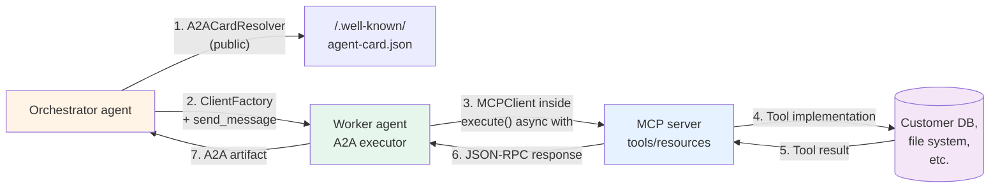

# MCP + A2A composition

> ⏱ ~14 min · 🟡 Fast-changing composition surface (both protocols active; SDK 1.0.3 + FastMCP 3.3+; composition patterns continue to firm up). Prerequisites: [Module 5 — A2A foundations](./a2a-foundations.md) for the primitives; [Module 6 — A2A endpoint at production depth](./a2a-endpoint-production-depth.md) for the production wrap-up that left push notifications + OAuth2 explicitly deferred to this module; [Module 3 — Building an MCP client](./building-an-mcp-client.md) for the agent-to-tool side. The canonical Path 04 closer.

Modules 1-4 covered MCP: how agents access tools that live in other processes. Modules 5-6 covered A2A: how agents call other agents over a network boundary. Module 7 covers what happens when both are in the same system — the composition pattern that closes Path 04.

The composition is asymmetric on purpose. MCP is for **agent-to-tool**: a fixed, programmatic contract; tools are nouns the agent uses. A2A is for **agent-to-agent**: an open-ended, conversational contract; other agents are peers the agent collaborates with. Most real systems have both — an agent uses MCP for its own tools while using A2A to coordinate with other specialists. The two protocols don't compete; they layer.

This module describes that layering at three depths: the protocols-side-by-side view, the canonical composition pattern (worker uses MCP inside, A2A on outside), and the orchestrator pattern that puts an A2A client on top.

## The shape of composition



The diagram makes the asymmetry visible. The orchestrator only knows about A2A — it discovered the worker via its Agent Card, called it via the A2A protocol. The worker does both — accepts A2A requests on the outside, opens an MCP client on the inside. The MCP server only knows about MCP — to it, the worker is just another client.

This shape generalizes. The worker could itself be one of many: another orchestrator with its own A2A subordinates, a multi-MCP agent, an agent using A2A and MCP and OpenAPI side-by-side. The composition is recursive.

## When the composition is the right shape

A few signals that you're in the territory:

- **One agent uses tools that another agent shouldn't see.** The composed worker pattern keeps tools encapsulated. The orchestrator gets the worker's *capability* (the skill list in the card); it doesn't get the worker's *implementation* (the MCP server URL, the database, the API keys). The capability is the contract; the implementation is hidden.
- **Tools cluster by ownership.** A customer-service team owns a knowledge-base MCP server; a billing team owns a payment-system MCP server. Each team's agent is the only thing that touches its own MCP. Orchestrator agents call those team agents via A2A — never directly through the team's MCP. Organizational boundaries become network boundaries; the protocols enforce them.
- **Some tasks need a long-running specialist.** Push notifications (Module 6 deferred them; they're a Module 7 concern) work in cross-agent flows because the orchestrator delegates a long-running task to the worker and gets a webhook when it completes. The MCP layer underneath doesn't change; only the A2A layer's task-lifecycle semantics matter.
- **Different teams ship different agents at different velocities.** The contract is the Agent Card; if the worker team ships a new internal MCP tool tomorrow, the orchestrator doesn't know or care — the A2A card surface stayed the same.

When the composition is overkill:

- **A single agent uses a handful of stable tools.** Just use MCP directly. A2A in front of MCP is for crossing process or organizational boundaries — if there's no boundary to cross, the indirection is cost without benefit.
- **All the agents live in the same process and share the same code.** Path 03's in-process patterns (supervisor-worker, generator-critic, plan-and-execute) cover this. A2A's protocol overhead is wasted on in-process coordination.

## The composed-worker code shape

Building a worker that uses MCP internally is fewer than 30 lines of new code on top of Lab 28's `hello_agent_server.py`:

```python
from fastmcp import Client as MCPClient
from a2a.server.agent_execution import AgentExecutor
from a2a.server.tasks import TaskUpdater
from a2a.helpers import new_text_part, new_task_from_user_message


class ComposedAgent(AgentExecutor):
    """A2A worker; uses an MCP server internally for tool calls."""

    async def execute(self, context, event_queue):
        message_text = self._extract_text(context.message)

        task = new_task_from_user_message(context.message)
        await event_queue.enqueue_event(task)
        updater = TaskUpdater(event_queue, task.id, task.context_id)
        await updater.start_work()

        # The composition: open the MCP client inside the A2A request lifetime.
        # The orchestrator never knows the MCP server exists.
        async with MCPClient("http://internal-kb:9991/mcp") as mcp:
            summary = (await mcp.call_tool("summarize_request", {"text": message_text})).data
            kb_result = (await mcp.call_tool("lookup_customer", {"customer_id": "C-100"})).data

        await updater.add_artifact(
            parts=[new_text_part(f"{summary}\n{kb_result}")],
            name="result",
        )
        await updater.complete()

    async def cancel(self, context, event_queue):
        raise NotImplementedError
```

Three things to notice. First, the `MCPClient` is opened inside `execute()` — one client per request. That's correct for short-lived tools; for high-frequency calls, hold the client open in the executor's `__init__` and reuse. Second, the MCP URL is the worker's internal config — orchestrators have no way to discover it. Third, `execute()` is async; both A2A and MCP are async-native; the composition is natural.

Production deployments add the same hardening the underlying protocols need — Module 4's MCP defenses (tool allowlist, response sanitization, fingerprint cache) protect the MCP edge; Module 6's A2A defenses (signed cards, auth middleware, `DatabaseTaskStore`) protect the A2A edge. Composition doesn't replace either layer's hardening; it stacks them.

## The orchestrator code shape

The orchestrator is the A2A client side. The SDK 1.0.3 ships two helpers that make this trivial:

- **`A2ACardResolver`** — fetches the Agent Card from `<base_url>/.well-known/agent-card.json`. Returns the protobuf `AgentCard`. Pass an `httpx.AsyncClient` for connection pooling across multiple resolutions.
- **`ClientFactory(config=ClientConfig(...)).create(card)`** — builds a `Client` from a resolved card. The factory picks the right transport based on the card's `supported_interfaces`. The `ClientConfig` controls streaming, polling, HTTP client, push notification defaults.

```python
import httpx
from a2a.client import A2ACardResolver, ClientFactory, ClientConfig
from a2a.types import SendMessageRequest, Message, Role
from a2a.helpers import new_text_part


async def call_worker(base_url: str, prompt: str) -> str:
    async with httpx.AsyncClient(timeout=30) as http:
        # 1. Discover
        resolver = A2ACardResolver(httpx_client=http, base_url=base_url)
        card = await resolver.get_agent_card()

        # 2. Build the client
        factory = ClientFactory(config=ClientConfig(httpx_client=http, streaming=False))
        client = factory.create(card)

        # 3. Send the message; iterate the result stream
        msg = Message(
            message_id="orch-1", role=Role.ROLE_USER,
            parts=[new_text_part(prompt)],
        )
        async for event in client.send_message(SendMessageRequest(message=msg)):
            # `event` is a StreamResponse with `task | statusUpdate | artifactUpdate`
            if event.HasField("task") and event.task.status.state.name == "TASK_STATE_COMPLETED":
                return event.task.artifacts[0].parts[0].text

        raise RuntimeError("no completed task in response stream")
```

Compare to the Lab 28 raw-httpx version: same wire protocol, but you don't hand-write the JSON-RPC envelope, you don't add the `A2A-Version: 1.0` header by hand, and you don't parse the response shape yourself. The factory absorbs the boilerplate.

Two additional capabilities from `ClientConfig` worth knowing about:

- **`streaming=True`** — opt into SSE; `send_message` returns an async iterator that yields one event per task lifecycle transition. Same shape as Module 6's `SendStreamingMessage` demo, but the factory handles the SSE plumbing.
- **`use_client_preference=True`** — overrides server's transport preference; useful when the orchestrator wants to force gRPC over the server's preferred JSON-RPC. The default (server preferences) is the right one for most cases.

The factory also accepts a `signature_verifier: Callable[[AgentCard], None]` arg via `create_from_url`. That's where Module 6's JWS verification plugs in — the verifier is called after card resolution, raises on signature mismatch.

## Push notifications — the long-running cross-agent pattern

Module 6 covered push notifications conceptually and deferred the implementation to Module 7. The reason: webhook callbacks make sense in cross-agent flows. When the orchestrator delegates a 30-minute data-extraction job to a worker, holding an HTTP connection open is wasteful; getting a webhook when it's done is the right shape.

The full protocol shape:

```mermaid
sequenceDiagram
    participant O as Orchestrator
    participant W as Worker
    participant WH as Webhook receiver

    O->>W: SendMessage<br/>+ SendMessageConfiguration<br/>(task_push_notification_config,<br/>return_immediately=true)
    W->>W: Store push config<br/>(InMemoryPushNotificationConfigStore)
    W-->>O: Task (state=SUBMITTED)
    Note over O: Orchestrator returns;<br/>doesn't wait
    W->>W: execute() runs<br/>(could take minutes)
    W->>WH: POST<br/>X-A2A-Notification-Token: <secret><br/>body: artifactUpdate
    WH-->>W: 200 OK
    W->>WH: POST<br/>X-A2A-Notification-Token: <secret><br/>body: statusUpdate (COMPLETED)
    WH-->>W: 200 OK
```

The key piece: the push config is registered **atomically with the message send**, via `SendMessageConfiguration.task_push_notification_config`. The alternative (calling `client.create_task_push_notification_config()` separately after sending the message) races with task completion — if the task finishes before the config is registered, no notification fires. The atomic path doesn't race.

`return_immediately=True` is the other half. Without it, the SendMessage call waits for task completion (the synchronous default); the orchestrator is effectively blocked anyway. With it, SendMessage returns the initial Task immediately (state `SUBMITTED`), and execution continues server-side.

Client-side code:

```python
from a2a.types import (
    SendMessageRequest, SendMessageConfiguration,
    TaskPushNotificationConfig,
)

push_cfg = TaskPushNotificationConfig(
    url="https://orchestrator.example.com/webhook",
    token="rotate-this-shared-secret",
)
config = SendMessageConfiguration(
    task_push_notification_config=push_cfg,
    return_immediately=True,
)
request = SendMessageRequest(message=msg, configuration=config)

async for event in client.send_message(request):
    # event.task.id is the task id; the task is now SUBMITTED
    print(f"delegated task {event.task.id}; awaiting webhook")
    break
```

Server-side wiring (the worker side):

```python
import httpx
from a2a.server.tasks import (
    InMemoryPushNotificationConfigStore,
    BasePushNotificationSender,
    InMemoryTaskStore,
)
from a2a.server.request_handlers import DefaultRequestHandler

push_store = InMemoryPushNotificationConfigStore()
push_sender = BasePushNotificationSender(
    httpx_client=httpx.AsyncClient(),
    config_store=push_store,
)
handler = DefaultRequestHandler(
    agent_executor=my_agent,
    task_store=InMemoryTaskStore(),
    agent_card=card,
    push_config_store=push_store,
    push_sender=push_sender,
)
```

Two production notes:

- **The `token` field is an HMAC shared secret.** The SDK sends it in the `X-A2A-Notification-Token` HTTP header on the webhook POST. The webhook receiver must validate it. Without that check, anyone who knows the webhook URL can POST fake completions. Rotate the token periodically; pin it per-task if possible.
- **Multiple notifications fire per task.** Each state transition + artifact publish generates a notification. The webhook receiver must be idempotent — receiving the same `statusUpdate(COMPLETED)` twice should not double-process the result. Idempotency keys derived from `(task_id, state_transition_index)` are the standard defense.

## Verifying signed Agent Cards on the client side

Module 6's JWS-signed Agent Cards become useful when the orchestrator and worker are deployed by different teams. Wire the verification into the client:

```python
from joserfc import jws
from joserfc.jws import JWSRegistry
from a2a.types import AgentCard
from google.protobuf.json_format import ParseDict, MessageToDict
import json, base64


def make_verifier(public_key):
    """Build a signature verifier callback for ClientFactory.create_from_url."""
    def verifier(card: AgentCard) -> None:
        if not card.signatures:
            raise ValueError("card has no signatures")
        sig = card.signatures[0]
        # Recover canonical payload — strip backward-compat fields by protobuf round-trip
        card_dict = MessageToDict(card)
        unsigned = {k: v for k, v in card_dict.items() if k != "signatures"}
        # Drop SDK-injected v0.3 compat fields (preferredTransport, protocolVersion, url)
        canon_msg = AgentCard()
        ParseDict(unsigned, canon_msg, ignore_unknown_fields=True)
        canonical = json.dumps(MessageToDict(canon_msg), sort_keys=True).encode()
        payload_b64 = base64.urlsafe_b64encode(canonical).rstrip(b"=").decode()
        compact = f"{sig.protected}.{payload_b64}.{sig.signature}"
        jws.deserialize_compact(compact, public_key, registry=JWSRegistry(algorithms=["RS256"]))
    return verifier


# Use it
client = factory.create_from_url(
    url="https://billing.acme.com",
    signature_verifier=make_verifier(public_key),
)
```

The verifier raises on any signature failure; the client construction fails before any RPC call. That's the right time to fail — before bad credentials get used against the wrong agent.

Compare with Module 6's verification: same JWS-RS256 mechanics, same protobuf round-trip to drop SDK-injected fields, same teaching about byte-identical canonical payloads. The composition just wires it into the client factory.

## What composition does not solve

A few real limits to call out:

- **No automatic capability inference.** The orchestrator still needs to know which worker to call for which task. The Agent Card describes skills, but matching a user request to the right skill is a separate planning problem (Path 03's plan-and-execute territory). A2A is the transport; intent routing is application logic.
- **No native multi-hop tracing.** OpenTelemetry traces propagate via HTTP headers if you wire them; out of the box, the SDK auto-instruments each agent individually. A composed system needs trace context propagation — pass `traceparent` headers between agents — to get a single trace across hops.
- **No cross-protocol type system.** MCP tool inputs are JSON Schema; A2A messages are protobuf. The composition makes the worker the translator: it parses the A2A message, builds the MCP tool args, parses the MCP tool result, builds the A2A artifact. There's no shared type system; the worker bridges.
- **No backpressure across the composition.** If the MCP server is slow, the worker's `execute()` blocks; if the worker has many concurrent A2A requests waiting on the same slow MCP server, queues build up. Production deployments add MCP-side timeouts (Module 3 covers the five-defense pattern) and A2A-side `DatabaseTaskStore` so queued tasks don't lose state on restart.

## Path 04 closure

This module closes Path 04. The seven modules cover the tool-protocol territory end-to-end:

1. MCP foundations — what the protocol is
2. Building an MCP server — exposing your tools
3. Building an MCP client — consuming external tools
4. MCP security — the threat model and defenses
5. A2A foundations — what the agent-to-agent protocol is
6. A2A endpoint at production depth — the operational concerns
7. **MCP + A2A composition** — the hybrid pattern

A complete Path 04 reader can build an agent that exposes its own tools via MCP, calls external MCP tools defensively, exposes itself for delegation via A2A, persists tasks for restart, verifies caller identity via signed cards, and orchestrates a small mesh of specialist agents via A2A while each specialist uses MCP underneath.

Two things Path 04 still doesn't cover that production deployments need, and where to find them:

- **OAuth2 token flows** — Module 6 sketched the security scheme; full integration with an auth issuer is in adjacent path-08 (Production Engineering, planned). The pattern: the orchestrator obtains a token from the auth server; passes it in the A2A request's auth headers; the worker validates via JWKS; the MCP server inside the worker uses a separate machine-to-machine credential.
- **Distributed tracing across the composition** — `concepts/evaluation/opentelemetry-genai-conventions.md` covers the GenAI semantic conventions. The composition-specific work is propagating `traceparent` headers across the A2A boundary; the SDK doesn't do this automatically yet.

## What's next

- 🧪 [Lab 30 — MCP + A2A composition](../../labs/30-mcp-a2a-composition/) — implements the full composition pattern end-to-end: tiny MCP server with 2 tools, A2A worker with MCP client inside `execute()`, orchestrator using `A2ACardResolver` + `ClientFactory`, push notifications wired with atomic registration and webhook receiver capturing the callback. Three subprocess lifetimes; ~140-min walkthrough.
- 🧠 [MCP + A2A composition quiz](../../quizzes/foundations/mcp-a2a-composition.md) — 8 questions covering this page and Lab 30
- 📖 **Future contributions** — production OAuth2 walkthrough; cross-protocol distributed tracing; multi-orchestrator-tier composition (orchestrator-of-orchestrators)

## References

**Primary sources**:
- [A2A Protocol official documentation](https://a2a-protocol.org/latest/) — Linux Foundation governed
- [github.com/a2aproject/a2a-python](https://github.com/a2aproject/a2a-python) — SDK 1.0.3; `A2ACardResolver`, `ClientFactory`, `ClientConfig`, `BasePushNotificationSender`
- [github.com/modelcontextprotocol/python-sdk](https://github.com/modelcontextprotocol/python-sdk) + [FastMCP 3.3](https://github.com/prefecthq/fastmcp) — the MCP side
- [RFC 7515 — JWS](https://datatracker.ietf.org/doc/html/rfc7515) — signature pattern carried from Module 6

**2026 composition reporting**:
- [a2a-mcp.org](https://a2a-mcp.org) (March 2026) — the canonical "MCP for tools, A2A for agents" framing; reports 40-60% workflow-velocity improvement for orchestrated agent deployments using both protocols
- [AI Workflow Lab (March 2026)](https://aiworkflowlab.dev/article/how-to-build-a2a-agents-python-production-guide) — production patterns including push notifications, signed cards, DatabaseTaskStore (carries Module 6's foundation)
- [Stellagent (April 2026)](https://stellagent.ai/insights/a2a-protocol-google-agent-to-agent) — enterprise composition examples (CRM via MCP + delegation via A2A pattern)

**Adjacent repo content**:
- 📖 [Module 3 — Building an MCP client](./building-an-mcp-client.md) — the five defenses (timeout, schema-drift, circuit-breaker, retry-on-auth, response-size limits) apply on the worker's MCP edge
- 📖 [Module 4 — MCP security threat model](./mcp-security-threat-model.md) — the attack classes that apply at the MCP edge of any composed worker
- 📖 [Module 6 — A2A endpoint at production depth](./a2a-endpoint-production-depth.md) — the production concerns that apply at the A2A edge
- 🏛 [Pattern 11 — MCP integration](../../patterns/11-mcp-integration.md) — architecture-level companion
- 🏛 [Pattern 12 — A2A federation](../../patterns/12-a2a-federation.md) — architecture-level companion; this module operationalizes the composition variant
- 🛣 [Path 03 — Multi-Agent Systems](../../learning-paths/03-multi-agent-systems/) — the in-process alternative; A2A is for cross-process orchestration
- 📖 [`concepts/evaluation/opentelemetry-genai-conventions.md`](../evaluation/opentelemetry-genai-conventions.md) — distributed tracing context that composed systems need
