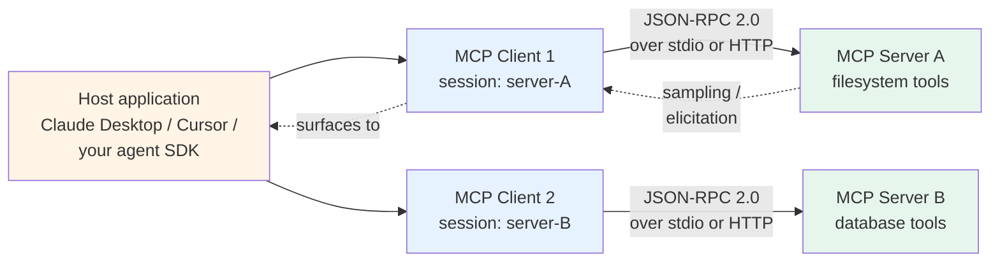
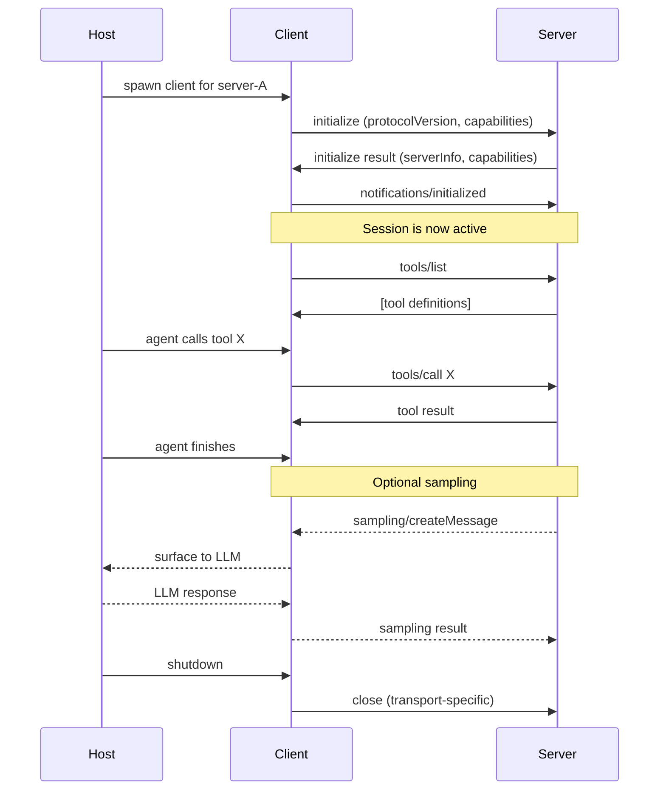

# MCP foundations

> ⏱ ~14 min · 🟡 Intermediate · Prerequisites: [Path 01 Foundations](../../learning-paths/01-foundations/), [`concepts/tools/tool-design.md`](./tool-design.md). Helpful: [`concepts/agents/agent-loop.md`](../agents/agent-loop.md) — MCP servers extend the agent loop's tool-call boundary into another process.

The Model Context Protocol (MCP) is the wire protocol that connects an AI agent to tools, data sources, and prompts running outside the agent's own process. Anthropic published the original spec in November 2024; by Q1 2026 the [Linux Foundation's Agentic AI Foundation](https://www.linuxfoundation.org/projects/agentic-ai-foundation) had taken over governance and the SDK was crossing [97 million monthly downloads](https://dev.to/x4nent/complete-guide-to-mcp-model-context-protocol-in-2026-architecture-implementation-and-4a11) with 10,000+ active public servers per truthifi.com May 2026.

This page covers what MCP *is*. The next page, [Building an MCP server](./building-an-mcp-server.md), covers what you do with it. Read in order if you're new; if you've already built an MCP server with FastMCP and want the conceptual grounding, this page is the answer to "wait, why did I write `@mcp.tool()` instead of just defining the function?"

## Why MCP exists — the N×M problem

Without a protocol, every agent that wants to use a tool needs a bespoke integration with that tool. With M agents and N tools, that's N×M integrations to write, each one a chance to drift out of date. Most teams hit this around their 4th or 5th tool — the integration code starts to dominate the agent code.

MCP collapses this to N+M. An agent speaks MCP once (the client side); a tool exposes MCP once (the server side); any compatible pair talks. The cost moves from "every connection" to "once per side." This is the same shape USB-C solved for hardware peripherals — a comparison the MCP team makes [explicitly in the launch announcement](https://www.anthropic.com/news/model-context-protocol).

The trade is one indirection layer. Instead of calling a function in-process, your agent makes a JSON-RPC call to a server that calls the function. For the use cases MCP targets — exposing internal databases, SaaS APIs, file systems, code-search indexes, vector stores — that indirection pays for itself the second time a different agent needs the same tool.

## The three primitives — tools, resources, prompts

MCP servers expose three kinds of capability, and the distinction matters because they invert the question of *who initiates*:

| Primitive | Who initiates | Read or write | Typical use |
|---|---|---|---|
| **Tool** | The LLM (during agent reasoning) | Either (often write) | Mutating actions: `create_ticket`, `send_email`, `query_database`. Same model as [tool design in single-agent loops](./tool-design.md). |
| **Resource** | The host application (proactively) | Read-only | URI-addressable data the host pulls *without* model invocation. Files, table rows, log streams. The model sees the content; the model didn't ask for it. |
| **Prompt** | The user (via slash command or UI) | Read-only template | Reusable prompt templates — "summarize this customer transcript" — that the user picks from a menu rather than typing freehand. |

This three-way split is what makes MCP more than "RPC for tools." A resource is what you'd otherwise paste into the system prompt manually; a prompt is what you'd otherwise hardcode in your application. By giving each its own protocol primitive, MCP lets servers ship a *complete unit of capability* — tools to act, resources to consult, prompts to template — instead of just function pointers.

Most servers start with tools and add resources/prompts later. That's fine. The protocol doesn't require all three.

## The architecture — host, client, server



Three layers, each with one job:

- **Host application** — the user-facing surface (Claude Desktop, Cursor, your custom agent). The host owns the LLM connection and the UI. It does not own MCP sessions directly.
- **MCP client** — one per server connection. The host spins up multiple isolated client sessions, each maintaining a stateful channel with its own MCP server. This isolation is what lets a single agent safely talk to a filesystem server, a database server, and a Slack server without those servers leaking state to each other.
- **MCP server** — a separate process exposing tools, resources, and prompts. Owns the actual business logic and credentials. The server is where your code lives.

The reverse arrows are worth flagging: servers can send **sampling** requests (asking the LLM to generate text mid-tool-call) and **elicitation** requests (asking the user for input via the host UI) back through the client. These aren't required for basic tool serving, but they're what makes MCP servers more than dumb RPC endpoints — a long-running tool can request reasoning or human input without breaking its own execution.

## The wire protocol — JSON-RPC 2.0

MCP messages are [JSON-RPC 2.0](https://www.jsonrpc.org/specification) — a 2010 spec for stateless request/response over any transport. Each message has an `id`, a `method` name, a `params` object, and a `result` or `error` in the response. The spec is small enough to read in 15 minutes.

A `tools/list` request looks like:

```json
{
  "jsonrpc": "2.0",
  "id": 1,
  "method": "tools/list"
}
```

And a `tools/call` to invoke a tool:

```json
{
  "jsonrpc": "2.0",
  "id": 2,
  "method": "tools/call",
  "params": {
    "name": "create_note",
    "arguments": {"title": "Q3 plan", "body": "..."}
  }
}
```

You almost never write these by hand. The MCP Python SDK and FastMCP build them for you. But knowing the underlying shape helps when debugging: the [MCP Inspector](https://github.com/modelcontextprotocol/inspector) tool displays the raw JSON-RPC messages, which is how you'll diagnose schema mismatches and missing handlers.

The protocol defines a small set of methods grouped by primitive: `initialize` (handshake), `tools/list`, `tools/call`, `resources/list`, `resources/read`, `prompts/list`, `prompts/get`. Plus housekeeping: `ping`, `notifications/cancelled`, `notifications/progress`. That's the full surface — about 15 methods total. Servers implement the ones they need; clients call the ones the server declares.

## The transports — stdio vs Streamable HTTP

JSON-RPC is transport-agnostic. MCP ships with two:

- **stdio (standard input/output)** — the host launches the server as a subprocess and pipes JSON-RPC messages through stdin/stdout. Process lifecycle is owned by the host; the server inherits the host's environment. Default for local development, Claude Desktop integrations, and Cursor. Zero network configuration.
- **Streamable HTTP** — the production-default since the [2026 MCP spec update](https://dev.to/x4nent/complete-guide-to-mcp-model-context-protocol-in-2026-architecture-implementation-and-4a11). HTTP POST for requests, server-sent events (SSE) for server-initiated messages (sampling, elicitation, notifications). Stateful via session IDs in headers. TLS required in production. Works across process and machine boundaries.

The previous HTTP+SSE transport from the 2024 spec is deprecated; if you read older tutorials they'll mention `mcp run --sse`, which is no longer the recommended path. Streamable HTTP is the right default for anything beyond local development.

Choosing between them is straightforward: stdio for local desktop integrations where the host and server run on the same machine; Streamable HTTP for everything else. Production multi-tenant deployments are Streamable HTTP with OAuth 2.1 at the front.

## The lifecycle — initialize, list, call, shutdown

The order of operations on every MCP session:



Five phases:

1. **Initialize** — handshake. Client sends supported `protocolVersion` and its own capabilities; server responds with its `serverInfo` (name, version) and capabilities (which primitive types it exposes). This is also where backward-compatibility negotiation happens.
2. **Capability advertisement** — `tools/list`, `resources/list`, `prompts/list`. The client caches these; the server can update via `notifications/tools/list_changed` if its catalog changes mid-session.
3. **Invocation** — `tools/call`, `resources/read`, `prompts/get`. This is the operational steady state. The host's agent loop drives this phase based on LLM decisions.
4. **Optional reverse calls** — `sampling/createMessage` and `elicitation/create` from server to client. Used by long-running tools that need LLM reasoning or human input mid-execution.
5. **Shutdown** — transport-dependent. stdio: send `SIGTERM` to the subprocess. Streamable HTTP: close the SSE stream and let the session timeout.

Two production conventions on the lifecycle: (1) **don't cache `tools/list` results across sessions**. A new session may connect to a server that's been redeployed with a different tool set. (2) **handle `notifications/tools/list_changed` if you receive it**. Long-running clients that ignore catalog updates ship stale tool descriptions to the LLM, which is the most common cause of "the agent keeps trying to call a tool that doesn't exist."

## Authentication and authorization

The current MCP spec uses OAuth 2.1 (RFC 6749 + RFC 8252 + the [2024 OAuth 2.1 draft](https://datatracker.ietf.org/doc/html/draft-ietf-oauth-v2-1)) for Streamable HTTP. The flow is standard: the client redirects the user to the server's authorization endpoint, the user approves, the server returns a token, the client uses it on every subsequent request.

The non-obvious part: **tokens scope to specific tools, not just to the whole server**. A well-designed MCP server exposes a `read_only` scope and a `read_write` scope; the client requests only what it needs. This is the protocol-layer expression of least-privilege tool access — the same principle that drives [`security/`](../../security/)'s defense-in-depth framing. Module 4 (future, in [Path 04](../../learning-paths/04-tool-protocols-mcp-a2a/)) covers the MCP security threat model in depth, including the [arxiv:2601.10955 resource-amplification attack](https://arxiv.org/abs/2601.10955) that scope-restricted tokens partially defend against.

stdio transport skips OAuth — the assumption is that local subprocesses inherit the user's authority. For desktop integrations like Claude Desktop, this is fine. For anything else, prefer Streamable HTTP with OAuth.

## What MCP is *not*

Three confusions worth flagging early:

- **MCP is not A2A.** MCP is agent-to-tool (vertical integration); [A2A](https://google-a2a.github.io/A2A/) is agent-to-agent (horizontal collaboration). The [most common 2026 mistake per dev.to March 2026](https://dev.to/pockit_tools/mcp-vs-a2a-the-complete-guide-to-ai-agent-protocols-in-2026-30li) is treating them as competitors. They compose: an agent accesses tools via MCP, delegates work to other agents via A2A. Module 5 (future) covers A2A; Module 7 (future) covers the composition.
- **MCP is not an LLM API wrapper.** The host owns the LLM connection. The server has no opinion about which LLM the host uses — it serves any compliant client. This is what allows the same MCP server to work with Claude Desktop, Cursor, OpenAI Agents SDK, and your custom agent.
- **MCP is not a function-calling format.** Function calling (OpenAI's `tools` parameter, Anthropic's `tool_use`) is what happens *inside* the LLM call — the model decides which function to call. MCP is what happens *outside* — how that function is implemented and where it runs. The LLM still uses its native function-calling format; the MCP client translates between the LLM's format and MCP's `tools/call` method.

## Why this protocol works (and where it strains)

MCP works for three reasons:

1. **Decorator-based registration on the server.** FastMCP turns `def get_weather(city: str) -> dict` into a registered MCP tool with a single `@mcp.tool()` decorator. The framework derives the JSON Schema from Python type hints. This drops the cost-per-tool from "write a JSON Schema + register a handler + handle errors" to "decorate the function."
2. **Standardization without overspecification.** The spec defines the wire format and the primitive types but leaves the tool *semantics* entirely to the server. A `search_database` tool can do whatever it wants; the protocol just guarantees a JSON request gets a JSON response with the right shape.
3. **Ecosystem effects.** Once 10,000+ public servers exist, the marginal cost of adopting MCP drops below the cost of bespoke integrations almost regardless of project size. This is the network effect every protocol bid for; MCP is the one that hit escape velocity.

Where it strains:

- **Long-running tools.** MCP's request/response shape is fine for sub-second tools. For tools that run for minutes (training jobs, long compilations), the `notifications/progress` mechanism is the right answer but few servers implement it well. Most production servers either keep the call open (and the client times out) or return a job ID and require polling (which breaks the model's mental flow).
- **Streaming output.** Sampling can stream, but tool results don't. A search tool returning 10K rows blocks until all rows are serialized. Workarounds exist (chunked resources, paginated tool results) but they're conventions, not protocol features.
- **Versioning across servers.** A client that talks to 20 servers will encounter 20 different versions of "the same tool" (`search`, `query`, `find`). The protocol provides no naming or compatibility framework. Module 4 (future) covers the naming-collision threat model.

These are real limitations, not deal-breakers. The protocol's choice to stay small is what enabled the 18-month adoption curve; broader features would have come at the cost of that velocity.

## What's next

Now that you have the protocol's mental model, the next page operationalizes it:

- 📖 [Building an MCP server](./building-an-mcp-server.md) — the FastMCP 3.0 workflow; decorator-based registration; type-hint-driven schemas; MCP Inspector debugging; deployment patterns.

After that:

- 🧪 [Lab 25 — MCP server from scratch](../../labs/25-mcp-server-from-scratch/) — build a working notes server with tools + resources + prompts; test with MCP Inspector + a Python client.
- 🧠 [Quiz — MCP foundations and server](../../quizzes/foundations/mcp-foundations-and-server.md) — 8 questions across this page, the next page, and the lab.

## References

**Specification and ecosystem**:
- Anthropic (November 2024), *[Introducing the Model Context Protocol](https://www.anthropic.com/news/model-context-protocol)* — the launch announcement; foundational rationale
- The official MCP specification at [modelcontextprotocol.io](https://modelcontextprotocol.io)
- The official Python SDK at [github.com/modelcontextprotocol/python-sdk](https://github.com/modelcontextprotocol/python-sdk)
- The MCP Inspector at [github.com/modelcontextprotocol/inspector](https://github.com/modelcontextprotocol/inspector)
- [JSON-RPC 2.0 specification](https://www.jsonrpc.org/specification) — the wire protocol foundation

**2026 production grounding**:
- dev.to (April 2026), *[Complete Guide to MCP in 2026](https://dev.to/x4nent/complete-guide-to-mcp-model-context-protocol-in-2026-architecture-implementation-and-4a11)* — 97M monthly SDK downloads; Streamable HTTP transport details; OAuth 2.1 patterns
- truthifi.com (May 2026), *[State of MCP 2026](https://truthifi.com/education/state-of-mcp-2026-ai-agents-custom-connectors)* — 10,000+ active public servers under Linux Foundation governance
- dev.to (March 2026), *[MCP vs A2A: The Complete Guide to AI Agent Protocols in 2026](https://dev.to/pockit_tools/mcp-vs-a2a-the-complete-guide-to-ai-agent-protocols-in-2026-30li)* — the protocol separation framing
- a2a-mcp.org (March 2026), *[MCP 2026 Roadmap](https://a2a-mcp.org/blog/mcp-2026-roadmap)* — H2 2026 priorities including Server Cards for discovery

**Security and threat model** (preview of Module 4):
- arxiv:2601.10955, *Beyond Max Tokens: Stealthy Resource Amplification via Tool Calling Chains in LLM Agents* — the MCP-tool-layer threat model Module 4 will cover

**Adjacent repo content**:
- [`concepts/tools/tool-design.md`](./tool-design.md) — the single-agent tool-design foundations MCP extends
- [`concepts/tools/tool-selection.md`](./tool-selection.md) — how the model picks among tools; applies equally to MCP-served tools
- [Top-level `patterns/README.md`](../../patterns/) — Pattern 11 (MCP integration) is the architecture-level view
- [`security/README.md`](../../security/) — defense-in-depth principles Module 4 will specialize for MCP
- [Path 04 README](../../learning-paths/04-tool-protocols-mcp-a2a/) — the path scaffold this page is the first concept page of
