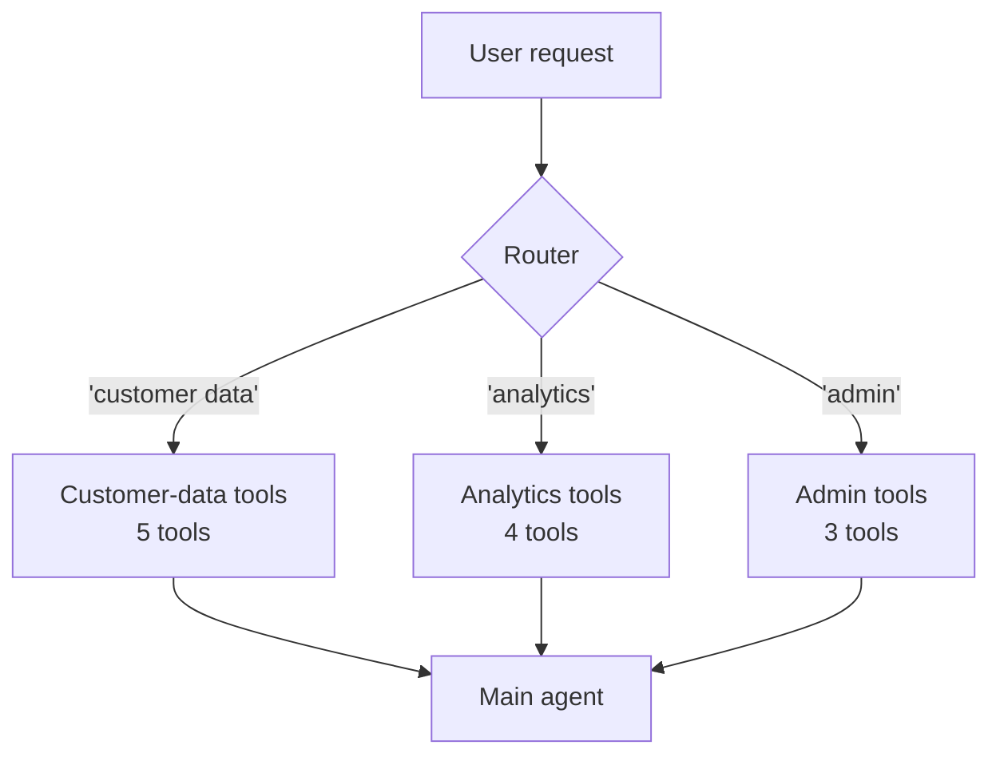

# Tool selection

> 🟢 Stable · ⏱ ~12 min read · 🏷 tools, foundations, selection

## TL;DR

Given a toolset, the model picks the next tool by *reading the conversation state and the tool descriptions* and emitting a structured choice. That choice is shaped by four levers — the system prompt, the tool descriptions, the conversation so far, and the `tool_choice` API parameter. Most "the model picked the wrong tool" bugs are problems with one of those four levers, not problems with the model. This page maps each failure mode to its lever.

If you've read [`tool-design.md`](./tool-design.md), you know how a well-designed tool looks. This page is about what happens when you have *several* well-designed tools and the model has to choose.

---

## How selection actually works

Mechanically: every tool definition (name + description + schema) is rendered into the prompt that gets sent to the model, on every step. The model produces output that includes a structured choice — either a final response or a tool call naming one of the available tools.

Two implications worth internalizing before debugging anything:

1. **The model isn't "selecting from a list" in any deeper sense.** It's autoregressively producing tokens, conditioned on a prompt that happens to include tool descriptions. There's no separate "selection module" inside the model — the same generative process emits a tool name as emits any other text. Selection quality depends on how well the prompt + tools + history concentrate the model's distribution on the right next token.

2. **What the model sees is what was in the prompt.** If you have 50 tools but only 8 are relevant, the model is reasoning across all 50. Pruning the toolset per call is one of the strongest interventions you can make — covered below.

---

## The four levers

### Lever 1 — The system prompt

The system prompt sets the *frame* for selection. It can specify:

- **A behavioral rule:** "Always call `search` before answering questions about user data."
- **A precedence order:** "Prefer `lookup_by_id` over `search_by_email` when an ID is available."
- **A negative guard:** "Never call destructive tools without explicit user confirmation."

Behavioral rules in the system prompt are surprisingly effective. They shape selection across *every* turn, without bloating tool descriptions. Use them for cross-tool policies; use tool descriptions for per-tool semantics.

### Lever 2 — Tool descriptions

Covered in detail in [`tool-design.md`](./tool-design.md). The two failure modes that show up specifically at selection time:

- **Overlapping descriptions.** Two tools have similar one-liners and the model picks the wrong one. Fix: explicit negative guidance in each (`"Do not use this for X — use Y for that."`).
- **Missing trigger phrases.** The user says "find me…" and the model doesn't pick `search_customers` because the description doesn't include the word "find." Fix: add a sentence with concrete example phrasings.

### Lever 3 — The conversation so far

The state $s_t$ includes the user's request, prior turns, and prior tool results. All of it influences the next selection. Two specific patterns to watch:

- **Stale context.** The model picks a tool because of something from 6 turns ago that's no longer relevant. Fix: summarize older context, or explicitly note in the prompt "the user's *current* request is X." See [Context Engineering](../context/context-budget.md) for the broader treatment.
- **Buried observations.** The last tool's result is the most important input for the next selection, but it's sitting under 4KB of other observations. Fix: pin the most recent observation high in the prompt, or pass it through a summarization step.

### Lever 4 — The `tool_choice` parameter

The API parameter that tells the model whether to call a tool, and which one. The values across major providers:

| Value | Behavior | Use when |
|---|---|---|
| `"auto"` (default) | Model chooses: call a tool, or respond directly | Most agent steps |
| `"required"` | Model *must* call some tool; can't respond with text | Step 1 of an agent run when a tool call is mandatory; force-routing |
| `"none"` | Model *must not* call a tool; respond with text | Final answer step; ablation/debug |
| `{"type": "function", "function": {"name": "X"}}` | Model must call tool `X` | Workflow steps where the agent is really a pipeline |

The mistake to avoid: leaving `tool_choice="auto"` on the *final answer* step when the agent has finished gathering data. The model may keep calling tools out of inertia. Either explicitly switch to `"none"` for the synthesis step, or detect "I have enough information now" and skip to a non-tool generation. Modern agent runtimes (LangGraph, ADK) handle this routing automatically.

OpenAI and Anthropic both also expose **`parallel_tool_calls`** (often defaulting to `true`). Setting it to `false` forces at most one tool call per response — useful when downstream code can't handle parallel observations, or when you want to force the model to think between calls.

---

## Why selection fails — a taxonomy

Five failure shapes, each with a different root cause:

### Failure 1: The "wrong-but-similar" pick

The model picks a tool that *kind of* fits but isn't the right one. Often two tools have overlapping intent (`search_customers` and `find_customer_by_email`).

**Diagnosis:** Look at the tool descriptions side-by-side. If you can't immediately tell which one is right for a given user request, the model can't either.

**Fix:** Add negative guidance to *both* tools' descriptions. "`search_customers` does fuzzy matching; **do not use it when you have a known email — use `find_customer_by_email`.**" The negative form ("do not use this for") trains selection more reliably than only stating positive use.

### Failure 2: The "no-tool" pick (premature termination)

The model gives a final answer when it should have called a tool. Often this is a confidence problem — the model has *some* prior on the question and prefers to use it.

**Diagnosis:** Look at the system prompt. Does it explicitly require tool use? Does the user's request match a trigger phrase in any tool's description?

**Fix:** Three options, in order of strength:

1. **Prompt-level:** Add "if the question can be answered with a tool, prefer the tool over your prior knowledge."
2. **API-level:** Set `tool_choice="required"` for the first step of relevant agent runs.
3. **Architecture-level:** Use a routing pattern where step 1 always asks "which family of tools (or none) does this need?" — then step 2 narrows to a specific tool.

### Failure 3: The "tool exists in spirit" pick

The model invents a tool name that *isn't* in the toolset. This used to be common; modern function-calling APIs largely prevent it via structured output. When it still happens, it's a sign the toolset is missing something obvious.

**Diagnosis:** Read the model's invented tool name. Does it describe a real capability the user expects?

**Fix:** Either add the missing tool, or make a real one's description match the user's mental model. Don't try to suppress the invention with prompt scolding — it's a signal, not noise.

### Failure 4: The "tool stew" — too many tools

The toolset has 30+ tools, the model spends tokens scanning all of them, and selection accuracy degrades. Empirically this gets bad somewhere around 15–25 tools depending on model and description quality.

**Diagnosis:** Count your tools. If you have more than ~12 active for a typical step, you have a tool-stew problem.

**Fix:** **Pruning** — show the model only the tools relevant to the current state. Three ways to do this:

- **Manual routing.** Step 1: a tiny "router" model picks the *family* of tools (e.g., "this looks like a customer-data task"). Step 2: only the customer-data tools are exposed to the main agent.
- **Embedding-based retrieval.** Embed each tool description; embed the user request; expose only the top-K tools by similarity.
- **Hierarchical tool sets.** Group tools under a "meta-tool" that, when called, reveals its sub-tools.

OpenAI's Agents SDK and ADK both support hosted tool-search variants of this pattern; LangGraph supports it via conditional edges. We come back to this in [`patterns/03-supervisor-workers.md`](../../patterns/03-supervisor-workers.md).

### Failure 5: The repeated-pick loop

The model picks the same tool, gets the same null result, picks it again. We saw this in Lab 01.

**Diagnosis:** Check the tool's return shape. Does it differ between "tool ran fine, found nothing" and "tool failed"? Does the observation contain enough information for the model to choose a *different* approach next time?

**Fix:** Either change the observation to suggest alternatives ("no results found — try `search_by_name` or a broader query"), or add runtime-level repeated-action detection. Both are in [Lab 01](../../labs/01-first-agent-from-scratch/).

---

## How many tools is too many?

There's no clean answer, but as a rule of thumb:

| Tools in prompt | Selection quality | Notes |
|---|---|---|
| 1–4 | Very high | The agent loop's "easy mode" |
| 5–12 | Good | Most production agents live here |
| 13–25 | Variable | Description quality dominates |
| 25+ | Degraded | You need pruning (routing or retrieval) |
| 50+ | Don't | Hierarchical tool design or supervisor topology |

These numbers come from informal community experience with frontier models in 2025–2026; they shift as models improve. The directional intuition holds: **fewer relevant tools, picked from a routing step, beats many tools picked in one shot.**

A pragmatic test: when you add a new tool to your toolset, ask yourself whether the model would have correctly picked it from the previous toolset's *neighbors*. If two existing tools could plausibly answer the same user query, you have a selection problem brewing.

---

## The architectural perspective

Looking at selection as an architecture choice rather than a per-tool problem:

A **router → subgroup → agent** flow turns 12 tools into "pick 1 of 3 families, then 1 of 5 tools" — two easier decisions instead of one harder one. The cost is one extra LLM call per turn; the win is selection accuracy that holds up as the toolset grows.

This is the pattern modern frameworks make easy: LangGraph's conditional edges, ADK's hosted tool-search, OpenAI Agents SDK's tool-search surface. They differ in mechanics; the underlying idea is the same.

---

## 🧮 Math behind it

Selection is a marginal over the policy's action distribution. Given the action space $\mathcal{A} = \mathcal{A}_{\text{tool}} \cup \{a_{\text{stop}}\}$, the probability of selecting tool $t$ is:

$$
\Pr[t \mid s_t] = \sum_{a \in \mathcal{A}_t} \pi_\theta(a \mid s_t),
$$

where $\mathcal{A}_t$ is the set of (tool, argument) pairs naming tool $t$. The interventions in this page change this distribution in different ways:

- **Prompt and description changes** alter $\pi_\theta(a \mid s_t)$ by changing $s_t$.
- **Pruning the toolset** alters $\mathcal{A}$ — removing options the model would otherwise put mass on.
- **`tool_choice="required"`** truncates $\mathcal{A}$ to exclude $a_{\text{stop}}$, then renormalizes.
- **`tool_choice="X"`** truncates $\mathcal{A}$ to just the (X, args) pairs.

The framing tells you why these interventions don't always combine cleanly. Setting `tool_choice="required"` and then *also* making one tool's description much stronger than the others doesn't necessarily compose — the truncation already removed the no-tool option, so the description difference is operating on a smaller, different distribution.

→ Full treatment: [`math-foundations/04-agents-as-policies.md`](../../math-foundations/04-agents-as-policies.md).

---

## See also

- 📖 [Tool design](./tool-design.md) — the prerequisite. Good design makes selection easier.
- 📖 [What is an agent?](../agents/what-is-an-agent.md), [Agent loop](../agents/agent-loop.md), [ReAct pattern](../agents/react-pattern.md) — the broader context.
- 🧪 [Lab 02: Tool design and selection](../../labs/02-tool-design-and-selection/) — hands-on, including a deliberately-broken toolset.
- 🏛 [Single-agent tool-use pattern](../../patterns/01-single-agent-tool-use.md).
- 🏛 [Supervisor-workers pattern](../../patterns/03-supervisor-workers.md) — when you need a router.

---

## References

- OpenAI. [*Function calling*](https://platform.openai.com/docs/guides/function-calling). Source for `tool_choice` semantics and `parallel_tool_calls`.
- Anthropic. [*Tool use overview*](https://docs.anthropic.com/en/docs/build-with-claude/tool-use/overview).
- Patil, S. G. et al. (2024). [*Gorilla: Large Language Model Connected with Massive APIs*](https://arxiv.org/abs/2305.15334). NeurIPS 2024. Quantitative work on how API selection scales with tool count.
- Qin, Y. et al. (2023). [*ToolLLM: Facilitating Large Language Models to Master 16000+ Real-world APIs*](https://arxiv.org/abs/2307.16789). On training and prompting strategies for very large toolsets.
- UC Berkeley CS294/194-196 *Agentic AI*, Fall 2025 — *Agent Evaluation & Project Overview*. [Course page](https://rdi.berkeley.edu/agentic-ai/f25). Useful for the evaluation perspective on selection.
