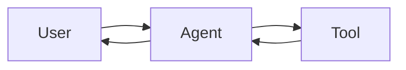

# Diagrams

Source files for the architecture and concept diagrams used throughout the repo. Mermaid is the default; SVG and PNG are committed alongside the `.mmd` source for places that need a rendered image.

## What lives here

```
diagrams/
├── README.md                 This page
├── *.mmd                     Mermaid source files
└── rendered/                 Generated SVG/PNG (one per .mmd)
```

A diagram has a stable file name based on what it depicts, prefixed with the topic area:

| Prefix | Topic |
|---|---|
| `agent-` | Agent loops and architectures |
| `rag-` | RAG pipelines and variants |
| `multiagent-` | Topologies (supervisor, hierarchical, swarm) |
| `mcp-` | MCP architecture and message flows |
| `a2a-` | A2A architecture and message flows |
| `context-` | Context budget and compression flows |
| `eval-` | Evaluation framework topologies |
| `prod-` | Production deployment topologies |

## Why Mermaid

Three reasons:

1. **GitHub renders it natively.** No image build step required for readers to see the diagram.
2. **It's text.** Diffs are reviewable, edits are atomic, PRs don't carry binary blobs that bloat the repo.
3. **It's reusable.** The same `.mmd` source renders inline in a Markdown page and as a standalone SVG.

For diagrams Mermaid can't express well (≥20 nodes, custom layouts, illustrations), we fall back to SVG authored in a vector editor. These still live in this folder, alongside a source file (`.excalidraw`, `.drawio`, or a note) that another contributor could open and edit.

## Embedding a diagram

Inside a Markdown page, the simplest embedding is an inline fenced block:

````markdown

````

For diagrams reused in multiple pages, embed a pre-rendered SVG instead. Use standard image-embed syntax — `![Diagram label]` followed by a parenthesised path like `./rendered/agent-loop.svg`. The `rendered/` directory is generated on demand via the render command below; in most pages, the inline mermaid block above is the simpler choice.

The page also links to the `.mmd` source so contributors can find the editable version. Use a quoted source line at the top or bottom of the page, naming the relative path in inline code (no link target needed — the file lives in this folder and is easy to find).

## Rendering Mermaid to SVG

When you add or change a `.mmd` file, regenerate the SVG:

```bash
npx -y @mermaid-js/mermaid-cli -i diagrams/your-diagram.mmd -o diagrams/rendered/your-diagram.svg
```

A CI workflow checks that every `.mmd` has a matching rendered file and that they're in sync.

## Style conventions

- Use `flowchart LR` (left-to-right) for sequence-style or pipeline diagrams.
- Use `flowchart TD` (top-down) for decision trees.
- Keep node text under 4 words.
- Use `<br/>` to break long labels onto two lines.
- Use subgraphs for groupings of 3+ related nodes.
- Avoid color unless it carries information; default styling is clearer.

### Curriculum diagram bundles

Some topics ship a curated bundle of diagrams as a single rendered Markdown page rather than loose `.mmd` files:

| Bundle | Covers |
|---|---|
| [`rag-bundle.md`](./rag-bundle.md) | Nine vertical, color-coded RAG diagrams: basic + advanced pipeline, evaluation lifecycle, retrieval-vs-generation eval, agentic RAG, Graph RAG, production observability, failure diagnosis, evolution timeline. |

The RAG bundle uses `flowchart TD` (vertical) with `classDef` color tiers deliberately: the colors encode stage and tier groupings (offline vs online, retrieval vs generation, era in the timeline), so color carries information here rather than decoration. Each diagram in the bundle also has a standalone `.mmd` source file in this directory.

## Contributing

A good diagram is often the highest-leverage contribution to a concept page. If a page is mostly text and you can replace a paragraph with a clear Mermaid block, that's almost always an improvement.

> 🟢 Diagrams are classified **stable**. The topology of an agent loop doesn't change because LangGraph shipped a new version.
