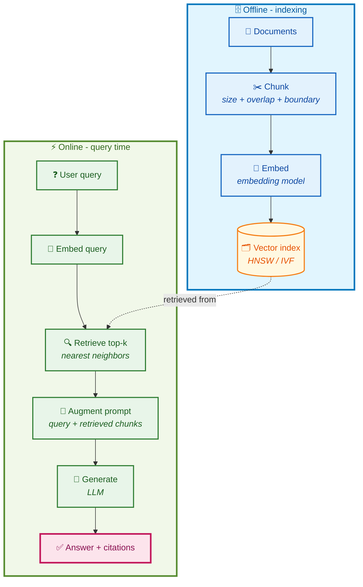
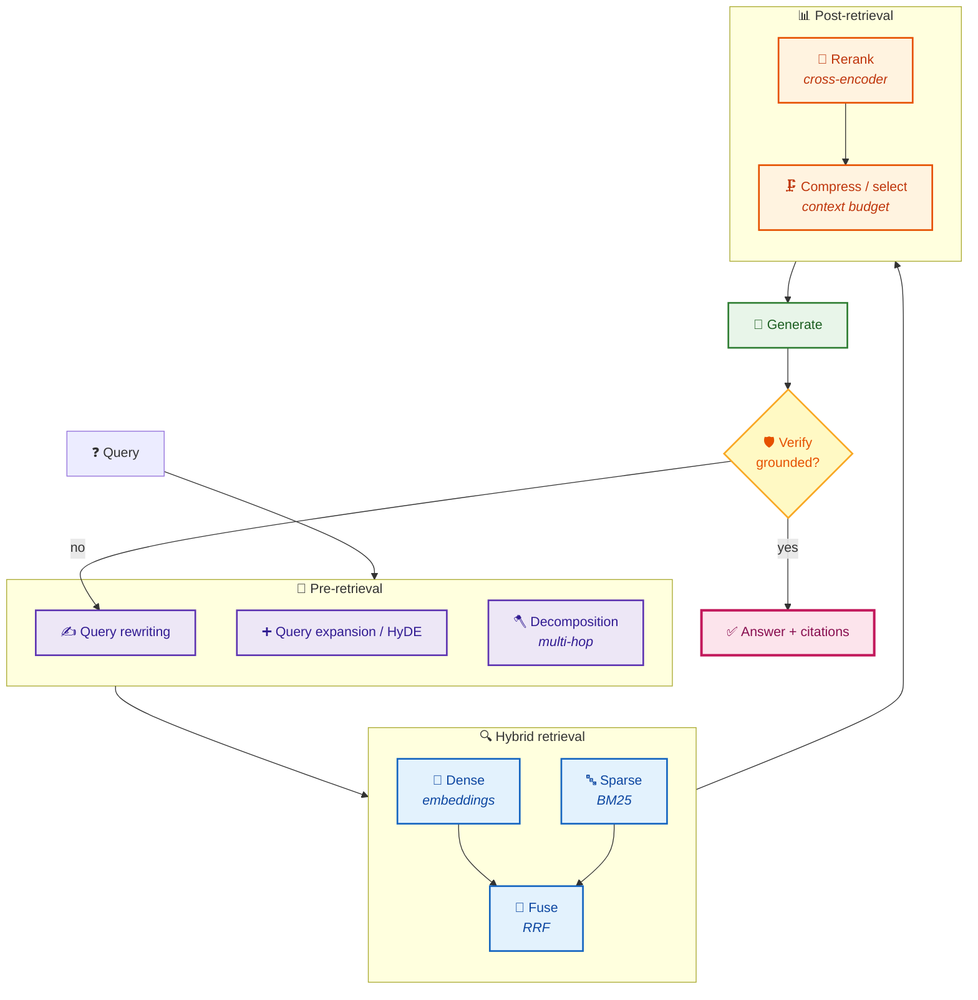
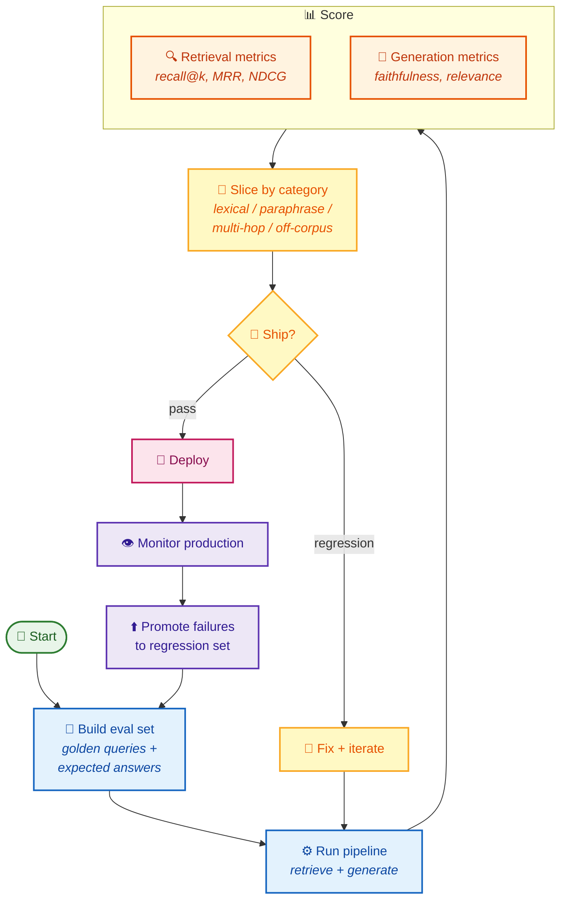
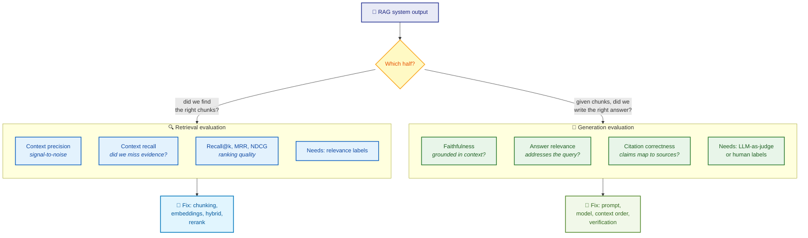
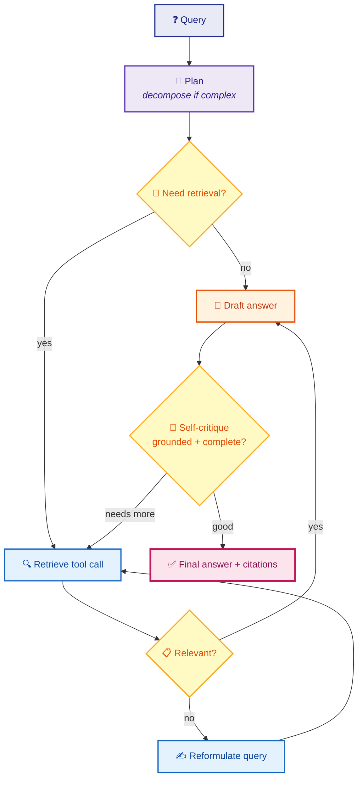
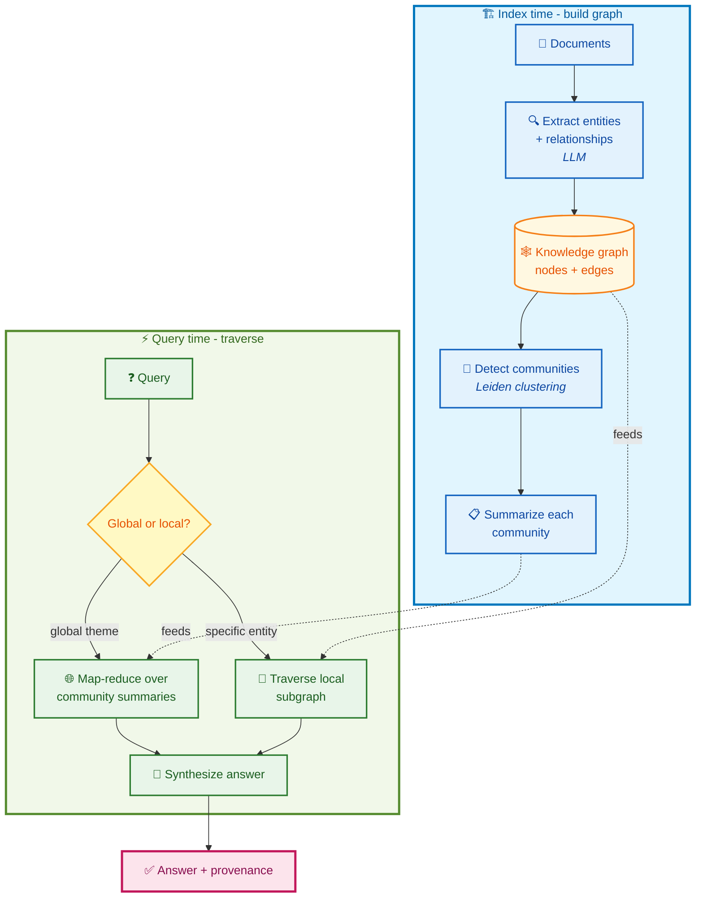
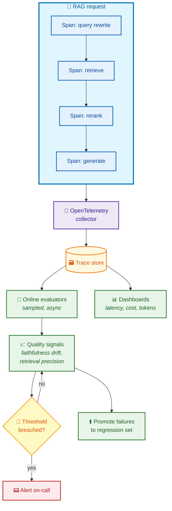
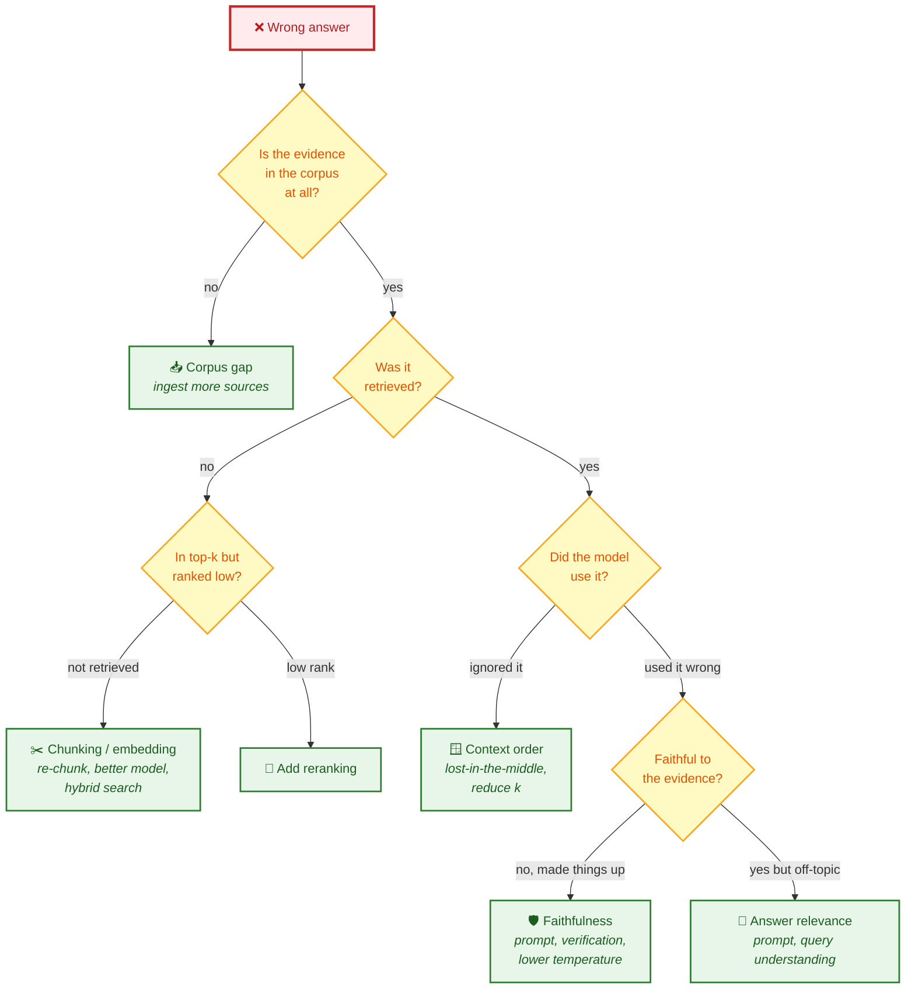
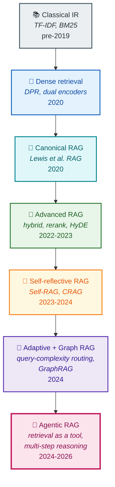

# RAG diagram bundle

> Colorful, vertical (`flowchart TD`) Mermaid diagrams for the RAG and RAG-evaluation curriculum. All render natively on GitHub. Source `.mmd` files live alongside this page in [`diagrams/`](./).

These complement the earlier horizontal diagrams (`rag-evaluation-loop.mmd`, `retrieval-pipeline.mmd`) with vertical, color-coded versions designed for the SOTA RAG bundle. Where both exist, prefer these for top-to-bottom reading.

## Contents

1. [Basic RAG pipeline](#1-basic-rag-pipeline)
2. [Advanced RAG pipeline](#2-advanced-rag-pipeline)
3. [RAG evaluation lifecycle](#3-rag-evaluation-lifecycle)
4. [Retrieval evaluation vs generation evaluation](#4-retrieval-evaluation-vs-generation-evaluation)
5. [Agentic RAG workflow](#5-agentic-rag-workflow)
6. [Graph RAG workflow](#6-graph-rag-workflow)
7. [Production RAG observability](#7-production-rag-observability)
8. [RAG failure diagnosis](#8-rag-failure-diagnosis)
9. [RAG evolution timeline](#9-rag-evolution-timeline)

---

## 1. Basic RAG pipeline

The seven-stage canonical pipeline: ingest, chunk, embed, index (offline) then retrieve, augment, generate (online).

---

## 2. Advanced RAG pipeline

Pre-retrieval (query transformation), retrieval (hybrid), post-retrieval (rerank, compress), and generation with verification. Each added stage targets a specific failure mode.

---

## 3. RAG evaluation lifecycle

Evaluation is not a one-time gate. It cycles: build an eval set, run pipelines, score, slice, decide, then promote production failures back into the set.

---

## 4. Retrieval evaluation vs generation evaluation

The two halves fail differently, get measured differently, and get fixed differently. Conflating them is the most common RAG-eval mistake.

---

## 5. Agentic RAG workflow

Retrieval becomes a tool the agent chooses to call, with the option to reformulate the query, retrieve again, or critique its own draft before answering.

---

## 6. Graph RAG workflow

GraphRAG builds a knowledge graph from the corpus, detects communities, summarizes them, and traverses the graph at query time. Strong for global "what are the themes" questions and multi-hop reasoning.

---

## 7. Production RAG observability

Every stage emits spans. Traces feed both online evaluators (sampled, scored live) and dashboards (latency, cost, quality trends).

---

## 8. RAG failure diagnosis

A decision tree for "the answer is wrong." Localize the failure to a stage before reaching for a fix. Mirrors the [retrieval failure modes](../concepts/rag/retrieval-failure-modes.md) page.

---

## 9. RAG evolution timeline

From classical IR to the 2024-2026 SOTA patterns. Each era added a capability the previous one lacked. Citations are on the [SOTA RAG patterns](../concepts/rag/sota-rag-patterns.md) page.

---

## Source files

Each diagram above is also available as a standalone `.mmd` file in this directory for embedding elsewhere:

- `rag-basic-pipeline.mmd`
- `rag-advanced-pipeline.mmd`
- `rag-evaluation-lifecycle.mmd`
- `rag-retrieval-vs-generation-eval.mmd`
- `rag-agentic-workflow.mmd`
- `rag-graph-workflow.mmd`
- `rag-production-observability.mmd`
- `rag-failure-diagnosis.mmd`
- `rag-evolution-timeline.mmd`

## See also

- [`concepts/rag/sota-rag-patterns.md`](../concepts/rag/sota-rag-patterns.md) - the patterns these diagrams illustrate, with citations.
- [`concepts/evaluation/rag-evaluation-framework.md`](../concepts/evaluation/rag-evaluation-framework.md) - the evaluation framework the lifecycle and retrieval-vs-generation diagrams support.
- [`math-foundations/14-retrieval-ranking-metrics.md`](../math-foundations/14-retrieval-ranking-metrics.md) - the math behind recall@k, MRR, NDCG shown in diagram 4.
