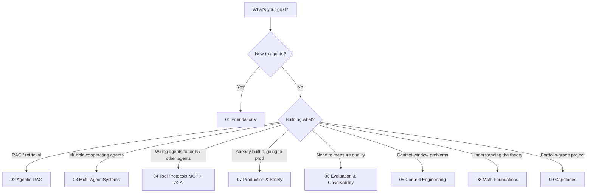

# Start here

A 5-minute orientation for anyone landing in this repo for the first time. If you just want to run code, jump straight to [Run your first lab](#run-your-first-lab).

---

## What this repo is

A community-maintained learning hub for engineers building agentic AI systems. The content is split into five types — concepts, labs, recipes, patterns, and projects — and organized into curated learning paths.

If you haven't read the [root README](../README.md), do that first. This page assumes you have.

---

## What to do first

Pick the option that matches where you are:

| Where you are | What to do |
|---|---|
| New to agents, comfortable with Python and LLM APIs | Run [Lab 01](../labs/01-first-agent-from-scratch/) → read [`concepts/agents/what-is-an-agent.md`](../concepts/agents/what-is-an-agent.md) → start the [Foundations Path](../learning-paths/01-foundations/) |
| Already built simple agents, want depth | Skim [`concepts/agents/`](../concepts/agents/) → pick a path from the table below |
| Need to solve a specific problem now | Search [`recipes/`](../recipes/) → fall back to [`patterns/`](../patterns/) if you need architecture-level guidance |
| Researching for a decision (framework / pattern / vector DB) | Go to [`tools/comparisons/`](../tools/comparisons/) and the relevant page in [`patterns/`](../patterns/) |
| Want to teach this material | Read [`LICENSING.md`](../LICENSING.md) for attribution rules, then use the curriculum freely under CC-BY-4.0 |
| Want to contribute | Read [`CONTRIBUTING.md`](../CONTRIBUTING.md) and look for [`good-first-issue`](../../../issues?q=label%3Agood-first-issue) |

---

## Run your first lab

Before anything else, get a working agent running locally. This confirms your environment is set up correctly and gives you a concrete reference point for the rest of the material.

```bash
# 1. Clone and enter the repo
git clone https://github.com/MHHamdan/Agentic-AI-Engineer.git
cd agentic-ai-engineer

# 2. Set up the environment
#    uv is recommended (faster, lockfile-aware); pip works fine too.
uv sync                                # or: python -m venv .venv && pip install -r requirements.txt

# 3. Add your API keys
cp .env.example .env
# Open .env and fill in at least one model provider key (OpenAI, Anthropic, or Google).

# 4. Launch the lab
uv run jupyter lab labs/01-first-agent-from-scratch/lab.ipynb
```

If anything fails: [`setup/troubleshooting.md`](../setup/troubleshooting.md) covers the common cases. If you don't want to pay for API credits, [`setup/local-models.md`](../setup/local-models.md) shows how to run the labs against a local Ollama or vLLM model.

---

## How to choose a learning path

Nine paths are listed in [`learning-paths/`](../learning-paths/). Each one is a curated reading list across the rest of the repo — not a duplicate set of content.

A quick decision aid:



Paths overlap deliberately. Reading two adjacent paths (e.g., Multi-Agent + Context Engineering) is expected and not wasteful — most concept pages serve multiple paths.

---

## How the content fits together

Five content types, each doing one job:

| Type | When you reach for it |
|---|---|
| 📖 **Concept** ([`concepts/`](../concepts/)) | You need to understand *what* something is and *when* to use it. |
| 🧪 **Lab** ([`labs/`](../labs/)) | You want to learn by doing, with a guided notebook. |
| 🧰 **Recipe** ([`recipes/`](../recipes/)) | You have a specific problem and need a copy-paste solution. |
| 🏛 **Pattern** ([`patterns/`](../patterns/)) | You need to make an architecture decision. |
| 🚀 **Project** ([`projects/`](../projects/)) | You want to build something substantial that combines multiple skills. |

Two supporting tracks run alongside these:

- **🧮 Math foundations** ([`math-foundations/`](../math-foundations/)) — engineer-useful equations for the concepts that benefit from them. Read or skip; nothing else requires it.
- **⚙️ Tools** ([`tools/`](../tools/)) — versioned snapshots of fast-moving frameworks (LangGraph, MCP, A2A, LangSmith, ADK, vector DBs). Every page carries a *verified as of* date and a primary-source link.

---

## How to avoid getting lost

A few habits that help when the repo grows:

- **Don't try to read it linearly.** This is a reference, not a textbook. Use the path you picked and follow links as they come up.
- **Trust the badges.** 🟢 stable, 🟡 slow-moving, 🔴 fast-changing. If you're reading a 🔴 page and the snapshot date is old, double-check against the linked official source.
- **Bookmark the glossary.** When you hit a term you don't recognize, [`glossary/`](../glossary/) is faster than re-reading a concept page.
- **Use search.** GitHub's repo-level search (`/` then type) is fast and indexes Markdown content well.
- **Skip the math the first time.** Read the concept page, do the lab. Come back to the math when something surprises you and you want to know why.
- **When in doubt, run the code.** A working snippet teaches more than three paragraphs of explanation.

---

## When to ask for help

| Issue | Where to go |
|---|---|
| Code doesn't run | [`setup/troubleshooting.md`](../setup/troubleshooting.md), then open an issue with the `bug` label |
| A concept is unclear | Open an issue with the `docs` label — vague pages are bugs |
| Tool snapshot looks stale | Open an issue with the `stale-tool-version` label |
| Want a new recipe / lab / pattern | Open an issue with the `enhancement` label, or send a PR |
| General question or discussion | [GitHub Discussions](../../../discussions) |

---

## What's next

Once you've finished Lab 01 and have a working environment:

1. Read [`concepts/agents/what-is-an-agent.md`](../concepts/agents/what-is-an-agent.md) — the vocabulary the rest of the repo uses.
2. Pick a learning path from [`learning-paths/`](../learning-paths/).
3. Star the repo if it's useful — it helps other engineers find it.
