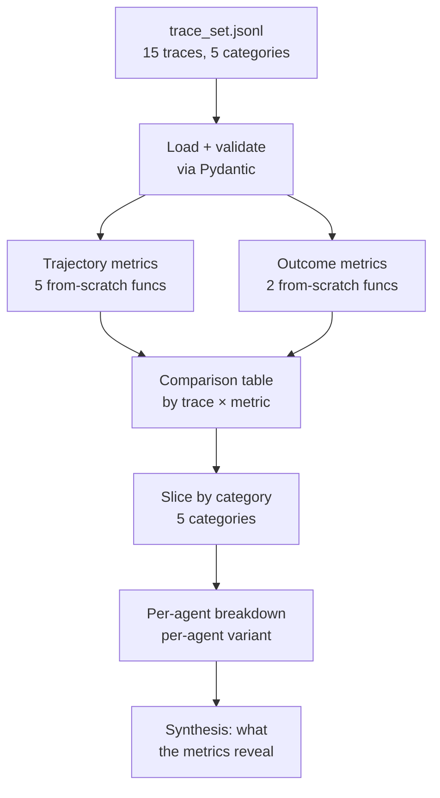

# Lab 16 — Multi-agent evaluation harness from scratch

> ⏱ 100-130 min · 🟡 Intermediate · Prerequisites: Lab 09 (the harness pattern this extends), Labs 10/11/12 (the systems being evaluated)

Build the from-scratch evaluation harness for Path 03's multi-agent systems. Same shape as Lab 09's RAG eval harness — hand-curated fixture set + rule-based metric tier + LLM-as-judge tier + category slicing — applied to multi-agent trajectories instead of single-query RAG runs.

The lab closes Path 03 v1's curriculum. After this, you have full coverage: foundations → patterns → framework bridge → evaluation.

## What you'll build

A reusable evaluation harness that consumes a `trace_set.jsonl` of 15 hand-curated multi-agent runs (5 each from Lab 10/11/12) and produces a comparison table across seven metrics, sliced by category.

No new dependencies. Pure Python + pandas + pydantic. An optional Step 7 uses `openai` or `anthropic` for an LLM-as-judge variant of plan validity (you can skip it if you don't want to spend the ~$0.30).

## Goal

By the end of the lab you should be able to:

- Read and validate trace fixtures structured as `trace_set.jsonl` (pydantic `StrictModel` discipline carried from earlier labs).
- Implement the five trajectory metrics from scratch — handoff success rate, routing accuracy, plan validity, plan coverage, replan rate — with the per-trace and per-set variants where applicable.
- Implement the two outcome metrics — citation preservation, groundedness — including the lexical-overlap rule-based version for groundedness.
- Use category slicing to localize failures (a 0.75 aggregate score across `happy_path` and `citation_drift` traces is less useful than the per-category breakdown).
- Read per-agent metric breakdowns and decide which agent to iterate on.
- Run an optional LLM-as-judge variant for one metric (plan validity) and contrast its findings with the rule-based version.
- Explain when this harness is sufficient and when production needs LangSmith / Phoenix / Galileo / Vertex AI integration instead.

## Prerequisites

- **Lab 09** — strongly recommended. The pattern this lab extends. Hand-curated fixtures + rule-based + LLM-as-judge + category slicing. Without Lab 09, the choice of tiering will feel arbitrary; with it, the pattern is familiar.
- **Lab 10 (supervisor-worker)** — required reading. Five of the 15 trace fixtures replay Lab 10's pattern; understanding the supervisor-researcher-writer flow is required to read the trajectories.
- **Lab 11 (generator-critic)** — required reading. Five fixtures replay this pattern; the critic-iteration loop produces the longest trajectories.
- **Lab 12 (plan-and-execute)** — required reading. Five fixtures replay this pattern; plan validity and plan coverage metrics are specific to Lab 12's planner output.
- **Concept pages** — read [`multi-agent-evaluation`](../../concepts/multi-agent/multi-agent-evaluation.md) and [`trajectory-level-metrics`](../../concepts/multi-agent/trajectory-level-metrics.md) first. The notebook references both directly.

## 🛠 Tools and versions

| Library | Version | Used for |
|---|---|---|
| `pydantic` | `>=2.0` (already pinned) | trace validation |
| `pandas` | `>=2.0` (already pinned) | comparison tables |
| `openai` *or* `anthropic` | already pinned | optional Step 7 LLM-as-judge |

No new dependencies beyond what the repo's `pyproject.toml` already declares.

## What you'll see in the trace_set

15 hand-curated traces, balanced across source labs and categories:

| Source lab | Count | Categories represented |
|---|---|---|
| Lab 10 (supervisor-worker) | 5 | happy_path × 2, citation_drift × 1, tool_failure × 1, step_cap_hit × 1 |
| Lab 11 (generator-critic) | 5 | happy_path × 2, citation_drift × 2, step_cap_hit × 1 |
| Lab 12 (plan-and-execute) | 5 | happy_path × 1, replan_needed × 2, tool_failure × 1, step_cap_hit × 1 |

The trace set is intentionally small. Lab 09's lesson: hand-curated > synthesized. 15 carefully designed traces beats 1500 generated ones for diagnostic purposes. If the harness needs to be robust to scale, the scaling comes after the harness is correct.

## Structure

Roughly 32-36 cells, output-stripped, sample-output markdown cells throughout.

- **Step 0**: Setup — provider config, pydantic + pandas imports. Familiar shape.
- **Step 1**: Pydantic models for `TraceStep` and `Trace`. Load + validate `trace_set.jsonl`. Print category distribution.
- **Step 2**: Implement `handoff_success_rate(trace)` and `routing_accuracy(trace)` from scratch. Run on the trace set; surface per-trace scores.
- **Step 3**: Implement `plan_validity(trace)` and `plan_coverage(trace)`. These return `None` for non-Lab-12 traces. Demonstrate the category split.
- **Step 4**: Implement `replan_rate(trace_set)` as a set-level metric.
- **Step 5**: Implement `citation_preservation(trace)`. Including URL canonicalization (strip trailing slashes, fragments, common query-param noise) so canonical-URL equality works in practice.
- **Step 6**: Implement `groundedness(trace)` — rule-based, lexical-overlap version. Same approach as Lab 09's groundedness.
- **Step 7**: Run the full harness. Produce the master comparison table: rows = traces, columns = metrics. Then aggregate, then slice by category.
- **Step 8**: Per-agent breakdown. Same trace data, re-keyed by agent. Show that this re-keying surfaces per-agent issues that the trace-level aggregate hides.
- **Step 9 (optional)**: LLM-as-judge variant of plan validity. Compare against the rule-based version on the two `replan_needed` traces.
- **Step 10**: Synthesis — what the metrics revealed, what they hid, and which production tools take this to the next level.

## What to watch for

**1. Category slicing is the discipline.** Aggregate metrics across heterogeneous traces will lie. The same 0.73 citation preservation looks very different sliced by category — happy_path at 0.97 and citation_drift at 0.40 is a healthy harness catching a real bug. Same aggregate, totally different signal. The lab insists on the slice every step.

**2. Citation URL equality needs canonicalization.** `https://example.com/x` and `https://example.com/x/` are the same page in practice; `https://example.com/x?utm=foo` is also the same page. The rule-based citation preservation metric canonicalizes before comparing (strip trailing slashes, strip fragments, strip a small allowlist of tracking params). Without this you get false negatives that mask real issues.

**3. Per-trace metric outputs come in three flavors:** float (most), None (when the metric doesn't apply — plan validity returns None for Lab 10 traces), and dict (when the metric needs to surface multiple subscores — citation preservation returns `{preserved, hallucinated, dropped}` so you can diagnose). The harness handles all three; pandas DataFrame structure accommodates them.

**4. Rule-based groundedness is conservative.** Lexical-overlap-on-cited-content rejects paraphrased-but-correct claims more often than LLM-as-judge does. For regression testing, conservative is fine — false positives are cheap (re-check by hand). For grading, you may want LLM-as-judge. The lab implements rule-based; the LLM-as-judge upgrade is mentioned but not built.

**5. The trace_set is a contract, not a sample.** Each trace was hand-built to test specific failure signatures. Modifying a trace (adjusting `expected_citations` to "match" a buggy implementation) breaks the harness's diagnostic value. If a metric is firing on a trace and you think the trace is wrong, audit the trace's `category` annotation first.

## What's not in this lab (anti-scope)

- **LangSmith / `agentevals` / Phoenix / Galileo / Vertex AI integration.** Mentioned in the concept page and the closing synthesis. The lab is framework-agnostic so the metric mechanics are visible. Path 06 covers production tooling.
- **Online (live) evaluation.** The lab is replay-only. Online evaluation needs different infrastructure (trace ingestion, alerting, drift detection) and belongs in Path 06.
- **Adversarial / red-team evaluation.** Out of scope. Path 07 territory.
- **Multi-turn (threaded) evaluation.** Lab 16 evaluates single-task traces. Multi-turn lives in conversational systems; LangSmith's multi-turn evals (Oct 2025) is the documented path.
- **Agent-as-a-judge calibration.** The LLM-as-judge step is implemented; calibrating it against human judgment (the Zheng et al. biases) is a Path 06 topic.
- **Lab 13/14/15 trace coverage.** The trace fixtures replay Lab 10/11/12. Lab 13 (multi-agent RAG) adds the retrieval step but uses the same supervisor pattern; the metrics carry over directly. Lab 14/15 are LangGraph re-implementations of Lab 10/12 — same trajectory shape, same metrics. Extension exercise.

## Cost and timing

The lab is mostly local Python computation:

- Steps 1-8: zero LLM calls. Pure computation over the trace set. Runs in ~5 seconds.
- Step 7 (optional LLM-as-judge): 2 LLM calls (one per `replan_needed` trace, judging plan validity). ~$0.005 at gpt-4o-mini rates.

Total cost: under $0.01 for the full lab including the optional step.

Wall-clock: 100-130 minutes including reading both concept pages and working through the synthesis section.

## Solution

A reference implementation lives in [`solution/lab.ipynb`](./solution/lab.ipynb) with notes in [`solution/README.md`](./solution/README.md). 19 cells vs the lab's 32 — the per-metric design discussions and the synthesis section are condensed; the seven-metric harness reads end-to-end against `trace_set.jsonl`. Two design choices worth flagging up front:

- **The harness is one Python module, not one notebook.** Each metric is a standalone pure function (no globals, no shared state). The notebook calls into them. This keeps the metrics testable in isolation — you can move them to a `harness.py` file later without rewriting them.
- **The trace model uses pydantic `StrictModel` with `extra="forbid"`.** Same discipline as Lab 02 and the rest of Path 03. Trace fixtures are structured data; the validator catches typos and field-drift early. The cost is that adding a new field to the trace shape requires updating both the model and every fixture.

## Next

Path 03 v1 is complete after this lab.

The natural follow-ups:

- **Path 06 — Evaluation & Observability.** Production-grade evaluation: LangSmith depth, OpenTelemetry, drift detection, agent-as-judge calibration, online evaluation. The from-scratch harness from Lab 16 is the conceptual foundation.
- **Path 03 v2** — possible future extensions: Lab 13 (multi-agent RAG) framework-bridge variant, multi-turn evaluation, Lab 11 (critic) framework-bridge variant.

## References

- [Lab 09 — Evaluating agentic RAG](../09-evaluating-agentic-rag/) — the precedent.
- [`concepts/multi-agent/multi-agent-evaluation.md`](../../concepts/multi-agent/multi-agent-evaluation.md) — the framing.
- [`concepts/multi-agent/trajectory-level-metrics.md`](../../concepts/multi-agent/trajectory-level-metrics.md) — the per-metric details.
- LangChain `agentevals` repository — production reference for trajectory evaluators. [github.com/langchain-ai/agentevals](https://github.com/langchain-ai/agentevals).
- McKinsey QuantumBlack, *Evaluations for the Agentic World* (Jan 2026) — handoffs-per-task, duplicate-work-rate as production multi-agent metrics. [medium.com/quantumblack](https://medium.com/quantumblack/evaluations-for-the-agentic-world-c3c150f0dd5a).
- Galileo, *How to Build an Agent Evaluation Framework* (Feb 2026) — argues that trajectory metrics surface the reliability gap that outcome metrics hide. [galileo.ai/blog](https://galileo.ai/blog/agent-evaluation-framework-metrics-rubrics-benchmarks).
