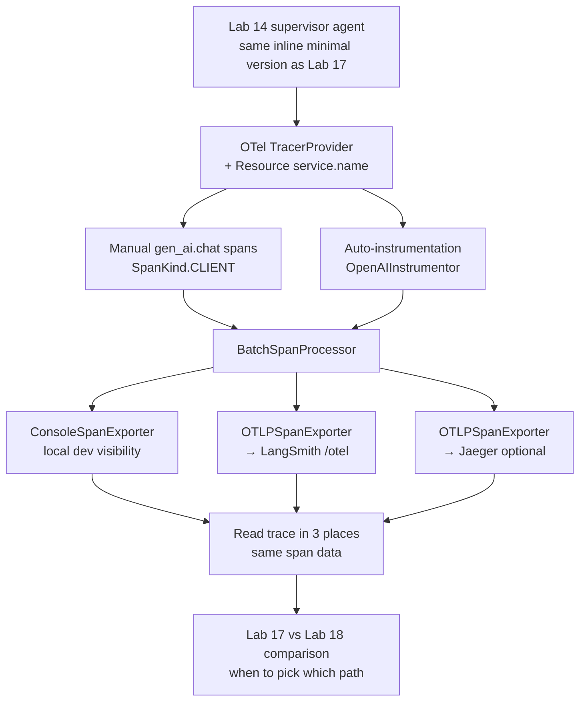

# Lab 18 — OpenTelemetry portable tracing

> ⏱ 90-110 min · 🔴 Advanced · Prerequisites: [Lab 17](../17-langsmith-trace-ingestion/) (the LangSmith-native counterpart — recommended but not strictly required), [OpenTelemetry GenAI semantic conventions](../../concepts/evaluation/opentelemetry-genai-conventions.md), [platform fanout and portability](../../concepts/evaluation/platform-fanout-and-portability.md), a free LangSmith account.

Instrument the same Lab 14-style supervisor agent from Lab 17, this time with OpenTelemetry's GenAI semantic conventions. Three exporters: console (immediate dev visibility), OTLP→LangSmith (the same UI as Lab 17), and optionally OTLP→Jaeger (the vendor-neutral demo).

Lab 17 showed the LangSmith-native path; Lab 18 shows the vendor-neutral one. Together they establish both viable production-instrumentation paths. Modules 4-7 build on whichever the reader picked.

## What you'll build

No new agent code — the lab reuses the Lab 17 supervisor inline. The focus is the instrumentation layer: OTel-native instead of LangSmith-native.

## Goal

By the end of the lab you should be able to:

- Install the OpenTelemetry Python SDK and the OpenAI auto-instrumentor, configure a `TracerProvider` with a `Resource`, attach `BatchSpanProcessor`s for multiple exporters.
- Create gen_ai spans manually with the correct `SpanKind` (CLIENT for LLM calls, INTERNAL for tool execution and agent invocations) and the canonical `gen_ai.*` attribute set.
- Use the `OpenAIInstrumentor` for auto-instrumented LLM calls; understand when manual instrumentation is required (custom retrievers, business logic, orchestration glue).
- Configure the OTLP exporter to fanout to LangSmith's `/otel` endpoint with the right OTLP headers (`x-api-key`, `Langsmith-Project`).
- (Optional) Stand up a local Jaeger via docker; add a third exporter; observe the same trace in three places (console + LangSmith + Jaeger).
- Decorate an agent boundary as a `gen_ai.invoke_agent` span; see it wrap the underlying LLM call spans correctly.
- Compare Lab 17's `@traceable`-decorated trace shape against Lab 18's OTel-instrumented trace shape; identify what's the same (the data) and what's different (the wiring + lock-in cost).
- Apply the `OTEL_SEMCONV_STABILITY_OPT_IN=gen_ai_latest_experimental` env var to emit v1.37+ aggregated attributes.
- Decide for a specific project whether the Lab 17 or Lab 18 path is the right starting point.

## Prerequisites

- **Lab 17 (LangSmith trace ingestion)** — recommended. The same agent and the same LangSmith UI are reused here; reading Lab 17 first makes the contrast concrete. The lab works without Lab 17 but the "what's different" framing assumes you've seen the LangSmith-native path.
- **Concept pages** — read [OpenTelemetry GenAI semantic conventions](../../concepts/evaluation/opentelemetry-genai-conventions.md) and [platform fanout and portability](../../concepts/evaluation/platform-fanout-and-portability.md) before starting. The lab applies patterns those pages establish.
- **Free LangSmith account** — sign up at smith.langchain.com if you haven't already. Same account used in Lab 17.
- **OpenAI API access** — the lab uses `gpt-4o-mini` directly via the OpenAI SDK (not via LangChain's wrapper) to demonstrate provider-level auto-instrumentation. Anthropic also works (swap to `opentelemetry-instrumentation-anthropic`).
- **(Optional) Docker** — for the Jaeger fanout step. Without docker, the lab works through Step 6; Step 7 is skipped.

## 🛠 Tools and versions

| Library | Version (May 2026) | Used for |
|---|---|---|
| `opentelemetry-sdk` | ≥ 1.27 | Core SDK: `TracerProvider`, `BatchSpanProcessor`, `Resource` |
| `opentelemetry-exporter-otlp` | ≥ 1.27 | OTLP HTTP exporter for LangSmith and Jaeger ingest |
| `opentelemetry-instrumentation-openai` | latest stable | Auto-instrumentation for `openai` Python SDK |
| `openai` | ≥ 1.50 | Provider SDK (used directly in this lab) |
| `langgraph` | already pinned | Agent runtime |

Two new packages this lab adds to the toolchain: `opentelemetry-sdk` + `opentelemetry-exporter-otlp` + `opentelemetry-instrumentation-openai`. The setup cell installs them with explicit pip; pinning them in `pyproject.toml` is a hygiene-batch task.

## Structure

The lab is structured to make the OTel patterns visible step-by-step before adding the production wiring.

- **Step 0**: Setup — install OTel packages, set env vars (`OTEL_SERVICE_NAME`, `OTEL_EXPORTER_OTLP_ENDPOINT`, `OTEL_EXPORTER_OTLP_HEADERS`, `OTEL_SEMCONV_STABILITY_OPT_IN`).
- **Step 1**: Inline minimal Lab 14 agent — same supervisor + stub researcher + writer pattern as Lab 17. Reused to keep the focus on instrumentation.
- **Step 2**: Configure the `TracerProvider` with a `Resource` (`service.name`, `deployment.environment`). The single source of identity for the spans this process emits.
- **Step 3**: Add the `ConsoleSpanExporter` with `SimpleSpanProcessor` for immediate visibility. Run the agent; see raw spans printed.
- **Step 4**: Manually create a `gen_ai.chat` span around an OpenAI call. Set `gen_ai.system`, `gen_ai.request.model`, `gen_ai.usage.input_tokens`/`output_tokens`. The span kind discipline: `SpanKind.CLIENT` for LLM calls is the critical attribute.
- **Step 5**: Add `OpenAIInstrumentor` for auto-instrumented LLM calls. Same gen_ai attributes; no manual decoration. Discuss when each pattern earns its place.
- **Step 6**: Add the `OTLPSpanExporter` pointing at LangSmith's `/otel` endpoint with the OTLP headers. Run the agent; same trace lands in BOTH the console and LangSmith. Open the LangSmith UI to confirm.
- **Step 7** (optional): Stand up local Jaeger via `docker run -p 16686:16686 -p 4318:4318 jaegertracing/all-in-one`. Add a third `OTLPSpanExporter`. True 3-way fanout. Skip this step without docker.
- **Step 8**: Read the same trace in both LangSmith and the console (and Jaeger if running). Note what's the same (the data) and what's different (the UI rendering, the queryability).
- **Step 9**: Add a `gen_ai.invoke_agent` span around the supervisor node. Set `gen_ai.agent.name="supervisor"`, `gen_ai.operation.name="invoke_agent"`. See it wrap the underlying LLM call spans correctly in the trace tree.
- **Step 10**: Lab 17 vs Lab 18 comparison — a side-by-side table: setup time, lock-in cost, ecosystem-fit cost, what each makes easy/hard.
- **Step 11**: Synthesis — picking the right path for a real project.

~28 cells total, ~17 markdown / ~11 code, output-stripped.

## What to watch for

**1. Span kind is the cheapest-to-get-right, expensive-to-debug attribute.** LLM calls need `kind=SpanKind.CLIENT`. Without it, APMs (Datadog, New Relic) group LLM spans under "internal database operations" in service maps. Two minutes to fix; hours to debug. The lab's Step 4 makes this explicit.

**2. `OpenAIInstrumentor` instruments the global `openai` module.** Calling `OpenAIInstrumentor().instrument()` monkey-patches the SDK. Doing it twice doesn't double-instrument (it's idempotent) but does silence later calls. Set it up once in your entry point.

**3. `OTEL_SEMCONV_STABILITY_OPT_IN=gen_ai_latest_experimental` matters for v1.37+ attributes.** Without it, instrumentations default to whatever version they were emitting (often v1.36 with per-message events). The lab sets it explicitly in Step 0.

**4. The LangSmith OTLP endpoint differs between SaaS and self-hosted.** SaaS: `https://api.smith.langchain.com/otel`. Self-hosted: typically `https://<your-langsmith-host>/api/v1/otel`. Some exporters require appending `/v1/traces` to the path. The lab uses SaaS; self-hosted readers adapt.

**5. Console output during development is non-negotiable.** Watching spans print as the agent runs catches bugs faster than checking the UI. The lab uses `SimpleSpanProcessor` for the console (immediate) and `BatchSpanProcessor` for OTLP (production-style batching).

**6. Jaeger via docker requires the all-in-one image with OTLP enabled.** The image listens on port 4318 for OTLP HTTP. The lab uses the OTLP HTTP exporter, not the legacy Jaeger Thrift exporter. Older docs still show Jaeger's UDP/Thrift agent; that's deprecated. Use OTLP.

**7. `OpenAIInstrumentor` and manual spans cooperate.** If you manually start a parent span with `kind=SpanKind.INTERNAL` (e.g., for the agent boundary) and call openai inside it, the auto-instrumented `gen_ai.chat` span correctly nests as a child. The parent-child relationship is implicit from context propagation.

**8. LangSmith ingests both formats.** Lab 17's `@traceable`-decorated trace shape (LangSmith-native) and Lab 18's OTel-instrumented shape both land in the same LangSmith UI. Side-by-side comparison is direct.

## What's not in this lab (anti-scope)

- **Tail-based sampling at the Collector layer.** Module 6.
- **OTel baggage for cost attribution.** Module 6.
- **`langsmith-collector-proxy` deployment.** Mentioned in concept page; requires a real cluster and isn't notebook-friendly.
- **Self-hosted Langfuse / Phoenix integration.** The fanout pattern works identically; specific endpoint and auth config is in their respective docs. Out of scope here to keep the lab focused.
- **`opentelemetry-instrumentation-langchain` deep-dive.** Mentioned briefly in Step 5; the LangChain-native auto-instrumentor works similarly to `OpenAIInstrumentor`. The lab uses raw `openai` to make the manual-vs-auto distinction concrete.
- **Production-scale exporter tuning.** Buffer sizes, batch flush intervals, back-pressure handling. Module 6.
- **A solution directory.** Lab solutions land in a follow-up batch per the Lab 09/16/17 pattern.

## Cost and timing

- LangSmith free tier: 5,000 traces/month. This lab uses ~10. **No charge.**
- LLM calls (5 runs × ~3 LLM calls × gpt-4o-mini rates): **~$0.05-0.15.**
- Total per full lab run: **~$0.05-0.20** (same as Lab 17).
- Wall-clock: **90-110 minutes** including reading both concept pages and the Lab 17 vs Lab 18 comparison.

You'll need:
- A LangSmith account (free tier; same as Lab 17)
- `LANGSMITH_API_KEY` in your environment
- `OPENAI_API_KEY` (or `ANTHROPIC_API_KEY` if swapping providers)
- Optionally docker (for Step 7's Jaeger fanout demonstration)

## Solution

Reference solution lands in a follow-up batch (Lab 09/16/17 pattern).

## Next

After this lab, Module 4 (planned, future batch) covers online evaluation against the live trace stream: registering evaluators in the platform that fire on every ingested trace, tail-based sampling decisions, alerts on metric regressions. Module 4 builds on either Lab 17's LangSmith-native path or Lab 18's OTel-native path — whichever you picked.

## References

- [OpenTelemetry GenAI semantic conventions](../../concepts/evaluation/opentelemetry-genai-conventions.md) — the attribute names and span shapes this lab implements.
- [Platform fanout and portability](../../concepts/evaluation/platform-fanout-and-portability.md) — the fanout patterns this lab applies.
- [Lab 17 — LangSmith trace ingestion](../17-langsmith-trace-ingestion/) — the LangSmith-native counterpart for direct comparison.
- LangChain docs, *Trace with OpenTelemetry*: [docs.langchain.com](https://docs.langchain.com/langsmith/trace-with-opentelemetry).
- OpenTelemetry Python docs, *Exporters*: [opentelemetry.io/docs/languages/python](https://opentelemetry.io/docs/languages/python/exporters/).
- OpenTelemetry GenAI conventions (official spec): [opentelemetry.io/docs/specs/semconv/gen-ai](https://opentelemetry.io/docs/specs/semconv/gen-ai/).
