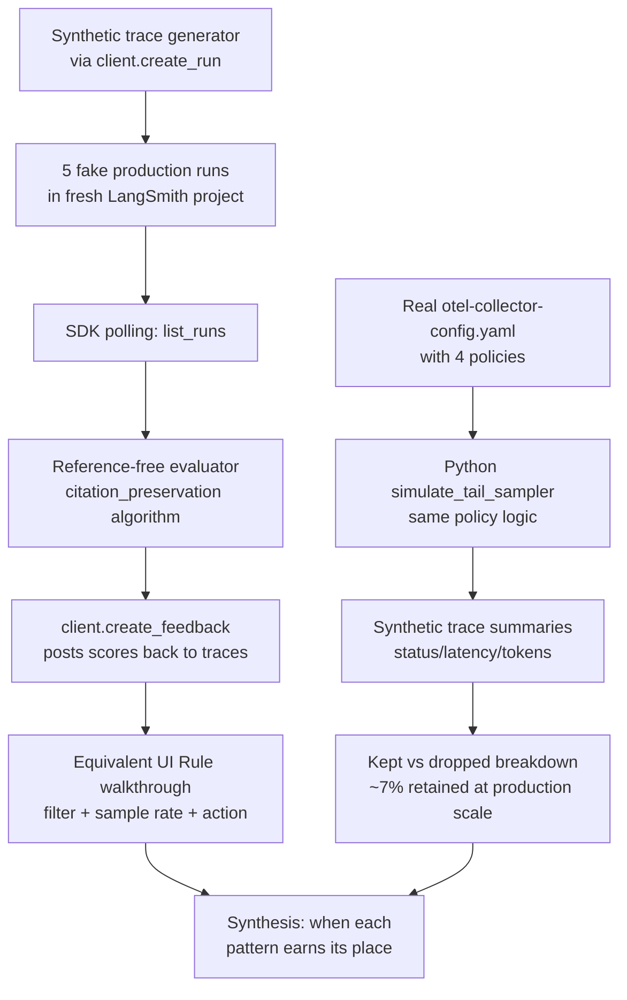

# Lab 19 — Online evaluation and tail-based sampling

> ⏱ 80-100 min · 🔴 Advanced · Prerequisites: [Online evaluator registration](../../concepts/evaluation/online-evaluator-registration.md), [Tail-based sampling](../../concepts/evaluation/tail-based-sampling.md), a free LangSmith account; familiarity with at least one of {Lab 17, Lab 18}.

Two halves, one lab. Half A wires the LangSmith Python SDK polling pattern — fetch recent traces, run a reference-free evaluator, post scores back as feedback. Half B walks through a real OTel Collector `tail_sampling` config and simulates the policy logic in Python to show what gets kept vs dropped.

The lab is self-contained: synthetic traces are generated via `client.create_run`, so you don't need to re-run Labs 17/18. The patterns apply identically to real production traffic.

## What you'll build

## Goal

By the end of the lab you should be able to:

- Generate synthetic LangSmith Runs programmatically via `client.create_run` for testing online-evaluation patterns without real production traffic.
- Write a reference-free evaluator function that examines a trace's outputs for structural properties (citation presence, format validity) without needing ground truth.
- Use the LangSmith Python SDK polling pattern (`list_runs` + iterate + `create_feedback`) as the code-side equivalent of a UI-configured Automation Rule.
- Read a LangSmith Automation Rule configuration and predict which traces it affects and what actions fire in what order.
- Read a real OTel Collector `tail_sampling` YAML config — identify policy types, evaluation order, decision_wait/num_traces budget.
- Implement a Python simulator that applies the same first-match-wins policy logic to synthetic trace summaries; verify the kept/dropped breakdown matches the policy intent.
- Compute the storage-cost-reduction math for a representative production traffic pattern.
- Explain why tail sampling requires all spans for a trace to reach the same Collector instance, and what the two-tier `loadbalancingexporter` topology solves.
- Pick between LangSmith Rules and Collector tail sampling for specific situations — and recognize when production deployments need both.

## Prerequisites

- **At least one of Lab 17 or Lab 18** — the underlying trace-ingestion patterns. Lab 19 doesn't generate traces from a real agent; it uses synthetic traces. But understanding what a real trace looks like helps the synthetic versions feel grounded.
- **Concept pages** — read [online evaluator registration](../../concepts/evaluation/online-evaluator-registration.md) and [tail-based sampling](../../concepts/evaluation/tail-based-sampling.md) first. The lab moves fast through patterns those pages establish.
- **Free LangSmith account** — same one from Labs 17/18. Free tier covers this lab's ~20 traces.
- **No OpenAI API access strictly required** — the lab uses a small LLM call in one optional step (the LLM-as-judge variant of the evaluator); if skipped, the lab still works with the rule-based variant.

## 🛠 Tools and versions

| Library | Version | Used for |
|---|---|---|
| `langsmith` | already pinned in repo | `Client.create_run`, `Client.list_runs`, `Client.create_feedback` |
| `pyyaml` | small new dep | Reading the example `otel-collector-config.yaml` |

The `pyyaml` install is a one-line `pip install` in the lab; tiny. Real OTel Collector deployment is not required — the lab walks through a YAML config and simulates the policy logic in Python.

## Structure

26 cells, 16 markdown / 10 code, output-stripped.

### Half A — LangSmith online evaluation (Steps 0-6)

- **Step 0**: Setup — env vars, install, verify LangSmith connection.
- **Step 1**: Generate 5 synthetic traces via `client.create_run`. Each has an input task, an output answer, varied citation patterns (some correctly preserve `[1]`/`[2]` markers, some drop them, some fabricate them). Simulates production traffic with known-failure-mode diversity.
- **Step 2**: Define a reference-free evaluator — `citation_preservation`, reused from Lab 16. The function checks whether the output contains citation markers without needing a reference answer.
- **Step 3**: The SDK polling pattern — `client.list_runs(project_name=...)` → iterate → `client.create_feedback(run_id, key=..., score=...)`. Code-side equivalent of a Rule.
- **Step 4**: Inspect results — pull the runs back via `list_runs` and verify the feedback scores attached correctly. The kind of audit you'd do after backfilling.
- **Step 5**: The equivalent UI Rule (markdown only; no code). What this would look like clicked into the LangSmith Automations tab: filter, sample rate, action. The reader sees both forms.
- **Step 6**: Sample-rate decisions — when 100% vs 10% vs only-errors makes sense. Cost arithmetic for an LLM-as-judge evaluator at varying rates.

### Half B — Tail-based sampling (Steps 7-10)

- **Step 7**: The architectural picture — application emits 100%, Collector decides what to forward. Mermaid diagram of the data flow.
- **Step 8**: Read a real `otel-collector-config.yaml` — a 4-policy stack: errors, high-latency, high-token-usage, 5% baseline. Walk through each policy. Identify first-match-wins ordering.
- **Step 9**: Implement `simulate_tail_sampler(traces, policies)` in Python — apply the same policy logic to a list of synthetic trace summaries. Verify the kept/dropped breakdown matches policy intent.
- **Step 10**: The load-balancing constraint — why all spans for a trace must reach the same Collector. The two-tier topology with `loadbalancingexporter`. Walkthrough only; not deployed.

### Synthesis (Step 11)

- **Step 11**: When LangSmith Rules earn their place vs Collector tail sampling. The complementary pattern in production: tail-sample at the Collector → Rules at the platform. Three concrete decision criteria.

## What to watch for

**1. `client.create_run` doesn't auto-fill all fields.** The lab provides explicit `start_time`, `end_time`, `inputs`, `outputs`, `run_type`, etc. Missing fields make traces look broken in the LangSmith UI. The lab's Step 1 sets the minimal required set.

**2. `list_runs` is paginated, and the default sort order is descending by start_time.** For backfilling, set `execution_order=1` to filter to root runs only (not the LLM-call sub-runs); otherwise the polling pattern processes far more traces than intended.

**3. `create_feedback` attaches by `run_id`, not by `trace_id`.** A trace has a root run; feedback attaches to the root. If you have nested sub-runs and want to attach feedback to a sub-run specifically, pass its run_id (not the trace id).

**4. Reference-free evaluators have lower confidence than reference-comparing ones.** The lab's `citation_preservation` flags structurally-incorrect outputs, but a correct-but-paraphrased citation set passes the structural check while semantically failing the user. This is the inherent limitation of reference-free evaluation; calibration against periodic human labels (Module 5) addresses it.

**5. Tail sampling policies are evaluated in order; first match wins.** The order matters. If `probabilistic: 5%` is listed first, all subsequent policies are unreachable. Errors-first / latency-second / cost-third / baseline-last is the canonical ordering for a reason.

**6. The `decision_wait` knob trades memory for completeness.** At 10s default, traces with long-running tool calls may have late spans that miss the decision window — the trace gets sampled based on incomplete data. For agent traces specifically, `decision_wait: 30s` is often more appropriate.

**7. Without the load-balancing two-tier topology, multi-instance Collectors produce wrong sampling.** Spans get split; tail sampling sees partial traces; decisions are inconsistent. The symptom is "tail sampling looks broken but config is correct." Surprisingly common in production deployments that scaled before reading the manual.

**8. LangSmith Rules and Collector tail sampling complement; they don't compete.** Production-scale deployments use both. Tail sampling reduces what reaches the platform; Rules decide what to do with what arrived.

## What's not in this lab (anti-scope)

- **Actual OTel Collector deployment.** The lab walks through the YAML and simulates policy logic in Python. Real Collector deployment requires docker + a multi-node setup; out of scope for a notebook.
- **LangSmith UI Rule creation.** UI walkthroughs don't translate well to notebooks. The lab shows what the equivalent UI configuration looks like; the reader does the UI step manually if interested.
- **LangSmith Engine** (the AI layer on top of online evaluators). Mentioned in concept pages; out of scope for this lab.
- **Webhook receivers.** Mentioned as a Rule action type; building webhook handlers is its own topic.
- **Drift detection on metric distributions.** Module 5.
- **Agent-as-judge calibration against periodic human labels.** Module 5.
- **OTel baggage for cost attribution.** Module 6.
- **A solution directory.** Lab solutions land in a follow-up batch (Lab 09/16/17/18 pattern).

## Cost and timing

- LangSmith free tier: 5,000 traces/month. This lab uses ~10 (5 synthetic traces + repeated reads). **No charge.**
- LLM calls: ~$0.005 if running the optional LLM-as-judge variant in Step 2.
- Wall-clock: **80-100 minutes** including reading both concept pages and the synthesis.

You'll need:
- A LangSmith account (free tier; same as Labs 17/18)
- `LANGSMITH_API_KEY` in your environment
- `OPENAI_API_KEY` (only if running the optional LLM-as-judge variant)

## Solution

Reference solution lands in a follow-up batch (Lab 09/16/17/18 pattern).

## Next

After this lab, Module 5 (planned, future batch) covers drift detection and agent-as-judge calibration. The output of Lab 19's online evaluator becomes the input of Module 5's drift detection — when scores trend down over time, when LLM-as-judge biases inflate confidence, how to calibrate against periodic human labels.

## References

- [Online evaluator registration](../../concepts/evaluation/online-evaluator-registration.md) — the platform-side mechanism.
- [Tail-based sampling](../../concepts/evaluation/tail-based-sampling.md) — the Collector-side mechanism.
- [Lab 17 — LangSmith trace ingestion](../17-langsmith-trace-ingestion/) — the trace-generation prerequisite.
- [Lab 18 — OpenTelemetry portable tracing](../18-opentelemetry-portable-tracing/) — the OTel-Collector-bound counterpart.
- LangChain docs, *Set up automation rules*: [docs.langchain.com](https://docs.langchain.com/langsmith/rules).
- OpenTelemetry Collector, *tailsamplingprocessor*: [github.com/open-telemetry/opentelemetry-collector-contrib](https://github.com/open-telemetry/opentelemetry-collector-contrib/tree/main/processor/tailsamplingprocessor).
