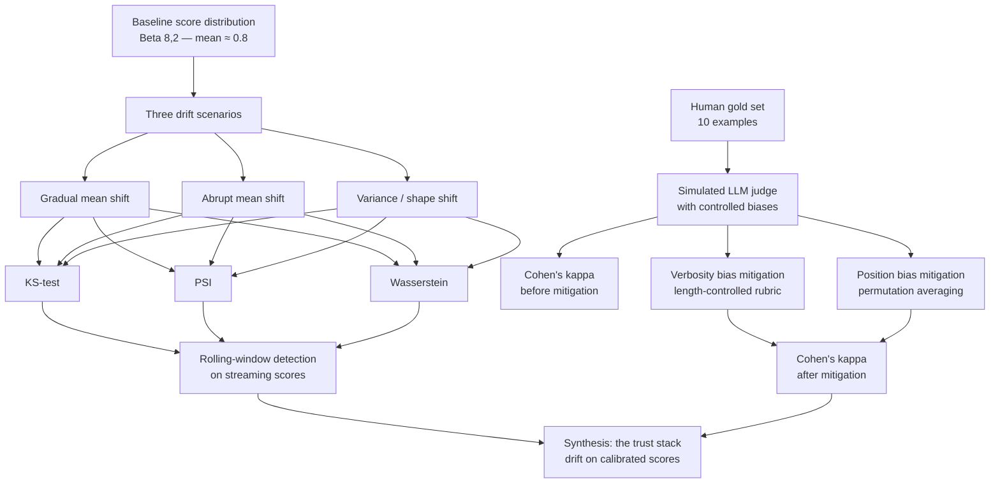

# Lab 20 — Drift detection and agent-as-judge calibration

> ⏱ 90-110 min · 🔴 Advanced · Prerequisites: [Drift detection](../../concepts/evaluation/drift-detection.md), [Agent-as-judge calibration](../../concepts/evaluation/agent-as-judge-calibration.md). Helpful but not strictly required: Lab 19 (the online-evaluator pattern this lab consumes scores from). Familiarity with `scipy.stats` and `sklearn.metrics`.

Two halves, one lab. Half A simulates 30 days of eval scores with three different drift patterns and detects each with the four canonical statistical tests. Half B runs an LLM-as-judge against a small human gold set, measures three named biases, applies mitigations, and computes Cohen's kappa as the calibration metric.

The lab is self-contained — all data is synthetic and deterministic. The patterns transfer directly to real production score streams from Lab 19's online evaluators.

## What you'll build

## Goal

By the end of the lab you should be able to:

- Generate score-stream data that mimics the three drift patterns: gradual mean shift, abrupt mean shift, and shape/variance shift with stable mean.
- Implement all four canonical drift tests from first principles: `ks_2samp`, PSI (hand-coded), `wasserstein_distance`, chi-square for categorical.
- Recognize which test catches which drift pattern most reliably — and why shape-only drift defeats naive mean-monitoring.
- Build a rolling-window drift detector that streams over a score series and emits an alert when persistent drift is detected.
- Set up a small human gold-labeled set and run an LLM-as-judge simulation against it.
- Compute and interpret Cohen's kappa with the Landis & Koch thresholds.
- Measure verbosity bias and position bias on synthetic judge outputs.
- Apply length-controlled prompt mitigation for verbosity bias; permutation-averaging for position bias.
- Plot kappa over simulated time to visualize the calibration loop and explain when the judge needs recalibration.
- Articulate when the 90/10 hybrid (LLM-as-judge for scale + human review for calibration) is required vs when pure LLM-as-judge suffices.

## Prerequisites

- **At least the two concept pages above** — the lab moves fast through patterns the pages establish.
- **Lab 19 (recommended, not required)** — Lab 19 produces the online-evaluator score stream; this lab demonstrates what to do with that stream's output. The synthetic data approach makes Lab 20 self-contained.
- **Statistical background** — comfort with hypothesis testing (p-values, null hypothesis), distribution comparison, and basic agreement metrics. The lab uses `scipy.stats` and `sklearn.metrics` as the primary toolkit; no explicit ML training.

## 🛠 Tools and versions

| Library | Version | Used for |
|---|---|---|
| `scipy` | already pinned in repo | `ks_2samp`, `wasserstein_distance`, `chisquare` |
| `numpy` | already pinned in repo | Distribution sampling and PSI computation |
| `sklearn` | already pinned in repo | `cohen_kappa_score` for inter-rater agreement |
| `matplotlib` | already pinned in repo | Rolling-window plots, kappa-over-time plots |
| `evidently` (optional) | new optional dep | OSS drift-report library; lab uses scipy-only fallback if not installed |

The lab is designed to run without `evidently` — the core math is in `scipy` and `numpy`. The Evidently variant is shown for teams that want HTML-report drift dashboards in CI; install with `pip install evidently` if you want to try that path.

## Structure

28 cells, 16 markdown / 12 code, output-stripped.

### Half A — Drift detection on eval scores (Steps 0-7)

- **Step 0**: Setup — `numpy`, `scipy`, `matplotlib`. Deterministic seed.
- **Step 1**: Generate the baseline distribution — 1000 samples from `Beta(8, 2)` (mean ≈ 0.8, narrow distribution). Represents "week 1 in production: agent is performing well."
- **Step 2**: Generate three drift scenarios:
  - **Scenario A — gradual drift**: `Beta(6, 3)` (mean ≈ 0.67). Detectable but subtle. Models a slow input-distribution shift.
  - **Scenario B — abrupt drift**: `Beta(4, 6)` (mean ≈ 0.4). Large shift. Models the "model provider silently updated weights" scenario.
  - **Scenario C — variance/shape drift**: `Beta(20, 5)` (mean ≈ 0.8, but distribution narrows). Same mean as baseline; shape collapsed toward high scores. Naive mean-monitoring misses this; KS catches it.
- **Step 3**: KS-test on each scenario — `scipy.stats.ks_2samp(baseline, current)`. Note the p-values.
- **Step 4**: PSI from first principles — hand-coded so the math is visible. Standard threshold interpretation: <0.1 stable, 0.1-0.25 moderate, >0.25 significant.
- **Step 5**: Wasserstein distance — scale-aware alternative to PSI. Interpret in score units.
- **Step 6**: Comparison table — which test catches which scenario most reliably. Shape-only drift (Scenario C) is the case naive monitoring fails on.
- **Step 7**: Rolling-window drift detection — slide a 100-sample window across a 1000-sample stream with a mid-stream drift event. Plot p-value over time. Annotate the warning / alert / critical lines.

### Half B — LLM-as-judge calibration (Steps 8-12)

- **Step 8**: The human gold set — 10 examples with binary ground-truth labels. Examples include answers of varying length and quality. The size is intentionally small to show the calibration loop with minimal labeling cost; production gold sets are typically 50-200.
- **Step 9**: Simulated LLM judge — a function that scores each example. Implemented as a deterministic function with controlled biases (verbosity bias: scores correlated with answer length; position bias in pairwise mode). Realistic, deterministic, lab-friendly.
- **Step 10**: Cohen's kappa baseline — `sklearn.metrics.cohen_kappa_score(human, judge)` before any mitigation. Interpret against the Landis & Koch scale.
- **Step 11**: Measure-and-mitigate two biases:
  - **Verbosity bias**: pair short-correct/long-correct examples; show judge over-weights length. Apply length-controlled prompt mitigation. Recompute kappa.
  - **Position bias**: pairwise mode with same pair in both orderings; show position-swap rate. Apply permutation averaging. Recompute kappa.
- **Step 12**: The recalibration loop visualization — simulate 12 weeks of judge runs; introduce a synthetic judge-drift event at week 6; plot kappa over time; show the alert firing when kappa drops below the 0.6 substantial-agreement threshold.

### Synthesis (Step 13)

- **Step 13**: The Path 06 trust stack assembled: instrumentation → online evaluation → drift detection on scores → calibration validates scores. When each layer earns its place; what happens when you skip any of them.

## What to watch for

**1. Naive mean-monitoring misses shape-only drift.** Step 2's Scenario C has the same mean as the baseline but a much narrower distribution. A mean-only alert (e.g., "alert if 7-day mean drops 5%") won't fire. The KS-test does. This is one of the strongest arguments for KS over mean-monitoring.

**2. KS-test p-values become very small with large sample sizes.** With 1000+ samples per window, even tiny distributional differences produce p < 0.001. Don't just check p-value < 0.05; track the KS statistic itself (the D value, the maximum CDF gap) for an effect-size signal independent of sample size.

**3. PSI threshold conventions are stable across teams.** The <0.1 stable / 0.1-0.25 moderate / >0.25 significant ranges are widely used in financial ML monitoring. They translate well to LLM eval scores.

**4. Wasserstein distance has units.** The number is in the units of the metric. A Wasserstein distance of 0.1 on `citation_preservation` scores (which are 0-1) means "the mean has shifted by approximately 0.1 in absolute terms." Easier to communicate to non-technical stakeholders than p-values.

**5. Cohen's kappa for binary labels is calibrated to chance agreement.** Two raters flipping coins independently agree 50% of the time on binary labels by random chance alone. Kappa subtracts that off. Don't substitute raw accuracy.

**6. The Landis & Koch thresholds are conventions, not laws.** Substantial agreement (κ ≥ 0.6) is the common production target, but some domains require almost-perfect agreement (κ ≥ 0.8) for any consequential decision. Medical and legal applications typically demand the higher threshold.

**7. Verbosity bias is the most reliably reproducible bias on lab data.** Position bias has become smaller in newer models (≤0.04 in some benchmarks); verbosity bias is more robust. The lab demonstrates both because the mitigation pattern (debias-via-prompt vs debias-via-permutation) differs.

**8. The calibration loop's value compounds over time.** A single kappa measurement at one point in time isn't very informative. The trend is the signal. The lab's Step 12 simulates this with a kappa-over-time plot.

## What's not in this lab (anti-scope)

- **Embedding-space drift detection.** Path 02 v2 territory (would be a Lab 09 extension). Mentioned by name in the drift concept page.
- **Autoencoder / reconstruction-loss drift.** Higher-complexity approach used by Arthur AI; out of scope for a notebook lab.
- **Real production data.** The lab uses synthetic distributions to make patterns deterministic. The patterns transfer directly to real score streams.
- **Drift-triggered retraining / RLAIF.** This is monitoring; retraining is a separate operational discipline.
- **Production alerting integration** (PagerDuty, Slack, webhook receivers). Webhook reference in the concept page only.
- **Multi-turn (threaded) calibration.** Module 7.
- **Cost attribution on the calibration loop.** Module 6.
- **A solution directory.** Solutions for Path 06 labs ship in a follow-up batch (Lab 09/16/17/18/19 pattern).

## Cost and timing

- LangSmith free tier: not used in this lab. The lab is local-compute only.
- LLM calls: **$0**. No real LLM calls — the "judge" is a simulated function with controlled biases.
- Total per full run: **~$0** (purely local computation).
- Wall-clock: **90-110 minutes** including reading both concept pages and the synthesis.

You'll need:
- Local Python with scipy, numpy, sklearn, matplotlib (all already in the repo's pinned base deps)
- Optional: `pip install evidently` for the HTML-report variant

## Solution

Reference solution lands in a follow-up batch (Lab 09/16/17/18/19 pattern).

## Next

After this lab, Module 6 (planned, future batch) covers cost attribution: tracking per-user / per-task / per-tenant cost across the agent's invocations via OTel baggage propagation, plus production-scale sampling decisions at the Collector. Module 7 then closes Path 06 v1 with multi-turn evaluation patterns for conversation-level trajectories.

## References

- [Drift detection](../../concepts/evaluation/drift-detection.md) — the score-stream-monitoring complement.
- [Agent-as-judge calibration](../../concepts/evaluation/agent-as-judge-calibration.md) — the trust-the-scores foundation.
- [Lab 19 — online evaluation and sampling](../19-online-evaluation-and-sampling/) — produces the score streams Lab 20 monitors.
- scipy.stats documentation: [docs.scipy.org](https://docs.scipy.org/doc/scipy/reference/stats.html).
- sklearn.metrics.cohen_kappa_score: [scikit-learn.org](https://scikit-learn.org/stable/modules/generated/sklearn.metrics.cohen_kappa_score.html).
- Evidently AI documentation: [evidentlyai.com](https://www.evidentlyai.com/).
