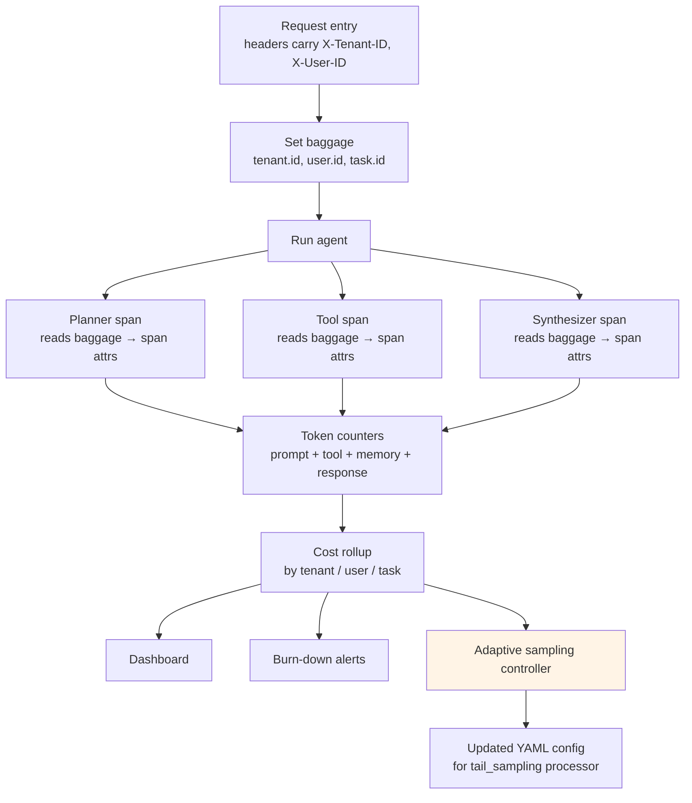

# Lab 21 — Cost attribution and adaptive sampling

> ⏱ 80-100 min · 🔴 Advanced · Prerequisites: [Cost attribution](../../concepts/evaluation/cost-attribution.md), [Adaptive sampling](../../concepts/evaluation/adaptive-sampling.md). Helpful but not strictly required: Lab 18 (the OTel-instrumented agent this lab extends with baggage), Lab 19 (the tail-sampling pattern this lab extends with cost-driven policies).

Two halves. Half A instruments a multi-step agent with OTel baggage carrying `tenant.id`, `user.id`, and `task.id`, then demonstrates cross-span propagation through tool calls. The four token layers are tracked as separate counters; cost is rolled up per attribution dimension. Half B configures the Collector with cost-driven sampling policies and implements the external control-loop pattern that adjusts sampling rates based on per-tenant burn rates.

The lab is self-contained. Real OTel SDK runs locally; trace output is visible via the console exporter; the cost-driven sampling policies are demonstrated by simulating the policy logic in Python (production deployment would target a real Collector, out of scope for a notebook).

## What you'll build

## Goal

By the end of the lab you should be able to:

- Set OTel baggage at request entry with `baggage.set_baggage()` + `context.attach()`.
- Read baggage from any downstream span and copy values to span attributes for searchability.
- Track the four token layers (prompt, tool, memory, response) as separate span attributes via the GenAI semantic conventions naming.
- Roll up cost across spans into per-tenant, per-user, and per-task views.
- Write a Collector configuration with composite policies including `numeric_attribute` on cost and `string_attribute` on tenant tier.
- Implement an external `AdaptiveSamplingController` in Python that polls cost metrics and emits config updates.
- Explain why the two-tier Collector topology (`loadbalancingexporter` → `tailsamplingprocessor`) is required for tail sampling at scale.
- Calculate `num_traces` for a target traffic rate and decision_wait window.
- Articulate when fixed-rate sampling suffices and when cost-driven adaptive sampling earns its place.
- Recognize the 4KB baggage limit and the IDs-only / no-PII / no-secrets discipline.

## Prerequisites

- **Both concept pages above** — the lab moves fast through patterns the pages establish.
- **Working OTel SDK install** — `pip install opentelemetry-api opentelemetry-sdk` (both small, no native deps).
- **Lab 18 (recommended)** — the OTel-instrumented agent this lab extends with baggage. Not strictly required since baggage primitives are shown in isolation here; helpful for the full mental model.
- **YAML reading comfort** — the Collector config in Half B is the production deployment artifact.

## 🛠 Tools and versions

| Library | Version | Used for |
|---|---|---|
| `opentelemetry-api` | already pinned (Lab 18) | `baggage`, `context`, `trace` modules |
| `opentelemetry-sdk` | already pinned (Lab 18) | `ConsoleSpanExporter`, `TracerProvider` |
| `pyyaml` | already pinned (Lab 19) | Load and inspect the Collector YAML config |

No new dependencies beyond what Labs 18 and 19 introduced. The lab runs entirely on stock OTel SDK; no Collector deployment required.

## Structure

30 cells, 18 markdown / 12 code, output-stripped.

### Half A — Cost attribution via baggage (Steps 0-7)

- **Step 0**: Setup — OTel SDK with `ConsoleSpanExporter`. Deterministic seed for the synthetic cost data.
- **Step 1**: The three-dimensions framing recap. Why per-user, per-task, per-tenant each answer different questions.
- **Step 2**: The four token layers (prompt, tool, memory, response) as separate counter attributes. Show why aggregating to input/output hides spend.
- **Step 3**: The baggage primitive — `baggage.set_baggage()`, `context.attach()`, `baggage.get_baggage()`. A minimal one-function demo that shows baggage flowing from setter to reader without explicit argument passing.
- **Step 4**: Multi-step agent simulation — planner → tool-caller → synthesizer. Each is its own span. Baggage set at entry propagates to all three. Each span reads `tenant.id` / `user.id` / `task.id` from baggage and adds them as span attributes. Compare to the "pass as function arguments" anti-pattern.
- **Step 5**: Per-span cost — provider rates × per-layer tokens; roll up to trace-level cost. Show the GenAI semantic-convention attribute names.
- **Step 6**: Burn-down report — synthesize 200 traces across 5 tenants and 20 users with different traffic patterns. Compute totals by dimension. Surface the "one tenant burning 80% of budget" signal.
- **Step 7**: The 4KB baggage limit, PII concerns, the allowlist pattern. What NOT to put in baggage.

### Half B — Adaptive sampling tied to cost (Steps 8-12)

- **Step 8**: Walk through a production-realistic Collector YAML with composite policies: errors / latency / high-cost / enterprise-tier / probabilistic-baseline. Load it with PyYAML; explain first-match-wins evaluation order.
- **Step 9**: The cost-driven policy specifically — `numeric_attribute` on `gen_ai.cost.total_usd` with `min_value: 0.10`. Simulate it in Python on the 200 synthetic traces from Step 6; show the retention statistics.
- **Step 10**: The external control loop — implement an `AdaptiveSamplingController` class that reads per-tenant burn rates, computes new sampling parameters via quadratic-falloff strategy, and emits the updated YAML. Demonstrate the policy-update flow as code.
- **Step 11**: The two-tier Collector topology — `loadbalancingexporter` first tier hashes by trace_id, `tailsamplingprocessor` second tier samples. Diagram + YAML for both tiers. Walk through what breaks without this (the half-trace failure mode).
- **Step 12**: Cost arithmetic at 1M traces/mo — head-only ingestion vs cost-aware tail sampling. Show the ~10x cost reduction the pattern delivers.

### Synthesis (Step 13)

- **Step 13**: The Path 06 production stack now complete with Modules 1-6. Five operational layers assembled: instrumentation → online evaluation → drift detection → calibration → cost attribution + adaptive sampling. Where Module 7 (multi-turn) fits next.

## What to watch for

**1. Baggage is implicit; span attributes are explicit.** Baggage propagates without you passing it as an argument. You don't see it in function signatures, which is exactly the point — and exactly the surprising part. The pattern is "set early, read everywhere, copy to span attributes for the trace store to index."

**2. The redundant set_attribute call matters.** Baggage is the propagation mechanism. Span attributes are the searchable index. If you skip the `span.set_attribute("tenant.id", ...)` step, the trace store won't have `tenant.id` to group by even though baggage was correctly set. Both are required.

**3. The 4KB limit is per-trace, not per-entry.** All baggage entries combined must fit in 4KB. Tempting to add more identity (org.id, project.id, environment, region, feature_flags...) until you exceed the limit and propagation silently truncates.

**4. ConsoleSpanExporter prints to stdout; useful for the lab, terrible for production.** The lab uses it because output is visible inline in the notebook. Production exports to OTLP toward the Collector. Same SDK API; different exporter.

**5. The `numeric_attribute` cost policy requires cost to be present as a span attribute.** This is why the cost-rollup step in Half A is a prerequisite for the cost-driven sampling in Half B. Without the attribute, the policy can't fire.

**6. First-match-wins means policy ordering matters operationally.** If you put `probabilistic` first, it'll catch errors and high-cost traces at the configured percentage rather than 100%. The priority order in Step 8 (errors → latency → cost → tier → probabilistic) is the canonical pattern.

**7. `decision_wait` of 30s for agents.** Default examples use 10s, which is wrong for agents with multi-second tool calls. The lab uses 30s; the formula `num_traces = traces_per_sec × decision_wait × 1.2` follows from there.

**8. The control-loop strategies are not auto-magical.** The Collector reads static YAML. Adaptive sampling requires an external controller that polls metrics and pushes config updates via file write, OPAMP, or remote-config endpoint. The lab shows the controller logic in Python; production deploys it as a sidecar or a dedicated service.

## What's not in this lab (anti-scope)

- **Real Collector deployment** (docker + multi-node + load balancer). Out of scope for a notebook; simulator pattern follows Labs 19 and 20.
- **Prompt-caching cost math** (cached_read_tokens × cached pricing vs full pricing). Mentioned in the concept page; out of scope for the lab.
- **FinOps tool integration** (Vantage, CloudZero, Apptio). Mentioned by name; not implemented.
- **Usage forecasting** (ARIMA, linear extrapolation). Different discipline; out of scope.
- **SDK-level head sampling** beyond a brief comparison. Tail-based is the focus.
- **Rate-limit infrastructure** (Redis token buckets). Mentioned as the Layer-3 enforcement pattern; not implemented.
- **A solution directory.** Reference solutions for all Path 06 labs ship in a follow-up batch.

## Cost and timing

- **LangSmith free tier**: not used. The lab doesn't ingest traces to any platform — ConsoleSpanExporter prints them locally.
- **LLM calls**: $0. No real LLM calls; the "agent" is a Python simulation with deterministic synthetic costs.
- **Total per full run**: ~$0 (purely local SDK + computation).
- **Wall-clock**: 80-100 minutes including reading both concept pages and the synthesis.

You'll need:
- Local Python with `opentelemetry-api`, `opentelemetry-sdk`, `pyyaml` (all already in the repo's pinned base deps)
- No API keys

## Solution

Reference solution lands in a follow-up batch.

## Next

After this lab, Module 7 (planned, future batch) closes Path 06 v1 with multi-turn (threaded) evaluation patterns for conversation-level trajectories. With Lab 21 shipped, the production operations layer of Path 06 is structurally complete; Module 7 is the trajectory-evaluation specialization on top.

## References

- [Cost attribution](../../concepts/evaluation/cost-attribution.md) — the dimensions, layers, and propagation mechanics.
- [Adaptive sampling](../../concepts/evaluation/adaptive-sampling.md) — the policy types, control-loop strategies, and two-tier topology.
- [Lab 18 — OpenTelemetry portable tracing](../18-opentelemetry-portable-tracing/) — the OTel-instrumented agent this lab extends.
- [Lab 19 — Online evaluation and sampling](../19-online-evaluation-and-sampling/) — the tail-sampling pattern this lab extends.
- OpenTelemetry Python baggage docs: [opentelemetry.io](https://opentelemetry.io/docs/languages/python/).
- OpenTelemetry tailsamplingprocessor README: [github.com/open-telemetry](https://github.com/open-telemetry/opentelemetry-collector-contrib/blob/main/processor/tailsamplingprocessor/README.md).
