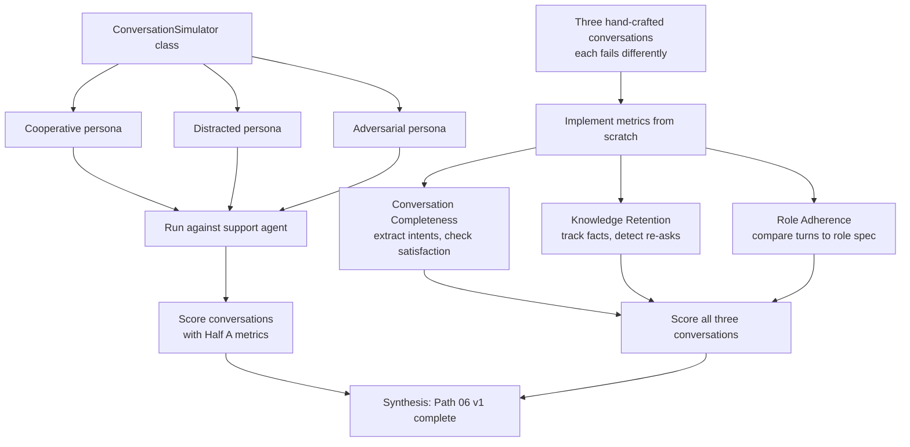

# Lab 22 — Multi-turn (threaded) evaluation

> ⏱ 75-95 min · 🔴 Advanced · Prerequisites: [Multi-turn evaluation](../../concepts/evaluation/multi-turn-evaluation.md), [Conversation simulation](../../concepts/evaluation/conversation-simulation.md). Helpful: any prior Path 06 lab. Useful: Lab 14 or 15 (the supervisor-style agent pattern).

Two halves. Half A implements three of the four canonical conversation-level metrics from scratch (Conversation Completeness, Knowledge Retention, Role Adherence) and applies them to three hand-crafted conversations where every turn looks fine but the dialogue as a whole fails. Half B builds a minimal `ConversationSimulator` with three personas (cooperative, distracted, adversarial), runs a small support agent against each, and scores the resulting conversations.

This is the sixth and final Path 06 lab. With Lab 22, Path 06 v1 is structurally complete.

## What you'll build

## Goal

By the end of the lab you should be able to:

- Distinguish turn-level, conversation-level, and trajectory metrics; explain which question each answers.
- Implement Conversation Completeness from scratch: extract user intents from history, check each was satisfied.
- Implement Knowledge Retention from scratch: track user-provided facts, detect when the agent re-asks for them.
- Implement Role Adherence from scratch: define a role spec, score each turn for compliance.
- Recognize that single-turn metrics can pass while conversation-level metrics catch real failures (the "grading movies by random frames" problem).
- Build a minimal `ConversationSimulator` that pairs a user-simulator LLM with an agent under test.
- Define cooperative, distracted, and adversarial personas via system prompts.
- Recognize the cooperative-only trap and the persona-consistency drift problem.
- Apply the sliding-window pattern for conversations exceeding judge context.
- Articulate when simulation supplements but doesn't replace production-trace evaluation (the Sim2Real gap).
- Articulate where Lab 22 sits in the Path 06 v1 production-readiness stack.

## Prerequisites

- **Both concept pages above** — the lab moves fast through patterns the pages establish.
- **An OpenAI or Anthropic API key** with access to a cheap-tier model (`gpt-4o-mini`, `claude-haiku-4-5`, or equivalent). The lab uses LLM-as-judge calls; bounded total cost ~$0.02.
- **Lab 14 or 15 (recommended, not required)** — the supervisor-style agent pattern. Lab 22's "support agent" is a minimal variant.
- **Familiarity with OpenAI/Anthropic Python SDK** — the lab uses `client.chat.completions.create()` or equivalent; same surface as Labs 13-21.

## 🛠 Tools and versions

| Library | Version | Used for |
|---|---|---|
| `openai` (or `anthropic`) | already pinned (Lab 13+) | LLM-as-judge calls for the three metrics + user-simulator LLM |
| `pyyaml` | already pinned (Lab 19) | Role specs are YAML; one judge-prompt template loaded from YAML |

No new dependencies. The lab builds DeepEval-style metrics from scratch rather than installing the framework — to keep the dependency footprint small and to make the metric machinery visible.

## Structure

30 cells, 18 markdown / 12 code, output-stripped.

### Half A — Conversation-level metrics from scratch (Steps 0-7)

- **Step 0**: Setup — `openai`, deterministic seed, judge model selection (`gpt-4o-mini` at temperature=0.1 for reproducibility).
- **Step 1**: The single-turn-trap framing — three hand-crafted conversations:
  - **Conv A** — every turn correct, but the agent never delivers on the user's intent (Completeness fail).
  - **Conv B** — agent re-asks for information the user gave at turn 2 (Knowledge Retention fail).
  - **Conv C** — agent drifts off-task into general advice (Role Adherence fail).
- **Step 2**: Conversation Completeness implementation. Two-stage LLM-as-judge: extract intents, check satisfaction. ~40 lines.
- **Step 3**: Knowledge Retention implementation. Extract user-provided facts, then check assistant questions against the fact list. ~35 lines.
- **Step 4**: Role Adherence implementation. Define a role spec in YAML (scope, allowed topics, refusal patterns); score each turn via LLM-as-judge. ~30 lines.
- **Step 5**: Apply all three metrics to the three hand-crafted conversations from Step 1. Confirm: single-turn metrics pass (all responses are individually coherent), multi-turn metrics catch the conversation-level failures.
- **Step 6**: A trajectory-efficiency metric — count tool calls per task vs minimum required. Demonstrates the O(n × k) framing without inventing complex tooling.
- **Step 7**: The decision boundary — when each metric earns its place. Completeness first, retention and adherence diagnostic when Completeness fails.

### Half B — Conversation simulator with personas (Steps 8-12)

- **Step 8**: Build a minimal `ConversationSimulator` class. Inputs: agent callable, persona spec, max_turns. Outputs: full transcript + termination reason. ~50 lines.
- **Step 9**: Define three personas as system prompts: cooperative (provides info upfront), distracted (changes topics, contradicts), adversarial (jailbreak attempts, off-task probes). ~30 lines.
- **Step 10**: Build a small support agent (single function, "schedule a meeting" task, 3 tools: `check_availability`, `book_slot`, `send_invite`). The agent should pass single-turn checks but be vulnerable to multi-turn failures.
- **Step 11**: Run the simulator with each persona against the support agent. Three conversations produced. Score each with Half A's metrics. Expected outcomes:
  - Cooperative — passes all three metrics.
  - Distracted — Conversation Completeness moderate, Knowledge Retention drops.
  - Adversarial — Role Adherence drops; Completeness depends on whether the agent stays on-task.
- **Step 12**: The sliding-window pattern — code sketch for conversations exceeding judge context (32K+); the trade-off (per-window scoring is local, misses cross-window contradictions).

### Synthesis (Step 13)

- **Step 13**: Path 06 v1 complete. The full production-readiness stack across six modules: instrumentation (M2-3) → online evaluation (M4) → drift detection + calibration (M5) → cost attribution + adaptive sampling (M6) → multi-turn evaluation (M7). Where each module sits operationally; what remains for v2.

## What to watch for

**1. The single-turn-trap is real and reproducible.** Step 1's three hand-crafted conversations are constructed so that every individual turn passes a single-turn LLM-as-judge relevance check. Run a single-turn evaluator on them first to confirm; then run the conversation-level metrics from Steps 2-4 and watch them catch what single-turn missed. This is the entire point of the lab.

**2. LLM-as-judge calls cost real money even at cheap-tier pricing.** The lab is bounded at ~$0.02 by using `gpt-4o-mini` (or equivalent) at temperature=0.1 with short prompts. If you swap to `gpt-4o` or `claude-opus-*`, total cost rises ~20-30x. Stick with the cheap tier for the lab; production deployments should still use cheap tiers for routine evaluation and reserve premium models for calibration runs.

**3. Conversation Completeness is the single most important metric.** If the task isn't done, nothing else matters. Knowledge Retention and Role Adherence are diagnostic — they tell you *why* Completeness failed when it fails.

**4. The persona-consistency problem shows up by turn 8-10.** The lab caps conversations at 6 turns specifically to avoid this. Past turn 10, even an "adversarial" persona drifts toward cooperative-helpful behavior unless explicitly reinforced. This is the persona-drift failure mode the concept page warns about.

**5. The cooperative-only trap is the silent killer of simulation suites.** Step 11 expects the cooperative persona to pass and the adversarial persona to fail. If your simulation suite is 100% cooperative-style, you'd ship the agent thinking it's ready and discover otherwise in production. Every test suite needs at least one adversarial persona.

**6. The sliding-window pattern in Step 12 is presented as pseudo-code, not implemented.** The reason: at 6-turn conversations, window-based scoring doesn't earn its complexity. The pattern is documented so you know when to reach for it — when conversations genuinely exceed the judge's context window.

**7. Real LLM responses are non-deterministic even at temperature=0.1.** The lab uses `temperature=0.1` and fixed model versions to maximize reproducibility, but exact scores may vary across runs by ±0.05-0.10. The *direction* of results (cooperative passes, adversarial fails) is stable; the exact numbers aren't.

**8. The role-spec YAML matters more than the LLM-as-judge prompt.** Role Adherence is fundamentally a spec-comparison metric. A vague role spec ("be helpful") gives you a vague metric. A precise spec ("scope: scheduling tasks only; refuse: medical, legal, financial advice; tone: professional") gives you a useful metric. The lab uses a precise spec to demonstrate the pattern.

## What's not in this lab (anti-scope)

- **DeepEval / MLflow / LangSmith framework integration.** Mentioned in the concept page; lab implements metrics from scratch to make the math visible.
- **The fourth canonical metric (Conversation Relevancy)**. Three is enough to demonstrate the pattern; the fourth is similar in structure to Turn Relevancy with conversation-history context.
- **RL-fine-tuned simulator models.** Research-frontier; concept-page reference only.
- **Production red-teaming integration** (DeepTeam, LivePerson's compliance machinery). Concept-page references only.
- **Multi-agent conversation evaluation** (multiple agents talking to each other). Path 03 territory.
- **Voice / multimodal simulation.** Active product space; out of scope.
- **A solution directory.** Reference solutions for all Path 06 labs ship in a follow-up batch.

## Cost and timing

- **OpenAI free-tier signups**: have access to `gpt-4o-mini` from day one; you only need a payment method on file (no minimum spend).
- **LLM calls**: bounded ~$0.02 total. The lab uses ~15 LLM-as-judge calls + the support-agent calls within simulated conversations.
- **Anthropic alternative**: `claude-haiku-4-5` works identically; substitute the API client at the top of the notebook.
- **Wall-clock**: 75-95 minutes including reading both concept pages and the synthesis.

You'll need:
- Local Python with `openai` or `anthropic`, `pyyaml` (all already in repo's pinned base deps)
- An API key with cheap-tier model access (`gpt-4o-mini` or `claude-haiku-4-5`)

## Solution

Reference solution lands in a follow-up batch (Lab 09/16/17-21 pattern).

## Next

After this lab, **Path 06 v1 is complete**. Six labs, seven modules, the full production-readiness stack documented end-to-end:

- Module 1 — framing
- Module 2 — LangSmith-native instrumentation
- Module 3 — OpenTelemetry-portable instrumentation
- Module 4 — online evaluation + tail-based sampling
- Module 5 — drift detection + judge calibration
- Module 6 — cost attribution + adaptive sampling
- **Module 7 — multi-turn (threaded) evaluation** ← *you are here*

The next natural batch after this is the **solutions catchup batch** — canonical reference solutions for Labs 17-22 shipped together.

Path 06 v2 (recipes, patterns, projects) remains as future work.

## References

- [Multi-turn evaluation](../../concepts/evaluation/multi-turn-evaluation.md) — the four-metric framework.
- [Conversation simulation](../../concepts/evaluation/conversation-simulation.md) — synthetic personas and the simulator loop.
- [Lab 17-21](..) — the prior Path 06 labs Lab 22 builds on operationally.
- DeepEval documentation: [deepeval.com](https://deepeval.com/docs/metrics-introduction).
- LangSmith Multi-turn Evals: [blog.langchain.com](https://blog.langchain.com/insights-agent-multiturn-evals-langsmith/).
