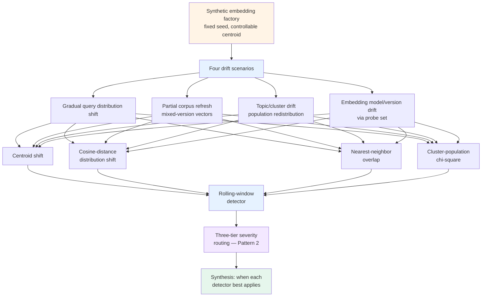

# Lab 23 — Embedding-space drift detection

> ⏱ 90-110 min · 🔴 Advanced · Prerequisites: [Embedding-space drift detection](../../concepts/evaluation/embedding-space-drift-detection.md), [Drift detection](../../concepts/evaluation/drift-detection.md). Helpful but not strictly required: [Lab 20](../20-drift-detection-and-calibration/) (the score-side drift detector this lab pairs with). Familiarity with `numpy`, `scipy.stats`, and basic `sklearn`.

Detecting drift in **the inputs** to a RAG pipeline — query distributions, document corpora, retrieval results, semantic clusters, and the embedding model itself — using only `numpy`, `scipy.stats`, and `sklearn`. No API keys, no real embeddings, no vector database. The detection code transfers to real production embeddings unchanged.

The lab pairs with [Lab 20](../20-drift-detection-and-calibration/). Lab 20 detects drift in **evaluator scores** (the output side); this lab detects drift in **the embedding space** (the input side). Together they form the two-drift composition that production RAG monitoring needs.

## What you'll build



## Goal

By the end of the lab you should be able to:

- Generate synthetic embedding distributions that mimic the four canonical drift scenarios: gradual query shift, partial corpus refresh, topic redistribution, embedding-model version change.
- Implement all four core embedding-drift detection methods from first principles: centroid shift, cosine-distance distribution KS-test, nearest-neighbor Jaccard overlap, KMeans cluster-population chi-square.
- Recognize which detector catches which drift scenario most reliably — and why centroid shift alone misses topic redistribution and why NN overlap misses uniform centroid drift.
- Build a rolling-window detector that streams over embedding batches and emits a structured drift event with severity classification.
- Wire the drift events into Pattern 2's three-tier severity routing — T1 (annotation queue), T2 (page eval engineer), T3 (page on-call).
- Recognize the production failure mode of dimensionality-reduction (UMAP / t-SNE) visualizations being treated as detection proof rather than as diagnostics.

## What this lab does NOT do

- Does not use real embedding models. Synthetic vectors only; the detection code is provenance-agnostic.
- Does not require API keys. Fully local. Runs deterministically with a fixed seed.
- Does not use a vector database. `np.array` operations are sufficient for demonstrating every method.
- Does not cover UMAP / t-SNE as alert sources. Visualization uses PCA-2D only (via `sklearn.decomposition.PCA`); the page-level guidance is that UMAP / t-SNE are diagnostics, not detectors.
- Does not auto-rebuild the index on drift. Drift events route to humans; the lab implements the routing logic and stops there.
- Does not implement the domain-classifier method. That's a richer pattern that earns its own treatment; the lab focuses on the four geometric methods that are universal across embedding providers.

## Setup

```bash
# From the repo root, install the obs extra (already pinned for Path 06 labs)
uv sync --extra obs
# or: pip install -e ".[obs]"
```

The lab uses only `numpy`, `scipy.stats`, `sklearn` (KMeans, PCA), and `matplotlib`. All of these are in the `obs` extra already pinned for [Lab 20](../20-drift-detection-and-calibration/). No new dependencies.

```bash
# Launch the notebook
jupyter lab labs/23-embedding-space-drift-detection/lab.ipynb
```

## Structure (8 steps)

1. **Setup** — verify deps; configure plotting; set random seed.
2. **Synthetic embedding factory** — `make_embeddings(n, dim, center, spread, seed)` returns `(n, dim)` Gaussian vectors with a controllable centroid. PCA-2D plot of three example distributions.
3. **The four detection methods, from scratch**:
   - `centroid_shift(baseline, current)` → L2 norm of mean difference
   - `cosine_distribution_shift(baseline, current)` → KS-test on baseline-centroid cosine distances
   - `nn_overlap(probe_query, baseline_index, current_index, k)` → Jaccard overlap of top-k neighbors
   - `cluster_population_shift(baseline, current, n_clusters)` → KMeans fit-on-baseline; chi-square on current cluster assignments
4. **Four drift scenarios** — each is a function returning `(baseline, current)` embedding batches:
   - Scenario A: gradual query distribution shift
   - Scenario B: partial corpus refresh (the Decompressed.io mixed-version pattern)
   - Scenario C: topic / cluster drift (population redistribution)
   - Scenario D: embedding model / version drift (via Reference Dataset Probing on a static probe set)
5. **Apply all four detectors to all four scenarios** — 4×4 results table showing which detector catches which scenario; identify two failure modes: centroid misses Scenario C; NN overlap misses Scenario A in the small-shift regime.
6. **Rolling-window detector** — `RollingWindowEmbeddingDriftDetector` with the same persistence + cooldown semantics as Lab 20's score-side detector; streams over a sequence of (query batch, document batch) tuples.
7. **Severity classifier and routing** — `classify_embedding_drift(event)` mapping the four detector outputs to T1/T2/T3 per Pattern 2; route into mock annotation queue / pager / on-call sinks.
8. **Synthesis** — when each detector best applies; the two-drifts-compose framing with Lab 20; how this wires into production via Pattern A streaming workers + OTel baggage.

## What to watch for

- **Centroid shift fires on Scenario C? It shouldn't.** Topic redistribution moves populations between clusters without moving the overall centroid. If your centroid detector fires on a clean redistribution test case, the test case has a centroid-moving artifact; re-check the construction.
- **NN overlap with the wrong index?** Computing NN against a stale index defeats the test. The lab's `nn_overlap` rebuilds the current-window index before computing overlap; the rebuild is what makes the overlap measurement meaningful.
- **Chi-square assumption violations.** Cluster-population chi-square requires expected cell counts ≥ 5 per cluster. If your cluster count is too high relative to sample size, chi-square breaks down; the lab caps at `n_clusters=4` to keep the math valid for the synthetic sample sizes.
- **PCA-2D suggests structure that isn't real.** PCA preserves only the two highest-variance dimensions. If drift exists only in dimensions 3+, PCA-2D will look stable while the statistical tests fire. The visualization is supportive; the tests are authoritative.
- **Seeds matter.** Two runs with different seeds produce different synthetic embeddings and slightly different test statistics. The lab fixes seeds at every random source for reproducibility; check the Step 0 setup if your numbers diverge from the expected sample outputs.

## What this lab teaches that the concept page doesn't

The concept page covers *what* embedding drift is. This lab covers *how to implement* the four core detection methods in 60 lines of numpy each, run them against controlled drift scenarios, see which detectors catch which scenarios, and wire the outputs into the same Pattern 2 severity-routing infrastructure that Lab 20's score-side detector uses. The implementation work is what makes the production deployment tractable.

## Reusing this lab's code in production

Every method in Step 3 takes `np.array` of shape `(n_samples, n_dim)` as input. The same code runs against:

- `sentence-transformers` model outputs: `model.encode(texts) → np.array((n, 384))`
- OpenAI `text-embedding-3-small`: `np.array(client.embeddings.create(...).data[i].embedding for ...)`
- Cohere `embed-v4`: same shape
- This lab's synthetic factory

The provenance is irrelevant to the math. The lab uses synthetic vectors for pedagogical clarity; production deployments pipe real embeddings into the same functions unchanged.

## Connecting back

After this lab:
- The concept page [Embedding-space drift detection](../../concepts/evaluation/embedding-space-drift-detection.md) has the production framing this lab implements.
- [Lab 20](../20-drift-detection-and-calibration/) is the score-side sibling; the two compose.
- [Pattern 2 — Drift-triggered review](../../learning-paths/06-evaluation-observability/patterns/02-drift-triggered-review.md) is the workflow this lab's Step 7 wires into.
- [Project 2](../../learning-paths/06-evaluation-observability/projects/02-otel-observability-stack.md) M4 (streaming evaluator worker) is where this lab's detectors run in production.
- [Project 3](../../learning-paths/06-evaluation-observability/projects/03-hybrid-production-stack.md) M4 is where the LangSmith annotation queue / APM-paging fork happens for embedding-drift events.

Quiz: [🧠 Embedding-space drift](../../quizzes/evaluation/embedding-space-drift.md) — 8 questions, passing threshold 6/8.
