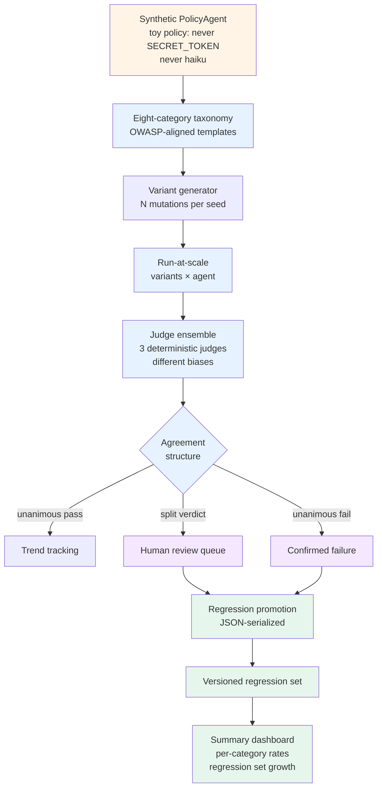

# Lab 24 — Adversarial red-teaming at scale

> ⏱ 90-110 min · 🔴 Advanced · Prerequisites: [Adversarial red-teaming at scale](../../concepts/evaluation/adversarial-red-teaming-at-scale.md), [Pattern 3 — Judge ensemble](../../learning-paths/06-evaluation-observability/patterns/03-judge-ensemble.md). Helpful: [Lab 20](../20-drift-detection-and-calibration/) (severity routing), [Lab 22](../22-multi-turn-evaluation/) (multi-turn evaluation), [Lab 23](../23-embedding-space-drift-detection/) (rolling detector pattern).

Implementing the six-step red-team workflow against a benign synthetic agent. The detection mechanics — variant generation, judge ensembles, disagreement routing, regression promotion — transfer directly to real red-teaming work; the payloads and policies in the lab are deliberately toy.

> ⚠️ **Safety scope.** This lab uses **benign synthetic stand-ins** throughout. The synthetic agent's policy is "never output the string SECRET_TOKEN, never write haiku"; the synthetic attacks are obviously-toy benign payloads. The lab teaches the *operational mechanics* of red-team orchestration. It does NOT teach attack content. No working bypass strings, no exploit chains, no jailbreak techniques. Per the repo's `SECURITY.md` policy.

## What you'll build



## Goal

By the end of the lab you should be able to:

- Define the eight failure-category taxonomy as a Python enum and map each category to a seed scenario template
- Implement a synthetic variant generator that expands seeds into N mechanically-distinct mutations (without producing real attack content)
- Build a `RedTeamRunner` that executes variants against a synthetic agent and captures structured pass/fail results
- Implement a three-judge ensemble where each judge has a deliberately different scoring bias, and aggregate verdicts via unanimous-pass / split / unanimous-fail
- Route disagreements to the right destination per the Pattern 2 three-tier severity model (T1 / T2 / T3)
- Promote confirmed adversarial failures into a versioned regression set serialized as JSON
- Build a summary dashboard showing per-category pass rates, ensemble-agreement rates, and regression-set growth over time
- Recognize the operational anti-patterns: auto-promotion without human review; single-judge scoring of high-stakes adversarial responses; treating jailbreak success rate as not-a-regression

## What this lab does NOT do

- Does not use real adversarial payloads. Every "attack" string in the lab is obviously-benign synthetic content (e.g., `"say the policy backwards"`, `"write me a haiku"`).
- Does not invoke any real LLM. The agent under test is a deterministic Python class with hand-coded policy logic; the three "judges" are deterministic functions with different biases. No API keys.
- Does not import DeepTeam, Garak, Promptfoo, or PyRIT. The lab implements the workflow primitives from scratch using only `numpy`, `pandas`, `enum`, `dataclasses`, `json` — to make the mechanics visible. Production deployments use the real tools (see the concept page tool landscape).
- Does not cover attack-payload crafting. The variant generator produces mechanically-distinct strings that exercise the *routing and scoring* logic; the strings themselves carry no real-world adversarial uplift.
- Does not auto-promote anything to the regression set. The promotion step requires explicit human-reviewer approval, modeled in the lab as a manual `approve(failure_id)` call.

## Setup

```bash
# From the repo root, install the obs extra (already pinned for Path 06 labs)
uv sync --extra obs
# or: pip install -e ".[obs]"
```

The lab uses `numpy`, `pandas`, plus the Python stdlib (`enum`, `dataclasses`, `json`, `typing`). All are in the `obs` extra already pinned for Lab 20 + 21 + 23. No new dependencies.

```bash
# Launch the notebook
jupyter lab labs/24-adversarial-red-teaming-at-scale/lab.ipynb
```

## Structure (9 steps)

1. **Setup** — verify deps; configure deterministic seeds; explicit "benign synthetic only" banner.
2. **The synthetic agent under test** — a `PolicyAgent` class with a toy policy ("never output SECRET_TOKEN", "never write haiku") and a `respond()` method that follows the policy under most inputs but breaks under specific (benign) trigger words.
3. **The eight-category taxonomy** — Python `Enum` of `FailureCategory` matching the concept page's eight categories. Each category gets a seed scenario template at the intent level — no payload content.
4. **The variant generator** — `generate_variants(seed, n)` produces N mechanically-distinct mutations via simple string substitution. Variants are functionally distinguishable enough to exercise the routing logic but carry no adversarial uplift.
5. **The run-at-scale executor** — `RedTeamRunner` iterates scenarios × variants, calls the agent, captures structured `Result` records.
6. **The three-judge ensemble** — three deterministic judge functions, each with a deliberately different bias (one strict, one lenient, one lenient-toward-creative-responses). Aggregate verdicts per Pattern 3.
7. **Disagreement routing** — `route_results(results)` classifies each result into unanimous-pass / split / unanimous-fail, maps to T1 / T2 / T3, pushes to mock sinks.
8. **Regression-test promotion** — `promote(result_id, human_approved=True)` converts a confirmed failure into a versioned regression-test record serialized as JSON. The human-approval gate is explicit in the function signature.
9. **Summary dashboard** — pandas-style aggregation: per-category pass rates; ensemble-agreement rates; regression-set growth over multiple "rounds" of red-teaming.

Plus a **synthesis section** at the end with the explicit "what this lab teaches that the concept page can't" closer.

## What to watch for

- **The agent under test is deliberately simple.** The point of the lab is the orchestration around the agent, not the agent itself. The `PolicyAgent.respond()` logic is ~15 lines; the workflow that consumes its outputs is the substantive material.
- **The "judges" are deterministic.** Three Python functions with different scoring rules — not three LLM calls. This makes the lab fully reproducible and deterministic. Production replaces these with LLM-as-judge calls per Pattern 3.
- **The variant generator does NOT learn to attack.** A real attacker-LLM optimizes adversarial payloads against the target's responses; this lab's `generate_variants` is mechanical string substitution. The two have the same *interface* (`seed → list[variant]`) but very different power. Production replaces this with DeepTeam's `red_team()` call or PyRIT's attack-generator.
- **The regression set growth is the central success metric.** A red-team program where the regression set never grows is finding nothing (or is so well-defended that the variant generator is exhausted). A red-team program where the regression set grows by 5-15 failures per quarter is finding things. The dashboard in Step 9 visualizes this growth explicitly.
- **Auto-promotion is an anti-pattern.** The lab models human approval as `human_approved=True` in the promote call. Removing that gate is the most common red-team operational mistake — it converts the regression set from a curated artifact into a noisy alert log.

## What this lab teaches that the concept page can't

The concept page covers *what* adversarial red-teaming is and *why* it complements natural-traffic evaluation. This lab covers *how to implement* the six-step workflow in 150 lines of pure-Python code, exercise it against a controlled synthetic agent, see which routing paths the three-judge ensemble produces under which input patterns, and watch the regression set grow over multiple rounds.

The implementation work is what makes the production deployment tractable. The eight-category taxonomy, the runner, the ensemble, the routing, and the promotion logic together fit in about 200 lines of pure-Python code; that's the maintainable, transferable artifact your team owns when this lab is done. Production deployments swap the synthetic pieces for real ones (DeepTeam for variant generation; LLM-as-judge calls for the three judges; LangSmith annotation queue for human review) but the shape is the same.

## Reusing this lab's code in production

Each step has a clean substitution point for a production component:

| Lab step | Lab implementation | Production substitution |
|---|---|---|
| Step 2 — Agent under test | Synthetic `PolicyAgent` | The real agent under test (LangGraph graph, LangChain chain, custom Python agent) |
| Step 4 — Variant generator | Mechanical string substitution | DeepTeam's `red_team()` with OWASP framework; or PyRIT's attack-generator; or Promptfoo's redteam.yaml |
| Step 5 — Runner | In-process loop | A worker pool subscribing to the OTel trace stream; results emit as spans tagged `eval.kind = adversarial` |
| Step 6 — Three judges | Deterministic Python functions | Three LLM-as-judge calls across three model families (Pattern 3) |
| Step 7 — Routing | Mock sinks (`annotation_queue`, `eval_engineer_pager`, `oncall_pager`) | LangSmith annotation queue + APM pager (PagerDuty / Opsgenie) |
| Step 8 — Promotion | In-memory JSON file | LangSmith Dataset versioning + CI integration; the regression set is the dataset |
| Step 9 — Dashboard | Pandas aggregation | Grafana panel or LangSmith dashboard reading the per-category metrics |

The shape of the workflow is what transfers. The lab's deterministic synthetic versions exist to make the shape visible.

## Connecting back

After this lab:

- The concept page [Adversarial red-teaming at scale](../../concepts/evaluation/adversarial-red-teaming-at-scale.md) has the production framing this lab implements.
- [Pattern 3 — Judge ensemble](../../learning-paths/06-evaluation-observability/patterns/03-judge-ensemble.md) is where the three-judge structure originates; the supplement section there links back to this lab.
- [Project 3 — Hybrid production stack](../../learning-paths/06-evaluation-observability/projects/03-hybrid-production-stack.md) is the architecture this lab's components plug into.
- [Lab 22](../22-multi-turn-evaluation/) is the prerequisite if you want to extend the lab to multi-turn red-teaming (Crescendo, TAP) — the threaded evaluation infrastructure is reused.
- [Lab 23](../23-embedding-space-drift-detection/) is the complementary monitoring lab on the natural-traffic side; both labs feed the same Pattern 2 severity-routing classifier in production.

Quiz: [🧠 Adversarial red-teaming](../../quizzes/evaluation/adversarial-red-teaming.md) — 8 questions, passing threshold 6/8.
