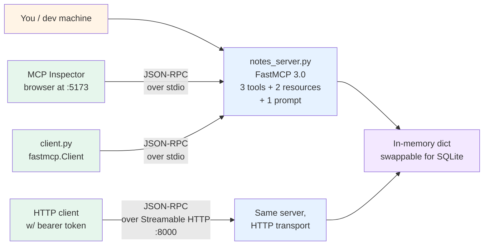

# Lab 25 — MCP server from scratch

> ⏱ 90-110 min · 🟡 Intermediate · Prerequisites: [MCP foundations](../../concepts/tools/mcp-foundations.md), [Building an MCP server](../../concepts/tools/building-an-mcp-server.md). Helpful: [Lab 02 (tool design and selection)](../02-tool-design-and-selection/) — tool semantics carry over from single-agent design.

Build a working MCP server end-to-end. By the end of the lab you'll have a notes server that exposes three tools, two resources, and one prompt template; you'll test it with the MCP Inspector and a Python client; you'll debug a deliberately-broken tool to learn the schema-inference failure modes; and you'll deploy it over Streamable HTTP with token-based auth.

This is the first MCP lab in the repo. Future labs in [Path 04](../../learning-paths/04-tool-protocols-mcp-a2a/) build the MCP *client* side (Module 3), cover MCP security threat models (Module 4), and add A2A (Modules 5-7).

## What you'll build



The server exposes:
- **Three tools** — `create_note` (write), `get_note` (read), `list_notes` (list). The minimum useful CRUD surface; `delete_note` and `update_note` are stretch.
- **Two resources** — `notes://all` (concatenated dump) and `notes://{title}` (templated single-note URI). Demonstrates both static and parameterized resources.
- **One prompt template** — `summarize_note(title)` — the parametric prompt the user surfaces as a slash command.

You'll exercise each capability through three channels: the MCP Inspector (visual), the Python client (`fastmcp.Client`), and a Streamable HTTP HTTP request (manual). The triple coverage is what locks in the protocol mental model.

## Lab structure — 9 steps

| Step | Topic | Time |
|---|---|---|
| 0 | Environment setup + `fastmcp` install verification | 5 min |
| 1 | Build the three tools (`@mcp.tool()` decorators, type hints, docstrings) | 15 min |
| 2 | Add the two resources (static + URI-templated) | 10 min |
| 3 | Add the prompt template | 5 min |
| 4 | Test with the MCP Inspector — list capabilities, exercise each, read the JSON-RPC log | 15 min |
| 5 | Test with the Python client (`fastmcp.Client`) — programmatic invocation | 10 min |
| 6 | Deliberately-broken tool walkthrough — four schema-inference failure modes with concrete fixes | 15 min |
| 7 | Streamable HTTP deployment — switch transport, add a token-based auth provider | 10 min |
| 8 | Stretch: persistent storage with SQLite; `delete_note` and `update_note`; rate-limit decorator | 10 min |

Each step is a notebook cell or two; the notebook is the canonical artifact. You can run the steps independently if you only need to verify a specific concept.

## What you'll watch for (the failure modes)

Five things the lab makes you observe directly, not just read about:

1. **Vague tool descriptions get picked wrong by the LLM.** Step 6 includes a tool with the docstring `"creates"`. When a real LLM has to choose between `create_note("creates")` and `update_note("updates an existing note by title")`, it picks `create_note` even when the user clearly wants to update. The lab swaps in a one-line good description and demonstrates the LLM picking correctly.
2. **Schema inference silently picks the wrong type.** Step 6 has a tool declaring `count: int` but receiving a string from a buggy client. FastMCP rejects with a clear JSON-RPC error — but if the type were `Any` or omitted, the tool would run with bad input. The lab shows both cases.
3. **Resources and tools get confused.** Step 6 has a `get_note` tool *and* a `notes://{title}` resource that do nearly the same thing. The lab makes you reason through when each is right; the canonical rule is *who decides to fetch* — the LLM (tool) or the host (resource).
4. **Streamable HTTP without auth is a network-exposed dict.** Step 7 starts with the server running on `0.0.0.0:8000` with no auth, hits it from a second terminal, and shows the entire notes corpus is readable by anyone on the network. Then adds the token-based auth provider; the same request now returns 401.
5. **Stateful connections don't survive server restarts.** A side observation in Step 4: the MCP Inspector loses its session if you restart the server; you have to reconnect. The lab uses this to ground the conversation about session IDs and why production deployments need session restoration logic — a topic Module 4 (future) covers.

## Repo connections

This lab plugs into the rest of the curriculum at four points:

- **[Path 04 Module 1](../../concepts/tools/mcp-foundations.md) + [Module 2](../../concepts/tools/building-an-mcp-server.md)** — the concept pages this lab operationalizes
- **[Lab 02 (tool design and selection)](../02-tool-design-and-selection/)** — tool semantics from single-agent design carry over directly. A poorly-named MCP tool fails the same way a poorly-named in-process tool fails — the protocol changes the *boundary*, not the *contract*.
- **[Path 03 Pattern 5 — Retry policies](../../learning-paths/03-multi-agent-systems/patterns/05-retry-policies.md)** — Step 6's mutation-without-idempotency-key discussion previews the production retry behavior MCP servers need
- **[Top-level `patterns/README.md`](../../patterns/)** — Pattern 11 (MCP integration) is the architecture-level view; this lab is the implementation-level companion

## Anti-scope — what this lab does NOT teach

- **A2A**. Module 5 territory; future lab.
- **MCP security threat model.** Module 4 territory. Step 6 demonstrates the *schema-mismatch* failure modes; it does not cover the arxiv:2601.10955 resource-amplification attack, which needs its own focused treatment in Module 4.
- **Production OAuth flow tuning.** Step 7 uses a simple token-based auth provider. Full OAuth 2.1 with refresh tokens, PKCE, and identity-provider integration is a Path 07 topic.
- **MCP client side beyond `fastmcp.Client`.** Module 3 (future) covers consuming external servers — server discovery, capability negotiation, error handling across the boundary, MCP Server Cards.
- **Frontend integration in Claude Desktop / Cursor.** Mentioned in the concept pages; the lab focuses on server development. Connecting your server to Claude Desktop is a 3-line config addition documented in the [MCP Python SDK README](https://github.com/modelcontextprotocol/python-sdk).
- **Performance benchmarking.** This is a 90-line server; benchmarking it would measure the asyncio overhead, not real production characteristics.

## What you'll have at the end

A working `notes_server.py` (~80 lines including docstrings) you can connect to Claude Desktop or any MCP-compatible host. A `client.py` (~30 lines) showing the programmatic invocation pattern. A documented understanding of the four schema-inference failure modes and how to spot them in production. A baseline Streamable HTTP deployment with auth — the production-default transport, not the development stdio.

These artifacts are the substrate for the rest of Path 04. Module 3 will reuse this server as a client target; Module 4 will use it as the attack surface for the security walkthrough; Module 7 will compose it with an A2A endpoint.

## How to run the lab

```bash
# Activate the project venv
source .venv/bin/activate

# Verify FastMCP is installed (it's in pyproject.toml as `fastmcp>=0.4`)
python -c "import fastmcp; print(fastmcp.__version__)"

# Open the notebook
jupyter lab lab.ipynb
```

The notebook runs cell-by-cell; some cells spawn subprocesses (`mcp dev inspector server.py`) that you'll need to terminate before moving on. Each subprocess-spawning cell has explicit cleanup notes.

If you get stuck, the `solution/` directory has a reference implementation of every step. Use it after attempting yourself — looking at the solution before trying defeats the point of the lab.

## References

- [MCP foundations](../../concepts/tools/mcp-foundations.md) and [Building an MCP server](../../concepts/tools/building-an-mcp-server.md) — the two concept pages this lab implements
- [FastMCP at gofastmcp.com](https://gofastmcp.com/getting-started/welcome) — official framework documentation
- [MCP Inspector](https://github.com/modelcontextprotocol/inspector) — the canonical dev tool used in Step 4
- Kevin Tan, *[How to Build an MCP Server in Python with FastMCP 3.0](https://blog.jztan.com/how-to-build-an-mcp-server-in-python-step-by-step/)* — the under-100-lines reference build this lab extends
- [The official MCP Python SDK](https://github.com/modelcontextprotocol/python-sdk) — what FastMCP wraps; useful for understanding the raw-SDK alternative
