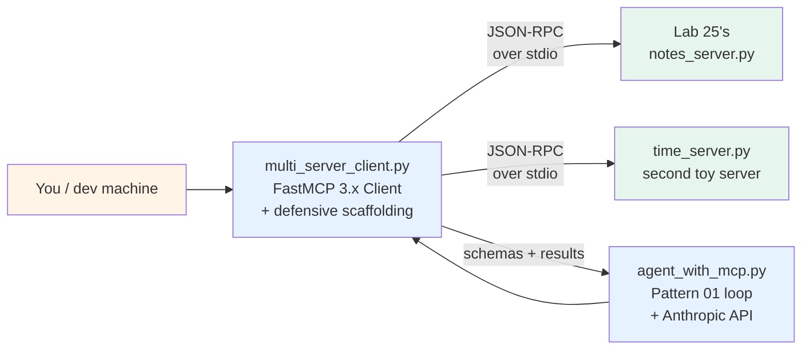

# Lab 26 — MCP client from scratch

> ⏱ 90-110 min · 🟡 Intermediate · Prerequisites: [Building an MCP client](../../concepts/tools/building-an-mcp-client.md), [Lab 25 — MCP server from scratch](../25-mcp-server-from-scratch/). Helpful: [Lab 02 (tool design and selection)](../02-tool-design-and-selection/), [Pattern 01 — Single-agent tool use](../../patterns/01-single-agent-tool-use.md).

Build a Python MCP client end-to-end. By the end of the lab you'll have a working client that connects to Lab 25's notes server, exercises all three primitives programmatically, adds a second server for multi-server orchestration, and implements the five production defenses (timeout, retry, circuit-breaker, schema-drift detection, response-size limits). You'll also wire it into a Pattern 01 agent loop with a real LLM call.

This is the implementation-level companion to [Module 3 (Building an MCP client)](../../concepts/tools/building-an-mcp-client.md). Lab 25 built the server; Lab 26 consumes it.

## What you'll build



The lab walks through three layers:

1. **Single-server client** — connect to Lab 25's notes server, list capabilities, call tools, read templated resources. The minimum-viable client.
2. **Multi-server client** — add a second small server (a `time_server` you'll write); implement collision-free tool routing via server-name prefixes; aggregate schemas across servers.
3. **Defensive client** — add the five production defenses (timeout, schema-drift detection, circuit-breaker, retry-on-auth-error, response-size limits).
4. **Agent integration** — drop the client into a Pattern 01 agent loop with a real Anthropic API call; observe the LLM picking among multi-server tools.

## Lab structure — 9 steps

| Step | Topic | Time |
|---|---|---|
| 0 | Environment setup; verify FastMCP 3.x + the Anthropic SDK | 5 min |
| 1 | Write a minimal client; connect to Lab 25's server; exercise all three primitives | 15 min |
| 2 | Write a second toy server (`time_server.py`) — adds 2 tools for demoing multi-server orchestration | 10 min |
| 3 | Build `MultiServerMcpClient` with collision-free routing; aggregate tools across both servers | 15 min |
| 4 | Add the five production defenses (timeout, schema-cache TTL, circuit-breaker, retry-on-auth-error, response-size limit) | 20 min |
| 5 | Schema-translation layer — MCP `Tool` → Anthropic `tools` format | 5 min |
| 6 | Wire the client into a Pattern 01 agent loop with real LLM calls | 15 min |
| 7 | Token-bloat measurement — count tool-schema tokens; observe the cost of multi-server scope | 10 min |
| 8 | Stretch: add a circuit-breaker integration test; add per-tool latency tracking; explore FastMCP 3.1 code mode | 10 min |

## What you'll watch for (the failure modes)

Five things the lab makes you observe directly:

1. **Tool name collisions across servers** — Step 3 deliberately gives both servers a tool named `get_status`. Without prefixing, the LLM picks unpredictably. With server-name prefixes (`notes__get_status` vs `time__get_status`), routing becomes deterministic and the LLM picks the right one.

2. **Per-tool timeouts catch hung tools** — Step 4 has a `slow_tool` that sleeps for 30s. Without a timeout, the agent loop blocks forever. With the 10s timeout, the tool call returns `{"status": "error", "error": "tool_timeout"}` and the agent loop continues with that signal.

3. **Schema drift breaks cached schemas** — Step 4's schema-cache TTL test mutates the server's tool surface mid-session; the client's stale cache produces a mismatch error; the cache refresh resolves it. This is the failure mode that causes the most production debugging time.

4. **Circuit-breaker prevents cascade** — Step 4 makes the time server return 500 errors 5 times in a row; the circuit-breaker opens; subsequent calls return `server_unavailable` immediately instead of waiting for the timeout. The agent loop continues with the remaining (working) server.

5. **Token bloat scales with server count** — Step 7 measures tool-schema token cost: 1 server with 3 tools ≈ 350 tokens; 5 servers with 10 tools each ≈ 6,000+ tokens per request. The measurement makes concrete why FastMCP 3.1's code mode exists.

## Repo connections

- **[Path 04 Module 3](../../concepts/tools/building-an-mcp-client.md)** — the concept page this lab operationalizes
- **[Lab 25 — MCP server from scratch](../25-mcp-server-from-scratch/)** — the server this lab's client connects to. Lab 26 reuses Lab 25's `notes_server.py` directly.
- **[Pattern 01 — Single-agent tool use](../../patterns/01-single-agent-tool-use.md)** — the agent loop pattern Step 6 integrates the client into
- **[Pattern 11 — MCP integration](../../patterns/11-mcp-integration.md)** — the architecture-level view this lab implements
- **[`concepts/tools/tool-selection.md`](../../concepts/tools/tool-selection.md)** — the multi-server tool-budget concerns Step 7 measures

## Anti-scope — what this lab does NOT teach

- **MCP server authoring beyond a tiny time-server**. That's Lab 25's territory. The 30-line `time_server.py` Step 2 writes exists only to give Lab 26 a second server to demo multi-server orchestration.
- **OAuth 2.1 client flows**. Production MCP clients connecting to public Streamable HTTP servers need OAuth refresh-token handling; this lab uses static bearer tokens loaded from environment variables. Full OAuth is Path 07 territory.
- **MCP Registry integration**. Module 3's concept page covers Registry / Server Cards architecture; the lab uses hardcoded local paths. Registry integration is future-batch work tracked for Module 4+.
- **Production observability**. FastMCP 3.x ships OpenTelemetry integration; wiring spans for tool calls is Path 06 territory (which already has the OTel GenAI conventions page).
- **A2A**. Pattern 12 / Modules 5-7 territory; different protocol.
- **MCP security threat model**. Module 4 will cover arxiv:2601.10955 resource-amplification and adversarial tool descriptions. This lab assumes trusted servers — the threat model is the focus of the next module.

## What you'll have at the end

A `multi_server_client.py` (~150 lines) implementing the defensive client. A `time_server.py` (~30 lines) as the second server. An `agent_with_mcp.py` (~100 lines) showing the full agent-loop integration with a real Anthropic API call. A documented measurement of per-tool token cost. Working understanding of the five production failure modes and how to defend against each.

These artifacts are the substrate for the rest of Path 04's MCP work. Module 4 will use this client as the *attacker target* in the security walkthrough; Modules 5-7 (A2A) will treat MCP and A2A as composable rather than separate.

## How to run the lab

```bash
# Activate the project venv
source .venv/bin/activate

# Verify FastMCP 3.x is installed
python -c "import fastmcp; print(fastmcp.__version__)"

# Set the Anthropic API key for Step 6 (the LLM-integration step)
export ANTHROPIC_API_KEY=sk-ant-...

# Open the notebook
jupyter lab lab.ipynb
```

The notebook runs cell-by-cell. Steps 2-5 generate scratch files (`notes_server.py` is copied in from Lab 25; `time_server.py` is created fresh; `multi_server_client.py` is built up incrementally). Step 6 makes one real API call to Anthropic; if you don't have an API key, the cell explicitly skips with a clear message and the rest of the notebook works without it.

## References

- [Building an MCP client](../../concepts/tools/building-an-mcp-client.md) — the concept page
- [FastMCP at gofastmcp.com](https://gofastmcp.com/getting-started/welcome) — official documentation
- [KDnuggets (February 2026) FastMCP guide](https://www.kdnuggets.com/fastmcp-the-pythonic-way-to-build-mcp-servers-and-clients) — client error-handling patterns
- [WorkOS (March 2026) MCP overview](https://workos.com/blog/everything-your-team-needs-to-know-about-mcp-in-2026) — Server Cards roadmap, code mode discussion
- [Apigene (April 2026) FastMCP 3.0](https://apigene.ai/blog/fastmcp) — code mode token-cost measurements (15K → 2-3K)
