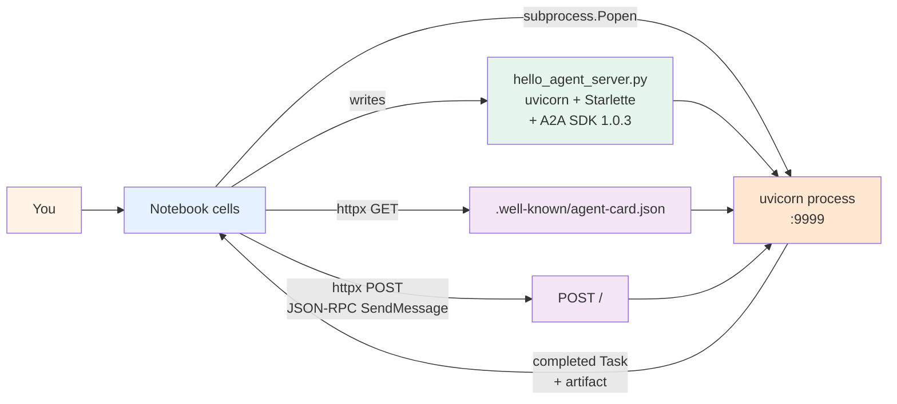

# Lab 28 — A2A endpoint from scratch

> ⏱ 90-110 min · 🟡 Intermediate · Prerequisites: [A2A foundations](../../concepts/tools/a2a-foundations.md), [Lab 25 — MCP server from scratch](../25-mcp-server-from-scratch/) (for the "build the server side" pattern). Helpful: [Pattern 12 — A2A federation](../../patterns/12-a2a-federation.md) for the architectural framing.

Build a working A2A endpoint with the official Python SDK (`a2a-sdk` 1.0.3). Serve its Agent Card at `/.well-known/agent-card.json`. Handle a real JSON-RPC `SendMessage` request. Observe the full Task lifecycle (`submitted` → `working` → `completed`) end-to-end with an actual HTTP roundtrip — not a mock, not a simulation.

This lab makes the abstractions from Module 5 concrete: you'll see the protobuf-based protocol types in action, watch the route factory wire Starlette routes, observe how `TaskUpdater` translates lifecycle calls into JSON-RPC events the client sees, and verify the protocol version negotiation. By the end you'll have a `hello-agent.py` server you can run + a `client.py` that probes it via Agent Card discovery and full message roundtrip.

## What you'll build



The notebook drives a subprocess running uvicorn (not an in-Jupyter event-loop server — that's fragile). Each test cell sends a real HTTP request to the subprocess and parses the protobuf-shaped JSON response. After the verification cells, the subprocess gets terminated cleanly.

After running the lab you'll have:

- A working `hello_agent_server.py` (~60 lines) implementing the full A2A v1.0 protocol with the official SDK
- A `client.py` probing the agent via `httpx` — Agent Card discovery + JSON-RPC `SendMessage`
- Direct observation of the Task lifecycle (`submitted` → `working` → `completed`) in the server's response
- Practical familiarity with the SDK 1.0.3 protobuf types — the field naming conventions (`snake_case` on the wire, `message_id`/`task_id`/`context_id`), the enum naming (`ROLE_USER`, `TASK_STATE_COMPLETED`), the route factory pattern (`create_agent_card_routes` + `create_jsonrpc_routes`)
- Understanding of the v0.3 → v1.0 protocol-version negotiation via the `A2A-Version` HTTP header

## Lab structure — 8 steps

| Step | Topic | Time |
|---|---|---|
| 0 | Environment setup; install `a2a-sdk` + `uvicorn`; verify imports | 5 min |
| 1 | Inspect the SDK 1.0.3 surface — protobuf types vs Pydantic; enum values; field names; the v0.3 → v1.0 shift | 10 min |
| 2 | Build the Agent Card — `AgentCard` + `AgentSkill` + `AgentCapabilities` + `AgentInterface` with `protocol_binding="JSONRPC"` | 10 min |
| 3 | Implement the AgentExecutor — subclass `AgentExecutor`, implement `execute()`, use `new_task_from_user_message` + `TaskUpdater` for the lifecycle, `new_text_part` for the artifact | 15 min |
| 4 | Wire the routes — `DefaultRequestHandler` + `create_agent_card_routes` + `create_jsonrpc_routes(rpc_url="/")` mounted on a `Starlette` app | 10 min |
| 5 | Run the server in a subprocess — spawn uvicorn on port 9999; wait for it to start; verify with a health probe | 10 min |
| 6 | Probe the Agent Card — `httpx.get` against `.well-known/agent-card.json`; parse the JSON; inspect the fields | 10 min |
| 7 | Send a real JSON-RPC `SendMessage` — with the `A2A-Version: 1.0` header; observe the protocol version negotiation; parse the returned Task with its complete lifecycle | 15 min |
| 8 | Stretch — observe what happens without the `A2A-Version` header (gets `-32009`); call `GetTask` to retrieve the task by ID; clean shutdown | 10 min |

## What you'll watch for (the lessons)

Six concrete observations the lab forces:

1. **Protobuf types behave differently from Pydantic.** The SDK 1.0.3 uses protobuf-based types (`AgentCard`, `Message`, `Task`). No `model_fields`, no `model_dump`, no `.json()`. Instead: `DESCRIPTOR.fields` for introspection, `MessageToDict`/`ParseDict` for serialization, `HasField(name)` for optional field checks. This is a 2026 architectural shift from pre-1.0 versions and tutorials online may still show the Pydantic patterns.

2. **JSON-RPC method names are gRPC-style PascalCase.** `SendMessage`, `GetTask`, `ListTasks`, `CancelTask` — not `message/send`, `tasks/get`. The v0.3 slash-style names work only via the compat adapter (`enable_v0_3_compat=True`). Step 7 demonstrates the right naming; Step 8 demonstrates what happens with the wrong one.

3. **Protocol version negotiation is header-based.** Send `A2A-Version: 1.0` or get `-32009 VERSION_NOT_SUPPORTED`. The server defaults to expecting v1.0; v0.3 clients work only with explicit compat enabled. Step 8 demonstrates the failure mode.

4. **Tasks must be enqueued before lifecycle updates.** The TaskUpdater publishes `TaskStatusUpdateEvent`, but the server expects to see the initial `Task` object first. Calling `await event_queue.enqueue_event(task)` before `await updater.submit()` is the canonical pattern; getting it wrong yields `-32006 INVALID_AGENT_RESPONSE` ("Agent should enqueue Task before TaskStatusUpdateEvent event"). The lab's Step 3 follows the working pattern.

5. **The route factory replaces `A2AStarletteApplication`.** Pre-1.0 SDK had an `A2AStarletteApplication` wrapper class; SDK 1.0 replaces it with `create_agent_card_routes` + `create_jsonrpc_routes`, which return Starlette `Route` lists you mount yourself. More composable; older docs still reference the deprecated wrapper.

6. **Subprocess is the right shape for running A2A servers from a notebook.** Running uvicorn inside the Jupyter event loop is fragile. `subprocess.Popen` lets the server run in its own process; the notebook drives it via `httpx`; cleanup is a `process.terminate()` away.

## Repo connections

- [Module 5 — A2A foundations](../../concepts/tools/a2a-foundations.md) — the concept page this lab operationalizes
- [Lab 25 — MCP server from scratch](../25-mcp-server-from-scratch/) — the structurally analogous "build the server side" lab; same conceptual lineage one protocol layer up
- [Pattern 12 — A2A federation](../../patterns/12-a2a-federation.md) — the architecture-level pattern this lab implements
- [Pattern 11 — MCP integration](../../patterns/11-mcp-integration.md) — Pattern 12's companion; together they describe the 2026 interoperability stack

## Anti-scope — what this lab does NOT do

- **No LLM integration.** The toy agent echoes the user's text via a Python string concatenation; no Anthropic / OpenAI / Gemini call. The point is the *protocol* surface, not the agent reasoning. The official `examples/langgraph` tutorial in the SDK repo shows the LLM integration if you need it.
- **No Signed Agent Cards.** v1.0 adds cryptographic signatures; the lab's card is unsigned. Signatures are Module 6 territory.
- **No persistent task store.** Uses `InMemoryTaskStore`; tasks vanish on restart. Production needs `DatabaseTaskStore` with PostgreSQL/MySQL/SQLite per [AI Workflow Lab March 2026](https://aiworkflowlab.dev/article/how-to-build-a2a-agents-python-production-guide). Persistence is also Module 6 territory.
- **No streaming.** The agent's `AgentCapabilities` declares `streaming=False`; we use the synchronous `SendMessage`, not `SendStreamingMessage` with SSE. Streaming is Module 6 territory.
- **No push notifications.** No `CreateTaskPushNotificationConfig`; the client polls or waits for the sync response. Module 6.
- **No multi-agent orchestration.** The lab builds *one* A2A endpoint. A2A's payoff scales with the number of remote agents you call; Module 7 covers the orchestrator pattern with `A2ACardResolver` + `ClientFactory`.
- **No OpenTelemetry tracing.** The SDK has built-in OTel support via the `[telemetry]` extra; the lab keeps the dependency surface small.
- **No A2A security beyond the protocol defaults.** No auth schemes wired (the `SecurityRequirement`/`SecurityScheme` types exist in the SDK; the lab declares neither). Production needs OAuth2 / API keys at minimum.

## What you'll have at the end

A `hello_agent_server.py` (~60 lines) — a runnable A2A server. A `client.py` (~50 lines) — a working httpx-based client that probes both the Agent Card and the JSON-RPC endpoint. A full transcript of the Task lifecycle observed end-to-end. A practical sense of where the SDK 1.0.3 docs are still catching up to the actual API.

These artifacts compose with future Modules 6-7's deeper material: Module 6 will replace `InMemoryTaskStore` with `DatabaseTaskStore`, add Signed Agent Cards, wire OAuth2 + OpenTelemetry, and demonstrate streaming. Module 7 will compose multiple A2A endpoints + MCP tools into the canonical hybrid pattern (each agent uses MCP for its tools; agents use A2A to coordinate with each other).

## How to run the lab

```bash
# Activate the project venv
source .venv/bin/activate

# Install the A2A SDK (Python 3.10+)
pip install 'a2a-sdk>=1.0,<2.0' uvicorn httpx

# Verify
python -c "import a2a; from a2a.types import AgentCard; print('a2a-sdk OK')"

# Open the notebook
jupyter lab lab.ipynb
```

The notebook runs cell-by-cell. Step 5 spawns a uvicorn subprocess on port 9999; if that port is in use you'll see a clear error and need to either kill the existing process or change the port in the scratch file. No external API keys required.

## References

- [Module 5 — A2A foundations](../../concepts/tools/a2a-foundations.md) — full source list lives there
- [`a2a-sdk` GitHub](https://github.com/a2aproject/a2a-python) — SDK 1.0.3; v0.3 → v1.0 migration guide
- [A2A Python Quickstart](https://a2a-protocol.org/latest/tutorials/python/1-introduction/) — official tutorial covering Agent Skills, Agent Cards, AgentExecutor, streaming, multi-turn, LLM integration
- [Google Codelabs — Purchasing Concierge](https://codelabs.developers.google.com/intro-a2a-purchasing-concierge) — multi-agent example
