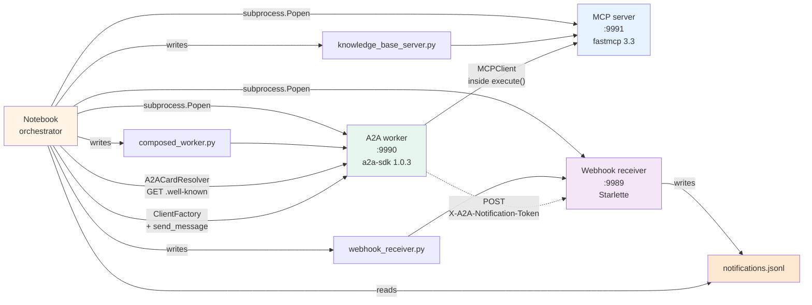

# Lab 30 — MCP + A2A composition

> ⏱ 130-160 min · 🟡 Intermediate · Prerequisites: [Lab 29 — A2A endpoint at production depth](../29-a2a-endpoint-production-depth/) for the SDK 1.0.3 surface; [Lab 25 — MCP server from scratch](../25-mcp-server-from-scratch/) and [Lab 26 — MCP client from scratch](../26-mcp-client-from-scratch/) for the MCP side; [Module 7 — MCP + A2A composition](../../concepts/tools/mcp-a2a-composition.md).

The closer for Path 04. Build the canonical composition pattern end-to-end: a tiny **MCP server** with two tools (knowledge base + summarizer), an **A2A worker** whose `execute()` method opens an `MCPClient` inside the request lifetime (so MCP stays an internal detail), and an **orchestrator** that uses the SDK's `A2ACardResolver` + `ClientFactory` to discover and call the worker. Then layer **push notifications** with atomic registration and a webhook receiver — finally closing the deferral from Module 6.

## What you'll build



Three subprocesses (MCP server, A2A worker, webhook receiver) all driven from a single notebook. The orchestrator is the notebook itself — it discovers the worker via Agent Card, dispatches tasks via `ClientFactory.create(card)` + `client.send_message(...)`, registers push notifications atomically with the message send, and walks away. The webhook receiver captures the worker's completion callbacks to a JSONL file the notebook reads back.

After running the lab you'll have:

- A working `knowledge_base_server.py` (FastMCP 3.3, 2 tools) and a working `composed_worker.py` (~120 lines, A2A SDK 1.0.3, MCP client inside `execute()`)
- A working `webhook_receiver.py` (Starlette, captures push notifications to a JSONL file)
- Hands-on experience with the SDK's `A2ACardResolver` + `ClientFactory` + `ClientConfig` — the high-level client surface that absorbs Lab 28's raw-httpx boilerplate
- Direct demonstration of the atomic push-notification-registration pattern (`SendMessageConfiguration.task_push_notification_config` + `return_immediately=True`) — why the standalone `create_task_push_notification_config()` call races with task completion and why this pattern doesn't
- Practical understanding of the `X-A2A-Notification-Token` HMAC header and idempotency requirements for webhook receivers
- The closure of Path 04 — seven shipped modules; the full MCP + A2A territory walked

## Lab structure — 8 steps

| Step | Topic | Time |
|---|---|---|
| 0 | Environment setup; install `fastmcp>=3.3`, `a2a-sdk>=1.0`, `httpx`, `uvicorn`, `starlette` | 5 min |
| 1 | Author `knowledge_base_server.py` — FastMCP server with two tools (`lookup_customer` returning fake KB records; `summarize_request` for a 1-line summary). HTTP transport on port 9991. | 15 min |
| 2 | Author `composed_worker.py` — A2A worker; `AgentExecutor.execute()` opens `MCPClient("http://127.0.0.1:9991/mcp")` inside the request, calls both MCP tools, packages the combined result as an A2A artifact. ~120 lines total. | 25 min |
| 3 | Author `webhook_receiver.py` — tiny Starlette app on port 9989 with a POST endpoint that captures incoming notifications + headers to `notifications.jsonl`. ~20 lines. | 10 min |
| 4 | Spawn all three subprocesses; health-probe MCP via `fastmcp.Client`, worker via Agent Card, webhook via a direct httpx POST. | 15 min |
| 5 | Orchestrator discovery — use `A2ACardResolver(httpx_client, base_url)` + `get_agent_card()` to fetch the worker card. Verify the card describes the worker's skill but doesn't expose MCP internals (good encapsulation). | 10 min |
| 6 | Orchestrator call — build a `Client` via `ClientFactory(config=ClientConfig(streaming=False)).create(card)`; send a `SendMessageRequest`; iterate the async event stream; observe the MCP-backed result returned as an A2A artifact. The orchestrator never directly speaks MCP. | 15 min |
| 7 | Push notifications — build a `SendMessageConfiguration(task_push_notification_config=..., return_immediately=True)`; send; observe the SUBMITTED task returned immediately; poll the webhook JSONL file; inspect the captured notifications (2-3 per task: artifact + status transitions); verify the `X-A2A-Notification-Token` header carries the shared secret. | 25 min |
| 8 | Clean shutdown; Path 04 closure summary; what's still ahead (OAuth2 cross-org, distributed tracing across the composition, production webhook hardening). | 10 min |

## The lessons the lab forces

Seven concrete observations you'll watch for:

1. **The orchestrator only knows A2A; the worker knows both.** Step 6's output shows the orchestrator dispatching a single A2A call and getting back a result that's clearly MCP-shaped (a JSON dict from the KB lookup + a summary string) — but the orchestrator has no MCP dependency, no MCP URL, no MCP credentials. The composition keeps that asymmetric on purpose.

2. **Atomic push registration via `SendMessageConfiguration` is the right pattern.** Step 7 contrasts the two paths: the SDK ships `client.create_task_push_notification_config()` as a standalone method, but if you call it after `send_message()` returns, the task has already completed and no notification fires. The atomic path (push config inside the SendMessage configuration) doesn't race.

3. **`return_immediately=True` is the half that makes A2A async.** Without it, `SendMessage` waits for the task to finish, which defeats push notifications entirely (you got the result, what's the webhook for?). With it, the SDK returns the SUBMITTED task immediately and continues processing server-side. The webhook fires when the server finishes.

4. **Multiple notifications per task, not one.** The push sender fires on each state transition + artifact publish. For our two-tool worker, expect 2-3 callbacks: one `artifactUpdate` and one or more `statusUpdate` events. Webhook receivers must be idempotent.

5. **`X-A2A-Notification-Token` carries the shared secret.** Step 7 inspects the captured webhook headers and shows the token field. Production receivers MUST validate it; otherwise anyone who knows the webhook URL can POST fake completions. (The lab demonstrates the header is present; building HMAC validation around it is left as an exercise.)

6. **`MCPClient` lifecycle inside `execute()` is per-request.** Step 2's worker opens an `async with MCPClient(...) as mcp` block inside each `execute()` call. That's correct for low-frequency calls; high-frequency workers should hold the MCP client open in the executor's `__init__` and reuse — at the cost of having to handle connection re-establishment on failures.

7. **The Agent Card describes capabilities, not implementation.** Step 5 prints the worker's full Agent Card: the skill name, the description, the tags — none of which mention MCP. That's the contract. The worker is free to swap its internal MCP server for direct database calls tomorrow; the card doesn't change; the orchestrator doesn't notice.

## Repo connections

- [Module 7 — MCP + A2A composition](../../concepts/tools/mcp-a2a-composition.md) — the concept page this lab operationalizes
- [Lab 29 — A2A endpoint at production depth](../29-a2a-endpoint-production-depth/) — the immediate predecessor; this lab uses the same A2A executor pattern with composition added
- [Lab 25 — MCP server from scratch](../25-mcp-server-from-scratch/) — the MCP server pattern Lab 30 builds a minimal version of
- [Lab 26 — MCP client from scratch](../26-mcp-client-from-scratch/) — the MCP client pattern used inside the worker's `execute()`
- [Pattern 11 — MCP integration](../../patterns/11-mcp-integration.md) and [Pattern 12 — A2A federation](../../patterns/12-a2a-federation.md) — architecture-level companions

## Anti-scope — what this lab does NOT do

- **No OAuth2 token flow.** Module 6 covered the security scheme conceptually; integrating with a real auth server is a substantial implementation that needs an auth issuer in the lab environment. Deferred to a future Path 08 (Production Engineering) module.
- **No JWKS-based key distribution.** The signature-verification pattern from Module 6 is straightforward to wire in (see the concept page); the lab omits it to keep the focus on composition itself. Layer it on as homework.
- **No multi-worker orchestration.** A real orchestrator dispatches across several workers. Path 03's plan-and-execute pattern handles intent routing; combining that with A2A delegation is a natural next step but expands the scope past one lab.
- **No distributed tracing across the composition.** OpenTelemetry trace propagation requires manually forwarding `traceparent` headers across the A2A boundary. The SDK doesn't do this automatically yet. Lab 29 demonstrates OTel within one process; cross-process correlation belongs elsewhere.
- **No HMAC validation on the webhook receiver.** The receiver captures the `X-A2A-Notification-Token` header so you can see it's there; building a robust HMAC verifier (with replay protection, key rotation) is documented but not implemented.
- **No real LLM calls.** The worker's logic is deterministic toy code that pattern-matches "C-NNN" in the input. Adding a real LLM call inside `execute()` is straightforward; omitted to keep the lab self-contained without an API key.
- **No `DatabaseTaskStore`.** Lab 29 demonstrated persistence; Lab 30 uses `InMemoryTaskStore` to keep moving parts minimal. Layer persistence on if you want it.

## What you'll have at the end

Three runnable Python files demonstrating the composition pattern (`knowledge_base_server.py`, `composed_worker.py`, `webhook_receiver.py`). A `notifications.jsonl` file showing real webhook callbacks captured from a real cross-agent task. Practical familiarity with `A2ACardResolver`, `ClientFactory`, `ClientConfig`, the atomic push-registration pattern, and the multi-subprocess orchestration that production composed systems use. And — closing the path — a complete tour of all seven Path 04 modules.

## How to run the lab

```bash
# Activate the project venv
source .venv/bin/activate

# Install dependencies (Python 3.10+)
pip install 'a2a-sdk>=1.0,<2.0' 'fastmcp>=3.3' httpx uvicorn starlette

# Verify
python -c "
import a2a, fastmcp, httpx, uvicorn, starlette
print('Lab 30 deps OK')
"

# Open the notebook
jupyter lab lab.ipynb
```

The notebook runs cell-by-cell. Step 4 spawns three uvicorn subprocesses on ports 9989, 9990, 9991; if any of those ports are in use you'll see a clear error and need to either kill the existing processes or change the ports in the scratch files. No external API keys, no LLM calls, no running infrastructure required beyond the local Python environment.

## References

- [Module 7 — MCP + A2A composition](../../concepts/tools/mcp-a2a-composition.md) — full source list
- [`a2a-sdk` GitHub](https://github.com/a2aproject/a2a-python) — SDK 1.0.3 (`A2ACardResolver`, `ClientFactory`, `BasePushNotificationSender`)
- [FastMCP](https://github.com/prefecthq/fastmcp) — MCP framework
- [A2A Protocol official documentation](https://a2a-protocol.org/latest/) — Linux Foundation governed; canonical spec
- [a2a-mcp.org (March 2026)](https://a2a-mcp.org) — the canonical "MCP for tools, A2A for agents" framing
