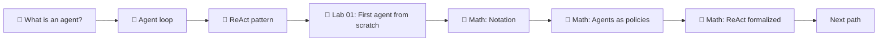

# 01 · Foundations

> 🟢 Beginner-friendly · ⏱ 8–12 hours · 📍 Start here if you're new to agents

## Who this is for

You've called LLM APIs and built simple chat features, but you haven't built a *real* agent — one that uses tools, observes results, and decides what to do next. This path takes you from "I can prompt a model" to "I can build an agent loop from scratch and explain why it works."

By the end you should be able to:

- Explain the agent loop in your own words and identify it in any framework's code.
- Build a tool-using agent from scratch in Python, with no framework.
- Read modern function-calling APIs (OpenAI, Anthropic) and emit structured tool calls.
- Recognize the common agent failure modes and what causes each.
- Understand the formal framing — agents as policies — well enough to read papers without getting stuck on notation.

## Prerequisites

- Python at intermediate level (type hints, async basics, working with libraries).
- Familiarity with an LLM API. If you've ever called `client.chat.completions.create(...)`, you're ready.
- No prior agent or framework experience needed.

If you're missing any of the above, work through them first — the rest of the path won't make sense without them.

## How this path is structured

The Foundations path layers three things in parallel: **concepts** (the ideas), **labs** (the practice), and **math** (the formal grounding). You can follow them strictly in order, or read the concepts first and come back to the math when you want to go deeper. The recommended order assumes you alternate between reading and building.

## The reading list

### Module 1 — Vocabulary

Before code, get the words right. These three concept pages define the terms the rest of the repo uses.

1. 📖 **[What is an agent?](../../concepts/agents/what-is-an-agent.md)** *(~10 min)* — The minimum definition: a system that uses an LLM to decide what to do next in a loop. Distinguishes agents from pipelines and explains why the loop matters more than the model size.

2. 📖 **[The agent loop](../../concepts/agents/agent-loop.md)** *(~10 min)* — The four-step cycle (perceive → reason → act → observe) every agent runs, with vocabulary for state, action, and observation. Covers stopping conditions explicitly.

3. 📖 **[The ReAct pattern](../../concepts/agents/react-pattern.md)** *(~10 min)* — The specific way modern agents structure the *reason* step: interleaved thoughts, actions, and observations. From Yao et al. (ICLR 2023).

> 💡 By the end of this module you should be able to read any "what is an AI agent" article online and (a) follow it, and (b) notice when it's wrong.

### Module 2 — Build

Now make it real.

4. 🧪 **[Lab 01: First agent from scratch](../../labs/01-first-agent-from-scratch/)** *(~60–90 min)* — Build a working ReAct agent in ~150 lines of Python, no framework. Covers:
   - A provider-agnostic LLM wrapper.
   - Pydantic-typed tools with auto-generated schemas.
   - The loop, with thoughts, actions, and observations.
   - Structured error handling.
   - Repeated-action detection and step caps.

> 💡 This lab is the foundation for every later lab. Take your time. If something doesn't make sense, the concept pages in Module 1 will usually have the missing piece.

### Module 3 — The math, lightly

Optional but recommended. These pages connect what you just built to the formal language used in research papers.

5. 🧮 **[Notation reference](../../math-foundations/notation.md)** *(~5 min)* — The symbols and conventions used across all math pages. Bookmark it.

6. 🧮 **[Agents as policies](../../math-foundations/04-agents-as-policies.md)** *(~10 min)* — The framing $\pi_\theta(a_t \mid s_t)$. Connects the loop you wrote to RL vocabulary without pretending you're doing RL.

7. 🧮 **[The ReAct loop, formalized](../../math-foundations/06-react-formalization.md)** *(~8 min)* — The same equation, specialized for the thought-action structure. Explains *why* the thought helps.

> 💡 You can skip these and still build working agents. They become valuable when you start debugging *why* an agent is misbehaving — the formal vocabulary maps onto specific failure modes.

## Topics this path deliberately doesn't cover

This is Foundations. We're keeping the surface small. The path does **not** cover:

- LangGraph, ADK, CrewAI, AutoGen — frameworks come *after* you've built the loop by hand. See [Lab 05](../../labs/) onward.
- Retrieval and RAG — that's the next path: [02 Agentic RAG](../02-agentic-rag/).
- Multi-agent topologies — [03 Multi-Agent Systems](../03-multi-agent-systems/).
- Evaluation, observability, production concerns — [06](../06-evaluation-observability/) and [07](../07-production-and-safety/).
- MCP and A2A protocols — [04 Tool Protocols](../04-tool-protocols-mcp-a2a/).

The goal of Foundations is to make all of those *legible*. You'll come back here whenever a later concept references the agent loop.

## What's next

Once you can explain the agent loop and have Lab 01 running:

- **Heading toward RAG?** → [02 Agentic RAG](../02-agentic-rag/). Treats retrieval as a tool, not a pipeline.
- **Heading toward multi-agent?** → [03 Multi-Agent Systems](../03-multi-agent-systems/). Supervisor, hierarchical, swarm.
- **Want the framework treatment?** → Lab 05 (LangGraph state machine, forthcoming) rewrites the Lab 01 agent in LangGraph so you can see what the framework adds.
- **Theory-curious?** → [08 Mathematical Foundations](../08-mathematical-foundations/) goes deeper.

## A note on time

The 8–12 hour estimate is honest. Most of it is Lab 01 — first-time setup, working through the cells, occasionally re-reading a concept page when something doesn't click. If you've built agents before in a framework, you can skim the concepts and finish in 3–4 hours. If LLM APIs are new, expect 12–15.

---

## References

Foundational sources cited in this path:

- Yao, S. et al. (2023). [*ReAct: Synergizing Reasoning and Acting in Language Models*](https://arxiv.org/abs/2210.03629). ICLR 2023.
- Sumers, T. R. et al. (2024). [*Cognitive Architectures for Language Agents*](https://arxiv.org/abs/2309.02427). TMLR 2024.
- Russell, S., & Norvig, P. (2020). *Artificial Intelligence: A Modern Approach* (4th ed.), Ch. 2.
- Sutton, R. S., & Barto, A. G. (2018). *Reinforcement Learning: An Introduction* (2nd ed.). [Free online](http://incompleteideas.net/book/the-book-2nd.html).
- UC Berkeley CS294/194-196 *LLM Agents*, Fall 2024. [Course page](https://rdi.berkeley.edu/llm-agents/f24). Used as a benchmark for topic coverage.
