# 01 · Foundations

> 🟢 Beginner-friendly · ⏱ 10–15 hours · 📍 Start here if you're new to agents

## Who this is for

You've called LLM APIs and built simple chat features, but you haven't built a *real* agent — one that uses tools, observes results, and decides what to do next. This path takes you from "I can prompt a model" to "I can build an agent loop from scratch, design tools the model can actually use, and explain why both work."

By the end you should be able to:

- Explain the agent loop in your own words and identify it in any framework's code.
- Build a tool-using agent from scratch in Python, with no framework.
- Read modern function-calling APIs (OpenAI, Anthropic) and emit structured tool calls.
- Design tool schemas, descriptions, and return contracts that the model uses correctly.
- Recognize the common agent failure modes — both in the loop and in tool selection — and know what causes each.
- Understand the formal framing — agents as policies — well enough to read papers without getting stuck on notation.

## Prerequisites

- Python at intermediate level (type hints, async basics, working with libraries).
- Familiarity with an LLM API. If you've ever called `client.chat.completions.create(...)`, you're ready.
- No prior agent or framework experience needed.

If you're missing any of the above, work through them first — the rest of the path won't make sense without them.

## How this path is structured

The Foundations path layers four things in parallel: **concepts** (the ideas), **labs** (the practice), **math** (the formal grounding), and **quizzes** (self-assessment after each module). You can follow them strictly in order, or read the concepts first and come back to the math when you want to go deeper. The recommended order assumes you alternate between reading, building, and self-testing.

```mermaid
flowchart LR
    A[📖 What is an agent?] --> B[📖 Agent loop]
    B --> C[📖 ReAct pattern]
    C --> D[🧪 Lab 01: First agent from scratch]
    D --> T1[📖 Tool design]
    T1 --> T2[📖 Tool selection]
    T2 --> E[🧪 Lab 02: Tool design and selection]
    E --> M1[🧮 Math: Notation]
    M1 --> M2[🧮 Math: Agents as policies]
    M2 --> M3[🧮 Math: ReAct formalized]
    M3 --> Q[🧠 Quizzes]
    Q --> H[Next path]
```

## The reading list

### Module 1 — Vocabulary

Before code, get the words right. These three concept pages define the terms the rest of the repo uses.

1. 📖 **[What is an agent?](../../concepts/agents/what-is-an-agent.md)** *(~10 min)* — The minimum definition: a system that uses an LLM to decide what to do next in a loop. Distinguishes agents from pipelines and explains why the loop matters more than the model size.

2. 📖 **[The agent loop](../../concepts/agents/agent-loop.md)** *(~10 min)* — The four-step cycle (perceive → reason → act → observe) every agent runs, with vocabulary for state, action, and observation. Covers stopping conditions explicitly.

3. 📖 **[The ReAct pattern](../../concepts/agents/react-pattern.md)** *(~10 min)* — The specific way modern agents structure the *reason* step: interleaved thoughts, actions, and observations. From Yao et al. (ICLR 2023).

> 💡 By the end of this module you should be able to read any "what is an AI agent" article online and (a) follow it, and (b) notice when it's wrong.

### Module 2 — Build the loop

Now make it real.

4. 🧪 **[Lab 01: First agent from scratch](../../labs/01-first-agent-from-scratch/)** *(~60–90 min)* — Build a working ReAct agent in ~150 lines of Python, no framework. Covers:
   - A provider-agnostic LLM wrapper.
   - Pydantic-typed tools with auto-generated schemas.
   - The loop, with thoughts, actions, and observations.
   - Structured error handling.
   - Repeated-action detection and step caps.

> 💡 This lab is the foundation for every later lab. Take your time. If something doesn't make sense, the concept pages in Module 1 will usually have the missing piece.

### Module 3 — Design tools that work

Most "the agent doesn't work" problems are tool problems wearing a costume. This module teaches you to see them.

5. 📖 **[Tool design](../../concepts/tools/tool-design.md)** *(~12 min)* — Name, description, schema, return contract, executor. Schema patterns (one-tool-per-intent, discriminated unions, pagination). The seven common tool-design mistakes mapped to symptoms and fixes.

6. 📖 **[Tool selection](../../concepts/tools/tool-selection.md)** *(~12 min)* — How the model picks among tools; the four levers (system prompt, descriptions, history, `tool_choice`); the five selection-failure modes; pruning strategies for large toolsets.

7. 🧪 **[Lab 02: Tool design and selection](../../labs/02-tool-design-and-selection/)** *(~90–120 min)* — Take Lab 01's agent, give it a deliberately-broken toolset, watch it fail, then fix the *tools alone* (not the agent code) and watch it become reliable. Covers strict-mode schemas, structured errors, destructive-action gates, `tool_choice` modes, parallel tool calls, and a stretch routing pattern.

> 💡 If you've built agents in a framework before, this module is where you'll most often realize the bugs you thought were "model issues" were actually tool-design issues.

### Module 4 — The math, lightly

Optional but recommended. These pages connect what you just built to the formal language used in research papers.

8. 🧮 **[Notation reference](../../math-foundations/notation.md)** *(~5 min)* — The symbols and conventions used across all math pages. Bookmark it.

9. 🧮 **[Agents as policies](../../math-foundations/04-agents-as-policies.md)** *(~10 min)* — The framing $\pi_\theta(a_t \mid s_t)$. Connects the loop you wrote to RL vocabulary without pretending you're doing RL. Tool design changes $\mathcal{A}$; tool selection is a distribution over it.

10. 🧮 **[The ReAct loop, formalized](../../math-foundations/06-react-formalization.md)** *(~8 min)* — The same equation, specialized for the thought-action structure. Explains *why* the thought helps.

> 💡 You can skip these and still build working agents. They become valuable when you start debugging *why* an agent is misbehaving — the formal vocabulary maps onto specific failure modes.

### Module 5 — Quizzes

Self-assessment after the material above. Aim for 6/8 or better on each.

11. 🧠 **[Agents — basics](../../quizzes/foundations/agents-basics.md)** *(~7 min)* — Covers `what-is-an-agent.md`.
12. 🧠 **[The agent loop](../../quizzes/foundations/agent-loop.md)** *(~8 min)* — Covers `agent-loop.md`.
13. 🧠 **[The ReAct pattern](../../quizzes/foundations/react-pattern.md)** *(~7 min)* — Covers `react-pattern.md`.
14. 🧠 **[Tool design and selection](../../quizzes/foundations/tool-design-and-selection.md)** *(~8 min)* — Covers both tool concept pages and Lab 02.

Each quiz is 8 single-select questions with `
`-block answers. Every question has a `review:` field pointing to the exact source section, so if you miss one, you know exactly where to read again.

> 💡 The quizzes work on GitHub directly — no JavaScript, no build step. The YAML front-matter is also designed for a future interactive renderer, so the same content will eventually power a richer experience without rewriting.

## Topics this path deliberately doesn't cover

This is Foundations. We're keeping the surface small. The path does **not** cover:

- LangGraph, ADK, CrewAI, AutoGen — frameworks come *after* you've built the loop by hand. See [Lab 05](../../labs/) onward (forthcoming).
- Retrieval and RAG — that's the next path: [02 Agentic RAG](../02-agentic-rag/).
- Multi-agent topologies — [03 Multi-Agent Systems](../03-multi-agent-systems/).
- Evaluation, observability, production concerns — [06](../06-evaluation-observability/) and [07](../07-production-and-safety/).
- MCP and A2A protocols — [04 Tool Protocols](../04-tool-protocols-mcp-a2a/).

The goal of Foundations is to make all of those *legible*. You'll come back here whenever a later concept references the agent loop or tool design.

## What's next

Once you can explain the agent loop, have Lab 01 and Lab 02 running, and have passed all four quizzes at 6+/8:

- **Heading toward RAG?** → [02 Agentic RAG](../02-agentic-rag/). Treats retrieval as a tool, not a pipeline.
- **Heading toward multi-agent?** → [03 Multi-Agent Systems](../03-multi-agent-systems/). Supervisor, hierarchical, swarm.
- **Want the framework treatment?** → Lab 05 (LangGraph state machine, forthcoming) rewrites the Lab 01 agent in LangGraph so you can see what the framework adds.
- **Theory-curious?** → [08 Mathematical Foundations](../08-mathematical-foundations/) goes deeper.

## A note on time

The 10–15 hour estimate is honest. Most of it is the two labs — first-time setup, working through the cells, occasionally re-reading a concept page when something doesn't click. If you've built agents before in a framework, you can skim the concepts and finish in 5–6 hours. If LLM APIs are new, expect 15+.

---

## References

Foundational sources cited in this path:

- Yao, S. et al. (2023). [*ReAct: Synergizing Reasoning and Acting in Language Models*](https://arxiv.org/abs/2210.03629). ICLR 2023.
- Sumers, T. R. et al. (2024). [*Cognitive Architectures for Language Agents*](https://arxiv.org/abs/2309.02427). TMLR 2024.
- Schick, T. et al. (2023). [*Toolformer: Language Models Can Teach Themselves to Use Tools*](https://arxiv.org/abs/2302.04761). NeurIPS 2023.
- Patil, S. G. et al. (2024). [*Gorilla: Large Language Model Connected with Massive APIs*](https://arxiv.org/abs/2305.15334). NeurIPS 2024.
- Russell, S., & Norvig, P. (2020). *Artificial Intelligence: A Modern Approach* (4th ed.), Ch. 2.
- Sutton, R. S., & Barto, A. G. (2018). *Reinforcement Learning: An Introduction* (2nd ed.). [Free online](http://incompleteideas.net/book/the-book-2nd.html).
- UC Berkeley CS294/194-196 *LLM Agents*, Fall 2024. [Course page](https://rdi.berkeley.edu/llm-agents/f24).
- UC Berkeley CS294/194-196 *Agentic AI*, Fall 2025. [Course page](https://rdi.berkeley.edu/agentic-ai/f25). Used as a benchmark for topic coverage on planning, tool use, and evaluation.
