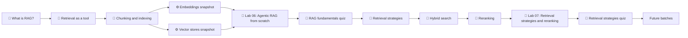

# 02 · Agentic RAG

> 🟡 Intermediate · ⏱ 8–12 hours (through batch 11; path grows over subsequent batches) · 📍 Start here once you've completed Path 01

## Who this is for

You've finished Foundations: you can build an agent loop from scratch, design tools that work, and ship a research agent against the real web (Lab 03). Now you want to do the same thing with a *controlled corpus* instead of the open web — retrieval-augmented generation, the pattern most production agent systems converge on.

This path takes you from "I understand the search/retrieval distinction conceptually" to "I can build an agentic RAG system end-to-end with a production-grade retrieval pipeline, from chunking through reranking to citation-tracking the answer." It does this from scratch in pure Python first — same discipline as the Foundations labs — so when you later reach for LangChain or LlamaIndex, you'll know what those abstractions are hiding and when they help.

By the end of the current batches you should be able to:

- Explain what RAG is and why naive vs. agentic RAG are meaningfully different patterns.
- Implement chunking that respects document boundaries and stays under the embedding model's silent-truncation limit.
- Build a vector index from scratch in ~20 lines of numpy and explain what production vector stores add on top.
- Wire retrieval into the agent loop as a tool — the *same* loop you built in Labs 01/03.
- Track citations at chunk granularity, by the loop and not by the LLM.
- Calibrate top_k, score floors, MMR, and query construction for a specific corpus.
- Build BM25 + dense hybrid retrieval with reciprocal rank fusion from scratch.
- Wire a cross-encoder reranker into the retrieve-then-rerank pipeline and explain its precision/cost tradeoff.
- Recognize the three retrieval-failure modes that look different from web-search failures.
- Make an informed call between MiniLM-L6-v2 and OpenAI's `text-embedding-3-small` for a given workload.

## Prerequisites

**Complete Path 01 — Foundations first.** This is non-negotiable. Lab 06 directly extends Lab 03's pattern, and the conceptual frame ("retrieval as a tool") only makes sense if you've internalized the search-vs-retrieval distinction from Foundations.

Minimum:

- Labs 01, 02, 03 finished.
- The [`search-tools`](../../concepts/tools/search-tools.md) concept page read and understood.
- All five Foundations quizzes passed at 6+/8.

If you've also done Lab 05 (LangGraph), great — but it's not required here. Lab 06 stays from-scratch on purpose, mirroring Lab 03's approach.

## How this path is structured

The first batch covered the conceptual frame and the from-scratch lab. The second batch (this update) adds the retrieval-quality stack: strategies, hybrid search, and reranking. Subsequent batches will add contextual retrieval, query expansion, RAG evaluation, and a framework-bridge lab.

The arrows reflect the *recommended* order. Module 1's three concept pages can be read together — they cross-reference each other and converge on Lab 06. Module 5's three concept pages have the same property and converge on Lab 07.

## The reading list — Module 1: Conceptual frame

The conceptual prerequisites for Lab 06. Read these in order; the lab assumes their vocabulary.

1. 📖 **[What is RAG?](../../concepts/rag/what-is-rag.md)** *(~10 min)* — The pattern, naive vs. agentic, what RAG fixes and doesn't fix. Anchored to Lewis et al. (NeurIPS 2020).

2. 📖 **[Retrieval as a tool](../../concepts/rag/retrieval-as-a-tool.md)** *(~9 min)* — The agentic framing. How `search_corpus` and `read_chunk` map onto Lab 03's `web_search` and `fetch_page`. What transfers, what changes.

3. 📖 **[Chunking and indexing](../../concepts/rag/chunking-and-indexing.md)** *(~12 min)* — The stable decisions: chunk size, overlap, boundaries, metadata, what a vector index actually is mechanically. Includes the 256-wordpiece foot-gun.

> 💡 By the end of Module 1 you should be able to read any "RAG explained" article online and (a) follow it, (b) notice which decisions it skips, and (c) explain why search ≠ RAG one more time, in your sleep.

## Module 2: Reference snapshots

The pinned APIs and versions Lab 06 depends on. Reference material — skim once, refer back when you write your own code.

4. ⚙️ **[Embedding models snapshot](../../tools/embeddings/snapshot-v1.0.md)** *(~6 min reference)* — `sentence-transformers/all-MiniLM-L6-v2` as the default (no API key, CPU, 384-dim) and `text-embedding-3-small` as the production swap-in (1536-dim, $0.02/1M tokens). Pinned APIs, honest tradeoffs, the freshness-check protocol.

5. ⚙️ **[Vector stores snapshot](../../tools/vector-stores/snapshot-v1.0.md)** *(~8 min reference)* — A survey of Chroma, pgvector, Qdrant, Weaviate, Pinecone, plus FAISS. A decision aid, not a tutorial. Lab 06 doesn't use any of these; the page explains when you would.

## Module 3: The from-scratch lab

The practical exercise for the conceptual material. Build the whole stack: load the bundled corpus, chunk it, embed it, index it in numpy, wire it as agent tools, and run multi-step retrieval with citation tracking.

6. 🧪 **[Lab 06: Agentic RAG from scratch](../../labs/06-agentic-rag-from-scratch/)** *(~100–130 min)* — The headline lab. Two tools (`search_corpus`, `read_chunk`), one loop, three test queries, an explicit failure-mode walkthrough, and a stretch section that swaps in OpenAI embeddings.

The lab corpus is bundled — 8 Markdown documents on agent/RAG topics, ~4,700 tokens total. Fully reproducible, no network downloads, you can inspect every document directly.

> 💡 If you can read Lab 03's agent code, you can read Lab 06's. The conceptual move is *only* "swap the I/O layer for retrieval over a local index." Most of the lab is the new I/O layer; the loop is unchanged.

## Module 4: First self-assessment

7. 🧠 **[RAG fundamentals quiz](../../quizzes/agentic-rag/rag-fundamentals.md)** *(~8 min)* — 8 single-select questions on the patterns, the 256-wordpiece foot-gun, citation tracking semantics, the search-vs-RAG distinction, and when to upgrade from numpy.

Same format as the Foundations quizzes: YAML front-matter, `
`-block reveals, `review:` field anchoring each question to a specific source section.

## Module 5: Retrieval quality

The retrieval-quality concept stack. Each of these reads in ~10–11 minutes and they share a worked example (the Lab 06 corpus). Read in order; Lab 07 assumes them.

8. 📖 **[Retrieval strategies](../../concepts/rag/retrieval-strategies.md)** *(~11 min)* — The four knobs every retriever exposes: `top_k`, score floors, MMR diversification, and query construction. The defensible defaults and how to calibrate them on your corpus.

9. 📖 **[Hybrid search](../../concepts/rag/hybrid-search.md)** *(~10 min)* — Why dense (semantic) and BM25 (lexical) have inverse failure modes. Reciprocal Rank Fusion from the Cormack 2009 paper, weighted combination, and the cascade pattern. When hybrid beats dense alone.

10. 📖 **[Reranking](../../concepts/rag/reranking.md)** *(~10 min)* — The bi-encoder limit; what a cross-encoder sees that a bi-encoder can't. The retrieve-then-rerank pipeline, the `candidate_k → final_k` ratio, model choices from MiniLM-L-6 to bge-reranker-large.

## Module 6: The retrieval-quality lab

11. 🧪 **[Lab 07: Retrieval strategies and reranking](../../labs/07-retrieval-strategies-and-reranking/)** *(~110–140 min)* — Extends Lab 06's `search_corpus` with BM25, RRF (from scratch), MMR (from scratch), and a cross-encoder reranker. Same corpus, same agent loop, measurably better retrieval. Step-by-step side-by-side comparison so every upgrade is visible.

The lab reuses Lab 06's corpus and chunker entirely. The only new dependency is `rank-bm25` for BM25; the `sentence-transformers` install from Lab 06 provides the cross-encoder via its `CrossEncoder` class.

> 💡 If Lab 06 was "build retrieval as a tool," Lab 07 is "make that retrieval reliably good." Same loop, different innards. After Lab 07 you've built every standard component of a production-grade retrieval pipeline.

## Module 7: Second self-assessment

12. 🧠 **[Retrieval strategies quiz](../../quizzes/agentic-rag/retrieval-strategies.md)** *(~9 min)* — 8 single-select questions on the four knobs, RRF mechanics, bi-encoder vs cross-encoder architecture, when each intervention helps, and the gotchas around score scales and `candidate_k`.

## What's *not* in this path yet

Anti-scope, kept explicit so you know what's coming and what isn't:

- ❌ **Contextual retrieval** (Anthropic's technique for augmenting chunks with document-level context before embedding). Future batch.
- ❌ **Query expansion / HyDE / multi-query**. Future batch.
- ❌ **Production vector stores in the headline labs** (Chroma, Pinecone, Qdrant, Weaviate). Covered in the survey snapshot but not exercised in either lab.
- ❌ **RAG evaluation frameworks** (Ragas, TruLens, custom evaluators). That's Path 06. Lab 07 uses informal side-by-side comparison instead.
- ❌ **LangChain / LlamaIndex RAG abstractions**. Reserved for a future framework-bridge lab analogous to Lab 05.
- ❌ **Multi-agent coordination** (researcher + synthesizer, etc.). That's Path 03.
- ❌ **Late-interaction retrieval** (ColBERT, PLAID, ColPali). Mentioned briefly in `reranking.md` as a production path; full treatment deferred.

Each item above is meaningful enough to deserve its own focused treatment rather than a paragraph buried elsewhere.

## What comes in later batches

When subsequent Path 02 batches land, this page will grow. The shape we're working toward:

- **Module 8: Contextual retrieval** — Anthropic's chunk-augmentation technique. Concept page + lab extension.
- **Module 9: Query construction** — HyDE, multi-query, query expansion. Concept page + lab extension.
- **Module 10: Framework bridge** — same RAG agent in LangChain/LangGraph, analogous to Lab 05 for Foundations.
- **Module 11: RAG evaluation primer** — a lightweight evaluation pass before learners reach Path 06 in earnest.

If you finish the current batches and want more *now*, the natural next moves are:

- **Path 03 — Multi-Agent Systems.** The patterns from Labs 06 + 07 transfer cleanly. A research agent + a synthesizer is just two of the loops you've built.
- **Path 06 — Evaluation & Observability.** Once you have a RAG agent with a good retrieval stack, the next honest question is "is it actually good?" — and that's a different curriculum.

## A note on time

The 8–12 hour estimate covers reading the six concept pages, skimming the two snapshots, doing both labs, and taking both quizzes. Most of it is the two labs. If you're already comfortable with sentence-transformers and numpy, the labs can each take 60–90 minutes; if you're learning the libraries for the first time, expect closer to two hours each. The retrieval-quality concept pages (Module 5) take roughly half an hour total.

---

## References

Foundational sources cited across this path's pages:

- Lewis, P. et al. (2020). [*Retrieval-Augmented Generation for Knowledge-Intensive NLP Tasks*](https://arxiv.org/abs/2005.11401). NeurIPS 2020. The paper that named the pattern.
- Karpukhin, V. et al. (2020). [*Dense Passage Retrieval for Open-Domain Question Answering*](https://arxiv.org/abs/2004.04906). EMNLP 2020. The dense retrieval mechanism Lewis et al. built on.
- Gao, Y. et al. (2024). [*Retrieval-Augmented Generation for Large Language Models: A Survey*](https://arxiv.org/abs/2312.10997). The standard 2024 survey covering naive, advanced, and modular RAG.
- Reimers, N., & Gurevych, I. (2019). [*Sentence-BERT: Sentence Embeddings using Siamese BERT-Networks*](https://arxiv.org/abs/1908.10084). EMNLP 2019. The paper introducing the sentence-transformers approach our default embedding model uses; Section 5.3 establishes the cross-encoder as a distinct architecture.
- Robertson, S., & Zaragoza, H. (2009). [*The Probabilistic Relevance Framework: BM25 and Beyond*](https://www.staff.city.ac.uk/~sb317/papers/foundations_bm25_review.pdf). The definitive BM25 review.
- Cormack, G. V., Clarke, C. L. A., & Büttcher, S. (2009). [*Reciprocal rank fusion outperforms Condorcet and individual rank learning methods*](https://dl.acm.org/doi/10.1145/1571941.1572114). SIGIR 2009. The RRF paper; introduces the `k=60` constant Lab 07 uses.
- Carbonell, J., & Goldstein, J. (1998). [*The use of MMR, diversity-based reranking for reordering documents and producing summaries*](https://dl.acm.org/doi/10.1145/290941.291025). SIGIR 1998. The MMR paper.
- Nogueira, R., & Cho, K. (2019). [*Passage Re-ranking with BERT*](https://arxiv.org/abs/1901.04085). The lineage of the `cross-encoder/ms-marco-MiniLM-L-6-v2` reranker Lab 07 uses.
- Thakur, N. et al. (2021). [*BEIR: A Heterogeneous Benchmark for Zero-shot Evaluation of Information Retrieval Models*](https://arxiv.org/abs/2104.08663). NeurIPS 2021. The standard reference benchmark.
- Anthropic (2024). [*Introducing Contextual Retrieval*](https://www.anthropic.com/news/contextual-retrieval). Future Path 02 batch covers this technique in detail.
- Malkov, Y. A., & Yashunin, D. A. (2018). [*Efficient and robust approximate nearest neighbor search using Hierarchical Navigable Small World graphs*](https://arxiv.org/abs/1603.09320). The HNSW paper — the basis for most ANN indexes used in production vector stores.
