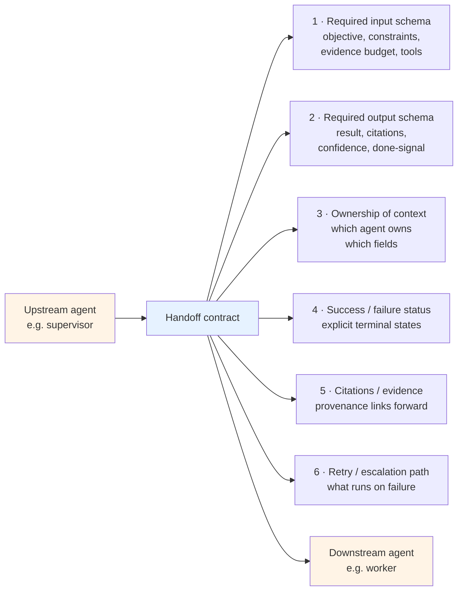

# Pattern 1 — Handoff contracts

> 🟢 Stable · ⏱ ~15 min · 📍 Read after [Lab 10 (supervisor-worker from scratch)](../../../labs/10-supervisor-worker-from-scratch/)

## Intent

Multi-agent systems that survive 2026 production use **structured handoff contracts** — explicit input/output schemas at every agent-to-agent boundary. Free-form delegations between agents are a documented failure mode: the supervisor and worker drift on shared assumptions, the worker over-reaches, the supervisor mis-routes the result, and the next subagent receives input that doesn't match its expectations.

The fix isn't a smarter prompt at either end. The fix is a contract that both sides commit to before either runs.

## When to use this pattern

- **You have two or more agents that pass work between roles** — supervisor-worker (Lab 10), generator-critic (Lab 11), plan-and-execute (Lab 12), multi-agent RAG (Lab 13). Any topology where one agent's output becomes another agent's input.
- **The handoff carries non-trivial structure** — citations, evidence, tool results, confidence scores, partial plans. Anything richer than a single freeform string.
- **You need to test the handoff in isolation** — the contract makes it possible to mock either side, write unit tests against the schema, and replay a handoff event without re-running the upstream agent.
- **You're seeing agents loop or pass the same task back and forth** — this is the canonical symptom that the handoff lacks an explicit done-signal. The fix is contract, not prompt tuning.

## When NOT to use

- **Single-agent loops with tool calls.** Tool-calling already gives you a schema — request and response are defined by the tool's signature. Don't layer a redundant contract on top.
- **One-shot prompt chains with no shared state.** A pipeline like "summarize → classify → format" where each stage takes the previous string and returns a new string doesn't need a contract; it needs the tool-calling contract Lab 02 already gave you.
- **Exploratory prototypes.** During the first day of building, the handoff shape is what you're learning. Lock the contract once the shape stabilizes; not before.
- **When the topology is wrong.** If your "handoffs" are actually a single agent calling helper tools (the "compound single-agent design" failure mode), a contract on the handoff doesn't fix anything — you don't have a multi-agent system, you have a single agent with tools. Reach for Path 03 v1 Module 1's "when does multi-agent earn its complexity" framing instead.

## The mechanism

A handoff contract names six things at every agent-to-agent boundary:



### 1. Required input schema

What the downstream agent must receive to do its job. The minimum useful set per the 2026 P2 prompt pattern: **objective** (one-sentence goal), **constraints** (what the agent must not do), **evidence budget** (max tool calls, max tokens, max retries), **available tools** (the allowlist for this invocation).

This is not the downstream agent's system prompt. The system prompt is its identity ("you are a researcher who never invents claims"); the handoff input is the task-specific brief ("find five sources on MCP server design; cite each; budget 8 search calls").

### 2. Required output schema

What the downstream agent must return. The minimum useful set: **result** (the structured payload), **citations** (provenance for any factual claim), **confidence** (a numeric or categorical signal the upstream can route on), **done-signal** (an explicit "I finished" or "I failed" terminal state).

Two anti-patterns this prevents:
- The "return a transcript" failure: returning the full conversation history pollutes the upstream context and burns tokens at roughly 15× the rate of a summary return. Production deployments return a summary string per the niteagent May 2026 measurements.
- The "implicit done" failure: if there's no explicit done-signal, the upstream agent's prompt has to infer completion from the message content, and inference is what loops are made of.

### 3. Ownership of context

Which agent owns which fields. The supervisor owns the objective; the worker owns the evidence it gathers; the citations field is co-owned (supervisor enforces format, worker fills content). Without ownership rules, two agents will both try to mutate the same field and the last write wins — usually the wrong one.

### 4. Success / failure status

Explicit terminal states. At minimum: `succeeded`, `failed`, `needs_escalation`. Production deployments often add `partial` (result is usable but incomplete; useful for plan-and-execute where the executor wants to flag that a step needs re-planning) and `policy_violation` (route to a security or safety reviewer; see [Pattern 3](./03-escalation-and-fallback.md)).

### 5. Citations / evidence transfer

Any factual claim in the result must carry provenance. The handoff contract makes this enforceable: if the downstream agent returns a `result.facts` array, the contract requires a matching `result.citations` array of the same length, with each citation linking to the source the claim came from. Lab 13's multi-agent RAG already does this; the pattern is to make it a contract requirement, not an emergent behavior.

### 6. Retry / escalation path

What happens when the downstream returns `failed` or `partial`. The contract names the next destination: retry with adjusted prompt? escalate to critic agent? escalate to human? fall back to a canned answer? This is where Pattern 1 hands off to [Pattern 3](./03-escalation-and-fallback.md).

## Implementation sketch

A Python sketch using Pydantic — the schema is the contract, both sides import it. Production deployments serialize the contract as JSON Schema and validate at the boundary.

```python
from typing import Literal, Optional
from pydantic import BaseModel, Field


class HandoffRequest(BaseModel):
    """Upstream → downstream. The contract input."""
    objective: str = Field(..., description="One-sentence goal")
    constraints: list[str] = Field(default_factory=list)
    evidence_budget: int = Field(default=8, ge=1, le=32)
    available_tools: list[str] = Field(default_factory=list)
    context_owner: str = Field(default="supervisor")  # who owns the upstream context


class Citation(BaseModel):
    fact_id: str           # links back to a facts[i] entry
    source_uri: str
    span: Optional[str] = None  # the supporting passage


class HandoffResponse(BaseModel):
    """Downstream → upstream. The contract output."""
    status: Literal["succeeded", "failed", "partial", "needs_escalation", "policy_violation"]
    result: dict           # downstream-defined payload
    facts: list[str] = Field(default_factory=list)
    citations: list[Citation] = Field(default_factory=list)
    confidence: float = Field(..., ge=0.0, le=1.0)
    done: bool             # the explicit done-signal
    next_action: Optional[str] = None  # if not done, what should the upstream do


def make_handoff(
    request: HandoffRequest,
    downstream_agent_callable,  # e.g. agent.invoke
) -> HandoffResponse:
    """Boundary function. Validates input and output against the contract."""
    request_dict = request.model_dump()  # validates input schema
    raw_response = downstream_agent_callable(request_dict)
    response = HandoffResponse.model_validate(raw_response)  # validates output schema
    # Provenance invariant: every fact has a citation
    if response.facts and len(response.citations) < len(response.facts):
        response.status = "failed"
        response.next_action = "missing_citations"
    return response
```

Two things this sketch does that matter in production:

- **Validation at the boundary.** The Pydantic models reject malformed payloads at the handoff line, not deep inside the downstream agent's logic. This is what makes the handoff testable in isolation.
- **The provenance invariant.** The boundary function enforces "every fact has a citation" — a downstream agent that returns facts without citations is automatically `failed`. This catches citation laundering (see Path 06's [adversarial red-teaming page](../../../concepts/evaluation/adversarial-red-teaming-at-scale.md) for the threat-model framing) at the multi-agent boundary, not just at the final response stage.

For LangGraph implementations, the contract maps cleanly to a typed `TypedDict` state schema with `Annotated[..., reducer]` fields. Lab 14's `StateGraph` is the production reference for this shape.

## How this combines with Path 03 modules

| Path 03 module / lab | Where this pattern applies |
|---|---|
| Module 1 / Lab 10 (supervisor-worker from scratch) | The supervisor → worker boundary is the canonical example. The lab's tool-calling contract is the proto-handoff; layering the explicit `HandoffRequest`/`HandoffResponse` schema is the production upgrade. |
| Module 2 / Lab 11 (generator-critic) | The generator → critic boundary needs the contract to carry the artifact under review *plus* the rubric the critic should apply. Without the rubric in the contract, the critic falls back to its system prompt's default rubric — which can differ from what the generator was optimized for. |
| Module 3 / Lab 12 (plan-and-execute) | The planner → executor boundary needs the contract to carry one step of the plan plus the executor's success criteria for that step. The "step is done" judgement belongs in the contract, not in either agent's prompt. |
| Module 4 / Lab 13 (multi-agent RAG) | The retriever → synthesizer boundary needs the citation array as a first-class contract field. The Lab 13 implementation is most of the way there already; the upgrade is making citations contract-required rather than convention-followed. |
| Module 5 / Lab 14 (LangGraph supervisor bridge) | The `Command(goto=worker, update={...})` primitive in LangGraph is exactly the handoff contract — the `update` payload is the `HandoffRequest`, the worker's return is the `HandoffResponse`. The bridge lab is where the contract becomes load-bearing infrastructure. |
| Module 6 / Lab 16 (multi-agent evaluation) | Lab 16 evaluates trajectories. A trajectory consists of handoffs; a handoff that fails its contract is a turn-level failure the evaluator should flag. Contract-violation rate is a useful trajectory-level metric. |

## Tradeoffs and what this misses

**Tradeoffs**:

- **Schema rigidity vs flexibility.** A strict contract catches handoff errors early but locks in the downstream agent's interface — adding a field after the contract is in use means a coordinated change across both sides. Production teams version their handoff contracts (`HandoffRequestV1`, `HandoffRequestV2`); the velocity cost is real.
- **Validation cost.** Pydantic validation on every handoff adds a small latency tax. At a 6-agent system with 12 handoffs per request, this is negligible; at a 100-agent swarm with hundreds of handoffs, the cumulative cost shows up.
- **The contract is not the prompt.** Teams sometimes assume that defining a contract eliminates the need to engineer the downstream agent's system prompt. It doesn't. The contract specifies the *boundary*; the prompt specifies the *behavior inside the boundary*. Both matter.

**What this misses**:

- **The "second LLM as validator" pattern**. A separate evaluator-LLM that scores handoff quality (was the result well-formed? did it answer the objective?) is a richer signal than Pydantic validation alone. That's an evaluation pattern, not a contract pattern — see [Path 06 Pattern 3](../../06-evaluation-observability/patterns/03-judge-ensemble.md).
- **Cross-agent prompt-injection defense**. A handoff contract validates *shape*; it doesn't validate *content* against injected instructions. The agentic-red-teaming [Path 06 v2 concept page](../../../concepts/evaluation/adversarial-red-teaming-at-scale.md) covers indirect prompt injection through tool outputs and retrieved documents — the same threat applies to handoff payloads.
- **Distributed contract evolution**. When the supervisor and worker are owned by different teams (the canonical enterprise case), contract changes need governance. JSON Schema versioning + a contract registry (similar to a service registry) is the production answer; this pattern doesn't cover the organizational side.

## References

**Production literature (verified mid-2026)**:

- niteagent (May 2026), *Multi-Agent in Production 2026: 3 Patterns That Survived* — [niteagent.com/blog](https://niteagent.com/blog/multi-agent-production-2026/) — the P2 prompt pattern (objective + output format + tool guidance + clear task boundaries); the 15× token-burn cost for full-transcript inlining; "return summary string, not transcript" as Rule 3 of the production-survival rules
- dev.to (April 2026), *Multi-Agent Handoff With Ownership Boundaries Nobody Crosses* — [dev.to](https://dev.to/gabrielanhaia/multi-agent-handoff-with-ownership-boundaries-nobody-crosses-nll) — "the fix was a contract, not a smarter prompt"; agent-handoff event as first-class span type in Langfuse / Arize / Braintrust / W&B Weave; OpenAI Agents SDK + LangGraph `Command(goto=...)` as the two production handoff primitives
- AffinityBots (December 2025), *AI Agent Teams in 2026: How Multi-Agent Systems Actually Work* — [affinitybots.com/blog](https://affinitybots.com/blog/ai-agent-teams-in-2026-how-multi-agent-systems-actually-work) — five canonical message types (task assignments, tool results, critiques, approvals, escalation signals); "reliability stems from explicit protocols, idempotent handlers, and durable state, not from emergent conversations"
- Anthropic (2024), *Building effective agents* — [anthropic.com/research](https://www.anthropic.com/research/building-effective-agents) — the foundational essay; orchestrator-worker pattern; structured input/output framing for subagents

**LangGraph / framework documentation**:

- LangGraph Multi-Agent Supervisor docs — [reference.langchain.com](https://reference.langchain.com/python/langgraph-supervisor) — the tool-based agent handoff mechanism; `(AIMessage, ToolMessage)` pair convention for returning control to supervisor
- LangGraph `Command(goto=..., update=...)` API — the primitive that implements the handoff-contract shape natively

**Path 03 internals**:

- [`concepts/multi-agent/handoffs-and-shared-state.md`](../../../concepts/multi-agent/handoffs-and-shared-state.md) — Module 1 concept page; the message-passing vs shared-state architectural choice this pattern operates inside
- [`concepts/multi-agent/supervisor-worker-pattern.md`](../../../concepts/multi-agent/supervisor-worker-pattern.md) — Module 1 concept page; the topology this pattern is most often applied to
- [Lab 10](../../../labs/10-supervisor-worker-from-scratch/), [Lab 13](../../../labs/13-multi-agent-rag-from-scratch/), [Lab 14](../../../labs/14-langgraph-supervisor-bridge/), [Lab 16](../../../labs/16-multi-agent-evaluation-from-scratch/) — the lab implementations this pattern layers onto
- [Pattern 2 — Shared-state boundaries](./02-shared-state-boundaries.md) — the complementary "what crosses the boundary" pattern
- [Pattern 3 — Escalation and fallback](./03-escalation-and-fallback.md) — what runs when a handoff returns `failed`, `partial`, or `needs_escalation`
