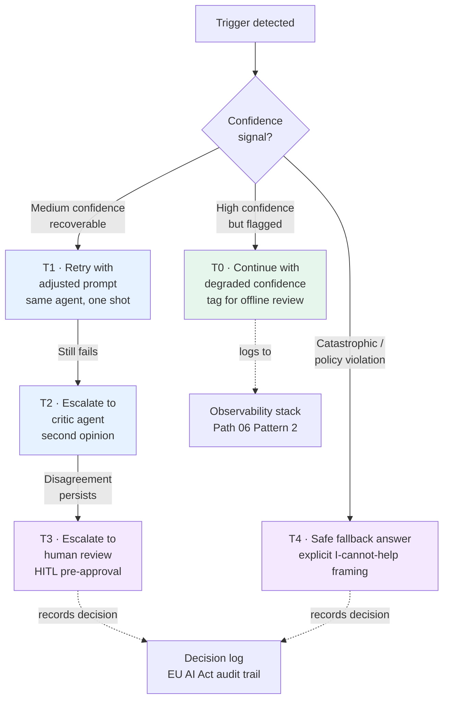

# Pattern 3 — Escalation and fallback

> 🟢 Stable · ⏱ ~15 min · 📍 Read after [Lab 11 (generator-critic from scratch)](../../../labs/11-generator-critic-from-scratch/) and [Lab 16 (multi-agent evaluation)](../../../labs/16-multi-agent-evaluation-from-scratch/)

## Intent

Patterns 1 and 2 are about **prevention** — the handoff contract prevents free-form delegation loops; the shared-state boundary prevents context-window blowups. Pattern 3 is about **reaction**: what happens when the prevention layers don't catch the case and the system stalls, disagrees, or produces a low-confidence output.

The 2026 production literature is settling on a consistent framing — conflict between agents is not a failure mode to suppress, it's a signal to route. A planner and an executor that disagree on a step boundary; a critic that flags a generator's output; a retriever that returns insufficient evidence; an executor that times out on a tool call — each of these is information. The pattern names where that information should go.

## When to use this pattern

- **Your topology includes a critic or verifier.** Generator-critic (Lab 11), plan-and-execute with a verifier (Lab 12 + critic extension), multi-agent RAG with a faithfulness check (Lab 13 + Path 06 Module 2's faithfulness evaluator). The critic's "I disagree" output needs somewhere to go.
- **Your topology executes tools that can fail.** Plan-and-execute (Lab 12, Lab 15) is the canonical case: the executor calls a tool, the tool returns an error or a degraded result, and the system needs a rule for what to do next.
- **You operate under regulatory escalation requirements.** EU AI Act high-risk categories (healthcare, credit, employment, critical infrastructure) carry explicit obligations to escalate uncertain decisions to a human reviewer; the August 2026 enforcement deadline makes this concrete. The pattern names the routing tiers.
- **You're seeing the "agents loop forever" symptom.** This is the timeout/loop-risk trigger. The pattern's safe-fallback tier exists for exactly this case.

## When NOT to use

- **Single-agent loops with simple tool-failure semantics.** A single agent with retry logic doesn't need an escalation pattern — it needs a retry budget and a clear terminal-failure state. The pattern earns its complexity in multi-agent topologies where the answer to "who decides what to do on failure" is not obviously "the calling agent."
- **For low-stakes consumer chat.** A general-purpose chat assistant that sometimes gives a hedged answer doesn't need a five-tier escalation ladder. The pattern is for systems where the cost of a wrong answer justifies the operational machinery — agentic tasks that mutate state, make decisions, or call regulated APIs.
- **As a substitute for evaluation.** The pattern routes detected failures. Detecting failures in the first place is Module 6 (multi-agent evaluation) and [Path 06](../../06-evaluation-observability/) territory — trajectory metrics, judge ensembles, drift detection. Don't build escalation on top of an untrustworthy detector.
- **When the right answer is to not deploy.** Some agentic tasks shouldn't run autonomously — they need a human in the loop at every step. The pattern's HITL tier covers this case, but if every interaction routes to T3, you don't have an autonomous system; you have a workflow tool with extra steps. Reconsider the topology.

## The mechanism

A five-tier escalation ladder, mapped to four canonical triggers:



### The five tiers

**T0 — Continue with degraded confidence.**
The agent returns a result, but tags the trace as low-confidence. No user-visible change; the result flows to the next handoff with a `confidence < threshold` marker. The trace lands in the offline-review queue (the same one [Path 06 Pattern 2](../../06-evaluation-observability/patterns/02-drift-triggered-review.md) feeds). Use T0 for soft signals where blocking would over-react.

**T1 — Retry with adjusted prompt.**
One-shot retry by the same agent, with a small prompt adjustment (the orchestrator says "you returned X but the contract requires Y; try again"). T1 catches recoverable failures: malformed JSON, missing citation, mild contract violations. Hard cap at one retry — two retries with no progress is a loop signal, not a recovery.

**T2 — Escalate to critic agent.**
A second agent (typically the generator-critic from Module 2, but it can be a domain-specific verifier) reviews the upstream output. T2 is for cases where the failure was at the *judgment* layer — the result is well-formed, but the orchestrator isn't confident it's right. The critic produces a binary verdict (`accept` / `reject`) plus reasoning; on `accept`, the result flows forward; on `reject`, T2 escalates to T3.

**T3 — Escalate to human review (HITL pre-approval).**
The system halts and awaits human confirmation before any external action. This is the canonical pre-approval HITL mode (per Anna Jey April 2026): the agent has prepared an action, a reviewer must approve before it executes. Three production conventions matter here: structured briefing for the reviewer (intent, data lineage, permissions chain, expected blast radius, rollback plan); challenge-and-response checklist rather than a single "approve?" button; logged approval authority for audit.

**T4 — Safe fallback answer.**
The system returns a canned response that explicitly names what it cannot do. Examples: "I couldn't gather enough evidence to answer this; please rephrase or provide more context"; "this request requires a human reviewer and I've created a ticket". T4 fires when T0-T3 are unavailable (no human reviewer online), when the trigger is catastrophic (policy violation, security-relevant trigger), or as the *terminal* state when retries are exhausted. The fallback is structured; the framing is explicit; the system records the decision for review.

### The four triggers

| Trigger | Source | Default tier | Why |
|---|---|---|---|
| **Critic disagreement** | Generator-critic boundary (Module 2; Lab 11) | T2 → T3 | Two LLMs disagree; route to the explicit critic agent (T2), then human (T3) if the critic also disagrees |
| **Failed tool call** | Plan-and-execute executor (Module 3; Lab 12, Lab 15) | T1 → T4 | Try one retry (T1); if that fails, safe-fallback (T4). Tool failures rarely benefit from critic-level reasoning |
| **Missing evidence** | Multi-agent RAG retriever (Module 4; Lab 13) | T0 → T4 | Tag as low-confidence (T0) and continue with hedged answer; if the question requires the missing evidence, safe-fallback (T4) |
| **Timeout / loop risk** | Orchestrator (any topology) | T4 | The system has been spinning; the right move is to stop and return a safe fallback. T2 and T3 are expensive when the upstream loop is the symptom |

A note on tier transitions: tiers don't always cascade linearly. A policy-violation trigger goes straight to T4 (no point retrying with an adjusted prompt; the issue isn't recoverable). A missing-evidence trigger on a low-stakes query may go to T0 (continue with degraded confidence) and never reach T4. The right tier depends on the trigger *and* the task stakes; the table above is a default mapping, not a fixed rule.

### Reuse of Path 06 Pattern 2's severity routing

The escalation ladder is structurally identical to [Path 06 Pattern 2's three-tier drift-triggered review](../../06-evaluation-observability/patterns/02-drift-triggered-review.md), expanded with T4 (safe fallback) at the bottom. This is deliberate — production systems already operate the Path 06 severity classifier for drift events; reusing the same routing infrastructure for agent escalation events keeps the operational surface small. The annotation queue, the on-call pager, the audit log — all the same destinations, with the event source tag distinguishing `drift` from `agent_escalation`.

## Implementation sketch

A Python sketch with explicit tier routing. The orchestrator wraps each agent invocation in a tier-aware policy:

```python
from typing import Literal, Optional, Callable
from pydantic import BaseModel
from enum import Enum


class Tier(Enum):
    T0_DEGRADED = "T0_DEGRADED"
    T1_RETRY = "T1_RETRY"
    T2_CRITIC = "T2_CRITIC"
    T3_HUMAN = "T3_HUMAN"
    T4_FALLBACK = "T4_FALLBACK"


class EscalationDecision(BaseModel):
    tier: Tier
    trigger: str                # which trigger fired
    reason: str                 # human-readable rationale
    next_action: Optional[str]  # if not terminal, what to run next
    decision_id: str            # for audit trail (EU AI Act / decisions log)


def route_failure(
    trigger: Literal["critic_disagreement", "failed_tool_call",
                     "missing_evidence", "timeout_loop_risk", "policy_violation"],
    confidence: float,
    retries_remaining: int,
    is_high_stakes: bool,
    is_policy_violation: bool,
) -> EscalationDecision:
    """Route a detected failure to the appropriate tier."""

    # Catastrophic / policy → T4 unconditionally
    if is_policy_violation or trigger == "policy_violation":
        return EscalationDecision(
            tier=Tier.T4_FALLBACK,
            trigger=trigger,
            reason="Policy violation — no recovery; safe fallback only",
            next_action=None,
            decision_id=_new_decision_id(),
        )

    # Tool failures: T1 (retry) then T4
    if trigger == "failed_tool_call":
        if retries_remaining > 0:
            return EscalationDecision(
                tier=Tier.T1_RETRY,
                trigger=trigger,
                reason=f"Tool failed; {retries_remaining} retries remain",
                next_action="retry_with_adjusted_prompt",
                decision_id=_new_decision_id(),
            )
        return EscalationDecision(
            tier=Tier.T4_FALLBACK,
            trigger=trigger,
            reason="Tool failed; retries exhausted",
            next_action=None,
            decision_id=_new_decision_id(),
        )

    # Critic disagreement: T2 (critic), then T3 (human) if stakes are high
    if trigger == "critic_disagreement":
        if is_high_stakes:
            return EscalationDecision(
                tier=Tier.T3_HUMAN,
                trigger=trigger,
                reason="Critic disagrees on high-stakes decision; HITL required",
                next_action="halt_and_await_human",
                decision_id=_new_decision_id(),
            )
        return EscalationDecision(
            tier=Tier.T2_CRITIC,
            trigger=trigger,
            reason="Critic disagrees; route to verifier for second opinion",
            next_action="invoke_verifier_agent",
            decision_id=_new_decision_id(),
        )

    # Missing evidence: T0 for low-stakes, T4 for high-stakes
    if trigger == "missing_evidence":
        if is_high_stakes:
            return EscalationDecision(
                tier=Tier.T4_FALLBACK,
                trigger=trigger,
                reason="Missing evidence on high-stakes query; safe fallback",
                next_action=None,
                decision_id=_new_decision_id(),
            )
        return EscalationDecision(
            tier=Tier.T0_DEGRADED,
            trigger=trigger,
            reason="Missing evidence; continue with degraded-confidence flag",
            next_action="continue_with_low_confidence_tag",
            decision_id=_new_decision_id(),
        )

    # Timeout / loop risk: T4 — stop spinning
    return EscalationDecision(
        tier=Tier.T4_FALLBACK,
        trigger=trigger,
        reason="Timeout or loop risk; halt and return safe fallback",
        next_action=None,
        decision_id=_new_decision_id(),
    )


def _new_decision_id() -> str:
    import uuid
    return f"esc-{uuid.uuid4().hex[:12]}"
```

Three production conventions this sketch encodes:

- **The decision is explicit and recorded.** Every escalation produces an `EscalationDecision` with a stable `decision_id`. This is the audit-trail field — EU AI Act high-risk systems require evidence that escalation policies were followed; this is how you produce that evidence.
- **High-stakes tasks skip tiers.** The `is_high_stakes` boolean shortcuts critic-level review on critic-disagreement, routing straight to T3 (human). This matches the EU AI Act mapping per Galileo April 2026: confidence-score-only routing misses the risks that high-stakes thresholds catch.
- **Tool failures don't get critic review.** A failed tool call is rarely a *judgment* failure that benefits from a second LLM's reasoning — it's a system failure that benefits from a retry budget. Routing tool failures through T2 wastes critic capacity and adds latency without improving outcomes.

For LangGraph deployments, this maps to a conditional edge that returns the next node name (`retry`, `critic`, `human_review_pause`, `fallback`) based on the `EscalationDecision`. Lab 14's supervisor-bridge `StateGraph` pattern is the reference.

## How this combines with Path 03 modules

| Path 03 module / lab | Where this pattern applies |
|---|---|
| Module 2 / Lab 11 (generator-critic from scratch) | The critic IS the T2 tier. Lab 11 implements the critic; this pattern names what to do with the critic's verdict — accept and continue (T0/T1), or escalate to T3 (human) on persistent disagreement. The lab's binary `accept`/`reject` output is the routing signal. |
| Module 3 / Lab 12 (plan-and-execute from scratch) | The failed-tool-call trigger is the canonical T1 → T4 case. Lab 12's executor calls tools; tool failures route through T1 (retry); exhausted retries route to T4 (safe fallback). The "step needs re-planning" verdict is a separate signal that can route to T2 (critic review of the plan) before continuing. |
| Module 4 / Lab 13 (multi-agent RAG) | The missing-evidence trigger maps directly to Lab 13's retriever returning insufficient chunks. The pattern's T0-vs-T4 split (low-stakes vs high-stakes) is what makes the RAG system robust to evidence shortfalls — hedging on conversational questions, fallback on factual ones. |
| Module 5 / Lab 14 (LangGraph supervisor bridge) | The supervisor IS the orchestrator that detects triggers and runs `route_failure`. Lab 14's `Command(goto=...)` primitive is the mechanism that routes to the right next node based on the `EscalationDecision`. |
| Module 5 / Lab 15 (plan-and-execute bridge) | The bridge implementation gets the same escalation infrastructure as Lab 14, with two specific triggers: failed-tool-call (executor side) and step-replan-needed (planner side). The replan signal is a soft escalation — the planner gets the chance to revise before the system escalates higher. |
| Module 6 / Lab 16 (multi-agent evaluation) | Lab 16's trajectory-level metrics ARE the signals this pattern routes on. Trajectory completeness drops below threshold → T0 or T4 depending on stakes; trajectory-level critic disagreement → T2 or T3. The pattern is what makes the evaluation actionable — without escalation tiers, the metrics describe failures without prescribing responses. |

This pattern also combines with [Path 06 Pattern 2 (drift-triggered review)](../../06-evaluation-observability/patterns/02-drift-triggered-review.md): both use the same severity classifier and routing destinations. A production deployment running both patterns has one annotation queue, one on-call pager, and one audit log — with event source tags (`drift`, `agent_escalation`, `adversarial_red_team_fail`) distinguishing the origin.

## Tradeoffs and what this misses

**Tradeoffs**:

- **Escalation has a cost ladder of its own.** T0 is free (just a trace tag). T1 adds one extra LLM call. T2 adds another LLM call plus the critic's latency. T3 blocks on a human — minutes to hours. T4 is fast but returns no useful answer. Production deployments measure the cost of each tier in *both* dollars and customer-experience terms; the choice of default tier per trigger is an explicit policy decision, not a default.
- **The "escalate everything" anti-pattern.** A system that routes every uncertain decision to T3 defeats the point of multi-agent automation. The mid-2026 production literature names this: HITL escalation rates above 10-15% of decisions usually mean the topology is wrong, not that the system needs more reviewers. The fix is upstream — better evaluators, tighter handoff contracts, fewer agent boundaries — not more humans.
- **The "no escalation" anti-pattern.** The opposite failure: every detected issue gets logged but no action runs. T0 (continue with degraded confidence) is the correct response sometimes; it's not the correct response always. Production deployments audit the T0 rate — if it dominates the routing distribution and the underlying error rate is non-trivial, the system is silently degrading and the routing policy needs tightening.

**What this misses**:

- **Multi-turn escalation memory.** A conversation where the user re-asks after a T4 fallback needs different handling than the initial T4 — the agent saw the previous failure; the next attempt should adjust. That's threaded-evaluation territory and depends on per-session memory; this pattern is single-turn-shaped.
- **Cross-agent escalation arbitration.** When two agents both want to escalate but for different reasons (the executor times out and the critic flags a separate issue), the pattern doesn't say which trigger wins. Production deployments add a priority rule (security > correctness > efficiency); naming the priority rule is application-specific.
- **The "smart fallback" frontier.** T4 returns a canned response; a more sophisticated fallback would consult a smaller / cheaper / more constrained model to produce a hedged-but-relevant answer. That's a topology decision (does the fallback path itself have an LLM?), not an escalation-pattern decision; this pattern intentionally treats T4 as terminal.
- **HITL reviewer experience.** T3 escalations sent to a tired or distracted reviewer get rubber-stamped — automation bias is a documented HITL failure mode per Strata May 2026. Mitigating it requires reviewer rotation, two-factor judgment for critical actions, and complacency-cue training; those are organizational practices, not patterns the codebase can document.

## References

**Production literature (verified mid-2026)**:

- clickittech (February 2026), *Multi-Agent System Architecture Guide for 2026* — [clickittech.com/ai](https://www.clickittech.com/ai/multi-agent-system-architecture/) — the four canonical conflict-resolution mechanisms (priority-based, voting/consensus, critic-mediated arbitration, HITL escalation); the framing that "conflict resolution transforms disagreement from a failure mode into a feature"
- Anna Jey (Medium, April 2026), *Human-in-the-Loop AI Agents: How to Add Approvals, Escalation, and Safe Autonomy in Production* — [medium.com/@arvisionlab](https://medium.com/@arvisionlab/human-in-the-loop-ai-agents-how-to-add-approvals-escalation-and-safe-autonomy-in-production-0a21e359781c) — three HITL modes (pre-approval, in-loop interrupts, post-action review); "most production systems need all three"
- Galileo (April 2026), *How to Build Human-in-the-Loop Oversight for AI Agents* — [galileo.ai/blog](https://galileo.ai/blog/human-in-the-loop-agent-oversight) — EU AI Act multi-tier risk categorization (unacceptable/high/limited/minimal) maps directly to escalation policy; high-risk obligations under the August 2026 enforcement deadline; multi-agent chain complexity requires monitoring chain length + confidence decay + inter-agent disagreement
- Strata (May 2026), *Human-in-the-Loop: A 2026 Guide to AI Oversight* — [strata.io/blog/agentic-identity](https://www.strata.io/blog/agentic-identity/practicing-the-human-in-the-loop/) — structured briefings (mission, roles, abort criteria, escalation ladder); challenge-and-response checklists (intent, data lineage, permissions chain, expected blast radius, rollback plan); two-factor judgment for critical actions
- AffinityBots (December 2025), *AI Agent Teams in 2026: How Multi-Agent Systems Actually Work* — [affinitybots.com/blog](https://affinitybots.com/blog/ai-agent-teams-in-2026-how-multi-agent-systems-actually-work) — five canonical message types including the explicit "escalation signals when an agent is stuck or detects risk"
- codebridge (2026), *Multi-Agent Systems & AI Orchestration Guide 2026* — [codebridge.tech](https://www.codebridge.tech/articles/mastering-multi-agent-orchestration-coordination-is-the-new-scale-frontier) — automated escalation framework for high-stakes environments (financial fraud detection example); rerouting to a conservative fallback model or human compliance officer

**Regulatory / standards**:

- EU AI Act, high-risk category obligations — adversarial-evaluation and escalation requirements for healthcare, credit, employment, critical infrastructure deployments; August 2026 enforcement deadline
- NIST AI RMF, Measure 2.6 — the adversarial-testing-and-escalation requirement that interoperates with this pattern

**Path 03 internals**:

- [`concepts/multi-agent/generator-critic-pattern.md`](../../../concepts/multi-agent/generator-critic-pattern.md) — Module 2 concept page; the critic agent that implements T2
- [`concepts/multi-agent/plan-and-execute.md`](../../../concepts/multi-agent/plan-and-execute.md) — Module 3 concept page; the plan-and-execute topology with failed-tool-call triggers
- [`concepts/multi-agent/multi-agent-evaluation.md`](../../../concepts/multi-agent/multi-agent-evaluation.md) — Module 6 concept page; the trajectory-level metrics that fire the triggers
- [Lab 11](../../../labs/11-generator-critic-from-scratch/), [Lab 12](../../../labs/12-plan-and-execute-from-scratch/), [Lab 13](../../../labs/13-multi-agent-rag-from-scratch/), [Lab 14](../../../labs/14-langgraph-supervisor-bridge/), [Lab 15](../../../labs/15-langgraph-plan-execute-bridge/), [Lab 16](../../../labs/16-multi-agent-evaluation-from-scratch/) — the lab implementations this pattern layers onto
- [Pattern 1 — Handoff contracts](./01-handoff-contracts.md) — the handoff `status` field's `failed`, `needs_escalation`, and `policy_violation` values are the upstream triggers this pattern routes on
- [Pattern 2 — Shared-state boundaries](./02-shared-state-boundaries.md) — the decisions-log field records every `EscalationDecision` for audit
- [Path 06 Pattern 2 — Drift-triggered review](../../06-evaluation-observability/patterns/02-drift-triggered-review.md) — the structurally-identical severity classifier this pattern reuses
