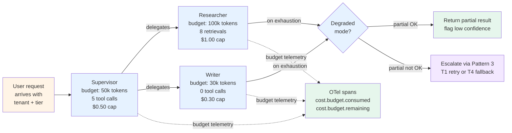

# Pattern 4 — Per-agent cost budgeting

> 🟢 Stable · ⏱ ~15 min · 📍 Read after [Lab 12 (plan-and-execute)](../../../labs/12-plan-and-execute-from-scratch/) and [Pattern 1 — Handoff contracts](./01-handoff-contracts.md)

## Intent

Multi-agent systems multiply LLM calls per request — a four-agent pipeline with five calls each costs 20× a single call, and a `LangChain` multi-agent loop once ran 11 days at $47,000 in API charges before anyone noticed (per Codebridge 2026). Aggregate system-level budgets — "stay under $X/day" — catch the bill after the damage. Per-agent budgets catch runaway behavior at the boundary it happens.

This pattern documents the decision rule: which budgets to set per agent role, what to do when an agent exhausts its budget, and what telemetry to attach so a budget overrun is a signal you can route, not a postmortem you're writing.

## When to use this pattern

- **Multi-agent topologies in production with cost-sensitive economics.** Agentic tools cost $200-$2,000+ per engineer per month in token spend per Fungies.io April 2026; multi-agent systems multiply that linearly with agent count. If you have a margin model, you have a budget problem.
- **Plan-and-execute or supervisor-worker with variable fan-out.** Lab 12's plan-and-execute fans out an unknown number of executors per plan; Lab 14's supervisor invokes workers in unbounded loops if the contract is sloppy. Both shapes need per-agent budgets to bound the cost of a single user request.
- **Multi-tenant SaaS shipping agentic features.** One customer burning 90% of your token budget is the documented multi-tenant failure mode per digitalapplied April 2026. Per-tenant aggregate budgets are necessary but not sufficient — the budget needs to decompose by agent role so you know *which* agent on a tenant's behalf went runaway.
- **When you're operating under a margin contract.** Outcome-based pricing (charge per resolved ticket, per generated report) makes a runaway agent into a direct margin loss; pass-through pricing protects the vendor but degrades the user experience when costs spike. Either model needs per-agent budgets to be operable.

## When NOT to use

- **Single-agent loops.** A single agent with one tool budget and one token budget doesn't need per-agent decomposition — there's only one agent. Budget at the request level instead.
- **Internal-only research deployments.** If your multi-agent system runs against a known budget allocation (a research team's compute grant), aggregate caps are fine. Per-agent decomposition pays for itself when economics are user-facing.
- **Before you have observability.** Per-agent budgets without per-agent traces produce alerts you can't act on. The cost-attribution work in [Path 06 Module 6](../../../concepts/evaluation/cost-attribution.md) is the upstream dependency. If baggage propagation isn't in place, the per-agent attribution is guessing.
- **Where the agent count is dynamic and unbounded.** A swarm topology spawning workers on demand doesn't have a stable "agent role" to budget against; budget per *task* or *user request* there, not per agent instance.

## The mechanism

Each agent role gets four budget dimensions and one exhaustion behavior. The five together turn cost from a postmortem topic into a routing signal:



### The four budget dimensions

| Dimension | What it bounds | Why per-agent |
|---|---|---|
| **Token budget** (input + output) | Total token consumption for one agent invocation | Researcher generates 100k retrieval tokens; writer generates 5k output tokens. Same global cap would over-allocate to writer or starve researcher |
| **Tool-call ceiling** | Max number of tool invocations per agent invocation | Researcher needs ~8 retrievals; writer needs 0; reviewer needs 1. Per-agent ceiling catches "researcher in retrieval loop" before the loop spends $50 |
| **Cost cap** (dollars or credits) | Tokens × per-model price + tool fees | Tokens are model-priced (GPT-5 input is $10/1M tokens vs Gemini 3 Flash $0.10/1M per niteagent May 2026 — a 100× price difference). Cost caps are model-aware where token budgets are not |
| **Wall-clock budget** | Max seconds the agent can run before timeout | A "stalled" agent looks the same as a runaway-but-cheap agent in token telemetry. Wall-clock catches the case where the agent is mid-tool-call indefinitely |

The four dimensions are independent; a runaway agent can hit any one of them. Token-based throttling alone misses the tool-call-loop case (one cheap tool call can fan out to expensive downstream calls); cost-based throttling alone misses the slow-tool case (a 5-minute hung HTTP call costs zero tokens). Set all four; the first one to trip is the actionable signal.

### Default budgets by role

Production deployments seed budgets from observed traces, not from intuition. A starter rule (calibrate against your own workload after the first week):

| Role | Token budget | Tool-call ceiling | Cost cap | Wall-clock |
|---|---|---|---|---|
| Supervisor / orchestrator | 50k | 5 | $0.50 | 30s |
| Researcher / retriever | 100k | 8 | $1.00 | 60s |
| Writer / synthesizer | 30k | 0 | $0.30 | 30s |
| Critic / verifier | 40k | 1 | $0.40 | 30s |
| Executor (per step) | 60k | 3 | $0.60 | 30s |

Calibrate by measuring the 90th percentile of each dimension across one week of natural traffic, then setting the budget at 1.5× that. Setting at the 50th percentile produces too many false positives; setting at the 99th percentile lets runaway agents through.

### Budget exhaustion behavior — three options

When an agent hits any of its four ceilings, the system has three choices. The choice depends on stake; pick one per agent role and document it.

- **Hard stop with partial-result return.** The agent terminates; whatever it has produced so far returns as `status: "partial"` via the [Pattern 1 handoff contract](./01-handoff-contracts.md). The orchestrator decides whether the partial is usable. Default for researcher/retriever roles where partial evidence beats no evidence.
- **Hard stop with [Pattern 3 escalation](./03-escalation-and-fallback.md).** The agent terminates; the boundary returns `status: "needs_escalation"` with `trigger: "budget_exhausted"`. The escalation policy decides T1 retry (with a tighter prompt), T4 safe fallback, or T3 HITL. Default for critic/verifier roles where partial verification is worse than no verification.
- **Budget extension on supervisor approval.** Rare. Only for high-value-task overrides where the supervisor explicitly approves a one-time extension (e.g., long-form research that ran 20% over budget but the partial is high-quality). Requires the supervisor to log the extension for audit; budget extensions are the path to the $47k loop bill if applied automatically.

The default-decision matrix per role:

| Role | Default exhaustion behavior | Rationale |
|---|---|---|
| Researcher / retriever | Hard stop, partial return | Partial evidence still informs the synthesis step |
| Writer / synthesizer | Hard stop, partial return + low-confidence flag | A truncated answer is degraded but still useful; flag the truncation |
| Critic / verifier | Hard stop, escalate to Pattern 3 | "Almost verified" is not a defensible state |
| Executor | Hard stop, escalate to Pattern 3 T1 retry once | Tools sometimes hang; retry the step before declaring failure |
| Supervisor / orchestrator | Hard stop, escalate to Pattern 3 T4 fallback | If the orchestrator runs out of budget, the entire request is over-budget; safe fallback only |

### Budget telemetry — the four required attributes

Every agent invocation emits four span attributes that map to OTel GenAI conventions and Path 06 cost attribution. These are the four that make per-agent budgets observable, not just enforceable:

```
agent.role                = "researcher" | "writer" | ...
agent.budget.tokens       = {consumed: int, remaining: int, ceiling: int}
agent.budget.tool_calls   = {consumed: int, remaining: int, ceiling: int}
agent.budget.cost_usd     = {consumed: float, remaining: float, ceiling: float}
agent.budget.outcome      = "completed" | "exhausted" | "extension_approved"
```

These attributes attach to the agent's parent span (the boundary span from [Pattern 1](./01-handoff-contracts.md)). When an agent role consistently exhausts its budget across many invocations, that's a calibration signal — bump the budget at the 90th percentile, not at the alert-pager. When an agent role rarely uses 30% of its budget, that's a margin-recovery signal — tighten the ceiling.

## Implementation sketch

Per-agent budget as a Pydantic model that travels in the handoff payload from Pattern 1:

```python
from typing import Literal
from pydantic import BaseModel, Field
from dataclasses import dataclass


class AgentBudget(BaseModel):
    """Per-agent budget assigned at handoff time and enforced at every step."""
    role: str
    tokens_ceiling: int = Field(..., ge=1)
    tool_calls_ceiling: int = Field(..., ge=0)
    cost_usd_ceiling: float = Field(..., ge=0.0)
    wall_clock_seconds_ceiling: float = Field(..., ge=1.0)

    tokens_consumed: int = 0
    tool_calls_consumed: int = 0
    cost_usd_consumed: float = 0.0
    wall_clock_seconds_consumed: float = 0.0

    def remaining_tokens(self) -> int:
        return max(0, self.tokens_ceiling - self.tokens_consumed)

    def remaining_tool_calls(self) -> int:
        return max(0, self.tool_calls_ceiling - self.tool_calls_consumed)

    def exhausted(self) -> tuple[bool, str | None]:
        """Returns (is_exhausted, which_dimension)."""
        if self.tokens_consumed >= self.tokens_ceiling:
            return True, "tokens"
        if self.tool_calls_consumed >= self.tool_calls_ceiling:
            return True, "tool_calls"
        if self.cost_usd_consumed >= self.cost_usd_ceiling:
            return True, "cost_usd"
        if self.wall_clock_seconds_consumed >= self.wall_clock_seconds_ceiling:
            return True, "wall_clock"
        return False, None


# Default seeds — calibrate against your own workload after week one.
DEFAULT_BUDGETS: dict[str, AgentBudget] = {
    "supervisor": AgentBudget(
        role="supervisor", tokens_ceiling=50_000,
        tool_calls_ceiling=5, cost_usd_ceiling=0.50,
        wall_clock_seconds_ceiling=30.0,
    ),
    "researcher": AgentBudget(
        role="researcher", tokens_ceiling=100_000,
        tool_calls_ceiling=8, cost_usd_ceiling=1.00,
        wall_clock_seconds_ceiling=60.0,
    ),
    "writer": AgentBudget(
        role="writer", tokens_ceiling=30_000,
        tool_calls_ceiling=0, cost_usd_ceiling=0.30,
        wall_clock_seconds_ceiling=30.0,
    ),
}


def check_budget_before_call(
    budget: AgentBudget,
    estimated_tokens: int,
    estimated_cost: float,
) -> tuple[bool, str | None]:
    """Pre-call check: would this call exhaust the budget? If yes, route to exhaustion handler."""
    if budget.tokens_consumed + estimated_tokens > budget.tokens_ceiling:
        return False, "would_exceed_tokens"
    if budget.cost_usd_consumed + estimated_cost > budget.cost_usd_ceiling:
        return False, "would_exceed_cost"
    if budget.tool_calls_consumed >= budget.tool_calls_ceiling:
        return False, "would_exceed_tool_calls"
    return True, None


def emit_budget_telemetry(budget: AgentBudget, outcome: str) -> dict:
    """Returns the four OTel-conventions-aligned span attributes."""
    return {
        "agent.role": budget.role,
        "agent.budget.tokens": {
            "consumed": budget.tokens_consumed,
            "remaining": budget.remaining_tokens(),
            "ceiling": budget.tokens_ceiling,
        },
        "agent.budget.tool_calls": {
            "consumed": budget.tool_calls_consumed,
            "remaining": budget.remaining_tool_calls(),
            "ceiling": budget.tool_calls_ceiling,
        },
        "agent.budget.cost_usd": {
            "consumed": round(budget.cost_usd_consumed, 4),
            "remaining": round(budget.cost_usd_ceiling - budget.cost_usd_consumed, 4),
            "ceiling": budget.cost_usd_ceiling,
        },
        "agent.budget.outcome": outcome,
    }
```

Three production conventions this sketch encodes:

- **Pre-call check, not post-call enforcement.** Checking the budget *before* the LLM call costs nothing; checking *after* the LLM call means you've already paid for the overage. The `check_budget_before_call` shape is the gate that prevents the $47k loop.
- **Budget travels in the handoff payload.** The `AgentBudget` model is part of the [Pattern 1 handoff contract](./01-handoff-contracts.md) — the supervisor allocates a budget to each delegated agent at handoff time, and the boundary function validates the delegated agent stayed within its share. This makes per-agent attribution structural, not retrofitted.
- **Outcome is enumerated, not derived.** `outcome` is one of `completed` / `exhausted` / `extension_approved` — three values that map cleanly to dashboards. Production deployments running this pattern aggregate by outcome to spot calibration drift: a researcher role with 40% `exhausted` rate needs either a budget bump or upstream prompt work.

## How this combines with Path 03 modules

| Path 03 module / lab | Where this pattern applies |
|---|---|
| Module 1 / Lab 10 (supervisor-worker) | The supervisor allocates budgets to each delegated worker at handoff. Worker budgets are typed and travel in the `HandoffRequest`; on exhaustion, workers return `status: "partial"` with the consumed-tokens telemetry attached |
| Module 3 / Lab 12 (plan-and-execute from scratch) | Each executor invocation gets its own budget. Plans with many steps need a per-step budget allocation strategy (equal distribution vs proportional-to-complexity); the planner should annotate steps with estimated cost |
| Module 4 / Lab 13 (multi-agent RAG) | The researcher's tool-call ceiling is the most-exercised dimension here. RAG retrieval loops are the canonical case where tool-call ceilings catch runaways that token budgets miss (each retrieval is cheap; ten of them in a loop is not) |
| Module 5 / Lab 14 (LangGraph supervisor bridge) | LangGraph's `StateGraph` carries the `AgentBudget` as a shared-state field per [Pattern 2](./02-shared-state-boundaries.md). Each agent node reads its budget, decrements consumption, writes back |
| Module 5 / Lab 15 (plan-and-execute bridge) | The `Send` fan-out primitive multiplies budget enforcement complexity — each `Send`-dispatched executor needs its own budget envelope. Per-step budget allocation happens at `Send` time |
| Module 6 / Lab 16 (multi-agent evaluation) | Budget telemetry is a trajectory-level metric. Lab 16's harness can compute `budget_exhaustion_rate` per role across the trace set; calibration drift shows up as a slow trend in this metric |

This pattern composes with [Pattern 3 — Escalation and fallback](./03-escalation-and-fallback.md) directly: budget exhaustion is a fifth trigger in Pattern 3's four-trigger model. The escalation tier depends on the role (researcher → T0 partial; critic → T2 or T3). Pattern 3's `EscalationDecision` schema accepts `trigger: "budget_exhausted"` as a first-class value.

This pattern also composes with [Path 06 Module 6 cost attribution](../../../concepts/evaluation/cost-attribution.md): per-agent budget telemetry is the data Module 6's baggage propagation collects. The pattern provides the *enforcement* layer; Module 6 provides the *measurement* layer; together they close the cost loop.

## Tradeoffs and what this misses

**Tradeoffs**:

- **Calibration overhead is real.** Setting four budgets across five roles is 20 parameters per topology. The first iteration uses defaults; the second uses 90th-percentile-from-traces; the third uses cost-of-error-weighted percentiles. Each step is work. Teams that skip calibration end up with either alert fatigue (too-tight budgets) or expensive false negatives (too-loose budgets).
- **Per-agent budgets can starve correctly-running agents.** A researcher that genuinely needs 12 retrievals on a complex question hits the 8-retrieval ceiling and returns partial evidence. The user gets a worse answer than they would without the ceiling. The fix is dynamic budgets (more on complex queries), but dynamic budgets need a complexity estimator — which is itself an LLM call.
- **Multi-tenant fairness vs per-tenant utility.** A per-tenant budget is the highest-leverage single control per digitalapplied April 2026. But a per-tenant cap that's the same for all tenants under-serves heavy-use tenants. Tiered budgets (Free / Pro / Team / Enterprise) per the digitalapplied four-tier framework are the standard answer; adding tiers adds complexity.
- **The budget-exhaustion fallback isn't free.** Hard-stop with partial return is cheap but degrades the experience. Escalation to Pattern 3 is the right behavior but adds latency. The cheapest exhaustion behavior is "don't exhaust" — i.e., set budgets that almost never hit. The most defensible is "exhaust loudly with HITL." Pick per role.

**What this misses**:

- **Adaptive budget reallocation across agents in a single request.** If the supervisor's budget is unused but the researcher hits its ceiling, why not transfer? This is technically possible but operationally complex — it requires real-time budget arbitration that turns the supervisor into a budget broker on top of an orchestration broker. Most teams don't need this.
- **Cost-shaped retries.** Pattern 5 (retry policies) treats retry as a separate decision; this pattern treats budget as a hard ceiling. A more sophisticated system would price retries against remaining budget and skip retries when the budget is tight. That's an interaction this pattern doesn't model explicitly.
- **Budget-driven model selection.** GPT-5 vs Gemini 3 Flash is a 100× price difference per niteagent May 2026. A budget-aware system would route to the cheap model when budget is tight and the task is simple. That's a model-routing layer that lives above this pattern; this pattern budgets against whatever model the agent picked.
- **Predictive vs reactive enforcement.** This pattern enforces at the point of consumption. A predictive system would forecast budget exhaustion mid-trajectory and adjust upstream (give the researcher a tighter ceiling because the supervisor already over-spent). Predictive enforcement requires a budget-state model; this pattern's reactive enforcement is simpler and catches the common case.

## References

**Production literature (verified mid-2026)**:

- digitalapplied (April 2026), *LLM Agent Cost Attribution: Complete Production 2026 Guide* — [digitalapplied.com/blog](https://www.digitalapplied.com/blog/llm-agent-cost-attribution-guide-production-2026) — "kill switches before dashboards" framing; per-tenant daily cap as the single highest-leverage control; the four token layers (input, output, cached, reasoning); the three attribution dimensions
- digitalapplied (May 2026), *Agent Token Budget Calculator: Cost-Control Framework 2026* — [digitalapplied.com/blog](https://www.digitalapplied.com/blog/agent-token-budget-calculator-cost-control-framework-2026) — four-tier token-budget framework (Free / Pro / Team / Enterprise); soft-cap and three overage patterns; "skip the multiplier and you under-size paid tiers"
- niteagent (May 2026), *AI Agent Cost Optimization in 2026: How to Cut Token Spend by 60%* — [niteagent.com/blog](https://niteagent.com/blog/ai-agent-cost-optimization-2026/) — three structural cost problems (context bloat, one-model-fits-all, invisible orchestration loops); the $47k 11-day infinite-loop case; GPT-5 vs Gemini 3 Flash 100× price difference
- niteagent (May 2026), *Multi-Agent in Production 2026: 3 Patterns That Survived* — [niteagent.com/blog](https://niteagent.com/blog/multi-agent-production-2026/) — the $75,000/day bill from runaway agent loops; "architecture decisions aren't theoretical — they're budget decisions"; orchestration patterns that work at 100 req/min and fail at 10,000
- Fungies.io (April 2026), *AI Agent Orchestration for Developers* — [fungies.io](https://fungies.io/ai-agent-orchestration-developers-guide-2026/) — agentic tools cost $200-$2,000+ per engineer per month; multi-agent systems multiply this linearly; 2.5-3.5× ROI average with proper cost controls
- Kunal Ganglani (May 2026), *Multi-Agent AI in Production: 4-Week Pilot Guide* — [kunalganglani.com/blog](https://www.kunalganglani.com/blog/multi-agent-ai-systems-production) — "Token budgets per agent. Set a maximum token budget for each agent. If an agent exceeds its budget, terminate it and use the partial result"; agent control planes maturation in 2026

**Path 03 internals**:

- [Pattern 1 — Handoff contracts](./01-handoff-contracts.md) — the budget travels in the `HandoffRequest` payload
- [Pattern 2 — Shared-state boundaries](./02-shared-state-boundaries.md) — budget state lives in the shared `StateGraph` for LangGraph implementations
- [Pattern 3 — Escalation and fallback](./03-escalation-and-fallback.md) — budget exhaustion becomes a fifth trigger in Pattern 3's escalation model
- [Lab 10](../../../labs/10-supervisor-worker-from-scratch/), [Lab 12](../../../labs/12-plan-and-execute-from-scratch/), [Lab 13](../../../labs/13-multi-agent-rag-from-scratch/), [Lab 14](../../../labs/14-langgraph-supervisor-bridge/), [Lab 15](../../../labs/15-langgraph-plan-execute-bridge/) — the topologies this pattern applies to

**Path 06 cross-path references**:

- [`concepts/evaluation/cost-attribution.md`](../../../concepts/evaluation/cost-attribution.md) — the cost-attribution baggage propagation this pattern's telemetry plugs into
- [`concepts/evaluation/adaptive-sampling.md`](../../../concepts/evaluation/adaptive-sampling.md) — adaptive sampling policies that read budget telemetry to skip sampling when budget is tight
- [Path 06 Pattern 1 — Cost-aware retrieval](../../06-evaluation-observability/patterns/01-cost-aware-retrieval.md) — the retrieval-side complement; this pattern budgets per agent, Path 06 Pattern 1 budgets per retrieval decision
