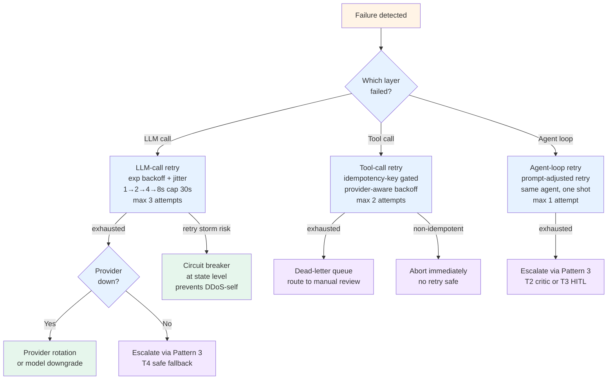

# Pattern 5 — Retry policies

> 🟢 Stable · ⏱ ~15 min · 📍 Read after [Pattern 3 (Escalation and fallback)](./03-escalation-and-fallback.md) and [Lab 12 (plan-and-execute)](../../../labs/12-plan-and-execute-from-scratch/)

## Intent

Multi-agent systems fail at three layers — the LLM call, the tool call, the agent loop — and each layer needs a different retry decision. A retried-everything system is a DDoS engine pointed at your own infrastructure (per LifeTidesHub's 2026 retry-storm post-mortem); a never-retry system fails brittle on transient errors that would have resolved in a second. The production answer is **layered**: bounded exponential backoff with jitter for transient failures, circuit breakers for systemic failures, fallbacks for persistent provider issues, and explicit escalation (Pattern 3) for everything else.

This pattern documents the decision rule: which failures get retried, with what shape, at which layer, and when retry stops being the right answer.

## When to use this pattern

- **You operate tools or LLM calls that can fail transiently.** LLM API calls fail 1-5% of the time on rate limits, timeouts, and 5xx errors per Fastio February 2026. Multi-agent topologies multiply this — a 1% per-call failure rate becomes a ~6% per-trajectory failure rate across six agents. Retry is the floor.
- **You operate side-effect-producing tools.** Tool calls that mutate external state (Stripe charge, Salesforce update, Slack message) need idempotency keys, not just retry budgets. Blind retry of side-effectful tools is the path to duplicate charges per Composio December 2025.
- **You use plan-and-execute or generator-critic topologies.** Lab 12's executor pattern is exactly where tool-call retries live; Lab 11's critic-disagreement pattern needs to know whether to retry-with-adjusted-prompt or escalate. Both need explicit retry policy.
- **You operate against multiple LLM providers.** Provider-rotation as a fallback strategy requires understanding which failure shapes warrant a provider hop vs a same-provider retry. The five named 2026 LLM fallback strategies (provider-rotation, model-downgrade, retry-then-fallback, cache-on-failure, manual-handoff per FutureAGI May 2026) all start with retry policy.

## When NOT to use

- **For non-idempotent operations without idempotency keys.** A Stripe charge without an idempotency key cannot be retried safely. If your tool layer lacks idempotency support, build that first (per [Pattern 1](./01-handoff-contracts.md) — the contract is the right place to require idempotency keys). Retry policy without idempotency creates new failure modes.
- **As a substitute for fixing genuine bugs.** Retries hide intermittent bugs as "flakes." If a specific tool is failing on a specific input shape and a retry happens to succeed, you have a bug you're not addressing. Audit retry rates per-tool; trends are bug-detection signals.
- **For systemic provider outages.** When the LLM provider is genuinely down, retries stack requests and pay for every failed attempt. Three retries is the documented reasonable max per buildmvpfast March 2026; after that, switch to a different provider or a different model, not the same dead endpoint.
- **When the failure is a budget exhaustion (Pattern 4).** Budget-exhausted agents should escalate via Pattern 3, not retry. A retry against an exhausted budget either silently overruns the budget or returns the same exhaustion immediately. Either is worse than escalation.

## The mechanism

Three retry layers, three retry shapes:



### Retryable vs non-retryable failures

The first decision is binary, and it's where teams get retry wrong most often:

| Failure shape | Retryable? | Why |
|---|---|---|
| Rate limit (429) | ✅ Yes | Transient by definition; provider-aware backoff respects the `Retry-After` header |
| Timeout | ✅ Yes (with idempotency check) | Often transient; but a hung side-effectful tool may have already executed — idempotency key required |
| 5xx server error | ✅ Yes | Provider-side transient; bounded retry with exp backoff |
| Network error / connection refused | ✅ Yes | Often DNS or transient routing; bounded retry; circuit-break after consistent failures |
| 4xx client error (400, 401, 403, 404) | ❌ No | The request shape is wrong; retrying the same request produces the same error |
| Schema validation failure (Pydantic) | ❌ No | The output doesn't match the contract; retry the *agent* with adjusted prompt, not the *call* |
| Context-window overflow | ❌ Same call no, prompt-adjusted yes | The same prompt won't fit; truncate or summarize, then retry |
| Policy violation / content filter | ❌ No | Retry will produce the same filter; escalate via Pattern 3 T4 |
| Budget exhausted (Pattern 4) | ❌ No | Escalate via Pattern 3; retry against an exhausted budget is a no-op |

The decision rule: **retry only if the next attempt has a reason to succeed**. Same-input-same-output failures (4xx, schema, policy) need a different attempt (prompt adjustment, escalation), not a repeat.

### The three retry shapes

**LLM-call retry** — exponential backoff with jitter, three attempts max:
- Wait shape: 1s → 2s → 4s → 8s, cap at 30s, jitter ±25% to avoid retry storms (per buildmvpfast March 2026)
- Decorate at the LLM-client layer using `tenacity` / `backoff` libraries
- After three attempts, fall back: provider rotation, model downgrade, or escalate via Pattern 3 T4
- The five 2026-canonical fallback strategies per FutureAGI May 2026 — provider-rotation, model-downgrade, retry-then-fallback, cache-on-failure, manual-handoff — all live downstream of this layer

**Tool-call retry** — idempotency-gated, provider-aware, two attempts max:
- Idempotency key required for side-effectful tools (the `tool_call_hash` pattern per Composio December 2025)
- Backoff respects provider's `Retry-After` header for 429s
- After exhaustion, route to a dead-letter queue (DLQ) for manual review rather than blind escalation
- Non-idempotent tools without keys: zero retries — abort immediately and escalate via Pattern 3
- Per-tool retry policies (per-tool `max_retries`, `timeout`, `fallback`) per the FutureAGI Agent Command Center pattern

**Agent-loop retry** — prompt-adjusted, one attempt max:
- This is Pattern 3's T1 tier explicitly
- The retry is *not* the same call — it's the same agent with a different prompt ("you returned X but the contract requires Y; produce Y")
- Two retries with no progress is a loop signal, not a recovery — hard cap at one
- Beyond T1, escalation flows through Pattern 3's ladder (T2 critic → T3 HITL → T4 fallback)

### The circuit-breaker layer (state-level, not per-node)

LangGraph's default `with_retry` decorator applies exponential backoff per-node — but it doesn't cascade a "service is dead" signal across the graph (per LifeTidesHub 2026). The supervisor keeps routing to a broken worker because the state doesn't track systemic failure. The fix is a **state-level circuit breaker**:

```
state.circuit_breakers = {
    "stripe_api": {"status": "closed", "consecutive_failures": 0, "last_failure_ts": None},
    "openai_api": {"status": "closed", "consecutive_failures": 0, "last_failure_ts": None},
    ...
}
```

Per service, three states:
- **`closed`** — normal operation, calls flow
- **`open`** — N consecutive failures triggered the breaker; calls fail-fast for cooldown_seconds (typically 60s)
- **`half-open`** — cooldown elapsed; next single call probes the service; success → closed; failure → open again

The supervisor reads the breaker state before delegating; agents read the breaker state before tool calls. This is what prevents the documented "LLM happily retries 1,000 times" failure mode per LifeTidesHub 2026.

### Prompt-adjustment vs same-call retry — the explicit distinction

When the LLM returns malformed output (JSON parse error, schema validation failure, missing required field), two retry shapes are possible:

- **Same-call retry** — re-send the same prompt, hope for a different output. Useful only for genuine non-determinism (temperature > 0); even then, two consecutive same-prompt retries are usually a waste of two calls' worth of cost
- **Prompt-adjusted retry** — modify the prompt to add the error context ("your previous response failed validation with: {error}. Produce a corrected response.") and re-call. This is what Pattern 3's T1 tier does

The decision rule: prompt-adjusted retry is the right default for output-format failures; same-call retry is the right default for transport failures. Don't mix them — same-call-retry on a schema failure is wasted spend; prompt-adjusted retry on a 429 doesn't address the rate limit.

### When to escalate instead of retry

Five canonical signals that retry is the wrong answer:

1. **Failure shape is non-retryable.** 4xx client error, schema failure, policy violation, budget exhaustion. Escalate via Pattern 3.
2. **Retry budget exhausted.** Three LLM-call retries, two tool-call retries, one agent-loop retry — when these are spent, escalate.
3. **Circuit breaker is open.** The service is systemically failing; retries against it are theatre. Skip to fallback.
4. **Retry rate exceeds threshold.** Per-tool or per-agent retry rates above ~10% over a rolling window are a calibration signal, not a retry signal. Pause retries and route to manual review.
5. **The retry would cost more than the failure.** A $5 retry on a $0.50 task is a margin loss; route to the cheaper fallback instead.

## Implementation sketch

A Pydantic-typed retry policy that travels in the [Pattern 1 handoff contract](./01-handoff-contracts.md) and is enforced at the boundary:

```python
import random
import time
from typing import Callable, Literal, Optional
from pydantic import BaseModel, Field


class RetryPolicy(BaseModel):
    """Per-layer retry policy. Travels in the handoff contract."""
    layer: Literal["llm_call", "tool_call", "agent_loop"]
    max_attempts: int = Field(..., ge=0, le=5)
    base_delay_seconds: float = Field(default=1.0, ge=0.0)
    max_delay_seconds: float = Field(default=30.0, ge=0.0)
    jitter_ratio: float = Field(default=0.25, ge=0.0, le=1.0)
    requires_idempotency_key: bool = False


class RetryDecision(BaseModel):
    should_retry: bool
    delay_seconds: float = 0.0
    reason: str
    attempt_number: int


# The retryable failure-shape taxonomy
RETRYABLE_SHAPES = {"rate_limit_429", "timeout", "server_5xx", "network_error"}
NON_RETRYABLE_SHAPES = {
    "client_4xx", "schema_validation", "policy_violation",
    "context_overflow_same_prompt", "budget_exhausted",
}


def decide_retry(
    failure_shape: str,
    attempt_number: int,
    policy: RetryPolicy,
    circuit_breaker_open: bool,
    has_idempotency_key: bool,
) -> RetryDecision:
    """Return the retry decision for a single failure."""
    # Hard stop on non-retryable shapes
    if failure_shape in NON_RETRYABLE_SHAPES:
        return RetryDecision(
            should_retry=False, reason=f"non-retryable: {failure_shape}",
            attempt_number=attempt_number,
        )

    # Hard stop if circuit breaker is open
    if circuit_breaker_open:
        return RetryDecision(
            should_retry=False, reason="circuit_breaker_open; fall back instead",
            attempt_number=attempt_number,
        )

    # Hard stop on non-idempotent side-effect tool without key
    if policy.requires_idempotency_key and not has_idempotency_key:
        return RetryDecision(
            should_retry=False, reason="non_idempotent_tool_lacks_key",
            attempt_number=attempt_number,
        )

    # Hard stop on budget exhaustion
    if attempt_number >= policy.max_attempts:
        return RetryDecision(
            should_retry=False, reason="retry_budget_exhausted",
            attempt_number=attempt_number,
        )

    # Exponential backoff with jitter
    raw_delay = min(
        policy.base_delay_seconds * (2 ** attempt_number),
        policy.max_delay_seconds,
    )
    jitter = raw_delay * policy.jitter_ratio * (2 * random.random() - 1)
    delay = max(0.0, raw_delay + jitter)

    return RetryDecision(
        should_retry=True, delay_seconds=delay,
        reason=f"retryable_{failure_shape}_attempt_{attempt_number + 1}",
        attempt_number=attempt_number + 1,
    )


# Default policies per layer — calibrate against observed failure rates after week one
DEFAULT_POLICIES: dict[str, RetryPolicy] = {
    "llm_call": RetryPolicy(
        layer="llm_call", max_attempts=3,
        base_delay_seconds=1.0, max_delay_seconds=30.0, jitter_ratio=0.25,
    ),
    "tool_call_idempotent": RetryPolicy(
        layer="tool_call", max_attempts=2,
        base_delay_seconds=1.0, max_delay_seconds=10.0, jitter_ratio=0.25,
        requires_idempotency_key=True,
    ),
    "tool_call_non_idempotent": RetryPolicy(
        layer="tool_call", max_attempts=0,  # zero retries without idempotency
        base_delay_seconds=0.0, max_delay_seconds=0.0,
        requires_idempotency_key=True,
    ),
    "agent_loop": RetryPolicy(
        layer="agent_loop", max_attempts=1,  # one prompt-adjusted retry
        base_delay_seconds=0.0, max_delay_seconds=0.0,
    ),
}
```

Three production conventions this sketch encodes:

- **Failure shape, not exception class, is the routing key.** Library exceptions are an implementation detail; failure shapes (`rate_limit_429`, `schema_validation`, `policy_violation`) are the operational vocabulary. Map exceptions to shapes once at the boundary; route on shapes everywhere downstream. This is what makes the policy portable across SDKs.
- **Jitter is non-optional.** The `jitter_ratio` parameter is present in the default policy because retry storms without jitter are the documented LangGraph 2026 failure mode (per LifeTidesHub). Production deployments that omit jitter create synchronized retry waves that take down the upstream service the agents depend on.
- **Idempotency is a contract requirement, not a hope.** `requires_idempotency_key=True` on side-effectful tool policies makes the absence of an idempotency key a *hard stop*, not a warning. This is what prevents the duplicate-charge failure mode per Composio December 2025.

For LangGraph deployments, the retry policy attaches to graph nodes as `with_retry({"retry_on": (RateLimitError, TimeoutError), "max_attempts": 3, "backoff_factor": 2.0})` — but the state-level circuit breaker must live separately, as a field in the `StateGraph` per [Pattern 2](./02-shared-state-boundaries.md). The default `with_retry` decorator does not cascade across nodes; the circuit breaker does.

## How this combines with Path 03 modules

| Path 03 module / lab | Where this pattern applies |
|---|---|
| Module 1 / Lab 10 (supervisor-worker) | The supervisor wraps each worker invocation in agent-loop retry policy (one prompt-adjusted retry on contract violation). Worker tool calls use tool-call retry policy. The supervisor itself is wrapped in LLM-call retry at the model-client layer |
| Module 2 / Lab 11 (generator-critic) | The critic-disagreement signal can route to agent-loop retry (adjust the generator's prompt with the critic's specific objection) before escalating to T2 per Pattern 3. This is where the prompt-adjustment-vs-same-call distinction matters most |
| Module 3 / Lab 12 (plan-and-execute from scratch) | The executor's tool calls use tool-call retry; planner's LLM calls use LLM-call retry; the "step failed, re-plan" decision is agent-loop retry at the planner. The state-level circuit breaker prevents the supervisor from re-dispatching to a broken executor |
| Module 4 / Lab 13 (multi-agent RAG) | The retriever's retrieval calls use tool-call retry; the synthesizer's LLM calls use LLM-call retry. Retrieval failures (zero relevant chunks) are Pattern 3 T0 territory, not retry territory — the prompt-adjustment retry won't help if the corpus genuinely lacks the evidence |
| Module 5 / Lab 14 (LangGraph supervisor bridge) | `with_retry` decorator on individual nodes implements the per-node retry; the state-level circuit breaker (Pattern 2 shared state) implements the cross-node coordination. Without both, you get the "LLM happily retries 1,000 times" failure mode |
| Module 5 / Lab 15 (plan-and-execute bridge) | `Send` fan-out + per-executor retry means the maximum amplification of a transient upstream failure is `(num_executors × max_retries)`. Bounded retries are essential at the fan-out boundary; otherwise a 429 against the LLM provider becomes a 429-storm |
| Module 6 / Lab 16 (multi-agent evaluation) | Retry rate is a first-class trajectory-level metric. Sustained retry rates above ~10% per role are calibration signals; Lab 16's harness can compute these from the trace set |

This pattern composes directly with [Pattern 3 — Escalation and fallback](./03-escalation-and-fallback.md): retry is what runs *before* escalation. Pattern 3's T1 tier is "retry with adjusted prompt"; this pattern is the policy that defines *which* failures get T1, *how many* T1s, and *when* T1 stops being the right answer. Retry exhaustion is the upstream trigger for Pattern 3's T2 / T3 / T4 tiers.

This pattern composes with [Pattern 4 — Per-agent cost budgeting](./04-per-agent-cost-budgeting.md): retries consume budget. A retry-aware budget enforcement either (a) reserves headroom for retries at budget allocation time, or (b) skips retries when budget is tight. The interaction is not free — production deployments measure `cost_per_successful_request` (including retry cost) rather than just `cost_per_call`.

## Tradeoffs and what this misses

**Tradeoffs**:

- **Bounded retries leave some genuine transients unrecovered.** A 1% per-call failure rate with 3 retries gives ~99.9999% effective success — but the 0.0001% genuinely-failed requests are real users seeing real failures. The cost-of-perfect-recovery is unbounded; bounded retries pick a defensible point on the curve.
- **Jitter adds latency in the success case.** The `jitter_ratio` adds 0-25% to backoff delay; a tightly-tuned latency budget pays for this even when no retry storm is forming. The alternative — no jitter — is worse at any scale beyond a single client.
- **Per-tool / per-agent retry policy is configuration overhead.** Three layers × multiple tools × multiple agent roles = many policies to maintain. Production deployments either (a) collapse to ~3 named policy families (idempotent, non-idempotent, llm-call) or (b) accept per-tool tuning as ongoing operational cost. Most teams underinvest in policy hygiene; alert fatigue follows.
- **Circuit breakers introduce a new failure mode.** A breaker that's incorrectly tuned can open on a transient blip and stay open through the cooldown, returning fail-fast errors to users during what's actually a healthy upstream. Cooldown duration is a tuning parameter; too-short cooldowns create flapping; too-long cooldowns mask recovery.

**What this misses**:

- **Adaptive retry budget by request priority.** A premium-tier request deserves more retries than a free-tier one. This pattern treats retry budget as uniform; production deployments often tier it. The implementation is straightforward (parameterize `max_attempts` by tenant tier per [Pattern 4](./04-per-agent-cost-budgeting.md)); the operational complexity isn't.
- **Retry-cost-aware fallback selection.** When the primary fails, picking the fallback should consider both quality and cost. This pattern routes to "the fallback" generically; production systems often have multiple fallbacks at different price points (a downgraded model, a cached response, a manual queue). The FutureAGI May 2026 five-strategy framework names these but doesn't prescribe the routing algorithm.
- **Cross-trajectory retry intelligence.** If five trajectories in the past minute all failed on the same tool call with the same input shape, the sixth shouldn't retry — it's clearly a systemic issue. This requires a higher-order observability layer (Path 06 territory) that aggregates retry signals across trajectories. This pattern is single-trajectory.
- **Graceful degradation modes beyond retry.** Some systems define multiple service tiers (full, degraded, minimum-viable) and route to a less-capable but more-reliable path on persistent failure. That's a topology decision, not a retry decision; this pattern intentionally stops at "escalate via Pattern 3."

## References

**Production literature (verified mid-2026)**:

- Fastio (February 2026), *AI Agent Retry Patterns - Exponential Backoff Guide 2026* — [fast.io/resources](https://fast.io/resources/ai-agent-retry-patterns/) — LLM API calls fail 1-5% of the time; the layered approach (exp backoff + circuit breakers + fallback models + human escalation); jitter to prevent retry storms; persistent state for resume-from-crash
- Composio (December 2025), *Outgrowing Zapier, Make, and n8n for AI Agents: The Production Migration Blueprint* — [composio.dev/content](https://composio.dev/content/outgrowing-make-zapier-n8n-ai-agents) — blind LLM retry on side-effect tools increases duplicate-transaction risk; safe retries require idempotency keys, bounded retries, provider-aware backoff, timeouts, DLQ routing; Transaction Outbox pattern with `(user_id, tool_call_hash)` tracking
- FutureAGI (May 2026), *What Is a Tool Timeout? Definition & FutureAGI Guide* — [futureagi.com/glossary](https://futureagi.com/glossary/tool-timeout/) — Agent Command Center per-tool retry and fallback policies; `tool.duration_ms` + `tool.status` first-class trace attributes; `fallback: "abort_with_summary"` pattern for unrecoverable tools
- FutureAGI (May 2026), *What Is an LLM Fallback Strategy? A 2026 Field Guide* — [futureagi.com/blog](https://futureagi.com/blog/what-is-llm-fallback-strategy-2026/) — the five named 2026 LLM fallback strategies (provider-rotation, model-downgrade, retry-then-fallback, cache-on-failure, manual-handoff); idempotency keys to prevent double-billing; OTel GenAI span attributes marking fallback hops
- LifeTidesHub (May 2026), *Retry Storms in Multi-Agent LangGraph Systems: Circuit Breaker Fix (2026)* — [lifetideshub.com](https://www.lifetideshub.com/retry-storms-multi-agent-systems/) — "a multi-agent system without a circuit breaker is a DDoS engine pointed at your own infrastructure"; LangGraph default `with_retry` doesn't cascade across nodes; state-level breakers required
- buildmvpfast (March 2026), *LLM Error Handling and Fallback Strategies for Production* — [buildmvpfast.com](https://www.buildmvpfast.com/blog/building-with-unreliable-ai-error-handling-fallback-strategies-2026) — exponential backoff with jitter (1s → 2s → 4s → 8s, cap 30s); three retries reasonable max; Portkey framing: "retries for transient glitches, fallbacks for persistent failures, circuit breakers for systemic degradation"

**Path 03 internals**:

- [Pattern 1 — Handoff contracts](./01-handoff-contracts.md) — retry policy travels in the `HandoffRequest`; idempotency-key requirement is a contract field
- [Pattern 2 — Shared-state boundaries](./02-shared-state-boundaries.md) — state-level circuit breaker lives in the shared `StateGraph`, not per-node
- [Pattern 3 — Escalation and fallback](./03-escalation-and-fallback.md) — retry exhaustion is the upstream trigger for Pattern 3's T2 / T3 / T4 tiers; retry is what runs *before* escalation
- [Pattern 4 — Per-agent cost budgeting](./04-per-agent-cost-budgeting.md) — retries consume budget; budget-tight requests should skip retries
- [Lab 10](../../../labs/10-supervisor-worker-from-scratch/), [Lab 11](../../../labs/11-generator-critic-from-scratch/), [Lab 12](../../../labs/12-plan-and-execute-from-scratch/), [Lab 13](../../../labs/13-multi-agent-rag-from-scratch/), [Lab 14](../../../labs/14-langgraph-supervisor-bridge/), [Lab 15](../../../labs/15-langgraph-plan-execute-bridge/) — the topologies this pattern applies to

**Library / framework references**:

- LangGraph `with_retry` decorator — per-node exponential backoff; cascading circuit-breaker behavior must be added at state level
- Python `tenacity` / `backoff` libraries — the standard decorators for exponential backoff with jitter
- OpenTelemetry GenAI semantic conventions — `gen_ai.response.error_code`, `gen_ai.usage.attempt_number` span attributes for retry observability
