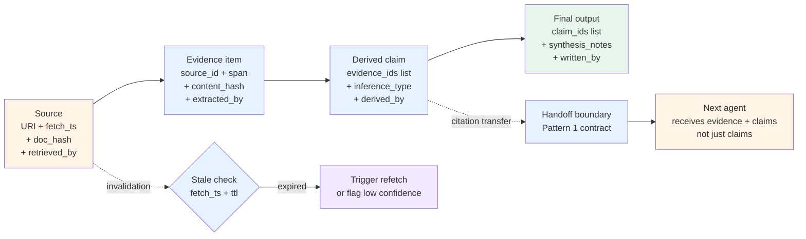

# Pattern 6 — Cross-agent provenance

> 🟢 Stable · ⏱ ~15 min · 📍 Read after [Lab 13 (multi-agent RAG)](../../../labs/13-multi-agent-rag-from-scratch/) and [Pattern 1 — Handoff contracts](./01-handoff-contracts.md)

## Intent

Multi-agent RAG amplifies a single-agent failure mode: a claim that loses its citation between handoffs becomes indistinguishable from a hallucination at the synthesis step. The retriever finds evidence; the reasoner draws an inference; the writer phrases the inference as prose; somewhere along that chain the link back to the source breaks. The 2026 production literature is converging on a structural fix — **provenance travels as a first-class field through every handoff, every claim carries a source ID, and citation transfer is a contract requirement rather than emergent behavior** (per SQuAI's "in-line citations and supporting sentences" arxiv:2510.15682; per MASS-RAG's "role-specialized agents for summarization, extraction, reasoning, synthesis" arxiv:2604.18509).

This pattern documents the decision rule: what carries a source ID, who owns each piece of evidence, how derived claims preserve lineage back to retrieved evidence, and what the audit trail looks like when a regulator or a debugging session asks "where did this claim come from?".

## When to use this pattern

- **Multi-agent RAG topologies** (Lab 13). Multiple agents read and synthesize over a shared evidence pool. Without provenance discipline, the synthesizer's claims drift from the retriever's evidence.
- **High-stakes domains with audit requirements.** Healthcare, financial advice, legal research, scientific QA — domains where a claim's source matters as much as the claim itself. SQuAI's scientific-QA benchmark (1,000 question-answer-evidence triplets per arxiv:2510.15682) is the canonical case.
- **Generator-critic topologies where the critic verifies factual claims.** Lab 11's critic can only verify factual claims against evidence if the claims arrive with their source IDs attached. A critic checking citation-free claims is doing pattern-matching, not verification.
- **Plan-and-execute with research steps.** Lab 12's executor sometimes runs research steps that produce evidence used downstream. The plan's lineage from "step result" to "final claim" needs explicit provenance threading.
- **Systems that operate over long-running tasks where evidence freshness matters.** A claim cited from a 6-month-old retrieval may be stale; without provenance metadata (timestamp, source URI, retrieval context), staleness is undetectable.

## When NOT to use

- **Single-agent loops with direct retrieval-synthesis coupling.** A single agent that retrieves and synthesizes in one prompt doesn't have a handoff boundary where citations can drop. Lab 03's research-agent pattern is the example. Provenance discipline still matters for the final output, but the cross-agent threading is absent.
- **Conversational chat without factual-claim grounding.** Open-domain chat where the bot's role is conversational rather than evidential doesn't need cited provenance. Adding it adds friction without value.
- **Where the corpus is small and stable.** A 20-document knowledge base with weekly updates doesn't benefit much from per-claim provenance — the source set is small enough that "the answer came from somewhere in the docs" is verifiable manually.
- **Before retrieval quality is good.** Provenance discipline on top of bad retrieval produces well-cited wrong answers. The faithfulness improvement reported by SQuAI (+0.088 / 12% over a strong RAG baseline per arxiv:2510.15682) assumes the upstream retrieval is competent.

## The mechanism

Provenance is a graph over four entity types — sources, evidence items, derived claims, and final outputs. Each entity carries enough metadata to trace its lineage backward:



### The four entity types

| Entity | What it represents | Required provenance fields |
|---|---|---|
| **Source** | A retrievable document (URL, paper, internal doc, database row) | `source_uri`, `fetched_at`, `doc_hash`, `retrieved_by` (which agent), `ttl_seconds` |
| **Evidence item** | A specific span extracted from a source (passage, table row, citation) | `evidence_id`, `source_id` (FK to source), `span` or `passage_text`, `content_hash`, `extracted_by` (which agent) |
| **Derived claim** | A statement an agent produced by reasoning over one or more evidence items | `claim_id`, `evidence_ids` (list of FKs), `inference_type` (`direct_quote`, `paraphrase`, `summarized`, `inferred`, `synthesized`), `derived_by` (which agent), `derived_at` |
| **Final output** | The user-facing answer or artifact | `output_id`, `claim_ids` (list of FKs), `synthesis_notes`, `written_by`, `confidence` |

Each level has a foreign key back to the previous level. A claim that lacks `evidence_ids` is not a citation-laundering failure to be detected later — it's a contract violation at the handoff that produced it (per [Pattern 1 — Handoff contracts](./01-handoff-contracts.md)'s provenance invariant). The schema makes that invariant enforceable.

### Evidence ownership

Each evidence item has exactly one extracting agent (`extracted_by`), but multiple consuming agents. The ownership rule:

- **Append-only.** Evidence items, once extracted, never get rewritten by downstream agents. A reasoner that wants to "correct" an evidence item produces a new item that references the old one as `corrected_from`, with an explicit inference_type.
- **Provenance is owned by the extracting agent.** If the retriever extracted it, the retriever's identity and timestamp are recorded; downstream agents add *their own* derivations but don't alter the source attribution.
- **The shared-state convention from [Pattern 2](./02-shared-state-boundaries.md) applies.** Evidence lives in the shared `evidence` field with `operator.add` reducer semantics; agents append; the orchestrator coordinates.

### Derived claims and inference types

The `inference_type` field is what distinguishes legitimate paraphrase from drift. The five canonical types per the SQuAI / MASS-RAG 2026 conventions:

| Type | Definition | When to use |
|---|---|---|
| `direct_quote` | Verbatim text from the evidence span | Quoting numerical results, exact wording of policy text, definitions |
| `paraphrase` | Same factual content, restated | Most common case; the writer's rephrasing of the retriever's evidence |
| `summarized` | Aggregation across multiple spans of one evidence item | Long-document summarization where the span is the whole doc |
| `inferred` | A claim that follows logically but isn't stated | A weaker citation; flagged as inference, not direct evidence |
| `synthesized` | A claim derived from multiple evidence items combined | Multi-source claims; `evidence_ids` is necessarily a list of length ≥ 2 |

Two production conventions on inference type: (1) the *agent that produces* the claim is responsible for accurately tagging it; the contract validator can sample-audit these against a critic (Pattern 3 T2 territory). (2) `inferred` and `synthesized` claims are higher-risk and should require an explicit critic-agent review before being included in user-facing output for high-stakes domains.

### Citation transfer at the handoff boundary

The [Pattern 1 handoff contract](./01-handoff-contracts.md) already requires `result.citations` to match `result.facts` length-for-length. This pattern extends that requirement structurally:

- The handoff's response payload must include the full evidence-item objects, not just citation IDs — downstream agents need the source URI and span text to verify or further-derive, not just the FK
- The receiving agent inherits the evidence items into its working set; its own derivations reference the inherited evidence IDs
- The boundary function validates that every claim in the payload has at least one evidence ID, and that every referenced evidence ID exists in the payload (no dangling references)
- For high-stakes domains, the boundary additionally validates inference-type consistency (a claim tagged `direct_quote` must literally appear in its referenced evidence span)

This is what makes "citation transfer" enforceable rather than aspirational. The contract validator runs at every handoff; broken citations are detected at the boundary they break, not at the final output where root-cause analysis becomes expensive.

### Stale evidence invalidation

Long-running tasks or session-spanning agents face evidence that ages out:

- Each source has `fetched_at` + `ttl_seconds`
- Before using evidence in a derivation, the agent checks `(current_ts - fetched_at) < ttl_seconds`
- Expired evidence triggers one of three behaviors: (a) refetch the source (if the underlying URI is still valid), (b) flag the derived claim with `freshness: "stale"` and a low-confidence marker, (c) escalate via Pattern 3 if the task is high-stakes

The TTL is source-type-dependent: a research paper has effectively infinite TTL on its core claims; a price-feed retrieval has a TTL of minutes. Production deployments tag TTL at retrieval time based on source type.

### The provenance audit trail

The full provenance graph (sources → evidence → claims → output) is exactly what audit and debugging both need. For audit purposes, a regulator asking "show me the evidence for this claim" gets a deterministic answer — the claim's `evidence_ids` resolve to evidence items with `source_id` resolving to source URIs with `fetched_at` timestamps. For debugging, a wrong claim's chain of derivation is inspectable: the synthesizer drew it from claims; the claims were derived by the reasoner from evidence; the evidence was extracted by the retriever from sources. Each step is logged with the agent that performed it.

The audit trail is *not* the same as observability traces (Path 06 territory). Traces capture *what the system did*; provenance captures *what claims are grounded in what evidence*. They compose: each provenance record is a structured payload that the observability trace stores as a span attribute (per Path 06 Module 3 OpenTelemetry GenAI conventions).

## Implementation sketch

A Pydantic-typed provenance graph that travels in the [Pattern 1 handoff contract](./01-handoff-contracts.md) and the [Pattern 2 shared state](./02-shared-state-boundaries.md):

```python
import hashlib
import time
from typing import Literal, Optional
from pydantic import BaseModel, Field
from uuid import uuid4


class Source(BaseModel):
    """A retrievable document."""
    source_id: str = Field(default_factory=lambda: f"src-{uuid4().hex[:12]}")
    source_uri: str
    fetched_at: float = Field(default_factory=time.time)
    doc_hash: str  # sha256 of the document content
    retrieved_by: str  # which agent fetched it
    ttl_seconds: float = Field(default=86400.0)  # 24h default; calibrate per source type

    def is_stale(self, now: Optional[float] = None) -> bool:
        return (now or time.time()) - self.fetched_at > self.ttl_seconds


class EvidenceItem(BaseModel):
    """A specific span extracted from a source."""
    evidence_id: str = Field(default_factory=lambda: f"ev-{uuid4().hex[:12]}")
    source_id: str  # FK to Source
    passage_text: str
    content_hash: str  # sha256 of the passage_text
    extracted_by: str
    extracted_at: float = Field(default_factory=time.time)
    span_start: Optional[int] = None  # char offsets within source
    span_end: Optional[int] = None


InferenceType = Literal[
    "direct_quote", "paraphrase", "summarized", "inferred", "synthesized"
]


class DerivedClaim(BaseModel):
    """A statement produced by reasoning over evidence items."""
    claim_id: str = Field(default_factory=lambda: f"cl-{uuid4().hex[:12]}")
    claim_text: str
    evidence_ids: list[str]  # FKs to EvidenceItem; must be non-empty
    inference_type: InferenceType
    derived_by: str
    derived_at: float = Field(default_factory=time.time)
    confidence: float = Field(..., ge=0.0, le=1.0)
    corrected_from: Optional[str] = None  # FK to a prior claim_id this corrects


class FinalOutput(BaseModel):
    """The user-facing artifact."""
    output_id: str = Field(default_factory=lambda: f"out-{uuid4().hex[:12]}")
    output_text: str
    claim_ids: list[str]  # FKs to DerivedClaim
    written_by: str
    synthesis_notes: Optional[str] = None
    confidence: float = Field(..., ge=0.0, le=1.0)


class ProvenanceGraph(BaseModel):
    """The full lineage. Lives in shared state (Pattern 2) and travels in handoffs (Pattern 1)."""
    sources: list[Source] = Field(default_factory=list)
    evidence: list[EvidenceItem] = Field(default_factory=list)
    claims: list[DerivedClaim] = Field(default_factory=list)
    outputs: list[FinalOutput] = Field(default_factory=list)


def validate_provenance(graph: ProvenanceGraph) -> tuple[bool, list[str]]:
    """Check structural invariants. Run at every Pattern 1 handoff boundary."""
    errors = []
    source_ids = {s.source_id for s in graph.sources}
    evidence_ids = {e.evidence_id for e in graph.evidence}
    claim_ids = {c.claim_id for c in graph.claims}

    # Every evidence item must reference an existing source
    for ev in graph.evidence:
        if ev.source_id not in source_ids:
            errors.append(f"evidence {ev.evidence_id} references missing source {ev.source_id}")

    # Every claim must reference at least one existing evidence item
    for cl in graph.claims:
        if not cl.evidence_ids:
            errors.append(f"claim {cl.claim_id} has no evidence_ids — provenance invariant violated")
        for ev_id in cl.evidence_ids:
            if ev_id not in evidence_ids:
                errors.append(f"claim {cl.claim_id} references missing evidence {ev_id}")
        # synthesized claims require ≥ 2 evidence items
        if cl.inference_type == "synthesized" and len(cl.evidence_ids) < 2:
            errors.append(
                f"claim {cl.claim_id} tagged 'synthesized' but has only "
                f"{len(cl.evidence_ids)} evidence item(s); use 'paraphrase' or 'inferred' instead"
            )

    # Every output must reference at least one existing claim
    for out in graph.outputs:
        for cl_id in out.claim_ids:
            if cl_id not in claim_ids:
                errors.append(f"output {out.output_id} references missing claim {cl_id}")

    return len(errors) == 0, errors


def check_freshness(graph: ProvenanceGraph) -> list[str]:
    """Return the list of source_ids that are stale and should be flagged or refetched."""
    return [s.source_id for s in graph.sources if s.is_stale()]
```

Three production conventions this sketch encodes:

- **The provenance graph IS the audit trail.** No separate logging step. The graph is structured data with FK relationships; serialize it to JSON and you have an audit-grade record of how every claim was derived. This is what makes regulator response and debugging the same operation.
- **Structural validation is hard, semantic validation is sampled.** `validate_provenance` checks that FK relationships are intact, that synthesized claims have ≥ 2 evidence items, that no claim is citation-less. It does NOT check that the claim *is actually supported* by the evidence — that's a critic-agent job (Pattern 3 T2) and runs on a sample rather than every handoff.
- **`corrected_from` preserves history.** When an agent supersedes a prior claim, the old claim stays in the graph with a back-pointer from the new one. This is what makes "the system changed its mind" inspectable rather than silently overwriting.

For LangGraph deployments, the `ProvenanceGraph` lives in shared state alongside the four-field model from [Pattern 2](./02-shared-state-boundaries.md). The append-only reducer semantics apply: `sources`, `evidence`, `claims`, `outputs` all use `operator.add`. The `validate_provenance` function runs as a node before any boundary the orchestrator considers safety-relevant.

## How this combines with Path 03 modules

| Path 03 module / lab | Where this pattern applies |
|---|---|
| Module 1 / Lab 10 (supervisor-worker) | The supervisor maintains the `ProvenanceGraph` as orchestrator-owned shared state. Workers append to `sources` and `evidence`; the supervisor coordinates `claims` and `outputs`. The boundary function validates at every handoff |
| Module 2 / Lab 11 (generator-critic) | The critic's verification job becomes structural: check that the generator's claims have valid `evidence_ids`, that the inference type matches the claim shape, that no claim laundered citations from another claim's evidence. This is exactly the Pattern 3 T2 critic-agent role. The critic can also flag `inferred` and `synthesized` claims for human review |
| Module 3 / Lab 12 (plan-and-execute from scratch) | Research steps in the plan produce evidence items. The executor must tag every evidence item with the step that produced it (`extracted_by`); downstream steps that reason over the evidence inherit the lineage. The planner can reorder steps based on evidence dependencies tracked in the graph |
| Module 4 / Lab 13 (multi-agent RAG) | This is the canonical case. Retriever produces sources + evidence; reasoner produces claims; writer produces outputs. The four-entity model maps directly to the Lab 13 agent roles. The faithfulness improvement (+0.088 per arxiv:2510.15682) is what this pattern delivers structurally |
| Module 5 / Lab 14 (LangGraph supervisor bridge) | The `ProvenanceGraph` is a `StateGraph` field with append-only reducer semantics per [Pattern 2](./02-shared-state-boundaries.md). LangGraph's per-node observability (per Vinod Rane March 2026: `critic_score`, `retrieval_round`, `iteration_count`, `token_budget_used`) extends naturally to per-node provenance attributes |
| Module 5 / Lab 15 (plan-and-execute bridge) | `Send`-dispatched research executors each produce evidence items; the synthesizer downstream reads the merged evidence pool. The append-only convention is essential — concurrent executors must not trample each other's evidence |
| Module 6 / Lab 16 (multi-agent evaluation) | Provenance is the structural foundation that makes RAGAS metrics (faithfulness, context precision per the RAGAS 2026 framework) computable. Lab 16's trajectory-level harness can now compute `citation_coverage_rate`, `synthesized_claim_review_rate`, `stale_evidence_usage_rate` — provenance-derived metrics that are not possible without the structured graph |

This pattern composes directly with [Pattern 1 — Handoff contracts](./01-handoff-contracts.md): the provenance graph travels in the handoff payload; the boundary validator runs `validate_provenance` at every handoff. The "every fact has a citation" invariant from Pattern 1 is the upstream rule; this pattern is the structural enforcement.

This pattern composes with [Pattern 2 — Shared-state boundaries](./02-shared-state-boundaries.md): the `ProvenanceGraph` lives in shared state with append-only semantics; private agent state (LLM-call transcripts) does NOT enter the graph — only structured claims, evidence, and sources do.

This pattern composes with [Path 06 Module 4 online evaluation](../../../concepts/evaluation/online-vs-offline-evaluation.md): the provenance graph is the input to faithfulness evaluators and citation-coverage metrics. RAGAS's three faithfulness metrics (faithfulness, answer-relevance, context-precision per Vinod Rane March 2026) all operate over a provenance graph.

## Tradeoffs and what this misses

**Tradeoffs**:

- **Structural overhead is non-trivial.** Every evidence extraction, every claim derivation, every output assembly produces a structured record. Implementation discipline costs ~10-15% additional code at each agent boundary. The payoff is audit-ready output; the cost is real.
- **Inference-type tagging is agent-discretion.** The agent producing a claim decides whether it's `paraphrase` or `inferred`. Agents can be wrong; critic-agent sampling catches systematic miscategorization but not occasional drift. Production deployments measure `inferred_claim_rate` per agent as a calibration signal.
- **The graph grows.** A long-running session accumulates sources, evidence, claims, outputs. Without compaction (the same compaction step from [Pattern 2](./02-shared-state-boundaries.md)), shared state balloons. Compaction strategy for provenance: keep the source URIs and content hashes (cheap); summarize the evidence spans (lossy but useful); preserve all claims and outputs (audit-required).
- **The faithfulness improvement is real but bounded.** SQuAI reports +0.088 (~12%) over a strong RAG baseline. The pattern is not a substitute for good retrieval; it's a structural complement that makes faithfulness *verifiable*. Bad retrieval with good provenance produces well-cited wrong answers.

**What this misses**:

- **Cross-session provenance.** The four-entity model is single-task / single-session. A user who refers back to "what you told me last week" needs persistent provenance — that's a memory architecture concern beyond this pattern. The graph layer (Neo4j / FalkorDB per Vinod Rane March 2026) is the production answer; this pattern's structured shape is what flows into it.
- **Source-quality scoring.** All sources are treated equally in the graph; in practice, a peer-reviewed paper deserves higher weight than a forum post. Source-quality scoring is a retrieval-side concern (or a separate ranking layer); this pattern preserves the source identity for downstream weighting but doesn't define the weights.
- **Adversarial citation injection.** A malicious retrieved source can contain text claiming to cite a third party; a naïve synthesizer might propagate the injected citation into its claims as if it were verified. The [Path 06 adversarial red-teaming page](../../../concepts/evaluation/adversarial-red-teaming-at-scale.md) covers indirect prompt injection; this pattern doesn't defend against the upstream injection, only makes the propagation traceable after the fact.
- **Cross-modal provenance.** This pattern is text-centric. Images, tables, and structured data have different provenance semantics (a chart citation needs the chart's caption + source; a table citation needs the row identity). Extending the four-entity model to multimodal evidence is straightforward but specific to each modality; this pattern stays text-focused.

## References

**Production literature and research (verified mid-2026)**:

- Vinod Rane (Medium, March 2026), *Next-Generation Agentic RAG with LangGraph (2026 Edition)* — [medium.com/@vinodkrane](https://medium.com/@vinodkrane/next-generation-agentic-rag-with-langgraph-2026-edition-d1c4c068d2b8) — graph layer (Neo4j / FalkorDB) for entity connection and provenance tracking; episodic layer for past execution traces; RAGAS framework (faithfulness, answer relevance, context precision and recall); per-node observability with `critic_score`, `retrieval_round`, `iteration_count`, `token_budget_used` as structured metadata
- SQuAI (arxiv:2510.15682, 2026), *Scientific Question-Answering with Multi-Agent Retrieval-Augmented Generation* — four collaborative agents over 2.3M arXiv papers; in-line citations + supporting sentences for traceability; +0.088 (12%) faithfulness improvement over strong RAG baseline; 1,000 question-answer-evidence triplet benchmark
- MASS-RAG (arxiv:2604.18509, April 2026), *Multi-Agent Synthesis Retrieval-Augmented Generation* — role-specialized agents for evidence summarization, extraction, reasoning, and synthesis; combines outputs through dedicated synthesis stage; exposes multiple intermediate evidence views; performance gains particularly in distributed-evidence settings
- Courtroom-debate (arxiv:2603.28488, March 2026), *Courtroom-Style Multi-Agent Debate with Progressive RAG and Role-Switching for Controversial Claim Verification* — "source and year preserved for provenance"; pre-trial-discovery-phase pattern for admissibility-weighted evidence pool construction; FAISS-indexed shared retrieval per decomposed premise
- VoltAgent awesome-ai-agent-papers (April 2026), *Curated 2026 AI Agent Research Papers* — [github.com/VoltAgent](https://github.com/VoltAgent/awesome-ai-agent-papers) — DeepEra step-by-step reasoning reranker; SPARC-RAG sequential-parallel scaling with context management; Q&A Nuggets with citation provenance; the 2026 multi-agent RAG research landscape

**Path 03 internals**:

- [Pattern 1 — Handoff contracts](./01-handoff-contracts.md) — provenance graph travels in handoff payload; the "every fact has a citation" invariant becomes structurally enforceable
- [Pattern 2 — Shared-state boundaries](./02-shared-state-boundaries.md) — provenance graph lives in shared state with append-only reducer semantics; private agent state (LLM transcripts) does NOT enter the graph
- [Pattern 3 — Escalation and fallback](./03-escalation-and-fallback.md) — provenance validation failure is a critic-agent (T2) trigger; missing evidence is the canonical T0/T4 case
- [Pattern 4 — Per-agent cost budgeting](./04-per-agent-cost-budgeting.md) — provenance overhead consumes a small fraction of budget; structural validation is cheap, semantic validation (critic-agent sampling) costs LLM calls
- [Pattern 5 — Retry policies](./05-retry-policies.md) — provenance validation failures are non-retryable (schema-class); escalate via Pattern 3, don't retry
- [Lab 10](../../../labs/10-supervisor-worker-from-scratch/), [Lab 11](../../../labs/11-generator-critic-from-scratch/), [Lab 12](../../../labs/12-plan-and-execute-from-scratch/), [Lab 13](../../../labs/13-multi-agent-rag-from-scratch/), [Lab 16](../../../labs/16-multi-agent-evaluation-from-scratch/) — the topologies this pattern applies to

**Path 06 cross-path references**:

- [`concepts/evaluation/online-vs-offline-evaluation.md`](../../../concepts/evaluation/online-vs-offline-evaluation.md) — provenance graph is the input to online faithfulness evaluators
- [`concepts/evaluation/adversarial-red-teaming-at-scale.md`](../../../concepts/evaluation/adversarial-red-teaming-at-scale.md) — the threat-model framing for citation-laundering and adversarial citation injection; this pattern makes the propagation traceable
