# Path 03 Patterns — Production Multi-Agent Mechanisms

> 🟢 Stable · ⏱ ~15 min per pattern · 📍 Read after at least one of {Lab 10, Lab 14, Lab 16}; patterns plug into the topologies Path 03 v1 documented

This directory contains **production multi-agent patterns** — reusable cross-cutting mechanisms that teams apply *inside* any of the Path 03 v1 topologies (supervisor-worker, generator-critic, plan-and-execute, multi-agent RAG) once those topologies are running in production.

Path 03 v1 ships the **topologies** (which agents exist, who calls whom, what each is responsible for). Path 03 v2 starts here with the **mechanisms inside those topologies** that make them safer, observable, and easier to operate. Same v1 → v2 split as Path 06: topologies first, operational mechanisms second.

## Patterns vs concepts vs labs vs architecture patterns

| You're trying to... | Reach for... |
|---|---|
| Understand a multi-agent topology (supervisor-worker, plan-and-execute, etc.) | [Concept pages](../../../concepts/multi-agent/) |
| Run code that implements a topology against a small task | [Path 03 labs (10-16)](../../../labs/) |
| Compare a from-scratch implementation against its production-quality variant | [Reference solutions](../../../labs/) — lab `solution/` subdirectories |
| Implement a reusable operational mechanism inside an existing topology | **Patterns** (this directory) |
| Pick the topology itself — what shape should my agentic system be? | The top-level [`/patterns/` directory](../../../patterns/) (architecture patterns) |

The distinction between **this directory** and the **top-level `/patterns/` directory** matters. The top-level patterns answer "what is the topology of my agent system" (single-agent, router, supervisor + workers, plan-and-execute, swarm, reflection, agentic RAG, deep research, HITL, MCP, A2A). Path 03 patterns answer a different question: "given the topology I've chosen, how do I do production operational hygiene *inside* it." They're orthogonal — a supervisor-worker topology can use handoff contracts, shared-state boundaries, and escalation/fallback all together; a plan-and-execute topology can too.

Patterns are deliberately smaller than concept pages. Each pattern covers one mechanism in ~15 minutes; a concept page like [handoffs-and-shared-state](../../../concepts/multi-agent/handoffs-and-shared-state.md) takes longer because it lays the architectural foundation the patterns build on.

## The six patterns

| # | Pattern | Solves | Connects to |
|---|---------|--------|-------------|
| 1 | [Handoff contracts](./01-handoff-contracts.md) | Free-form delegations between agents are a documented failure mode; the "P2 prompt pattern" structured contract is what production deployments survive with | Module 1 supervisor-worker · Module 4 multi-agent RAG · Lab 10 · Lab 13 · Lab 16 |
| 2 | [Shared-state boundaries](./02-shared-state-boundaries.md) | What belongs in shared state vs private agent state — over-sharing causes 15× token-burn from full-transcript inlining; under-sharing causes planning drift | Module 1 handoffs-and-shared-state · Lab 14 · Lab 15 · Lab 13 |
| 3 | [Escalation and fallback](./03-escalation-and-fallback.md) | When agents disagree, stall, or produce low-confidence output, the four canonical conflict-resolution mechanisms turn disagreement from failure mode into a routing signal | Module 2 generator-critic · Module 3 plan-and-execute · Module 6 multi-agent evaluation · Path 06 Pattern 2 |
| 4 | [Per-agent cost budgeting](./04-per-agent-cost-budgeting.md) | System-level budgets catch runaway behavior after the bill; per-agent budgets (tokens / tool calls / cost / wall-clock) catch it at the boundary it happens. The $47k 11-day loop case is what this prevents | Module 3 plan-and-execute · Module 1 supervisor-worker · Module 4 multi-agent RAG · Path 06 cost attribution |
| 5 | [Retry policies](./05-retry-policies.md) | Three retry layers (LLM-call / tool-call / agent-loop) with three retry shapes; circuit breakers at state level prevent the "LLM happily retries 1,000 times" failure; idempotency keys gate side-effectful tool retries | Pattern 3 escalation · Module 2 generator-critic · Module 3 plan-and-execute · Pattern 1 handoff contracts |
| 6 | [Cross-agent provenance](./06-cross-agent-provenance.md) | Citations that drop between handoffs become indistinguishable from hallucinations at synthesis; the four-entity provenance graph (sources → evidence → claims → outputs) makes citation transfer structurally enforceable rather than emergent | Module 4 multi-agent RAG · Pattern 1 handoff contracts · Module 6 multi-agent evaluation · Path 06 online evaluation |

## Pick-a-pattern decision aid

```mermaid
flowchart TD
    Start[Which problem<br/>are you facing?] --> Q1{Agents passing<br/>work between roles<br/>without a schema?}
    Start --> Q2{Unclear what<br/>to put in shared<br/>state vs private?}
    Start --> Q3{Agents disagree,<br/>stall, or hit<br/>low confidence?}
    Start --> Q4{Multi-agent token<br/>or tool-call costs<br/>running away?}
    Start --> Q5{Transient failures<br/>turning into<br/>retry storms?}
    Start --> Q6{Citations dropping<br/>between agents in<br/>multi-agent RAG?}

    Q1 -- Yes --> P1[Pattern 1<br/>Handoff contracts]
    Q2 -- Yes --> P2[Pattern 2<br/>Shared-state<br/>boundaries]
    Q3 -- Yes --> P3[Pattern 3<br/>Escalation and<br/>fallback]
    Q4 -- Yes --> P4[Pattern 4<br/>Per-agent cost<br/>budgeting]
    Q5 -- Yes --> P5[Pattern 5<br/>Retry policies]
    Q6 -- Yes --> P6[Pattern 6<br/>Cross-agent<br/>provenance]

    P1 -. plugs into any topology .-> Topologies[Path 03 v1<br/>Modules 1-6]
    P2 -. plugs into any topology .-> Topologies
    P3 -. plugs into any topology .-> Topologies
    P4 -. plugs into any topology .-> Topologies
    P5 -. plugs into any topology .-> Topologies
    P6 -. plugs into any topology .-> Topologies

    style P1 fill:#fff4e6
    style P2 fill:#fff4e6
    style P3 fill:#fff4e6
    style P4 fill:#fff4e6
    style P5 fill:#fff4e6
    style P6 fill:#fff4e6
    style Topologies fill:#e6f6ec
```

Four notes on the decision aid:

1. **Most production deployments need all six patterns simultaneously.** They're not alternatives — handoff contracts define the boundary (Pattern 1); shared-state boundaries define what crosses it (Pattern 2); escalation/fallback defines what happens when the boundary check fails (Pattern 3); per-agent budgets define the cost ceiling (Pattern 4); retry policies define the recovery shape (Pattern 5); cross-agent provenance defines how evidence threads through (Pattern 6). A team running Lab 14's supervisor-bridge topology in production applies all six to the same `StateGraph`.
2. **Reach for patterns *after* the topology is stable.** The Path 03 labs implement topologies cleanly enough to study; production retrofitting of patterns onto an unstable topology fixes the wrong layer. Lab → topology working → patterns layered in.
3. **Patterns 1, 2, 4, and 6 are about prevention; Patterns 3 and 5 are about reaction.** A handoff contract prevents the "two agents loop on the same task" failure mode; a shared-state boundary prevents the "15× token burn" failure mode; a per-agent budget prevents the "$47k 11-day loop" failure mode; cross-agent provenance prevents the "well-cited hallucination" failure mode. Escalation and retry are what run *when* the prevention layers don't catch the case. Production deployments need both kinds.
4. **The patterns compose in a stack, not a list.** Pattern 1 carries the schema; Pattern 2 carries the state; Pattern 4 carries the budget envelope; Pattern 6 carries the provenance graph — and all of them travel together in the handoff payload. Pattern 3 (escalation) is the catch-all reactor when any of the carriers' invariants fail; Pattern 5 (retry) is what runs at the LLM-call / tool-call / agent-loop layer before escalation. The mental model is: contract + state + budget + provenance flow forward; retry + escalation react when the flow breaks.

## How the patterns connect back to Path 03 v1

The patterns are designed to plug into Path 03 v1's existing modules without re-deriving any of the topology choices:

| Pattern | Path 03 v1 module it lives inside | Path 03 v1 lab where you'd apply it first |
|---|---|---|
| Handoff contracts | Module 1 (supervisor-worker) · Module 4 (multi-agent RAG) | Lab 10 (the supervisor → worker boundary) |
| Shared-state boundaries | Module 1 (handoffs-and-shared-state concept) · Module 3 (plan-and-execute) · Module 4 (multi-agent RAG) | Lab 14 (LangGraph `StateGraph` reducer semantics) |
| Escalation and fallback | Module 2 (generator-critic) · Module 3 (plan-and-execute) · Module 6 (multi-agent evaluation) | Lab 11 (the critic-disagreement signal) |
| Per-agent cost budgeting | Module 3 (plan-and-execute) · Module 1 (supervisor-worker) · Module 4 (multi-agent RAG) | Lab 12 (per-step executor budget) |
| Retry policies | Module 3 (plan-and-execute) · Module 2 (generator-critic) | Lab 12 (executor's tool-call retry) |
| Cross-agent provenance | Module 4 (multi-agent RAG) · Module 6 (multi-agent evaluation) | Lab 13 (retriever-to-synthesizer evidence threading) |

If you've completed Path 03 v1 through Module 6, you have enough context to apply all six patterns. If you've completed only Modules 1-2, Patterns 1, 3, and 5 are immediately useful; Patterns 2, 4, and 6 read better after Modules 4-5 (the LangGraph framework bridge and multi-agent RAG topology).

## What this directory is NOT

- **Not a list of new topologies.** The six patterns work *inside* the existing topologies; they don't add new agent shapes.
- **Not vendor recommendations.** LangGraph examples appear because LangGraph is the production substrate of Labs 14/15, not as endorsement; the patterns transfer to OpenAI Agents SDK, Anthropic Agent SDK, CrewAI, and AutoGen with the same shape.
- **Not a replacement for Path 06's observability work.** Path 03 patterns describe what an operational multi-agent system should do; Path 06 patterns describe how to observe and evaluate any agentic system in production. The two stacks compose — Path 03 Pattern 3 (escalation routing) explicitly reuses the severity-routing infrastructure from [Path 06 Pattern 2](../../06-evaluation-observability/patterns/02-drift-triggered-review.md).
- **Not exhaustive.** Six patterns is the current set. The Batch 39 trio (handoff contracts, shared-state boundaries, escalation/fallback) covered the prevention/reaction foundation; the Batch 41 trio (per-agent cost budgeting, retry policies, cross-agent provenance) covered cost, recovery, and evidence-lineage. Future Path 03 v2 batches may add patterns for role-scope leakage detection and other emerging operational concerns from the 2026 production literature.

## Adding a new pattern

Use the [`_template.md`](./_template.md) starting point. The eight-section structure is locked: Intent · When to use · When NOT to use · The mechanism · Implementation sketch · How this combines with Path 03 modules · Tradeoffs and what this misses · References.

Conventions carried from across the repo:
- Prose + inline-code for placeholder paths (no fake markdown links)
- Verified mid-2026 references with publication dates
- Connect explicitly to existing Path 03 labs by lab number
- 1 mermaid diagram per pattern at most (only if it adds real value)
- Pattern numbering continues from the existing series (next would be `07-...`)
