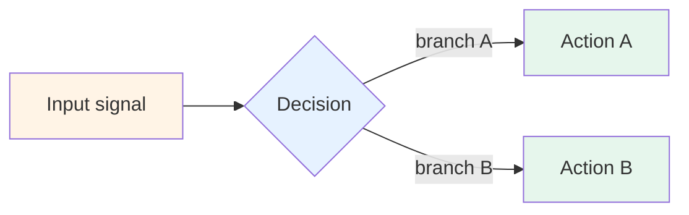

# Pattern N — [Pattern name]

> 🟢 Stable · ⏱ ~XX min · 🛠 Verified YYYY-MM-DD · 📍 Module [X, Y] anchor

<!--
This is the template for adding a Path 03 production multi-agent pattern.
Copy this file, rename to NN-pattern-name.md, fill in each section, delete these comments.

The pattern shape is deliberately smaller and more mechanism-focused than concept pages
(8 sections, ~15 min vs concept pages' deeper architectural discussion). Patterns
document cross-cutting operational mechanisms that apply INSIDE Path 03 v1 topologies;
concept pages document the topologies themselves and the architectural choices.

See README.md for the shape rationale and Patterns 01/02/03 for examples.

PLACEHOLDER CONVENTION: For path placeholders in the body, use prose with inline-code
(e.g. "the relevant concept page at `concepts/multi-agent/some-page.md`") NOT actual
markdown link syntax. The link-sweep tool flags placeholder paths inside markdown
link syntax as broken — even when they're documentation of patterns. The prose+code
form sidesteps the parser false positive. See the references section below for the
recommended pattern for citing concept pages and labs in the actual published file.
-->

## Intent

<!--
One or two sentences naming the mechanism's purpose. The intent should be
operational: "Apply X by Y to achieve Z." Not theoretical: "X is a property of Y."

Example (Pattern 1): "Multi-agent systems that survive 2026 production use
structured handoff contracts — explicit input/output schemas at every agent-to-agent
boundary. Free-form delegations between agents are a documented failure mode."
-->

[1-2 sentences naming what the mechanism does.]

## When to use this pattern

<!--
3-4 concrete situations. Each bullet should be testable — could a reader confirm
their situation matches by checking specific properties of their system?
-->

- [Concrete situation 1]
- [Concrete situation 2]
- [Concrete situation 3]

## When NOT to use

<!--
3-4 anti-patterns. The cases where reaching for this pattern is overkill or wrong.
Important: include "when the topology is wrong" — patterns assume the underlying
topology (supervisor-worker, plan-and-execute, etc.) is sound. A pattern can't
fix a misapplied topology.
-->

- [Anti-pattern 1]
- [Anti-pattern 2]
- [When the topology is wrong — reconsider topology first.]

## The mechanism

<!--
One mermaid diagram showing the decision flow / boundary shape / routing logic.
Use the Batch 33 color palette for consistency across patterns:
  warm (#fff4e6)   : source / app input / upstream agent
  cool (#e6f2ff)   : middleware / decision logic / contract
  purple (#f3e8ff) : vendor / queue / human reviewer
  green (#e6f6ec)  : output / downstream / ops destination

If a diagram doesn't add real value, drop it — text is fine.
-->



[1-3 paragraphs describing the mechanism. Include specific rules, thresholds, or
schema fields. The mechanism section is where the pattern earns its place —
without specific rules, it's vague advice.]

## Implementation sketch

<!--
Minimal Python (preferred) or YAML showing the core logic — under ~40 lines.
Reference the relevant lab for the full implementation; the sketch is what fits
in a runbook.

Use the form: docstring or function signature comment → clean function body.
No prose interleaved with code; let the code carry the meaning.

For Pydantic models, use the minimal field set. For LangGraph examples, prefer
the TypedDict shape over the full StateGraph wiring.
-->

```python
# Minimal implementation sketch
from pydantic import BaseModel

class ExampleSchema(BaseModel):
    field_one: str
    field_two: int

def example_pattern(input_signal):
    ...
```

[1-2 paragraphs flagging the non-obvious parts of the sketch — what would
surprise someone reading it without context. What's a parameter, what's a
threshold, what's deliberately left out.]

The reader can see the full implementation in the relevant lab — for example, the supervisor-worker boundary in `labs/10-supervisor-worker-from-scratch/` or the LangGraph state graph in `labs/14-langgraph-supervisor-bridge/`. The sketch is the runbook-page version.

## How this combines with Path 03 modules

<!--
Table showing which Path 03 v1 modules and labs this pattern applies to.
This is the cross-cutting glue — patterns must work inside multiple topologies
to earn their place as patterns rather than as topology-specific tactics.

Reference labs by lab number (existing Path 03 README convention).
-->

| Path 03 module / lab | Where this pattern applies |
|---|---|
| Module 1 / Lab 10 (supervisor-worker from scratch) | [How it fits — be specific] |
| Module 2 / Lab 11 (generator-critic) | [How it fits] |
| Module 3 / Lab 12 (plan-and-execute from scratch) | [How it fits] |
| Module 4 / Lab 13 (multi-agent RAG) | [How it fits] |
| Module 5 / Lab 14 (LangGraph supervisor bridge) | [How it fits — typically the production substrate] |
| Module 5 / Lab 15 (plan-and-execute bridge) | [How it fits] |
| Module 6 / Lab 16 (multi-agent evaluation) | [How the pattern interacts with trajectory-level metrics] |

[1 paragraph summarizing the cross-cutting nature — what stays the same across
modules vs what varies by topology.]

## Tradeoffs and what this misses

<!--
Two subsections:
- Tradeoffs: 3-4 concrete cost/latency/complexity points
- What this misses: 3-4 things the pattern deliberately doesn't address
-->

**Tradeoffs**:

- **[Tradeoff 1]** — [concrete cost/complexity description].
- **[Tradeoff 2]** — [concrete description].
- **[Tradeoff 3]** — [concrete description].

**What this misses**:

- **[Adjacent problem 1]** — [why; where to look instead].
- **[Adjacent problem 2]** — [why].

## References

<!--
Repo-internal first (concept pages, labs, sister patterns), then external sources.
External sources should be verified-via-web-search; include verification date
implicitly via the source's publication date.

Use markdown link syntax in the actual published file — see Patterns 01/02/03 for examples.

Categorize references into three groups if there are enough sources:
- Production literature (vendor blogs, industry guides — verified mid-2026)
- Framework / library documentation (LangGraph, OpenAI Agents SDK, etc.)
- Path 03 internals (concept pages, labs, sister patterns)
-->

- Concept page references at paths like `concepts/multi-agent/relevant-page.md` — see Patterns 01/02/03 for the exact link format.
- Lab references at paths like `labs/NN-some-lab/`.
- Sister-pattern references — sibling patterns this composes with.
- External sources — vendor blogs, framework documentation, research papers.

<!--
DELETE BEFORE COMMITTING:

Pre-publication checklist:
- [ ] All `[bracketed placeholders]` replaced with real content
- [ ] Placeholder paths in prose use inline code (e.g. `concepts/multi-agent/example.md`)
      and NOT markdown link syntax (which trips the link checker)
- [ ] Real concept-page, lab, and external links use proper markdown syntax
- [ ] Mermaid diagram syntax verified (paste into GitHub preview to confirm)
- [ ] Reading time estimate matches actual length (heuristic: 1500 chars/min)
- [ ] At least 3 external references, each verified to exist
- [ ] Word-discipline check: scan against the locked forbidden-vocabulary list
      in CONTRIBUTING.md (no filler-grade hedges or marketing-tone superlatives;
      note that some existing Path 03 concept pages use vocabulary from that
      list in voice — do not carry those uses into new patterns)
- [ ] PR title: "Path 03 v2: Add [pattern name] pattern"
- [ ] Link the new pattern in patterns/README.md's table
- [ ] Update the pick-a-pattern decision aid in README.md if the new pattern
      adds a new top-level decision branch

Once those are done, delete this entire HTML comment block.
-->
