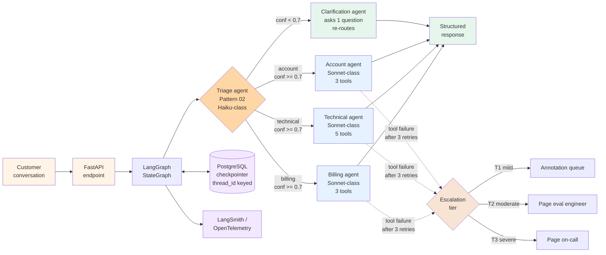

# Project 1 — Customer-support multi-agent

> 🔴 Advanced · ⏱ ~40 min reading · 🛠 ~3-5 day build · Verified 2026-05-29

## Project brief

You're building a customer-support multi-agent system: a triage agent that classifies incoming user messages and dispatches to one of three specialists (billing, technical, account). Each specialist has its own focused tool set. The system runs at chat-speed — sub-3-second median latency for the first response — and degrades gracefully when classification confidence is low or a specialist hits a tool failure.

The deployment target is a containerized FastAPI service backed by LangGraph state graphs with PostgreSQL checkpointing. The agent code is single-org (no cross-organization handoffs); the observability stack is LangSmith or OpenTelemetry-routed-to-your-APM, integrated with [Path 06](../../06-evaluation-observability/) for cost attribution and drift detection.

**Deployment target**: FastAPI service in a Docker container, deployed via your team's existing infrastructure. PostgreSQL for LangGraph checkpointing. Anthropic Claude (or equivalent) as the primary LLM; a smaller model (Haiku-class) for the routing classifier per [Pattern 02](../../../patterns/02-router.md)'s cost lever.

**Scale assumption**: up to 100K conversations/month, 1-3 person team, LangGraph or LangChain as the agent framework. If you need ≥1M conversations/month or sub-second median latency, treat this project as a starting point and add caching + read replicas — neither is in the rubric.

This project composes [Pattern 02 (Router)](../../../patterns/02-router.md) + [Pattern 03 (Supervisor + workers)](../../../patterns/03-supervisor-workers.md) + Path 03 v2 patterns 01 (handoff contracts), 03 (escalation), 05 (retry policies). It's the smallest of the three Path 03 projects — pick it when your deployment fits a single org and the UX is chat-speed interactive.

## Prerequisites

Before starting, you should have completed:

- **Required Path 03 v1 labs**: [Lab 10 (Supervisor-worker from scratch)](../../../labs/10-supervisor-worker-from-scratch/) end-to-end; [Lab 14 (LangGraph supervisor bridge)](../../../labs/14-langgraph-supervisor-bridge/) for the LangGraph deployment patterns.
- **Required Path 03 v2 patterns**: [Pattern 01 (Handoff contracts)](../patterns/01-handoff-contracts.md), [Pattern 03 (Escalation and fallback)](../patterns/03-escalation-and-fallback.md), [Pattern 05 (Retry policies)](../patterns/05-retry-policies.md).
- **Required top-level patterns**: [Pattern 02 (Router)](../../../patterns/02-router.md) and [Pattern 03 (Supervisor + workers)](../../../patterns/03-supervisor-workers.md) read end-to-end.
- **Recommended Path 06 modules**: [Lab 17 (LangSmith trace ingestion)](../../../labs/17-langsmith-trace-ingestion/) or [Lab 18 (OpenTelemetry portable tracing)](../../../labs/18-opentelemetry-portable-tracing/) — pick whichever fits your observability stack.
- **External**: an Anthropic API key (or equivalent LLM provider); a PostgreSQL instance reachable from your container; Docker locally; a LangSmith or APM account for tracing.

If any of those are gaps, fix the gaps first. Projects assume the prerequisites are solid.

## What you'll have when done

- A FastAPI service running a LangGraph multi-agent graph, packaged in a Docker image deployable to your team's container platform.
- A triage agent (Pattern 02 Router) that classifies user messages into `{billing, technical, account, unclear}` with a Pydantic-validated routing decision and a confidence threshold of 0.7.
- Three specialist agents (billing, technical, account), each with a focused tool set of 3-5 tools, instrumented as LangGraph subgraphs.
- An "unclear" fallback agent that asks one targeted clarifying question and re-routes — never silently guesses.
- PostgreSQL-backed checkpointing keyed by `thread_id` so multi-turn conversations resume cleanly.
- Pattern 01 (handoff contracts) enforced at every supervisor → specialist transition: a typed Pydantic envelope including `intent`, `confidence`, `conversation_state`, and `escalation_signals`.
- Pattern 03 (escalation) wired with T0/T1/T2/T3 severity tiers — T0 soft signals tag traces; T1 routes to annotation queue; T2 pages eval engineer; T3 pages on-call.
- Pattern 05 (retry policies) on every tool call with exponential backoff + jitter, capped at 3 retries with structured error escalation on terminal failure.
- LangSmith or OpenTelemetry tracing with per-conversation cost attribution (router vs specialist split) and trace-level metadata for `route`, `confidence`, `escalation_tier`.
- An acceptance test suite covering 50 representative conversations spanning all 4 routes plus 10 edge cases (ambiguous intent, tool failures, multi-turn).
- A runbook entry documenting the routing categories, the escalation tier semantics, and the rollback procedure for a specialist deploy gone wrong.

## Architecture at a glance

The triage agent is the only one running a fast/small model — its job is classification, not synthesis, so a Haiku-class model hits 90%+ routing accuracy at ~10-15% of the per-conversation token cost. Each specialist runs a Sonnet-class model with a focused tool set (3-5 tools) — the per-specialist tool count stays below the 8-10 break-even point named in Pattern 01.

The escalation path is structurally separate from the happy path: tool failures after 3 retries don't return a user-facing error; they emit a structured escalation event that the severity classifier routes to the appropriate tier per Path 03 v2 Pattern 03. This is what makes the deployment graceful — users see a degraded-but-coherent response (e.g., "I'm having trouble accessing your account details; a teammate will follow up within 4 hours") rather than a stack trace.

## Build milestones

### M1 — FastAPI + LangGraph skeleton with PostgreSQL checkpointing (~1 day)

**Goal**: ship a containerized FastAPI service running a minimal LangGraph state graph with PostgreSQL-backed checkpointing.

**Scope**:
- FastAPI endpoint `POST /conversations/{thread_id}/messages` accepting `{user_message: str}` and returning `{assistant_message: str, route: str, escalation_tier: int | None}`.
- LangGraph `StateGraph` with one placeholder node (echoes input).
- `PostgresSaver.from_conn_string()` checkpointer with `thread_id` config plumbed end-to-end.
- Dockerfile + `docker compose up` that launches FastAPI + Postgres locally.
- Health-check endpoint `GET /health` returning Postgres connectivity status.

**Done when**:
- A `curl POST` to the endpoint round-trips successfully through the LangGraph state machine and the message appears in the checkpoint table.
- Restarting the container and posting a second message with the same `thread_id` shows the first message in `state["messages"]`.

### M2 — Triage agent with Pydantic-validated routing decision (~0.5 day)

**Goal**: implement the Pattern 02 Router as a LangGraph node that classifies into 4 categories with structured output.

**Scope**:
- Pydantic `RouteDecision` schema with `route: Literal["billing", "technical", "account", "unclear"]` + `confidence: float` + `rationale: str` (max 200 chars).
- Triage node calls a Haiku-class model (or Mistral-small / Llama-3-8B equivalent) via `with_structured_output(RouteDecision)`.
- Confidence threshold `ROUTE_CONFIDENCE_THRESHOLD = 0.7` — below threshold routes to the clarification node, not to a specialist.
- LangGraph `add_conditional_edges` from triage to the 4 downstream nodes based on `decision.route` + threshold check.

**Done when**:
- Posting `{"user_message": "I was double-charged for plan B"}` triggers a route to `billing` with `confidence >= 0.7` visible in the trace.
- Posting an ambiguous message like `{"user_message": "It's broken"}` routes to `clarification` (or returns `unclear` route).
- The Haiku-call cost is 10-15% of total per-conversation token spend (measure with 50 sample conversations).

### M3 — Three specialist agents with focused tool sets (~1 day)

**Goal**: ship the billing, technical, and account specialists as LangGraph subgraphs with their own tools.

**Scope**:
- **Billing**: `lookup_invoice`, `change_plan`, `apply_refund_credit` (3 tools). Tool calls use mock backends for the project; production would hit your billing system.
- **Technical**: `check_service_status`, `lookup_error_code`, `restart_user_session`, `escalate_to_engineer`, `read_kb_article` (5 tools).
- **Account**: `update_profile`, `reset_password`, `verify_identity` (3 tools).
- Each specialist is a `create_react_agent` subgraph with a focused system prompt enumerating only its own tools.
- Specialists use Sonnet-class model (or equivalent — Pydantic AI `Agent` works too).

**Done when**:
- Posting a billing-shaped message triggers the billing subgraph, which makes 1-3 tool calls and returns a structured response.
- The trace shows tool selection within the specialist stayed within its own 3-5 tool set (no cross-contamination from triage prompt).
- A specialist refuses to handle out-of-domain requests: a billing question routed to the technical agent gets a structured "this seems like a billing question, escalating" response, not a hallucinated billing answer.

### M4 — Pattern 01 handoff contracts at every transition (~0.5 day)

**Goal**: enforce typed Pydantic envelopes at every supervisor → specialist handoff per Path 03 v2 Pattern 01.

**Scope**:
- Pydantic `HandoffEnvelope` with fields `intent`, `confidence`, `conversation_state`, `prior_turns_summary`, `escalation_signals: list[str]`.
- Triage node populates the envelope and passes it via LangGraph state.
- Each specialist's first step is validating the envelope; an invalid envelope routes to escalation tier T2 (this is a routing bug, not a user-facing error).
- The handoff envelope is logged as a structured trace span.

**Done when**:
- Inspecting any trace shows the `HandoffEnvelope` JSON at the triage → specialist boundary.
- Manually corrupting an envelope (e.g., setting `confidence=2.0` violating the `0.0 <= confidence <= 1.0` constraint) triggers a T2 escalation, not a user-facing error.

### M5 — Pattern 05 retry policies on every tool call (~0.5 day)

**Goal**: wrap every tool call with retry + exponential backoff per Path 03 v2 Pattern 05.

**Scope**:
- Tenacity (`tenacity.retry`) wrapper on every tool function: 3 retries max, exponential backoff with jitter (0.5s base, 4s cap).
- Retry only on transient errors (timeouts, 503s); fast-fail on 4xx errors (don't retry a 404 lookup).
- Structured logging of every retry attempt with `tool_name`, `attempt_number`, `error_class`.
- Terminal failure (3 retries exhausted) emits a structured error envelope, not an exception bubbling to the user.

**Done when**:
- Injecting a transient 503 in a tool call shows the retry sequence in the trace.
- Injecting a sustained tool outage (10 consecutive 503s) shows the 3-retry exhaustion + escalation event, with no stack trace reaching the user.
- 4xx errors (e.g., `lookup_invoice` for a deleted account) fast-fail without retries.

### M6 — Pattern 03 escalation tiers with structured signals (~1 day)

**Goal**: implement T0/T1/T2/T3 escalation per Path 03 v2 Pattern 03 — soft signal, annotation queue, page eval engineer, page on-call.

**Scope**:
- T0 (soft signal): low-confidence routing decisions and any specialist returning `"unable to resolve"` get tagged in the trace but don't user-impact.
- T1 (annotation queue): repeated low-confidence routes for the same `thread_id` (3+ in a row) routes the conversation to an annotation queue for offline review.
- T2 (page eval engineer): handoff-envelope violations, repeated specialist failures across different conversations within 1 hour, drift signals from the offline eval.
- T3 (page on-call): all specialists down within 5 minutes, PostgreSQL connection failures, model-provider 503s sustained > 1 minute.
- Severity classifier as a single function returning `{tier: 0|1|2|3, source: str, payload: dict}` — same shape as Path 06 Pattern 2's drift severity classifier.

**Done when**:
- Manually triggering each tier produces the expected downstream effect (annotation queue entry, PagerDuty alert, etc.).
- The severity classifier code is reused unchanged from Path 06 if you've shipped Path 06 v2 — this is the explicit "compose with Path 06" point.

### M7 — 50-conversation acceptance suite + runbook (~0.5-1 day)

**Goal**: ship a regression test suite + the on-call runbook entry.

**Scope**:
- 50 representative conversations covering all 4 routes (~12 each plus edge cases) + 10 edge cases (ambiguous intent, multi-turn, tool failures, escalation triggers).
- Suite runs in CI; each conversation has expected `route`, `escalation_tier`, and optional regex match on the assistant response.
- Runbook entry covers: routing categories and how to add a new one; specialist deploy + rollback procedure; escalation tier semantics; reading the LangSmith / APM trace for a misrouted conversation.

**Done when**:
- CI run on a fresh branch shows the 50-conversation suite passing.
- A teammate not involved in the build can follow the runbook to deploy the specialist update from a clean checkout.

## The integration layer

| Milestone | Path 03 v1 lab | Path 03 v2 pattern | Top-level pattern | Path 06 module |
|---|---|---|---|---|
| M1 — FastAPI skeleton | [Lab 14 (LangGraph supervisor bridge)](../../../labs/14-langgraph-supervisor-bridge/) | — | — | — |
| M2 — Triage agent | [Lab 10 (Supervisor-worker)](../../../labs/10-supervisor-worker-from-scratch/) | — | [Pattern 02 (Router)](../../../patterns/02-router.md) | — |
| M3 — Specialists | [Lab 10 (Supervisor-worker)](../../../labs/10-supervisor-worker-from-scratch/), [Lab 14](../../../labs/14-langgraph-supervisor-bridge/) | — | [Pattern 03 (Supervisor + workers)](../../../patterns/03-supervisor-workers.md) | — |
| M4 — Handoff contracts | [Lab 14](../../../labs/14-langgraph-supervisor-bridge/) | [Pattern 01 (Handoff contracts)](../patterns/01-handoff-contracts.md) | — | — |
| M5 — Retry policies | — | [Pattern 05 (Retry policies)](../patterns/05-retry-policies.md) | — | — |
| M6 — Escalation tiers | — | [Pattern 03 (Escalation and fallback)](../patterns/03-escalation-and-fallback.md) | — | [Pattern 2 (Drift-triggered review)](../../06-evaluation-observability/patterns/02-drift-triggered-review.md) |
| M7 — Acceptance + runbook | [Lab 16 (Multi-agent eval)](../../../labs/16-multi-agent-evaluation-from-scratch/) | — | — | — |

The integration layer is the explicit composition story. M6 is where Path 03 v3 deliberately reuses the Path 06 severity classifier infrastructure — the annotation queue, the on-call paging hookup, the audit log — with the event source tag distinguishing `agent_escalation` from Path 06's `drift`.

## Acceptance rubric

A PR is ready to ship when:

1. **The triage agent's routing accuracy is ≥90% on the 50-conversation suite**, measured against expected `route` labels. Below 90%, the per-specialist tool selection signal is being polluted by misrouted conversations — fix routing first.
2. **The triage agent uses a smaller/faster model than the specialists.** A Haiku-class model for triage; Sonnet-class (or equivalent) for specialists. Inverting this is the most common cost-control regression per [BSWEN March 2026](https://docs.bswen.com/blog/2026-03-06-agent-routing/) — verify the model strings in code review.
3. **Every triage decision below `ROUTE_CONFIDENCE_THRESHOLD = 0.7` routes to the clarification node, not to a specialist.** Manual test: post `{"user_message": "I have a question"}` — the trace must show clarification, not a guess.
4. **Each specialist's tool list has 3-5 entries.** No specialist should have 8+ tools (the Pattern 01 break-even point). If a specialist has too many tools, the routing decomposition is wrong — split it into two specialists.
5. **Every supervisor → specialist transition logs a `HandoffEnvelope` as a structured trace span.** Inspect 3 random traces in the LangSmith/APM UI; the envelope must be present and complete.
6. **Every tool call is wrapped with `tenacity.retry`** with 3-retry cap, exponential backoff, and retry-only-on-transient-errors. 4xx errors must fast-fail.
7. **Tool-call terminal failure emits a structured escalation event, not an exception bubbling to the user.** Inject a 10-consecutive-503 outage in a test environment; the user must see a coherent degraded response, the trace must show the T2 escalation.
8. **The severity classifier is reused from Path 06 Pattern 2 if Path 06 v2 is shipped.** If Path 06 v2 isn't shipped, the classifier is implemented per the Pattern 03 spec — but the code structure must match Path 06's so the future composition is a copy-paste.
9. **PostgreSQL checkpointing works across container restarts.** Restart-then-resume test: kill the container mid-conversation, restart, post the next message with the same `thread_id`, the conversation resumes from prior state.
10. **The 50-conversation acceptance suite passes in CI before every deploy.** No exceptions; flakiness > 2% means a test is wrong, not the code.

## Common failure modes and recoveries

### Triage model upgraded to Sonnet/Opus class "for accuracy"

A team measures triage accuracy at 88% with Haiku, decides to "upgrade to Sonnet for the routing decision" — and conversation cost goes up 40-60% per [BSWEN March 2026](https://docs.bswen.com/blog/2026-03-06-agent-routing/). The accuracy gain is typically 2-4 percentage points, not enough to justify the cost.

**Recovery**: revert to Haiku for triage. If accuracy is still below 90% after revert, the routing categories themselves are the problem — they have too much overlap. Split or merge categories; don't throw a bigger model at a category-design problem.

### Specialists run "with all tools available, just to be safe"

A team copies the full tool list into every specialist's system prompt to avoid the "what if billing needs to look up an error code" case. Per-conversation token cost climbs; tool selection accuracy within each specialist drops below 85%.

**Recovery**: enforce focused tool lists at the LangGraph subgraph level — `create_react_agent(tools=[billing_tools_only], ...)`. Cross-specialist tool needs route through escalation, not through cross-contaminated tool lists.

### Confidence threshold tuned aggressively low

A team sets `ROUTE_CONFIDENCE_THRESHOLD = 0.3` to reduce the clarification frequency. Misrouted conversations triple; specialists handle out-of-domain requests poorly; user satisfaction drops.

**Recovery**: revert to 0.7 (or tune empirically on the 50-conversation suite). The clarification path is the gate that protects per-specialist accuracy; aggressive low thresholds collapse that protection.

### Escalation tiers fire without rate limits

T2 paging fires on every handoff-envelope violation. A bug in the envelope schema causes 500+ pages in an hour; the on-call team mutes the alert; a real T3 incident goes unnoticed.

**Recovery**: rate-limit T2 and T3 alerts (e.g., max 5 T2 pages per hour, 2 T3 per 15 minutes). Spillover above the rate limit routes to the annotation queue with a `rate_limited` tag for offline review.

### PostgreSQL checkpointer becomes the bottleneck

At 100K+ conversations/month, every state mutation hitting Postgres saturates the connection pool. Latency p95 climbs from 2s to 8s.

**Recovery**: connection pooling (`asyncpg` pool with size = 2 × CPU count); selective checkpointing (only checkpoint at supervisor → specialist transitions, not every node); read replicas for the conversation-history read path.

### Tool retries on idempotency-unsafe operations

A retried `apply_refund_credit` tool call double-refunds the customer because the upstream billing system isn't idempotent.

**Recovery**: idempotency keys on every state-mutating tool call. The retry wrapper passes a stable key derived from `(thread_id, tool_name, args_hash)`; the upstream tool either honors the key or short-circuits on duplicate.

## Operational checklist (pre-launch)

### Instrumentation

- [ ] LangSmith or OpenTelemetry tracing on the FastAPI service + LangGraph
- [ ] Per-conversation cost attribution (router vs specialist split) visible in the trace UI
- [ ] Trace metadata includes `route`, `confidence`, `escalation_tier`, `thread_id`
- [ ] Per-tool latency histogram per specialist

### Deployment

- [ ] Dockerfile uses pinned base image (not `latest`)
- [ ] PostgreSQL connection string pulled from secret manager, never from env var literal
- [ ] Health-check endpoint hit by the load balancer; failing health → instance pulled from rotation
- [ ] Container resource limits set (memory + CPU; no unbounded growth)

### Security

- [ ] LLM API key in secret manager; rotation runbook entry exists
- [ ] User input sanitized before tool calls (no SQL injection via `lookup_invoice(account_id=user_input)`)
- [ ] Tool outputs that include PII are redacted in traces

### Monitoring

- [ ] PagerDuty (or equivalent) integration for T2 + T3 escalations
- [ ] Rate-limit on T2 + T3 alerts (5/hr, 2/15min — adjust to your team's pager fatigue threshold)
- [ ] Cost dashboard (per-conversation, per-route, per-tier) refreshed daily
- [ ] Routing accuracy dashboard (T1 + T2 escalation rate as proxy for misrouted conversations)

### Runbook

- [ ] "How to add a new routing category" — step-by-step including the 50-conversation suite update
- [ ] "Specialist deploy + rollback" — including the rollback-on-elevated-T1-rate runbook
- [ ] "Escalation tier semantics" — what each tier means, who responds, what the SLA is
- [ ] "Reading a misrouted-conversation trace" — annotated example with arrows pointing at the routing decision

## Cost envelope

| Scale | LLM tokens | Infrastructure | Observability | Total |
|---|---|---|---|---|
| 10K conv/mo | ~$50 (Haiku triage + Sonnet specialists, avg 4K tokens/conv) | ~$25 (1 small FastAPI instance + small Postgres) | ~$0 (LangSmith free tier) | **~$75/mo** |
| 100K conv/mo | ~$500 | ~$70 (2 FastAPI instances + medium Postgres) | ~$39 (LangSmith Plus or APM) | **~$609/mo** |
| 1M conv/mo | ~$5,000 | ~$300 (autoscaled FastAPI + larger Postgres + Redis cache) | ~$200 (APM mid-tier) | **~$5,500/mo** |

LLM tokens dominate at every scale (60-90% of total cost). The per-conversation token average of 4K is the production baseline per [MintSquare January 2026](https://www.agentframeworkhub.com/blog/ai-agent-production-costs-2026) for a 3-agent pipeline; agents make 3-10× more LLM calls than simple chatbots so the multi-agent token premium is structural.

The high-variance components: LLM provider pricing (Anthropic/OpenAI/Google move quarterly; Haiku-class pricing has moved ~30% YoY); LangSmith Plus tier ($39/mo as of mid-2026; check current pricing); APM seat-based pricing (Datadog APM at 1M traces is ~$200-400/mo depending on retention). Re-verify each line before committing budgets.

## Extensions and where to go next

- **Caching with semantic similarity (Redis + embeddings)** — at 100K+ conversations/month, ~30-40% of incoming messages are near-duplicates of recent ones. A semantic cache layer (Redis + sentence-transformer embeddings) saves 40-60% of LLM tokens per [MintSquare January 2026](https://www.agentframeworkhub.com/blog/ai-agent-production-costs-2026). The integration point is the FastAPI handler, before the LangGraph invoke.
- **Multi-turn evaluation per Path 06 v2** — the 50-conversation acceptance suite covers single-turn conversations and a few multi-turn cases. Multi-turn eval per [Lab 22 (Multi-turn evaluation)](../../../labs/22-multi-turn-evaluation/) generalizes this to conversation-level metrics (resolution rate, transfer rate, satisfaction proxy).
- **Pattern 10 (Human-in-the-loop) for high-stakes transfers** — currently the system auto-resolves refund decisions up to a threshold. For amounts above the threshold, add Pattern 10 HITL approval points per [Pattern 10](../../../patterns/10-human-in-the-loop.md). The LangGraph `interrupt_before` primitive is the right hook.
- **Path 04 MCP integration for tool standardization** — billing, technical, and account tools are currently in-process Python functions. Moving them behind MCP servers per [Pattern 11 (MCP integration)](../../../patterns/11-mcp-integration.md) lets each specialist's tool set be updated independently of the agent code. This is the path toward Project 3.
- **Cost-aware retrieval per Path 06 Pattern 1** — if a specialist needs to look up KB articles, the retrieval cost can dominate that specialist's token spend. [Path 06 Pattern 1 (Cost-aware retrieval)](../../06-evaluation-observability/patterns/01-cost-aware-retrieval.md) adds the budget-aware short-circuiting.

## References + further reading

**Path 03 + Path 06 repo content**:
- [Path 03 README](../README.md) — the overall multi-agent path
- [Path 03 v2 patterns README](../patterns/README.md) — the six v2 patterns this project composes
- [Pattern 02 (Router)](../../../patterns/02-router.md) — the architectural pattern for the triage agent
- [Pattern 03 (Supervisor + workers)](../../../patterns/03-supervisor-workers.md) — the architectural pattern for the supervisor + specialists
- [Path 06 v2 projects](../../06-evaluation-observability/projects/) — the projects-directory shape this project follows
- [Path 06 Pattern 2 (Drift-triggered review)](../../06-evaluation-observability/patterns/02-drift-triggered-review.md) — the severity-classifier composition

**2026 production guides**:
- [BSWEN (March 2026), *AI Agent Routing: A Practical Guide*](https://docs.bswen.com/blog/2026-03-06-agent-routing/) — the "cheap classifier, expensive execution" cost lever; the source for the 90% routing-accuracy benchmark
- [MintSquare (January 2026), *AI Agent Production Costs 2026*](https://www.agentframeworkhub.com/blog/ai-agent-production-costs-2026) — the 3-10× LLM call multiplier; semantic caching saves 40-60% of tokens; cost-per-component breakdown
- [Use Apify (March 2026), *LangGraph Agents in Production*](https://use-apify.com/blog/langgraph-agents-production) — PostgreSQL checkpointing recipe; the FastAPI integration shape; production gotchas
- [Gurusup (April 2026), *Best Multi-Agent Frameworks in 2026*](https://gurusup.com/blog/best-multi-agent-frameworks-2026) — LangGraph vs OpenAI Agents SDK vs CrewAI vs AutoGen; the framework-choice rationale
- [Intuz (Q1 2026), *Top 5 AI Agent Frameworks 2026*](https://www.intuz.com/blog/top-5-ai-agent-frameworks-2025) — $63-171/month production cost benchmarks

**Foundational papers + framework docs**:
- [Anthropic (December 2024), *Building Effective Agents*](https://www.anthropic.com/research/building-effective-agents) — the routing-workflow + orchestrator-worker primitives
- [LangGraph docs](https://langchain-ai.github.io/langgraph/) — `StateGraph`, `MessagesState`, `add_conditional_edges`, `PostgresSaver`
- [Pydantic AI docs](https://ai.pydantic.dev/) — the type-safe alternative for the specialist agents
