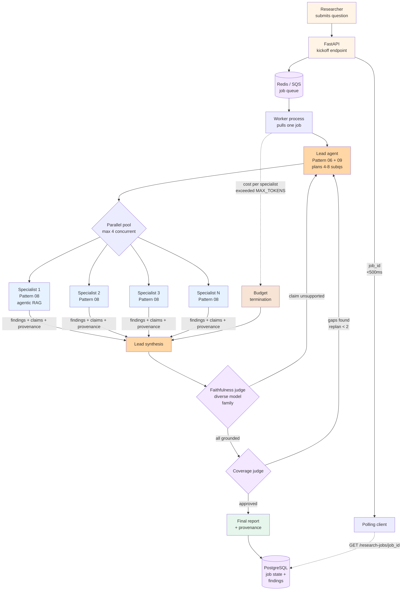

# Project 2 — Research pipeline with deep research

> 🔴 Advanced · ⏱ ~45 min reading · 🛠 ~5-7 day build · Verified 2026-05-29

## Project brief

You're building a long-running research pipeline: a user submits a research question, the system decomposes it into sub-questions, dispatches parallel specialists running agentic-RAG loops over your corpus + web search, synthesizes findings into a structured citation-rich report, and gates the output with a faithfulness judge before delivery. Wall-clock is 5-30 minutes per query; the user kicks off the task and reads the report later (or gets a notification when it's ready).

The deployment target is an async job-queue architecture — FastAPI for kickoff + status endpoints, a worker pool consuming jobs from Redis/SQS, agents implemented in the OpenAI Agents SDK or Anthropic Agent SDK (framework-flexible per the integration table below). PostgreSQL stores job state + intermediate findings; the synthesis judge runs with model diversity (a different model family than the specialists) to decorrelate the [Pattern 07 coherence trap](../../../patterns/07-reflection.md).

**Deployment target**: FastAPI kickoff/status service + worker pool (Celery / RQ / native asyncio with Redis). PostgreSQL for job + findings state. Anthropic Claude Sonnet (or equivalent Sonnet-class) for specialist research; a diverse-family model (e.g., GPT-4o-mini, Gemini 1.5) for the synthesis judge.

**Scale assumption**: 100-10,000 research jobs/month. Average per-job wall-clock 8-15 minutes; per-job token spend $1.50-$15. If your scale is sub-100/month, the operational overhead isn't worth it — use [Project 1's interactive shape](./01-customer-support-multi-agent.md) with an extended timeout instead. If your scale is 100K+/month and per-query budget is below $1, you have a [Pattern 02 routing problem](../../../patterns/02-router.md), not a deep-research problem.

This project composes [Pattern 06 (Plan-and-execute)](../../../patterns/06-plan-and-execute.md) + [Pattern 07 (Reflection)](../../../patterns/07-reflection.md) + [Pattern 08 (Agentic RAG)](../../../patterns/08-agentic-rag.md) + [Pattern 09 (Deep research)](../../../patterns/09-deep-research.md) + Path 03 v2 patterns 04 (per-agent cost budgeting), 06 (cross-agent provenance). It's the middle of the three Path 03 projects in complexity — pick it when you need long-running async research and your deployment is single-org.

## Prerequisites

Before starting, you should have completed:

- **Required Path 03 v1 labs**: [Lab 12 (Plan-and-execute from scratch)](../../../labs/12-plan-and-execute-from-scratch/) end-to-end; [Lab 15 (LangGraph plan-and-execute bridge)](../../../labs/15-langgraph-plan-execute-bridge/); [Lab 13 (Multi-agent RAG from scratch)](../../../labs/13-multi-agent-rag-from-scratch/).
- **Required Path 03 v2 patterns**: [Pattern 04 (Per-agent cost budgeting)](../patterns/04-per-agent-cost-budgeting.md), [Pattern 06 (Cross-agent provenance)](../patterns/06-cross-agent-provenance.md).
- **Required top-level patterns**: [Pattern 06](../../../patterns/06-plan-and-execute.md), [Pattern 07](../../../patterns/07-reflection.md), [Pattern 08](../../../patterns/08-agentic-rag.md), [Pattern 09](../../../patterns/09-deep-research.md) read end-to-end.
- **Required Path 02 labs**: [Lab 06 (Agentic RAG from scratch)](../../../labs/06-agentic-rag-from-scratch/), [Lab 07 (Retrieval strategies and reranking)](../../../labs/07-retrieval-strategies-and-reranking/) — the specialists are agentic-RAG agents and need the retrieval foundation.
- **Recommended Path 06 modules**: [Lab 21 (Cost attribution and adaptive sampling)](../../../labs/21-cost-attribution-and-adaptive-sampling/) — research jobs have the most variable per-job cost in the repo; cost attribution is required, not optional.
- **External**: Anthropic + diverse-family LLM API keys; a vector DB (Qdrant, Pinecone, or pgvector); Redis or SQS for the job queue; PostgreSQL; Docker.

If any of those are gaps, fix the gaps first. This is the most prerequisite-heavy of the three Path 03 projects; skipping prerequisites costs more days here than in Projects 1 or 3.

## What you'll have when done

- A FastAPI service exposing `POST /research-jobs` (kickoff) and `GET /research-jobs/{job_id}` (status + report) endpoints.
- A worker pool consuming research jobs asynchronously; each worker runs one job to completion (or hop-cap-reached) before pulling the next.
- A lead agent that decomposes the research question into 4-8 sub-questions per [Pattern 09](../../../patterns/09-deep-research.md), with `MAX_SUBQUESTIONS = 8` and `MAX_REPLANS = 2` caps.
- N parallel specialist agents (one per sub-question, capped at 4 concurrent), each running an agentic-RAG loop per [Pattern 08](../../../patterns/08-agentic-rag.md) with `MAX_RETRIEVAL_HOPS = 5`.
- A faithfulness judge using a different model family than the specialists — decorrelating the [Pattern 07 coherence trap](../../../patterns/07-reflection.md). Per-claim citation grounding gates the final report.
- A coverage judge (separate from the faithfulness judge) that decides whether the synthesis answers the original question or needs a replan.
- Per-agent cost budgeting per [Path 03 v2 Pattern 04](../patterns/04-per-agent-cost-budgeting.md): each specialist has a `MAX_TOKENS_PER_SUBQUESTION` budget; budget exhaustion triggers structured termination, not silent over-spend.
- Cross-agent provenance per [Path 03 v2 Pattern 06](../patterns/06-cross-agent-provenance.md): every claim in the final report carries `{claim, source_url, quote, retrieved_at, specialist_id, retrieval_hop}` provenance.
- Background processing with `background=True` semantics — the kickoff returns a `job_id` in <500ms; the work happens async.
- A status endpoint that returns progress (planned sub-questions, completed specialists, current replan number) for the user to poll.
- A 20-job acceptance suite covering 5 simple, 10 moderate, 5 complex research questions — each with expected sub-question count and a citation-coverage check.
- A runbook entry documenting the cost-runaway response, the model-diversity rationale, and how to add a new corpus to the retrieval surface.

## Architecture at a glance

Three structural choices matter most. First, the lead agent runs *once* per replan loop and produces the plan; specialists do the token-heavy work in parallel. This is the [Pattern 09](../../../patterns/09-deep-research.md) cost shape — the lead is cheap; specialists are expensive. Second, the faithfulness judge uses a *different* model family than the specialists — this is the only way to actually decorrelate per [Pattern 07's coherence-trap framing](../../../patterns/07-reflection.md). If both were Claude Sonnet, they'd share blind spots. Third, the budget-termination path is structurally separate from the happy path — exceeded budget doesn't crash the job; it produces a partial-but-coherent result with an explicit `[Partial — cost budget exceeded; N subquestions completed]` caveat.

The 5-30 minute wall-clock is dominated by specialist parallelism: 4-8 sub-questions × 2-5 minutes per specialist (agentic-RAG with up to 5 retrieval hops + reasoning) ÷ 4-way parallelism. The user-facing latency is the kickoff (<500ms); the background processing is async.

## Build milestones

### M1 — FastAPI kickoff + status endpoints + job queue (~1 day)

**Goal**: ship the async job-queue skeleton.

**Scope**:
- `POST /research-jobs` accepting `{question: str, max_budget_usd: float = 5.0, max_wall_clock_min: int = 15}` and returning `{job_id: str, status: "queued"}` in <500ms.
- `GET /research-jobs/{job_id}` returning `{status: "queued"|"running"|"completed"|"failed"|"partial", progress: {...}, report: dict | None, cost_usd: float, elapsed_seconds: int}`.
- Redis/SQS queue with one queue + one consumer pool (Celery, RQ, or native asyncio).
- Worker process pulls a job, marks it `"running"`, and runs a placeholder lead-agent that returns a stub plan.
- PostgreSQL `research_jobs` table with `job_id`, `status`, `report`, `cost_usd`, timing columns.

**Done when**:
- A `curl POST` returns `job_id` in <500ms with a stub-completing worker visible in logs.
- The `GET` endpoint shows status progression `queued` → `running` → `completed`.
- Container restart mid-job results in the job being retried (not silently dropped).

### M2 — Lead agent with Pattern 06 plan-and-execute decomposition (~1 day)

**Goal**: implement the lead agent that decomposes the research question into 4-8 sub-questions.

**Scope**:
- Pydantic `ResearchPlan` schema with `sub_questions: list[str]` (validated `4 <= len <= 8`), `rationale: str`, `expected_token_budget: int`.
- Lead agent calls Sonnet-class model with `with_structured_output(ResearchPlan)`.
- `MAX_REPLANS = 2` cap on the lead's replan loop; on the 3rd replan attempt, partial-finalize with explicit caveat.
- Plan validation: every sub-question must be 10-200 chars, no duplicates, no exact restatement of the original question.

**Done when**:
- Posting `{"question": "What's the regulatory landscape for autonomous-vehicle insurance in EU and California?"}` produces a plan with ~6 sub-questions covering EU + California + comparison + gaps.
- Posting an ambiguous research question that the lead can't decompose triggers a structured "question too ambiguous; please refine" response (not a hallucinated plan).
- The lead's cost is 5-10% of the total job cost (measure with 20 sample jobs).

### M3 — Specialist agents running Pattern 08 agentic-RAG (~1.5 days)

**Goal**: ship the per-sub-question specialist with hybrid retrieval + faithfulness gating.

**Scope**:
- Each specialist is an [OpenAI Agents SDK](https://github.com/openai/openai-agents-python) `Agent` (or Pydantic AI / Anthropic Agent SDK equivalent) with two tools: `retrieve_tool` (hybrid retrieval over your corpus + reranking) and `finalize_specialist_answer`.
- `MAX_RETRIEVAL_HOPS = 5` per specialist.
- Each retrieval call goes through query rewrite → hybrid BM25+vector search → cross-encoder reranking → top-5 chunks returned per [Pattern 08's five-sub-pattern catalog](../../../patterns/08-agentic-rag.md).
- Each finalized answer carries `{findings: str, claims: list[{claim, source_url, quote, retrieved_at}]}`.
- Web-search tool is optional but recommended (Tavily, Brave, or your provider's `web_search_preview`); per [OpenAI Cookbook deep-research](https://developers.openai.com/cookbook/examples/deep_research_api/introduction_to_deep_research_api) the web tool is standard for deep research.

**Done when**:
- Running a specialist on `"What is the current EU autonomous-vehicle insurance regulatory framework?"` produces a findings + 4-8 cited claims with verifiable source URLs.
- Hop-cap-reached behavior: a specialist that exhausts 5 hops without satisfying the local faithfulness gate returns a `partial` envelope with `{partial_reason: "hop_cap_reached"}` — not a silent under-grounded answer.

### M4 — Parallel pool with concurrency cap (~0.5 day)

**Goal**: dispatch specialists in parallel with bounded concurrency.

**Scope**:
- `asyncio.Semaphore(4)` (or thread/process pool with 4 workers) bounding concurrent specialists per job.
- All sub-questions for a job dispatch as `asyncio.gather(*tasks)` after the semaphore.
- Each specialist's start, completion, and termination logged with `job_id`, `sub_question_idx`, elapsed time, cost.
- A specialist's failure (exception bubble or timeout >5 min) doesn't fail the whole job — it produces a `failed_specialist` envelope that the synthesizer sees as a gap.

**Done when**:
- 6 sub-questions dispatch with at most 4 running concurrently (verify in the trace).
- One specialist failing (inject an exception) doesn't cascade — other specialists complete normally; the synthesizer flags the gap.

### M5 — Faithfulness + coverage judges with model diversity (~1 day)

**Goal**: implement the two judges that gate report finalization.

**Scope**:
- **Faithfulness judge**: takes a draft report + the full list of retrieved claims; returns `{approved: bool, unsupported_claims: list[str]}`. Uses a **different model family** than the specialists. If specialists are Claude Sonnet, judge is GPT-4o-mini or Gemini 1.5 Flash. This is the load-bearing decorrelation per [Pattern 07](../../../patterns/07-reflection.md).
- **Coverage judge**: takes the original question + the sub-question findings + the draft report; returns `{approved: bool, gaps: list[str]}`.
- On faithfulness rejection: the lead's next replan iteration receives the unsupported claims and dispatches targeted re-retrieval (not a full re-research).
- On coverage rejection: the lead's next replan adds 2-4 sub-questions targeting the gaps.
- Both judges short-circuit on the `MAX_REPLANS = 2` cap with a partial-finalize.

**Done when**:
- Manually injecting an unsupported claim in a draft report triggers a faithfulness rejection and a targeted re-retrieval in the trace.
- The faithfulness judge model is verifiably a different family than the specialists' model (assert on model strings in code review).

### M6 — Pattern 04 per-specialist cost budgeting + Pattern 06 provenance (~1 day)

**Goal**: enforce token budgets and end-to-end provenance per Path 03 v2 patterns.

**Scope**:
- Per-job `MAX_BUDGET_USD = 5.0` default (configurable per kickoff). Per-specialist allocation: `(MAX_BUDGET_USD * 0.7) / num_subquestions` (the 0.7 reserves headroom for lead + judges).
- Cost tracking on every LLM call (token counts × per-model unit prices); budget-exhaustion event terminates the specialist with a `cost_budget_exceeded` partial envelope.
- The full provenance chain `{claim → source_url → quote → retrieved_at → specialist_id → retrieval_hop}` recorded for every cited claim per [Pattern 06 (Cross-agent provenance)](../patterns/06-cross-agent-provenance.md).
- The final report's citation list is verifiably constructible from the provenance chain — no orphan citations.

**Done when**:
- A job kicked off with `max_budget_usd=1.0` (intentionally too low) produces a partial result with `cost_budget_exceeded` flagged and N-of-M subquestions completed.
- Every claim in a passing job's report has a complete provenance entry; running `validate_provenance(report)` against the spec returns no orphans.

### M7 — 20-job acceptance suite + runbook (~0.5-1 day)

**Goal**: ship the regression suite + on-call runbook.

**Scope**:
- 20 research questions: 5 simple (`"What's the current EU GDPR fine ceiling?"`), 10 moderate (the autonomous-vehicle regulatory question above), 5 complex (multi-aspect comparative analyses).
- Each question has expected sub-question count (range), expected wall-clock (range), and a citation-coverage check (each claim has provenance).
- Runbook covers: cost runaway response (a job exceeding 2× budget escalates to T2); model-diversity rationale (the faithfulness-judge model family vs specialist model family decision); how to add a new corpus to the retrieval surface; how to debug a "report finalized with unresolved gaps" partial.

**Done when**:
- CI run on a fresh branch shows the 20-job suite passing (acceptable: some moderate-complexity jobs hitting partial-finalize with explicit caveats; not acceptable: silent under-citation).
- A teammate not involved in the build can follow the runbook to add a new corpus and verify it's reachable from specialists.

## The integration layer

| Milestone | Path 03 v1 lab | Path 03 v2 pattern | Top-level pattern | Path 02 / Path 06 |
|---|---|---|---|---|
| M1 — FastAPI + queue | [Lab 12 (Plan-and-execute)](../../../labs/12-plan-and-execute-from-scratch/) | — | — | — |
| M2 — Lead agent | [Lab 12](../../../labs/12-plan-and-execute-from-scratch/), [Lab 15 (LangGraph)](../../../labs/15-langgraph-plan-execute-bridge/) | — | [Pattern 06 (Plan-and-execute)](../../../patterns/06-plan-and-execute.md), [Pattern 09 (Deep research)](../../../patterns/09-deep-research.md) | — |
| M3 — Specialists | [Lab 13 (Multi-agent RAG)](../../../labs/13-multi-agent-rag-from-scratch/) | — | [Pattern 08 (Agentic RAG)](../../../patterns/08-agentic-rag.md) | [Lab 06 (Agentic RAG)](../../../labs/06-agentic-rag-from-scratch/), [Lab 07 (Retrieval)](../../../labs/07-retrieval-strategies-and-reranking/) |
| M4 — Parallel pool | [Lab 12 (parallel pool)](../../../labs/12-plan-and-execute-from-scratch/) | — | [Pattern 09 (Deep research)](../../../patterns/09-deep-research.md) | — |
| M5 — Judges | [Lab 11 (Generator-critic)](../../../labs/11-generator-critic-from-scratch/) | — | [Pattern 07 (Reflection)](../../../patterns/07-reflection.md), [Pattern 08 (Agentic RAG)](../../../patterns/08-agentic-rag.md) | — |
| M6 — Budgets + provenance | — | [Pattern 04 (Cost budgeting)](../patterns/04-per-agent-cost-budgeting.md), [Pattern 06 (Cross-agent provenance)](../patterns/06-cross-agent-provenance.md) | — | [Lab 21 (Cost attribution)](../../../labs/21-cost-attribution-and-adaptive-sampling/) |
| M7 — Suite + runbook | [Lab 16 (Multi-agent eval)](../../../labs/16-multi-agent-evaluation-from-scratch/) | — | — | — |

The integration layer is dense because deep research composes many subsystems. M3 explicitly reuses Lab 06's retrieval pipeline as the specialist's tool surface — no need to reinvent dense + BM25 + RRF + cross-encoder rerank. M6 reuses Path 06 Lab 21's cost-attribution shape; the per-specialist budgeting is the same primitive applied at agent granularity instead of trace granularity.

## Acceptance rubric

A PR is ready to ship when:

1. **The faithfulness judge uses a different model family than the specialists.** This is the [Pattern 07 coherence-trap](../../../patterns/07-reflection.md) defense; without it, the judge approves what the specialists hallucinated. Verify model strings in CI (e.g., specialists string contains `"claude"`, judge string contains `"gpt"` or `"gemini"`).
2. **Every claim in a passing job's report has a complete provenance entry** `{claim, source_url, quote, retrieved_at, specialist_id, retrieval_hop}`. Running `validate_provenance(report)` on every report in the 20-job suite must return zero orphans.
3. **`MAX_SUBQUESTIONS = 8` and `MAX_REPLANS = 2` are enforced.** Tests intentionally inject scenarios that would trigger more (e.g., a research question that genuinely needs 12 sub-questions); the system must cap at 8 + partial-finalize, never silently exceed.
4. **`MAX_RETRIEVAL_HOPS = 5` per specialist is enforced.** A specialist hitting the cap returns `partial_reason: "hop_cap_reached"`, not a silent under-grounded answer.
5. **Per-specialist cost budgeting fires when exceeded.** Tests with intentionally-low `max_budget_usd` produce partial results with the explicit `cost_budget_exceeded` flag, not silent over-spend.
6. **The 20-job suite passes in CI.** Acceptable: some moderate-complexity jobs partial-finalizing with explicit caveats. Not acceptable: silent under-citation, orphan provenance, or budget over-spend without flag.
7. **Specialist failures don't cascade.** A single specialist exception (injected in test) produces a flagged-gap in the synthesis, not a job-level failure.
8. **The kickoff endpoint returns `job_id` in <500ms p95.** Verified with a load test posting 100 jobs.
9. **The status endpoint returns progress detail (sub-questions planned, completed, current replan).** Polling clients can show meaningful progress, not just "running" for 15 minutes.
10. **Cost attribution per [Path 06 Lab 21](../../../labs/21-cost-attribution-and-adaptive-sampling/) is wired.** Per-job cost is visible in your APM/LangSmith UI, broken down by lead vs specialists vs judges.

## Common failure modes and recoveries

### Faithfulness judge and specialists run the same model family

Engineering team picks "best model for everything" — Claude Sonnet for specialists, Claude Sonnet for the judge. The judge approves hallucinated claims because it shares the specialists' blind spots. Per [Zylos Research May 2026](https://zylos.ai/research/2026-05-12-agent-self-correction-reflexion-to-prm)'s coherence-trap formalization, iterative self-critique amplifies confidence without adding information when generator + evaluator share error modes.

**Recovery**: swap the judge to a different family (GPT-4o-mini or Gemini 1.5 Flash). Per-claim accuracy on a hand-graded eval set jumps 8-15 percentage points after the swap. The judge can be cheaper than the specialists — diversity matters more than capability.

### Lead agent dispatches 12 sub-questions for a moderate research question

Lead's prompt has no upper bound on sub-question count or the bound isn't enforced in code. A moderate-complexity research question expands into 12 sub-questions × 5 retrieval hops × 4 specialists worth of LLM calls — the per-job cost hits $25-40 instead of the $5-15 typical.

**Recovery**: enforce `MAX_SUBQUESTIONS = 8` in the Pydantic schema (`Field(max_items=8)`), not just in the prompt. A model that wants to produce 12 is producing a different shape than the contract allows; reject and re-prompt with "your previous plan had 12 sub-questions; the maximum is 8 — consolidate."

### Replan loop thrashes (coverage gaps never close)

Coverage judge keeps flagging the same gap on every replan because the gap genuinely requires retrieval against a source the corpus doesn't contain. The job hits `MAX_REPLANS = 2` and partial-finalizes — but the trace shows 3 wasted replan cycles.

**Recovery**: the coverage judge needs to flag `gap_likely_unaddressable: bool` when the same gap appears 2+ replans in a row. The lead's next iteration sees this and either expands the corpus (if the team has a fallback web-search tool) or finalizes immediately with the gap noted in the report — no third wasted replan.

### Specialists time out at exactly 5 minutes (worker timeout < specialist timeout)

The worker process has a 5-minute hard timeout; the specialist's `MAX_RETRIEVAL_HOPS = 5` × per-hop latency can hit 6-8 minutes on hard questions. Worker SIGKILLs the specialist mid-work; the job gets re-queued and runs again from scratch.

**Recovery**: worker timeout = max specialist wall-clock × 2 + lead + judge overhead = typically 15-20 minutes. The semaphore enforces concurrency; the timeout enforces termination. They're orthogonal constraints.

### Per-job cost runaway from a degenerate question

A research question like `"Tell me everything about every topic"` triggers a max-decomposition (8 sub-questions), each hits max-retrieval-hops (5), each replans (2) — the per-job cost hits $40+ before the budget guard fires.

**Recovery**: the budget guard must fire at the *lead* level too, not just per specialist. A `BUDGET_CHECK_INTERVAL_SECONDS = 30` background task on the worker watches the running cost; budget breach short-circuits the next dispatch (lead's replan, new specialist start) with a partial-finalize.

### Provenance dropped during synthesis

The synthesizer composes specialist findings into a flowing narrative; in the process, some claims lose their `source_url`. The faithfulness judge passes the result (every claim is still grounded in some chunk) but the user-visible report has un-cited sentences.

**Recovery**: the synthesizer must emit `claims: list[{...}]` alongside the prose, and the prose-rendering layer asserts `every_claim_in_prose_has_provenance(prose, claims)`. This is a separate check from faithfulness — faithfulness is "every claim is grounded"; provenance is "every grounded claim is cited in the user-visible output."

## Operational checklist (pre-launch)

### Instrumentation

- [ ] LangSmith / OpenTelemetry tracing with hierarchical span structure (job → lead → specialist → retrieval hop)
- [ ] Per-job cost attribution broken down by lead, specialists (each), judges
- [ ] Per-specialist hop count visible in the trace
- [ ] Faithfulness + coverage judge verdict + payload in the trace

### Deployment

- [ ] Worker timeout > max-specialist-wall-clock × 2 + lead + judge overhead
- [ ] Concurrency: max-job-concurrent-specialists semaphore = 4 (tune for your LLM provider rate limits)
- [ ] Queue dead-letter for jobs failing 3 times (avoid infinite retry loops)
- [ ] PostgreSQL connection pooling sized for `worker_count × 3`

### Security

- [ ] LLM API keys in secret manager (multiple keys: specialist family + judge family)
- [ ] Research questions sanitized (no prompt injection through `"Ignore previous instructions and..."`)
- [ ] Retrieved web-search content filtered for malicious URLs before passing to the synthesizer
- [ ] Per-user job-quota enforcement (no single user can saturate the worker pool)

### Monitoring

- [ ] Per-job cost dashboard with p50, p95, p99 + budget-breach rate
- [ ] Wall-clock dashboard (p50, p95, p99) with the 15-minute SLA target line
- [ ] Faithfulness-rejection rate (high = judge too strict OR specialists hallucinating)
- [ ] Partial-finalize rate by reason (`hop_cap_reached`, `cost_budget_exceeded`, `replan_cap_reached`)

### Runbook

- [ ] "Cost runaway response" — when per-job cost exceeds 2× budget, T2 page; investigation steps
- [ ] "Model-diversity rationale" — why the judge must be a different family; what to do if you have to switch families (e.g., provider outage)
- [ ] "Adding a new corpus" — vector DB index creation + the specialist tool wiring + the 20-job suite update
- [ ] "Debugging a partial-finalize with unresolved gaps" — annotated example with arrows pointing at the trace evidence

## Cost envelope

| Scale | LLM tokens | Infrastructure | Observability | Total |
|---|---|---|---|---|
| 100 jobs/mo (avg $3/job) | ~$300 | ~$60 (1 small FastAPI + 1 worker + small Postgres + Redis) | ~$0 (LangSmith free tier) | **~$360/mo** |
| 1,000 jobs/mo (avg $4/job) | ~$4,000 | ~$200 (autoscaled workers + medium Postgres + Redis) | ~$39 (LangSmith Plus) | **~$4,239/mo** |
| 10,000 jobs/mo (avg $5/job) | ~$50,000 | ~$800 (4-8 workers + larger Postgres + Redis cluster + vector DB) | ~$300 (APM mid-tier) | **~$51,100/mo** |

The per-job average cost depends heavily on question shape — simple questions average $1.50-$2.50 (1-pass through fewer sub-questions); complex questions average $8-$15 (max sub-questions, max replans). Mid-range moderate-complexity questions are the per-job average above. Per [MarsDevs April 2026](https://www.marsdevs.com/guides/agentic-rag-2026-guide) the 3-10× one-pass-RAG cost multiplier compounds into the 50-250× single-Q&A multiplier of [Pattern 09](../../../patterns/09-deep-research.md).

The high-variance components: LLM provider pricing (deep research is the most token-heavy pattern in the catalog; provider price changes have the largest absolute impact); vector DB at 10K+ jobs/mo (your retrieval corpus size drives the variance — 1M-chunk corpus is much cheaper than 10M); worker compute autoscaling (cold-start overhead vs idle-warm cost). Re-verify each line quarterly.

## Extensions and where to go next

- **[Pattern 02 router](../../../patterns/02-router.md) upstream of the deep research kickoff** — most "research questions" submitted to a production system are actually single-fact lookups misclassified as research. A pre-kickoff router that classifies between `single_lookup` (route to a cheap [Pattern 08](../../../patterns/08-agentic-rag.md) call) and `deep_research` (route to this project's full pipeline) saves 60-80% of cost on a typical traffic mix. The router IS the cost-control gate per [Pattern 09's economics framing](../../../patterns/09-deep-research.md).
- **[Pattern 10 human-in-the-loop](../../../patterns/10-human-in-the-loop.md) for planning confirmation** — production deep-research UX (ChatGPT Deep Research, Claude Deep Research) surfaces the lead's first decomposition for user review before specialists dispatch. The user can correct misdirected research before burning the cost budget. The hook is between M2 and M4 in this project's build order.
- **Council mode per Microsoft Researcher** — instead of one specialist per sub-question, run two specialists from different model families per sub-question, then have the judge synthesize the agreements + divergences per the [DRACO benchmark setup](https://techcommunity.microsoft.com/blog/microsoft365copilotblog/introducing-multi-model-intelligence-in-researcher/4506011). 2× the cost; higher accuracy on contested topics.
- **Streaming progress to the user** — Project 2's status endpoint is polling-based; for interactive UX, add SSE / WebSocket streaming of progress events. Each specialist completion, each replan, each cost-budget warning streams to the user as the work happens.

## References + further reading

**Path 03 + Path 06 + Path 02 repo content**:
- [Path 03 README](../README.md) — the overall multi-agent path
- [Path 03 v2 patterns README](../patterns/README.md) — Patterns 04 (cost budgeting) and 06 (provenance) are load-bearing for this project
- [Pattern 06 (Plan-and-execute)](../../../patterns/06-plan-and-execute.md), [Pattern 07 (Reflection)](../../../patterns/07-reflection.md), [Pattern 08 (Agentic RAG)](../../../patterns/08-agentic-rag.md), [Pattern 09 (Deep research)](../../../patterns/09-deep-research.md) — the architectural patterns this composes
- [Path 06 Lab 21 (Cost attribution and adaptive sampling)](../../../labs/21-cost-attribution-and-adaptive-sampling/) — the cost-attribution shape reused for per-specialist budgeting

**2026 production guides**:
- [MarsDevs (April 2026), *Agentic RAG: The 2026 Production Guide*](https://www.marsdevs.com/guides/agentic-rag-2026-guide) — the 3-10× cost multiplier; LangGraph + LlamaIndex Workflows + Ragas + Phoenix + Langfuse stack consensus
- [ByteByteGo (December 2025), *How OpenAI, Gemini, and Claude Use Agents to Power Deep Research*](https://blog.bytebytego.com/p/how-openai-gemini-and-claude-use) — the lead-plus-parallel-specialists architectural shape; cross-vendor comparison
- [MindStudio (April 2026), *Google Gemini Deep Research Max*](https://www.mindstudio.ai/blog/google-gemini-deep-research-max-api) — the iterative-refinement loop; extended-iteration cost/accuracy tradeoff
- [Microsoft (March 2026), *Introducing multi-model intelligence in Researcher*](https://techcommunity.microsoft.com/blog/microsoft365copilotblog/introducing-multi-model-intelligence-in-researcher/4506011) — DRACO benchmark; Council mode; model-diversity rationale
- [Zylos Research (May 2026), *Agent Self-Correction: From Reflexion to Process Reward Models*](https://zylos.ai/research/2026-05-12-agent-self-correction-reflexion-to-prm) — the coherence-trap formalization driving the model-diversity acceptance criterion
- [OpenAI Cookbook, *Introduction to deep research in the OpenAI API*](https://developers.openai.com/cookbook/examples/deep_research_api/introduction_to_deep_research_api) — `o3-deep-research-2025-06-26` API shape; `background=True`; `web_search_preview` tool

**Foundational papers**:
- [Shinn et al. (NeurIPS 2023), *Reflexion: Language Agents with Verbal Reinforcement Learning*](https://arxiv.org/abs/2303.11366) — the foundational reflection paper
- [Huang et al. (ICLR 2024), *Large Language Models Cannot Self-Correct Reasoning Yet*](https://arxiv.org/abs/2310.01798) — the foundational counterpoint motivating model diversity

**Framework docs**:
- [OpenAI Agents SDK](https://github.com/openai/openai-agents-python) — specialist-implementation framework; v0.17+ as of mid-2026
- [Pydantic AI](https://ai.pydantic.dev/) — type-safe alternative for specialists
- [Anthropic Agent SDK](https://docs.anthropic.com/en/api/agent-sdk) — Anthropic-native alternative; ships with built-in MCP support
