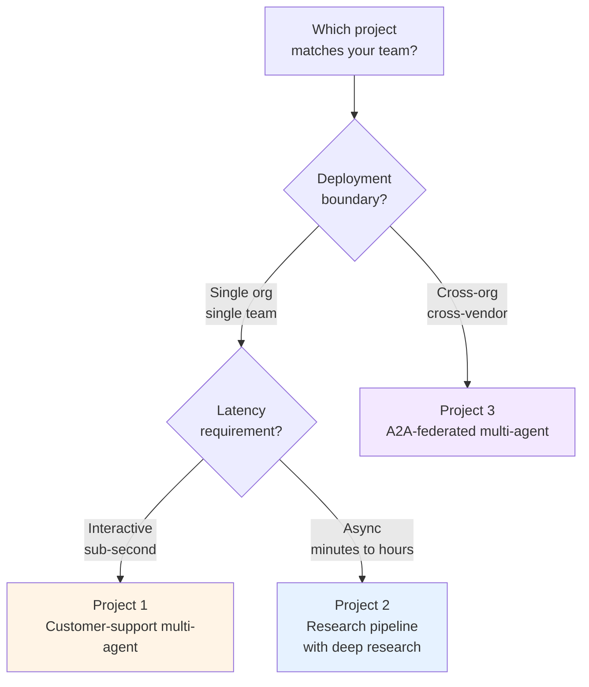

# Path 03 Projects — Production-Deployable Multi-Agent Capstones

> 🔴 Advanced · ⏱ ~35-50 min reading per project · 🛠 ~3-10 day build per project · 📍 Read after at least one of {Lab 10, Lab 12, Lab 13, Lab 14, Lab 15} and the [Path 03 v2 patterns](../patterns/) directory

This directory contains **production-deployable capstone projects** for Path 03 — multi-day builds that integrate Path 03 v1 labs (10-16), Path 03 v2 patterns (handoff contracts, shared-state boundaries, escalation, cost budgeting, retry policies, provenance), the [top-level patterns catalog](../../../patterns/), and Path 04's [MCP](../../04-tool-protocols-mcp-a2a/) + A2A protocols into realistic deployment shapes.

Where v1 labs taught the from-scratch implementation and v2 patterns documented reusable mechanisms, **projects are the full builds**. A pattern tells you the mechanism; a project gives you the milestones, the acceptance rubric, the failure modes, and the cost envelope for actually shipping the thing.

## The v3 ladder

Each layer answers a different question; projects sit at the top:

| Layer | Granularity | Shape | Reading time |
|-------|-------------|-------|--------------|
| [Concepts](../../../concepts/multi-agent/) (v1) | One topic per page | Explanatory | ~10-15 min |
| [Labs](../../../labs/) (v1) | One executable skill per notebook | Hands-on code | ~60-110 min |
| [v2 Patterns](../patterns/) (Batches 39+41) | Cross-cutting mechanism | Mechanism documentation | ~12-15 min |
| [Top-level patterns](../../../patterns/) (Batches 44-52) | Architectural shape | Architecture documentation | ~10-15 min |
| **Projects** (Batch 53) | End-to-end capstone build | Build brief + milestones + rubric | **~35-50 min read + multi-day build** |

The projects are deliberately the longest reading time because they include the full build sequence — milestones, acceptance rubric, failure modes, cost envelope. That structure is what makes them capstone briefs rather than longer recipes.

## How Path 03 projects differ from the top-level `/projects/` directory

The repo has a separate top-level [`/projects/`](../../../projects/) directory for **multi-path build challenges** (personal research assistant, PDF Q&A bot, financial research analyst) organized into beginner/intermediate/capstone tiers. Those projects span multiple paths.

Path 03 projects are different: **multi-agent-specific capstones** that integrate Path 03 labs + v2 patterns + top-level pattern catalog into a production multi-agent stack. They're not multi-path crossovers; they're deep dives on one production discipline.

The two directories are orthogonal. A learner finishing a top-level capstone (e.g., financial research analyst) can use Path 03 Project 2 (Research pipeline) as the multi-agent core for it.

## The three projects

| # | Project | Build for | Composes |
|---|---------|-----------|----------|
| 1 | [Customer-support multi-agent](./01-customer-support-multi-agent.md) | Teams shipping their first multi-agent product; intermediate complexity; LangGraph-rooted | [Pattern 02 (Router)](../../../patterns/02-router.md) + [Pattern 03 (Supervisor + workers)](../../../patterns/03-supervisor-workers.md) + [Path 03 v2 patterns 01, 03, 05](../patterns/) |
| 2 | [Research pipeline with deep research](./02-research-pipeline-with-deep-research.md) | Teams needing long-running research workloads; advanced; framework-flexible | [Pattern 06 (Plan-and-execute)](../../../patterns/06-plan-and-execute.md) + [Pattern 07 (Reflection)](../../../patterns/07-reflection.md) + [Pattern 08 (Agentic RAG)](../../../patterns/08-agentic-rag.md) + [Pattern 09 (Deep research)](../../../patterns/09-deep-research.md) + [Path 03 v2 patterns 04, 06](../patterns/) |
| 3 | [A2A-federated multi-agent](./03-a2a-federated-multi-agent.md) | Cross-organization deployments; most advanced; requires Path 04 completion | [Pattern 11 (MCP)](../../../patterns/11-mcp-integration.md) + [Pattern 12 (A2A federation)](../../../patterns/12-a2a-federation.md) + [Pattern 03 (Supervisor + workers)](../../../patterns/03-supervisor-workers.md) + [Path 03 v2 patterns 01, 06](../patterns/) |

## Pick-a-project decision aid

Three primary axes distinguish the projects. Project 1 is **single-org, interactive UX** — chat-speed customer-facing flows where a triage agent dispatches to specialists. Project 2 is **single-org, async batch** — research workloads where the user kicks off a task and reads a report later. Project 3 is **cross-org, async-or-interactive** — agents from different organizations and frameworks coordinating via A2A, with MCP as the tool-access layer.

The projects build in roughly increasing order of complexity (1 → 2 → 3), but they're not strictly sequential. A team running cross-org workflows out of the gate can skip directly to Project 3 if they have the Path 04 prerequisites solid.

## What the projects share

All three projects follow the same 12-section shape (modeled after [Path 06 v2 projects](../../06-evaluation-observability/projects/)):

1. **Project brief** — what you're building; deployment target; scale assumption.
2. **Prerequisites** — required Path 03 labs, v2 patterns, top-level patterns, Path 04 modules (if applicable).
3. **What you'll have when done** — concrete deliverable list (8-12 items).
4. **Architecture at a glance** — one detailed mermaid diagram of the full system.
5. **Build milestones** — 4-7 ordered milestones, each with goal, scope, time estimate, "done when" check.
6. **The integration layer** — table mapping each milestone to the Path 03 + Path 04 + patterns content it builds on.
7. **Acceptance rubric** — 6-11 testable PR-review criteria.
8. **Common failure modes and recoveries** — 5-8 mistakes that derail teams.
9. **Operational checklist (pre-launch)** — 12-18 items.
10. **Cost envelope** — monthly cost at 10K / 100K / 1M conversations.
11. **Extensions and where to go next** — 4-6 follow-ups.
12. **References + further reading**.

The four sections that distinguish projects from patterns — **milestones, integration layer, acceptance rubric, failure modes** — are what make them capstone briefs rather than mechanism documentation.

## What projects are not

- **Not full Docker Compose files or Kubernetes manifests.** Projects show the structural patterns; the specific YAMLs are organizationally-specific (your cloud, your secrets manager, your security posture).
- **Not starter or solution code.** The top-level `/projects/` directory uses those; Path 03 v3 projects are documentation-only build briefs. Learners reuse the existing Path 03 lab notebooks (Labs 10-16) as the starter and adapt them to the deployment target.
- **Not a substitute for production engineering judgment.** The acceptance rubric is the minimum bar; your team's domain, scale, and risk tolerance will push the bar higher in places the rubric doesn't anticipate.
- **Not a deployment runbook.** Projects get you to a deployable stack; the team's own runbook covers incident response, secret rotation, model swap-outs, compliance audits.

## Reading order

If you're new to Path 03: read the [v1 modules](../README.md) first, then [v2 patterns](../patterns/), then come back here.

If you're picking a project to build: skim the three project briefs in order (1 → 2 → 3), then use the decision tree above to pick. Project 1 is the smallest commitment (3-5 days); Project 3 is the largest (6-10 days, plus Path 04 prerequisites that may take their own days).

If you're auditing an existing production multi-agent stack: read whichever project matches your deployment shape, then use its 12-section structure as a self-audit checklist for any deployment, whether you built it from scratch following the project or built it independently.

## Version notes

Projects are classified **fast-moving** by content (tool versions, cost claims, specific pinned APIs) and **slow-moving** by structure (the milestones, the integration table, the acceptance rubric).

Each project carries a `verified YYYY-MM-DD` stamp at the top. The cost-envelope numbers carry the highest age-out risk; reverify against current vendor pricing before committing budgets. The milestone sequence and integration layer are more stable — the architecture patterns don't shift quarterly. The framework references (LangGraph version, OpenAI Agents SDK version, A2A SDK version) age fastest; re-check the docs for any breaking changes since the verified-on date.

## Contributing

The [`_template.md`](./_template.md) walks through each section with prompts. The right time to add a fourth project is when a deployment shape isn't covered (e.g., on-prem-only multi-agent with no external API dependencies; serverless multi-agent on Modal or Lambda; mobile/edge multi-agent with constrained connectivity). Open a PR; a maintainer reviews against the shared shape.
