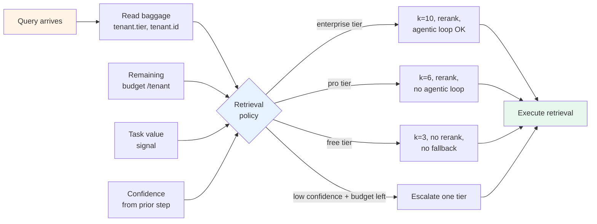

# Pattern 1 — Cost-aware retrieval

> 🟢 Stable · ⏱ ~15 min · 🛠 Verified 2026-05-26 · 📍 Module 6 anchor (cost attribution + adaptive sampling)

## Intent

Adapt retrieval decisions — top-k, reranking, web fallback, agentic loop — by a four-input policy: `{tenant_tier, task_value, remaining_budget, retrieval_confidence}`. Cheap queries get cheap retrieval; expensive paths fire only when the cost is earned.

Without this pattern, teams default to "best retrieval for everyone" — k=8, always rerank, always agentic — and watch retrieval cost grow linearly with traffic regardless of whether each query needed it. With this pattern, retrieval cost grows with **what each query actually needs**.

## When to use this pattern

- **Multi-tenant SaaS** where tenants pay different tiers and you need to bound their per-query cost without explicit rate-limiting on the API itself.
- **Mixed query workloads** where some queries are quick lookups (k=3, no rerank) and others need deep research (k=10, rerank, web fallback) — and the queries are mixed in the same stream.
- **Budget-constrained periods** (end-of-month spend tracking, finance-team-imposed limits) where the system should gracefully degrade rather than fail.
- **High-volume, high-variance retrieval** where the cost is dominated by retrieval (typical when k > 5 with reranking; Kalviumlabs 2026 documents the k=3 → k=8 path causing ~100× per-query context cost increase).

## When NOT to use

- **Single-tenant prototype** with fixed cost ceiling per query. Just pick a sensible default and skip the policy machinery.
- **Quality-non-negotiable domains** (legal, medical, financial — where a wrong answer has compliance cost > the LLM cost). Run the expensive pipeline on everything; the cost of the policy mistake is bigger than the cost of running everything.
- **Without Module 6 instrumentation in place.** The pattern needs baggage propagation (`tenant.id`, `tenant.tier`) and cost tracking (`gen_ai.usage.total_cost_usd`). If you don't have those, build them first ([Lab 21](../../../labs/21-cost-attribution-and-adaptive-sampling/)).
- **As a substitute for relevance evaluation.** Cost-aware retrieval optimizes the **price-quality frontier**; it doesn't lift the absolute quality ceiling. A pipeline that's cheap but always wrong is worse than the expensive pipeline.

## The mechanism

A retrieval policy function consumes four signals and returns retrieval settings:



The four inputs:

- **`tenant_tier`** — read from baggage. Three-level default (`free`, `pro`, `enterprise`); collapse to two or extend to five depending on your business shape.
- **`task_value`** — explicit signal from the calling code. Examples: `value=low` for autocomplete suggestions, `value=high` for end-of-quarter report generation. Defaults to `medium` if not set.
- **`remaining_budget`** — your cost-attribution metric exposes per-tenant spend so far this billing cycle; the policy reads it. Below the budget floor → degrade; near the ceiling → emergency-only retrieval.
- **`retrieval_confidence`** — if a prior retrieval step ran (e.g., dense baseline before considering reranking), the confidence score on that result feeds the next decision. Below threshold → escalate retrieval; above threshold → stop.

The policy table is small enough to fit on a runbook page. Tier defaults are the baseline; task value and confidence let the policy override per-query.

## Implementation sketch

```python
from dataclasses import dataclass
from opentelemetry import baggage

@dataclass
class RetrievalSettings:
    k: int
    rerank: bool
    web_fallback: bool
    agentic_loop: bool

POLICY = {
    # (tier, task_value, has_budget): settings
    ("enterprise", "high",   True):  RetrievalSettings(k=10, rerank=True,  web_fallback=True,  agentic_loop=True),
    ("enterprise", "medium", True):  RetrievalSettings(k=8,  rerank=True,  web_fallback=False, agentic_loop=False),
    ("pro",        "high",   True):  RetrievalSettings(k=8,  rerank=True,  web_fallback=False, agentic_loop=False),
    ("pro",        "medium", True):  RetrievalSettings(k=6,  rerank=True,  web_fallback=False, agentic_loop=False),
    ("free",       "high",   True):  RetrievalSettings(k=5,  rerank=False, web_fallback=False, agentic_loop=False),
    ("free",       "medium", True):  RetrievalSettings(k=3,  rerank=False, web_fallback=False, agentic_loop=False),
    # Emergency-only fallback when budget is exhausted
    ("any", "any", False):           RetrievalSettings(k=3,  rerank=False, web_fallback=False, agentic_loop=False),
}

def get_retrieval_settings(
    task_value: str = "medium",
    confidence: float | None = None,
    budget_remaining: float = float("inf"),
) -> RetrievalSettings:
    tier = baggage.get_baggage("tenant.tier") or "free"
    has_budget = budget_remaining > 0
    if not has_budget:
        return POLICY[("any", "any", False)]
    base = POLICY.get((tier, task_value, True), POLICY[("free", "medium", True)])
    # Confidence escalation: if a prior retrieval returned low confidence and we
    # have budget headroom, bump one tier (k+2, enable rerank).
    if confidence is not None and confidence < 0.65 and budget_remaining > 1.0:
        return RetrievalSettings(
            k=base.k + 2,
            rerank=True,
            web_fallback=base.web_fallback,
            agentic_loop=base.agentic_loop,
        )
    return base
```

In the retrieval pipeline:

```python
settings = get_retrieval_settings(task_value=req.task_value, budget_remaining=tenant_budget_remaining(req.tenant_id))
results = vector_search(query=req.query, k=settings.k)
if settings.rerank:
    results = cross_encoder_rerank(results, query=req.query)

# After first retrieval, optionally escalate if confidence is low
conf = retrieval_confidence(results)
if conf < 0.65 and settings.web_fallback:
    web_results = web_search_fallback(req.query)
    results = merge_results(results, web_results)
```

The full Lab 21 patterns (baggage attribution, cost-driven sampling) apply unchanged — this pattern adds the **retrieval-policy consumer** on top of the cost-attribution producer.

→ See [`concepts/evaluation/cost-attribution.md`](../../../concepts/evaluation/cost-attribution.md) for the baggage propagation contract; [Lab 21](../../../labs/21-cost-attribution-and-adaptive-sampling/) for the cost-driven sampling that makes the budget signal available.

## How this combines with recipes

| Recipe | Where this pattern plugs in |
|--------|------------------------------|
| Recipe 1 — LangSmith-native | The retrieval policy lives in app code; `@traceable` on the retrieval helper captures the settings as run metadata, surfaceable in LangSmith filters. Drop-in. |
| Recipe 2 — OpenTelemetry-native | Tenant tier propagates via OTel baggage (already in the recipe's Step 3). The retrieval policy reads baggage; results emit as span attributes including `retrieval.k`, `retrieval.reranked`, `retrieval.tier_applied`. APM dashboards slice by these. |
| Recipe 3 — Hybrid | Same as Recipe 2 for the OTel-emitting side. The `langsmith.metadata.*` hints can carry retrieval-policy decisions so LangSmith filters see them too. The eval-subset routing in the Collector benefits — `enterprise` tier traces are more likely to be routed to LangSmith for eval. |

The pattern is recipe-agnostic in shape; only the **observability hooks** vary by recipe.

## Tradeoffs and what this misses

**Tradeoffs**:

- **Cold-start risk for new tenants.** A new enterprise tenant starts with empty budget tracking; the policy needs a sensible default (treat as full-budget for the first week, then apply normal rules).
- **Confidence-score quality matters.** If the confidence signal is noisy, the escalation loop fires erratically, defeating cost predictability. Calibrate confidence against a small gold set before deploying the escalation path.
- **Policy-table maintenance.** The {tier × task_value × budget} table grows fast. Three tiers × three values × budget-binary = 18 cells; add a fourth tier and it's 24. Keep the table flat; if you find yourself wanting a fifth dimension, you probably need a different abstraction.
- **Latency floor doesn't move.** The free-tier path is still a real vector search; cost-aware retrieval reduces *expense*, not floor latency. If your free-tier latency budget is tight, the floor doesn't get cheaper by skipping rerank.

**What this pattern doesn't address**:

- **Retrieval quality measurement.** The pattern decides *which* pipeline runs; it doesn't tell you whether the cheap pipeline produces acceptable quality. Pair with offline eval ([Lab 09](../../../labs/09-evaluating-agentic-rag/)) per-tier to confirm the price-quality frontier you've picked makes sense.
- **Embedding-drift detection.** If the query distribution shifts (new tenant, new product), the confidence threshold may need retuning. Drift detection on retrieval scores is a complementary pattern — Path 02 v2 territory, not Path 06.
- **Cache management.** Semantic caching at the retrieval layer cuts cost by ~68.8% in typical production workloads (Redis 2026 reports) and is orthogonal to this pattern. Add caching first if it's not in place; cost-aware retrieval is the second layer.
- **Tier abuse detection.** A free-tier tenant generating enterprise-scale traffic isn't a retrieval-policy problem; it's an account-policy problem. Out of scope.

## References

- [`concepts/evaluation/cost-attribution.md`](../../../concepts/evaluation/cost-attribution.md) — OTel baggage propagation; the tier/tenant signal source.
- [`concepts/evaluation/adaptive-sampling.md`](../../../concepts/evaluation/adaptive-sampling.md) — cost-driven sampling policies; the budget signal source.
- [Lab 21 — Cost attribution and adaptive sampling](../../../labs/21-cost-attribution-and-adaptive-sampling/) — the working implementation of baggage + cost-driven sampling.
- [Lab 09 — Evaluating agentic RAG](../../../labs/09-evaluating-agentic-rag/) — how to measure retrieval quality per-tier so you know the price-quality frontier is acceptable.
- Recipe 1 / 2 / 3 — production deployments this pattern plugs into.
- Kalviumlabs (May 2026), *RAG in Production: Cost Surprises After Sprint 3* — [kalviumlabs.ai/blog](https://www.kalviumlabs.ai/blog/rag-in-production-what-it-actually-costs-after-sprint-3/) — the k=3 → k=8 cost explosion data.
- MarsDevs (May 2026), *Agentic RAG: The 2026 Production Guide* — [marsdevs.com](https://www.marsdevs.com/guides/agentic-rag-2026-guide) — the CRAG-style retrieval-evaluator threshold pattern that anchors confidence escalation.
- Redis blog (May 2026), *RAG at Scale: How to Build Production AI Systems in 2026* — [redis.io/blog](https://redis.io/blog/rag-at-scale/) — semantic caching as the complementary layer.
- Lushbinary (April 2026), *RAG Production Guide 2026* — [lushbinary.com](https://lushbinary.com/blog/rag-retrieval-augmented-generation-production-guide/) — Hybrid+Rerank as production default; Agentic RAG reserved for non-negotiable accuracy.
