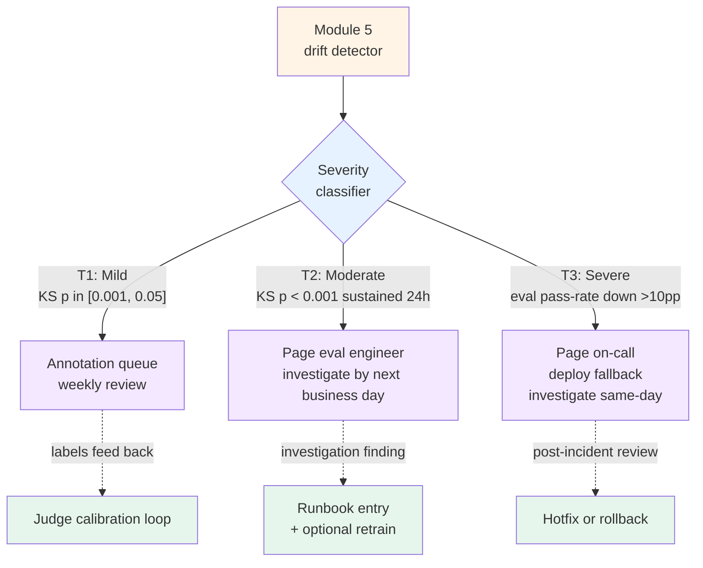

# Pattern 2 — Drift-triggered review

> 🟢 Stable · ⏱ ~15 min · 🛠 Verified 2026-05-26 · 📍 Module 5 anchor (drift detection + judge calibration)

## Intent

When drift signals fire, route the affected traces to a human review queue with severity-tiered urgency — **don't auto-retrain by default**. Auto-retrain is the special case; investigated, human-acknowledged response is the default. Drift detection is a *signal to look*, not a *signal to ship*.

The common anti-pattern: a drift alert triggers an automatic retraining job; the new model deploys without anyone having looked at what drifted. The new model handles the drift cleanly. It also silently makes a different kind of mistake that nobody catches until a customer complains a month later. The retraining covered up the diagnostic signal instead of resolving it.

## When to use this pattern

- **You have Module 5 drift detection running** — KS / PSI / Wasserstein on evaluator score streams ([Lab 20](../../../labs/20-drift-detection-and-calibration/)). Without the upstream detector, this pattern has no signals to consume.
- **You have multiple drift causes possible**: distribution shift from new tenants, prompt changes, model provider updates ("silent provider weight update" failure mode), seasonal traffic patterns, genuine concept drift. The tiered response lets you separate "needs investigation" from "needs hotfix" from "needs nothing."
- **You have a human-in-the-loop annotation infrastructure** — LangSmith annotation queues, internal review tools, or even a Slack channel + spreadsheet. The pattern needs somewhere to route the traces.
- **You're past the prototype stage** — the cost of false-positive drift alerts (paging engineers, wasted review time) is real, and the cost of false negatives (missing real drift) is also real. Tiered response trades these off explicitly.

## When NOT to use

- **Pure ML model serving** (not LLM) with frequent retraining baked in. Classical ML has a much shorter retraining cadence; the "investigate first" framing fits LLM agents better than recommendation models.
- **Pre-drift-detection deployments.** This pattern is a workflow on top of detection; build detection first. The Module 5 + Lab 20 work has to be running.
- **Single-tier "drift = page on-call" stacks.** If your team has only the binary alert/no-alert level, you don't need the three-tier mechanism — you have one tier. Adopt this pattern once the binary alert is firing often enough that tiering earns its complexity.
- **High-frequency batch retraining workflows.** Some teams retrain hourly or daily as a matter of course; for them, drift just informs the next training run rather than triggering a workflow. Different deployment shape.

## The mechanism

Three response tiers keyed to drift severity. Each tier has explicit thresholds, a routing destination, and an investigation owner.



The three tiers in detail:

### Tier 1 — Mild drift → annotation queue

- **Signal**: KS-test `p ∈ [0.001, 0.05]`, or PSI ∈ [0.1, 0.25], on the evaluator score stream rolling-window vs baseline.
- **Action**: Sample 20-50 affected traces into the annotation queue. Tag with the drift signal that triggered the routing.
- **Investigation cadence**: weekly review by the eval engineer. Not urgent.
- **Purpose**: Build calibration data for the judge — if drift is real, the annotation labels will show it; if drift is noise, the labels confirm the judge is still aligned.
- **Anti-paging**: do not page on T1. T1 is the slow-burn diagnostic signal.

### Tier 2 — Moderate drift → eval engineer page

- **Signal**: KS-test `p < 0.001` sustained ≥ 24h, OR PSI > 0.25, OR a coordinated movement across multiple evaluators simultaneously.
- **Action**: Page the eval engineer (Slack/PagerDuty/Opsgenie — whichever your team uses). Expand sampling to 100-200 affected traces. Suspend any in-flight A/B experiments until investigation completes.
- **Investigation cadence**: investigate by next business day. Document the cause in the team runbook.
- **Purpose**: Real drift is happening; you need a human looking at *what* is shifting before deciding the response. Common diagnoses: new tenant onboarded with different traffic mix; prompt change shipped recently; LLM provider silently updated a model.
- **Decision outcome**: continue (drift is legitimate distribution shift), recalibrate judge (rubric needs tightening), or escalate to Tier 3 (degradation is worse than initial threshold suggested).

### Tier 3 — Severe drift → on-call page

- **Signal**: eval pass-rate drop > 10 percentage points compared to 7-day baseline (this is the "users-are-noticing" threshold). OR coordinated 2-tier signal escalation from Tier 2 over multiple hours.
- **Action**: Page on-call. Deploy fallback model or rollback recent changes. Open an incident.
- **Investigation cadence**: same-day. Post-incident review within the week.
- **Purpose**: Customer-visible degradation is in progress. The first move is restoring service; investigation is concurrent.
- **Decision outcome**: hotfix, rollback, or — only after investigation — a deliberate retraining decision.

The retraining decision is **downstream of investigation, not automatic from any tier**. Tier 1 builds calibration data; Tier 2 produces a runbook entry; Tier 3 produces an incident report. Each can result in a retrain — but the retrain is a human-acknowledged engineering decision, not a signal-triggered automation.

## Implementation sketch

The detector emits a severity classification; the workflow router consumes it. Using the Module 5 + Lab 20 rolling-window detector as the upstream:

```python
from dataclasses import dataclass
from enum import Enum

class DriftSeverity(Enum):
    NONE = 0
    MILD = 1
    MODERATE = 2
    SEVERE = 3

@dataclass
class DriftEvent:
    metric_name: str            # e.g., "eval.faithfulness"
    ks_p_value: float
    psi: float
    pass_rate_delta_pp: float   # change in eval pass-rate, percentage points
    sustained_hours: float      # how long the signal has been firing
    affected_trace_ids: list[str]

def classify_drift(event: DriftEvent) -> DriftSeverity:
    # Tier 3: customer-visible degradation
    if event.pass_rate_delta_pp <= -10:
        return DriftSeverity.SEVERE
    # Tier 2: sustained moderate signal
    if (event.ks_p_value < 0.001 and event.sustained_hours >= 24) or event.psi > 0.25:
        return DriftSeverity.MODERATE
    # Tier 1: weak signal worth annotating
    if 0.001 <= event.ks_p_value <= 0.05 or 0.1 <= event.psi <= 0.25:
        return DriftSeverity.MILD
    return DriftSeverity.NONE

def route_drift_event(event: DriftEvent):
    severity = classify_drift(event)
    if severity == DriftSeverity.MILD:
        sample_to_annotation_queue(
            trace_ids=event.affected_trace_ids[:50],
            tag=f"drift-tier1-{event.metric_name}",
        )
    elif severity == DriftSeverity.MODERATE:
        page_eval_engineer(
            severity="moderate",
            event=event,
            sample_traces=event.affected_trace_ids[:200],
        )
        suspend_active_experiments(reason=f"drift on {event.metric_name}")
    elif severity == DriftSeverity.SEVERE:
        page_oncall(severity="critical", event=event)
        deploy_fallback_model()
        open_incident(metric=event.metric_name, delta_pp=event.pass_rate_delta_pp)
```

Three things worth flagging in the sketch:

1. **`sustained_hours`** is a first-class input. A single noisy datapoint doesn't escalate to Tier 2; the signal has to hold for 24 hours. This is the most common source of false positives — eliminate it by requiring sustained duration.
2. **`pass_rate_delta_pp`** is the user-visible signal that overrides statistical-test ambiguity. If pass rate drops 15 percentage points, you go to Tier 3 regardless of what KS or PSI say.
3. **Routing is side-effectful and idempotent.** `sample_to_annotation_queue` and `page_eval_engineer` should deduplicate — a single drift event firing multiple times in the same window shouldn't generate multiple pages.

→ See [`concepts/evaluation/drift-detection.md`](../../../concepts/evaluation/drift-detection.md) for the KS / PSI thresholds; [Lab 20](../../../labs/20-drift-detection-and-calibration/) for the working rolling-window detector that feeds this pattern.

## How this combines with recipes

| Recipe | Where this pattern plugs in |
|--------|------------------------------|
| Recipe 1 — LangSmith-native | Tier 1 routing is LangSmith annotation queues (already in Recipe 1's Step 5). Tier 2/3 hooks into your team's paging tool (Slack/PagerDuty); LangSmith doesn't host this part. The drift detection runs against LangSmith Dataset diffs + the Lab 20 statistical tests on the score arrays. |
| Recipe 2 — OpenTelemetry-native | Drift detection is in the metrics pipeline (Recipe 2's Step 5). Severity classification is a worker process. Routing destinations: annotation queue (whichever tool your team uses; e.g., Datadog incidents or custom internal tool), eval engineer paging (PagerDuty/Opsgenie via APM integration), on-call paging (same channel as the rest of the stack). |
| Recipe 3 — Hybrid | Best of both: drift detection runs in the APM (operational truth); annotation queue is in LangSmith (eval truth). The severity classifier reads from APM metrics and routes T1 → LangSmith, T2/T3 → APM-integrated paging. This is where the recipe's hand-off discipline section earns its keep — the boundary is explicit. |

The pattern reuses the underlying drift detection from Module 5 across all three recipes; only the routing destinations vary.

## Tradeoffs and what this misses

**Tradeoffs**:

- **Threshold tuning is empirical.** The KS p-value bands and the -10pp severe threshold are defaults; your team's false-positive tolerance determines the right values. Start with the defaults; tune after the first month based on alert-fatigue feedback.
- **Annotation queue can grow.** Tier 1 routes traces to humans; if no one reviews the queue, it accumulates. Operationalize: weekly queue review on the calendar; queue size monitoring; cap on auto-routed traces per metric per day.
- **Pager fatigue at Tier 2 is the failure mode.** If Tier 2 fires more than ~1/week consistently, the threshold is too sensitive. Tune up `sustained_hours` first; consider tightening the PSI threshold second.
- **Cost of investigation vs cost of retrain.** For teams with cheap retraining (open-weight model, low retrain cost), the threshold for "investigate first" is higher. For teams with expensive retraining (proprietary API tuning, weeks of preparation), investigation is the cheaper default.

**What this pattern doesn't address**:

- **Root-cause analysis of detected drift.** The pattern routes the signal; it doesn't tell you *what's* drifting (corpus update, model update, traffic shift, prompt change). Pair with version-tracking on prompts, models, and corpora ([Lab 19](../../../labs/19-online-evaluation-and-sampling/) demonstrates the trace-level metadata that supports root-cause queries).
- **Retraining decision logic.** When investigation concludes that retraining is the right response, *what* to retrain on and *how* to validate the new model is a separate workflow. This pattern hands off to that workflow; it doesn't subsume it.
- **Cross-tenant drift correlation.** A drift signal affecting only one tenant is different from one affecting all tenants. The pattern as written treats them uniformly; production extensions should slice by `tenant.id` before classification.
- **Rollback automation.** Tier 3's "deploy fallback model" is shown as a function call; the actual fallback infrastructure (model versioning, traffic splitting, gradual rollout) is deployment-infrastructure work outside this pattern's scope.

## References

- [`concepts/evaluation/drift-detection.md`](../../../concepts/evaluation/drift-detection.md) — the KS / PSI / Wasserstein math and the "silent provider weight update" failure mode.
- [`concepts/evaluation/agent-as-judge-calibration.md`](../../../concepts/evaluation/agent-as-judge-calibration.md) — Cohen's κ; how the annotation labels from Tier 1 feed the calibration loop.
- [Lab 20 — Drift detection and calibration](../../../labs/20-drift-detection-and-calibration/) — the working rolling-window detector that this pattern routes from.
- Recipe 1 / 2 / 3 — production deployments this pattern plugs into.
- Label Your Data (Sept 2025), *Data Drift: Key Detection and Monitoring Techniques in 2026* — [labelyourdata.com](https://labelyourdata.com/articles/machine-learning/data-drift) — the tiered drift response framing ("automate retraining on small drifts, human review for moderate ones, emergency intervention for severe shifts").
- Kili Technology (Feb 2026), *Human-in-the-Loop, Human-on-the-Loop, and LLM-as-a-Judge for Validating AI Outputs* — [kili-technology.com/blog](https://kili-technology.com/blog/human-in-the-loop-human-on-the-loop-and-llm-as-a-judge-for-validating-ai-outputs) — the HITL vs HOTL distinction; this pattern is HOTL-shaped.
- Braintrust (April 2026), *8 best human-in-the-loop LLM evaluation platforms in 2026* — [braintrust.dev/articles](https://www.braintrust.dev/articles/best-human-in-the-loop-llm-evaluation-platforms-2026) — confirms that "ongoing calibration workflows" are underdeveloped in current platforms (the gap this pattern fills).
- Galileo (March 2026), *9 Best LLM Drift Monitoring Platforms in 2026* — [galileo.ai/blog](https://galileo.ai/blog/best-llm-output-drift-monitoring-platforms) — platform landscape; useful for picking the upstream detector if you don't want to build it.
