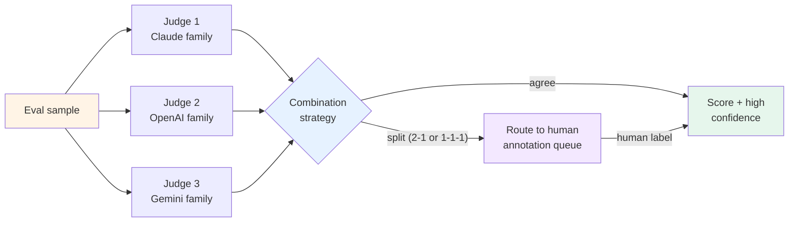

# Pattern 3 — Judge ensemble

> 🟢 Stable · ⏱ ~15 min · 🛠 Verified 2026-05-26 · 📍 Module 4 + Module 5 anchors (online evaluation + judge calibration)

## Intent

When a single LLM-as-judge isn't trustworthy enough — high-stakes evaluations, launch decisions, win-rate comparisons sitting in the noise band near 50% — combine multiple judges from different model families and aggregate their verdicts. Three combination strategies cover the realistic production cases: **majority vote** (simple, works on independent errors), **weighted vote** (judges weighted by their per-task κ against humans), and **disagreement routing** (split verdicts go to a human review queue).

The mid-2026 industry-realistic default for high-stakes work is three judges across three model families. The cost is 3× a single judge, the benefit is that family-specific biases cancel.

## When to use this pattern

- **Launch decisions** — going/no-going a model release, a prompt change, a routing-logic change. The cost of being wrong outweighs the 3× ensemble cost.
- **Win-rate comparisons in the noise band** — model A vs model B at 52/48 win-rate is in single-judge noise; ensemble reduces that variance.
- **Regulated or compliance-sensitive evaluations** — domains where the audit trail benefits from "three judges agreed" rather than "the judge said."
- **High-disagreement task domains** — open-ended generation tasks (summarization, dialogue) where single-judge variance is high. The ensemble narrows the confidence interval.

## When NOT to use

- **Routine weekly trend tracking.** Single judge with periodic calibration against a gold set is fine — the trend signal is robust to a single judge's biases when the same judge runs week over week. Ensemble is for absolute scoring, not trending.
- **Tight latency budgets.** Three sequential API calls per evaluation triple the latency. If your evaluation has to run in < 1s, the ensemble is too slow; consider running judges in parallel (if API parallelism allows) or picking a single low-bias judge.
- **Budget-constrained eval pipelines.** 3× cost is real. If your eval budget is already tight, reserve ensemble for the launch-decision subset (Tier 3 of [Pattern 2 — drift-triggered review](./02-drift-triggered-review.md)); keep single-judge for the daily monitoring volume.
- **Without per-judge calibration data.** Weighted vote needs per-judge κ; if you don't have it, default to unweighted majority. Don't synthesize weights from intuition.
- **When all available judges share a bias source.** Running three OpenAI models doesn't cancel OpenAI-family biases. The pattern only works when the model families are genuinely distinct.

## The mechanism

Three judges produce three scores. The combination strategy converts the three scores into a single decision plus a confidence/uncertainty signal:



The three combination strategies:

### Majority vote — simple baseline

- All judges have equal weight.
- The score is the modal verdict; if the verdict is binary (pass/fail), majority wins.
- Works when judge errors are independent — different families → different bias directions → averaging cancels.
- **Known failure mode**: correlated bias. If two of three judges share a bias source (e.g., "verbosity preference"), majority of three becomes "the two biased ones agree" and the third gets outvoted. The AgentAuditor paper (Feb 2026) documents this — "majority-wrong" cases where the minority answer is better supported by evidence.

### Weighted vote — per-judge κ as weights

- Each judge's vote is multiplied by its agreement-with-human κ on a held-out calibration set.
- Higher-κ judges count more; lower-κ judges count less but still contribute.
- Reduces the correlated-bias problem when one judge is reliably more accurate than the others on this task.
- **Requires**: a per-judge × per-task calibration sample. Lab 20's calibration discipline (90/10 split, Cohen's κ measurement) is the prerequisite.

### Disagreement routing — reserve human bandwidth

- When the verdicts split (2-1 in a 3-judge ensemble, or 1-1-1 in some setups), route the sample to a human annotation queue.
- Agreement cases get the auto-determined score; disagreement cases get human labels.
- **The leverage**: in practice, judges agree ~70-85% of the time. Routing the 15-30% disagreement subset to humans concentrates the human review budget on the cases where it actually moves the needle.
- **Implication for Pattern 2**: disagreement-routed samples *feed* the annotation queue that the drift-triggered review pattern also feeds. Same queue, multiple producers.

The three strategies compose:

| Combo strategy | Typical cost | Typical use |
|----------------|-------------|-------------|
| Majority vote | 3× single | Baseline; no calibration data available |
| Weighted vote | 3× single + κ calibration overhead | When you have per-judge κ; high-stakes |
| Disagreement routing | 3× single + human-review cost on disagreements | When human review bandwidth is the binding constraint; reserves humans for hard cases |

Production teams often combine: weighted-vote for the score, disagreement routing as a second layer (route splits even after weighting).

## Implementation sketch

The three-judge call + the three combination strategies:

```python
from dataclasses import dataclass

@dataclass
class JudgeVerdict:
    judge_id: str           # e.g., "claude-sonnet-4.5", "gpt-5.1", "gemini-2.5-pro"
    score: float            # 0.0 to 1.0
    verdict: str            # e.g., "pass" / "fail", or one of an ordinal label set

def run_judge_ensemble(sample, judges) -> list[JudgeVerdict]:
    return [judge.score(sample) for judge in judges]

# --- Combination strategies ---

def majority_vote(verdicts: list[JudgeVerdict]) -> dict:
    from collections import Counter
    counts = Counter(v.verdict for v in verdicts)
    top_verdict, top_count = counts.most_common(1)[0]
    return {
        "verdict": top_verdict,
        "score": sum(v.score for v in verdicts if v.verdict == top_verdict) / top_count,
        "agreement": top_count / len(verdicts),
        "unanimous": top_count == len(verdicts),
    }

def weighted_vote(verdicts: list[JudgeVerdict], weights: dict[str, float]) -> dict:
    # weights = per-judge kappa from a calibration set, normalized to sum to 1
    weighted_scores: dict[str, float] = {}
    for v in verdicts:
        w = weights.get(v.judge_id, 1.0 / len(verdicts))
        weighted_scores[v.verdict] = weighted_scores.get(v.verdict, 0.0) + w
    top_verdict = max(weighted_scores, key=weighted_scores.get)
    return {
        "verdict": top_verdict,
        "weighted_score": weighted_scores[top_verdict],
        "needs_human_review": weighted_scores[top_verdict] < 0.66,  # tunable threshold
    }

def with_disagreement_routing(verdicts: list[JudgeVerdict], min_agreement: float = 0.67) -> dict:
    base = majority_vote(verdicts)
    if base["agreement"] < min_agreement:
        return {**base, "needs_human_review": True, "reason": "judges_split"}
    return {**base, "needs_human_review": False}

# --- Usage ---

judges = [
    AnthropicJudge(model="claude-sonnet-4.5"),
    OpenAIJudge(model="gpt-5.1"),
    GoogleJudge(model="gemini-2.5-pro"),
]
verdicts = run_judge_ensemble(sample, judges)
result = with_disagreement_routing(verdicts)
if result["needs_human_review"]:
    queue.add(sample, verdicts=verdicts, reason=result["reason"])
else:
    log_eval_score(sample, score=result["score"], confidence=result["agreement"])
```

Three things worth flagging:

1. **The three model families come from FutureAGI's May 2026 production-realistic default** — Claude Sonnet 4.5 + GPT-5.1 + Gemini 2.5 Pro. The principle (cross-family) matters more than the specific models; substitute current-as-of-your-deployment frontier models.
2. **The `min_agreement` threshold** is the tunable parameter. 0.67 means "2-of-3 majority is enough"; 1.0 means "demand unanimity." Tune based on how much human review budget you have.
3. **Don't ensemble the judges and the candidate**. If you're evaluating an OpenAI-generated answer, don't include an OpenAI judge in the ensemble — known sycophancy / self-preference. The judges should be in different families *from each other* AND ideally different from the candidate.

→ See [`concepts/evaluation/agent-as-judge-calibration.md`](../../../concepts/evaluation/agent-as-judge-calibration.md) for the per-judge κ math; [`concepts/evaluation/online-evaluator-registration.md`](../../../concepts/evaluation/online-evaluator-registration.md) for how each judge runs as a registered evaluator.

## How this combines with recipes

| Recipe | Where this pattern plugs in |
|--------|------------------------------|
| Recipe 1 — LangSmith-native | Register three Automation Rules (one per judge) against the same trace subset. Combination logic runs as a custom Python evaluator that reads the three rule outputs from run feedback. Disagreement routing sends to the LangSmith annotation queue (already in Recipe 1). |
| Recipe 2 — OpenTelemetry-native | Pattern A (streaming worker) runs the three judges; combination is a function in the worker; results emit as span attributes (`eval.judge_1.score`, `eval.judge_2.score`, `eval.ensemble.score`, `eval.ensemble.agreement`). Disagreement routing pushes to whatever annotation tool your team uses. |
| Recipe 3 — Hybrid | LangSmith hosts the eval UX; the OTel layer carries the per-judge scores as span attributes. Combination logic can live in either layer; convention: ensemble computation in the OTel worker (canonical source of truth), replicated to LangSmith for the annotation-queue routing of disagreements. |

For all three recipes, the **3× cost** maps to 3× the per-evaluation budget. Pair with Pattern 1 (cost-aware retrieval, by analogy → cost-aware evaluation) and reserve ensemble for the high-task-value subset — launch decisions, win-rate gates, regulated comparisons.

## Tradeoffs and what this misses

**Tradeoffs**:

- **3× cost is real and binds at scale.** A naive ensemble runs everywhere; a smart deployment runs only on the launch-decision subset. The way to operationalize: use single-judge for the daily / weekly evaluation volume; reserve ensemble for the launch gates and the noise-band comparisons.
- **Latency is additive if sequential.** Three API calls in sequence triples the eval latency. Parallelize when the eval pipeline allows; budget for it when it doesn't.
- **Calibration data is expensive.** Weighted vote needs per-judge κ on a calibration set; that's human labels on 50-200 examples per judge per task. Once-per-launch is reasonable; per-day is not.
- **Family-diversity is a constraint.** As the major providers' models converge in training data and RLHF, the assumption that "different family = different bias" weakens over time. Watch for ensemble-correlation slowly increasing; recalibrate the judges' independence assumption every 6 months.
- **Human-review queue can become the bottleneck.** Disagreement routing concentrates human review on hard cases — great for human accuracy, painful for human throughput. Cap the queue; if more than X% of samples route to humans, the ensemble strategy itself is wrong for this task (the judges agree too rarely to be useful).

**What this pattern doesn't address**:

- **Choice of judging rubric.** A bad rubric defeats any ensemble. The rubric design is upstream of the ensemble; see [`concepts/evaluation/agent-as-judge-calibration.md`](../../../concepts/evaluation/agent-as-judge-calibration.md) for the five canonical bias categories and mitigation patterns.
- **AgentAuditor-style adjudication.** When majority-vote fails because judges share bias, the more sophisticated answer is to audit the reasoning trees that produced each verdict (AgentAuditor paper, Feb 2026, outperforms majority vote on GSM8K-style tasks). That's a different pattern; this one is the simpler-and-still-useful baseline.
- **Small-model evaluators for high-volume scoring.** Galileo's Luna-2 (sub-200ms latency, purpose-trained eval models) is the production alternative to frontier-LLM ensembles for daily-monitoring volume. Pattern 3 is for the high-stakes minority of evaluations; pair with small-model evaluators for the volume.
- **Self-consistency within a single model.** Running the same model 5× with temperature > 0 and majority-voting the answers (CoT self-consistency) is a different pattern — it's intra-model ensembling. This pattern is inter-model.

## References

- [`concepts/evaluation/online-evaluator-registration.md`](../../../concepts/evaluation/online-evaluator-registration.md) — single-evaluator registration; each judge in the ensemble runs as one.
- [`concepts/evaluation/agent-as-judge-calibration.md`](../../../concepts/evaluation/agent-as-judge-calibration.md) — Cohen's κ; per-judge bias measurement; calibration loop that produces the weights for weighted vote.
- [`concepts/evaluation/online-vs-offline-evaluation.md`](../../../concepts/evaluation/online-vs-offline-evaluation.md) — when online evaluation earns the budget; ensemble is a strict subset of online evals.
- [Lab 17 — LangSmith trace ingestion](../../../labs/17-langsmith-trace-ingestion/) — agentevals + custom evaluator patterns; how to register three judges as three evaluators.
- [Lab 19 — Online evaluation and sampling](../../../labs/19-online-evaluation-and-sampling/) — the evaluator registration patterns this pattern multiplies.
- [Lab 20 — Drift detection and calibration](../../../labs/20-drift-detection-and-calibration/) — the calibration discipline that produces per-judge κ.
- Recipe 1 / 2 / 3 — production deployments this pattern plugs into.
- FutureAGI (May 2026), *LLM-Judge Bias Mitigation (2026): Detect, Measure, Fix* — [futureagi.com/blog](https://futureagi.com/blog/evaluating-llm-judge-bias-mitigation-2026/) — the May 2026 three-judge default (Claude Sonnet 4.5 + GPT-5.1 + Gemini 2.5 Pro); the 3× cost framing.
- AgentAuditor team (Feb 2026), *Auditing Multi-Agent LLM Reasoning Trees Outperforms Majority Vote and LLM-as-Judge* — [arxiv.org](https://arxiv.org/pdf/2602.09341) — the correlated-bias failure mode of majority vote; the case for reasoning-tree adjudication as a more sophisticated alternative.
- Label Your Data (Dec 2025), *LLM as a Judge: A 2026 Guide to Automated Model Assessment* — [labelyourdata.com](https://labelyourdata.com/articles/llm-as-a-judge) — confirms 3-5 model majority vote for critical evals; 3-5× cost, 30-40% bias reduction.
- Confident AI (May 2026), *LLM-as-a-Judge Simply Explained* — [confident-ai.com/blog](https://www.confident-ai.com/blog/why-llm-as-a-judge-is-the-best-llm-evaluation-method) — the 85% LLM-judge-to-human agreement baseline; useful for setting the κ floor in weighted-vote.
