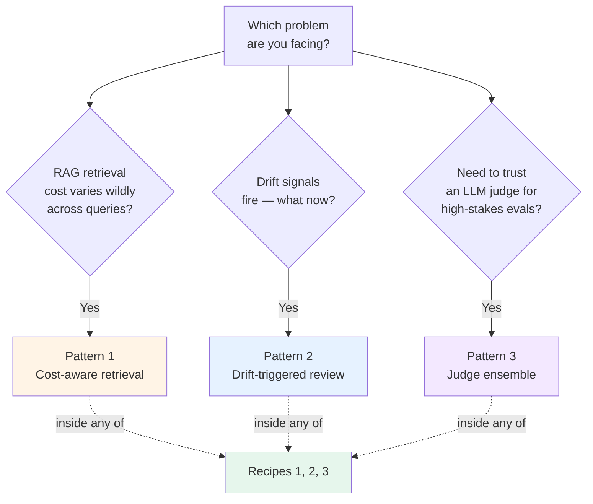

# Path 06 Patterns — Production Evaluation Mechanisms

> 🟢 Stable · ⏱ ~15 min per pattern · 📍 Read alongside the [recipes](../recipes/); patterns plug into recipes

This directory contains **production evaluation and observability patterns** — reusable cross-cutting mechanisms that teams apply *inside* any of the Batch 33 recipes.

If recipes are end-to-end deployment compositions, patterns are the mechanisms inside them. A team running the [Hybrid recipe](../recipes/03-hybrid-langsmith-and-otel.md) doesn't just install LangSmith + OTel — they also need a retrieval policy that respects cost budgets per tenant, a drift workflow that routes signals to human reviewers, and an evaluator combination strategy that handles judge disagreements. Those mechanisms are the patterns documented here.

## Patterns vs recipes vs concept pages

| You're trying to... | Reach for... |
|---|---|
| Decide on a full production deployment shape | [Recipes](../recipes/) |
| Implement a specific reusable mechanism inside a recipe | **Patterns** (this directory) |
| Understand the math or theory behind a mechanism | [Concept pages](../../../concepts/evaluation/) |
| Run code that demonstrates a mechanism on synthetic data | [Labs](../../../labs/) |

Patterns are deliberately smaller than recipes. Each pattern covers one mechanism in ~15 minutes; a recipe takes 20-25 minutes because it stitches multiple modules and patterns together.

## How patterns differ from architecture patterns

The repo has a separate top-level [`/patterns/`](../../../patterns/) directory for **architecture patterns** of agentic systems (single-agent, router, supervisor + workers, plan-and-execute, swarm, reflection, agentic RAG, deep research, human-in-the-loop, MCP, A2A). Those answer "what is the topology of my agent."

Path 06 patterns answer a different question: "how do I do production evaluation/observability *inside* my existing topology." They're orthogonal — an agentic-RAG topology can use cost-aware retrieval, drift-triggered review, and judge ensemble all together.

## The three patterns

| # | Pattern | Solves | Connects to |
|---|---------|--------|-------------|
| 1 | [Cost-aware retrieval](./01-cost-aware-retrieval.md) | Retrieval cost explodes when k, reranking, web fallback, and agentic loops fire on every query — including queries that don't need them | M6 cost attribution · adaptive sampling |
| 2 | [Drift-triggered review](./02-drift-triggered-review.md) | Auto-retrain on drift is the wrong default; drift signals should route traces to a human review queue, not trigger blind retraining | M5 drift detection · judge calibration |
| 3 | [Judge ensemble](./03-judge-ensemble.md) | A single LLM judge has family-specific biases; high-stakes evals need majority vote, weighted vote, or disagreement routing across multiple judges | M4 online evaluation · M5 judge calibration |

## Pick-a-pattern decision aid

Patterns combine. A production deployment running the hybrid recipe typically uses all three — cost-aware retrieval to bound spend per tenant, drift-triggered review to keep the eval feedback loop healthy, and judge ensemble for the launch decisions that gate the model into production.

## When NOT to reach for a pattern

These cases don't need the pattern overhead:

- **Single-tenant prototype, fixed budget.** Cost-aware retrieval is overkill; just pick a default k and reranker.
- **No production drift signals yet.** Pattern 2 needs Module 5's drift detection infrastructure first; build that before adding the review workflow.
- **Routine weekly eval trending.** Single-judge with periodic human calibration (Pattern 3's anti-scope) is fine; ensemble is for launches and noise-band winrates.
- **You're still doing offline-only evals.** Patterns assume the online evaluation infrastructure from Module 4 is running. If you don't have it, that's the prerequisite — not the patterns.

## The shared pattern shape

Every pattern follows the same 8-section structure:

1. **Intent** — one or two sentences naming what the mechanism does.
2. **When to use this pattern** — concrete situations.
3. **When NOT to use** — anti-patterns.
4. **The mechanism** — diagram + decision logic / scoring / routing rule.
5. **Implementation sketch** — minimal Python or YAML; references the relevant lab.
6. **How this combines with recipes** — Batch 33 recipes that use this pattern.
7. **Tradeoffs and what this misses** — concrete cost/latency/complexity trade-offs.
8. **References** — concept pages, labs, external sources.

The shape is documented in [`_template.md`](./_template.md). Contributing a fourth pattern (e.g., embedding-drift detection, cascading evaluators, retry budgets) is a copy-paste-and-customize job.

## How patterns relate to the v1 modules

Each pattern is anchored to one or two Path 06 v1 modules. The pattern documents the workflow on top of the module's mathematics:

| Pattern | Module anchor | What the module provides | What the pattern adds |
|---------|---------------|--------------------------|------------------------|
| 1 Cost-aware retrieval | M6 cost attribution + adaptive sampling | Baggage propagation; cost-driven sampling policies | Retrieval policy that consumes the cost signals |
| 2 Drift-triggered review | M5 drift detection + judge calibration | KS / PSI / Wasserstein algorithms; Cohen's κ | Three-tier response workflow on top of the signals |
| 3 Judge ensemble | M4 online evaluation + M5 calibration | Single-evaluator registration; per-evaluator κ | Multi-evaluator combination + disagreement routing |

If you haven't read the module yet, read the pattern first to see *why* the math matters, then the concept page for the math itself.

## Version notes

Patterns are classified **stable** — the names and shapes don't change quickly, even when the underlying tools or judge-model defaults shift. Specific numbers (cost claims, ensemble defaults, threshold values) age faster; each pattern carries a `verified YYYY-MM-DD` stamp and the source it was verified against.

## Contributing

The [`_template.md`](./_template.md) walks through each section. The right time to add a fourth pattern is when a recurring production mechanism isn't covered by 1, 2, or 3 (e.g., embedding-drift detection on retrieval, cascading evaluators, evaluator-retry budgets). Open a PR; a maintainer reviews against the shared shape.
