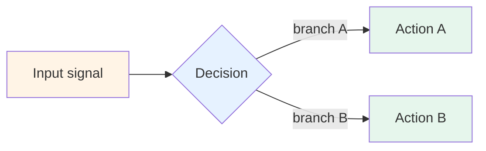

# Pattern N — [Pattern name]

> 🟢 Stable · ⏱ ~XX min · 🛠 Verified YYYY-MM-DD · 📍 Module [X, Y] anchor

<!--
This is the template for adding a Path 06 production evaluation/observability pattern.
Copy this file, rename to NN-pattern-name.md, fill in each section, delete these comments.

The pattern shape is deliberately smaller and more mechanism-focused than recipes
(8 sections, ~15 min vs recipes' 10 sections, ~20-25 min). Patterns document
cross-cutting mechanisms that apply INSIDE recipes; recipes document end-to-end
deployment compositions.

See README.md for the shape rationale and Patterns 01/02/03 for examples.

PLACEHOLDER CONVENTION: For path placeholders in the body, use prose with inline-code
(e.g. "the relevant concept page at `concepts/evaluation/some-page.md`") NOT actual
markdown link syntax. The link-sweep tool flags placeholder paths inside markdown
link syntax as broken — even when they're documentation of patterns. The prose+code
form sidesteps the parser false positive. See the references section below for the
recommended pattern for citing concept pages and labs in the actual published file.
-->

## Intent

<!--
One or two sentences naming the mechanism's purpose. The intent should be
operational: "Adapt X by Y to achieve Z." Not theoretical: "X is a property of Y."

Example (Pattern 1): "Adapt retrieval decisions — top-k, reranking, web fallback,
agentic loop — by a four-input policy: {tenant_tier, task_value, remaining_budget,
retrieval_confidence}. Cheap queries get cheap retrieval; expensive paths fire only
when the cost is earned."
-->

[1-2 sentences naming what the mechanism does.]

## When to use this pattern

<!--
3-4 concrete situations. Each bullet should be testable — could a reader confirm
their situation matches by checking specific properties of their system?
-->

- [Concrete situation 1]
- [Concrete situation 2]
- [Concrete situation 3]

## When NOT to use

<!--
3-4 anti-patterns. The cases where reaching for this pattern is overkill or wrong.
Important: include "when prerequisites aren't in place" — patterns assume upstream
infrastructure (Module N detection, baggage propagation, annotation queue, etc.).
-->

- [Anti-pattern 1]
- [Anti-pattern 2]
- [Without prerequisite X — build X first.]

## The mechanism

<!--
One mermaid diagram showing the decision flow / scoring rule / routing logic.
Use the Batch 33 color palette for consistency across recipes and patterns:
  warm (#fff4e6)   : source / app input
  cool (#e6f2ff)   : middleware / decision logic
  purple (#f3e8ff) : vendor / queue / human
  green (#e6f6ec)  : output / ops destination
-->



[1-3 paragraphs describing the decision logic the diagram represents. Include
specific thresholds, scoring rules, or routing criteria. The mechanism section
is where the pattern earns its place — without specific rules, it's vague advice.]

## Implementation sketch

<!--
Minimal Python or YAML showing the core logic — under ~30 lines. Reference the
relevant lab for the full implementation; the sketch is what fits in a runbook.

Use the form: docstring or function signature comment → clean function body.
No prose interleaved with code; let the code carry the meaning.
-->

```python
# Minimal implementation
def example_pattern(input_signal):
    ...
```

[1-2 paragraphs flagging the non-obvious parts of the sketch — what would
surprise someone reading it without context. What's a parameter, what's a
threshold, what's deliberately left out.]

The reader can see the full implementation in the relevant lab (e.g. `labs/NN-some-lab/`); the sketch is the runbook-page version.

## How this combines with recipes

<!--
Table showing which Batch 33 recipes use this pattern and where it plugs in.
This is the cross-cutting glue — patterns must work inside multiple recipes
to earn their place as patterns rather than as recipe-specific tactics.
-->

| Recipe | Where this pattern plugs in |
|--------|------------------------------|
| Recipe 1 — LangSmith-native | [How it fits — be specific] |
| Recipe 2 — OpenTelemetry-native | [How it fits] |
| Recipe 3 — Hybrid | [How it fits, including the hand-off boundary if relevant] |

[1 paragraph summarizing the cross-cutting nature — what stays the same across
all three recipes vs what varies.]

## Tradeoffs and what this misses

<!--
Two subsections:
- Tradeoffs: 3-4 concrete cost/latency/complexity points
- What this misses: 3-4 things the pattern deliberately doesn't address
-->

**Tradeoffs**:

- **[Tradeoff 1]** — [concrete cost/complexity description].
- **[Tradeoff 2]** — [concrete description].
- **[Tradeoff 3]** — [concrete description].

**What this pattern doesn't address**:

- **[Adjacent problem 1]** — [why; where to look instead].
- **[Adjacent problem 2]** — [why].

## References

<!--
Repo-internal first (concept pages, labs, recipes), then external sources.
External sources should be verified-via-web-search; include verification date
implicitly via the source's publication date.

Use markdown link syntax in the actual published file — see Patterns 01/02/03 for examples.
-->

- Concept page references at paths like `concepts/evaluation/relevant-page.md` — see Patterns 01/02/03 for the exact link format.
- Lab references at paths like `labs/NN-some-lab/`.
- Recipe references (e.g., Recipe 1, 2, 3) — production deployments this pattern plugs into.
- External sources — vendor blogs, research papers, industry surveys.

<!--
DELETE BEFORE COMMITTING:

Pre-publication checklist:
- [ ] All `[bracketed placeholders]` replaced with real content
- [ ] Placeholder paths in prose use inline code (e.g. `concepts/evaluation/example.md`)
      and NOT markdown link syntax (which trips the link checker)
- [ ] Real concept-page, lab, recipe, and external links use proper markdown syntax
- [ ] Mermaid diagram syntax verified (paste into GitHub preview to confirm)
- [ ] Reading time estimate matches actual length (heuristic: 1500 chars/min)
- [ ] At least 3 external references, each verified to exist
- [ ] Word-discipline check: scan against the locked forbidden-vocabulary list
      in CONTRIBUTING.md (no filler-grade hedges or marketing-tone superlatives)
- [ ] PR title: "Path 06 v2: Add [pattern name] pattern"
- [ ] Link the new pattern in patterns/README.md's table

Once those are done, delete this entire HTML comment block.
-->
