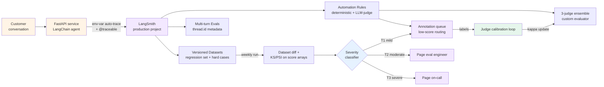

# Project 1 — LangSmith eval stack

> 🔴 Advanced · ⏱ ~45 min reading · 🛠 ~3-5 day build · Verified 2026-05-26

## Project brief

You're building a LangSmith-native production evaluation stack for a LangChain-rooted agent. The agent ingests customer support conversations; the evaluation layer surfaces regressions before they reach users; the calibration loop keeps the LLM-as-judge aligned with domain reviewers.

**Deployment target**: FastAPI service in a Docker container, deployed via your team's existing infrastructure. LangSmith Plus tier for the observability backend.

**Scale assumption**: up to 100K traces/month, 1-3 person team, LangChain or LangGraph as the agent framework.

This project is the buildable form of [Recipe 1 (LangSmith-native)](../recipes/01-langsmith-native.md). The recipe describes the architecture; the project ships it.

## Prerequisites

Before starting, you should have completed:

- **Required Path 06 v1**: Modules 1, 2, 4, 5, 7. [Labs 17](../../../labs/17-langsmith-trace-ingestion/), [19](../../../labs/19-online-evaluation-and-sampling/), [20](../../../labs/20-drift-detection-and-calibration/), [22](../../../labs/22-multi-turn-evaluation/).
- **Required Batch 33 + 34**: [Recipe 1](../recipes/01-langsmith-native.md). [Pattern 2 (drift-triggered review)](../patterns/02-drift-triggered-review.md) and [Pattern 3 (judge ensemble)](../patterns/03-judge-ensemble.md).
- **External**: a LangSmith Plus account; LangChain or LangGraph agent code to instrument; Docker locally.

If any of those are gaps, fix the gaps first. Projects assume the prerequisites are solid.

## What you'll have when done

- A FastAPI service running a LangChain agent, instrumented with `@traceable` + env-var auto-tracing, deployed in Docker.
- A LangSmith project receiving production traces, separated from staging and eval projects.
- A versioned LangSmith Dataset with at least 50 examples representative of real traffic.
- Two Automation Rules registered: one deterministic (e.g., `graph_trajectory_strict_match`), one LLM-judged.
- A three-judge ensemble custom evaluator (Pattern 3) for launch-decision evaluations.
- An annotation queue routing low-score runs to a domain reviewer, with the queue review workflow on the team calendar.
- Multi-turn evals running automatically on conversations marked complete (Lab 22 patterns via LangSmith Multi-turn Evals).
- A weekly Dataset diff dashboard surfacing drift week-over-week; statistical tests (KS, PSI) run on the score arrays.
- A three-tier drift-response wiring (Pattern 2): T1 mild → annotation queue; T2 moderate → page eval engineer; T3 severe → page on-call.
- A runbook entry documenting the LangSmith project structure, the Dataset versioning policy, and the drift-response playbook.

## Architecture at a glance

The architecture is LangSmith-centric — every block downstream of "production project" runs inside LangSmith or against LangSmith's API. The Sev classifier and judge-ensemble custom evaluator are the parts you build; everything else is LangSmith-native configuration.

## Build milestones

### M1 — Instrumented FastAPI service in Docker (~1 day)

**Goal**: ship a containerized LangChain agent emitting traces to LangSmith.

**Scope**:
- FastAPI service wrapping the LangChain agent's invoke method
- Three environment variables: `LANGCHAIN_TRACING_V2=true`, `LANGCHAIN_API_KEY`, `LANGCHAIN_PROJECT`
- Docker image with pinned dependencies (uv or pip-tools)
- `@traceable` on any non-LangChain helpers (retrievers, tool wrappers)
- Healthcheck endpoint that doesn't pollute the trace stream

**Done when**: hitting the FastAPI endpoint locally produces a trace visible in the LangSmith UI within 5 seconds.

→ Builds on [Lab 17](../../../labs/17-langsmith-trace-ingestion/) instrumentation patterns and [Recipe 1 Step 1](../recipes/01-langsmith-native.md).

### M2 — Versioned Dataset + baseline Automation Rule (~0.5 day)

**Goal**: a regression-test dataset and the first online evaluator.

**Scope**:
- Create at least 50 examples in a LangSmith Dataset, named `<agent>-regression-v1`
- Add 10-15 hard cases (edge cases, known failure patterns) to a second Dataset
- Register one Automation Rule: deterministic evaluator (e.g., output-shape validity, refusal-pattern check)
- Set sample rate to 10-20% (cost discipline)
- Verify the Rule fires on production traffic by checking run feedback

**Done when**: the LangSmith dashboard shows the rule firing with non-zero feedback writes; the Dataset is browseable in the UI.

→ Builds on [Lab 19](../../../labs/19-online-evaluation-and-sampling/) registration patterns and [Recipe 1 Steps 2-3](../recipes/01-langsmith-native.md).

### M3 — Multi-turn evals + thread metadata (~0.5 day)

**Goal**: conversation-level evaluation triggered when threads complete.

**Scope**:
- App passes `thread_id` as run metadata: `tracing_v2_enabled(metadata={"thread_id": session_id})`
- LangSmith Multi-turn Eval configured with an LLM-as-judge prompt covering Conversation Completeness, Knowledge Retention, Role Adherence, Turn Relevancy
- Explicit thread-complete signal (don't rely on the timeout default — too unpredictable for production)
- Threads visible in the LangSmith threads view

**Done when**: completing a synthetic test conversation triggers a Multi-turn Eval run within 10 minutes, with a score visible per metric.

→ Builds on [Lab 22](../../../labs/22-multi-turn-evaluation/) metrics and [Recipe 1 Step 6](../recipes/01-langsmith-native.md).

### M4 — Annotation queues + calibration loop (~1 day)

**Goal**: the human-in-the-loop layer that keeps the LLM-judge calibrated against domain expert judgment.

**Scope**:
- Configure an annotation queue routed by evaluator score threshold (e.g., score < 0.6)
- Assign at least one domain reviewer
- Domain reviewer marks agree/disagree on at least 20 sampled runs (this is the calibration data)
- Compute Cohen's kappa between the judge and the reviewer on the calibration set
- If kappa < 0.6, revise the judge prompt or rubric; recompute

**Done when**: the calibration set exists; kappa is recorded for the current judge prompt; the agree-rate is documented in the runbook.

→ Builds on [Lab 20](../../../labs/20-drift-detection-and-calibration/) calibration patterns and [Recipe 1 Step 5](../recipes/01-langsmith-native.md). Wires Pattern 2's Tier 1 destination.

### M5 — Three-judge ensemble (~1 day)

**Goal**: for launch decisions and noise-band win-rate comparisons, run an ensemble.

**Scope**:
- Three Automation Rules registered, each running a different judge model (cross-family: e.g., Claude Sonnet 4.5, GPT-5.1, Gemini 2.5 Pro)
- Custom Python evaluator that reads the three rule outputs from run feedback and applies majority vote (or weighted vote if you have per-judge kappa from M4)
- Disagreement routing: 2-1 or split decisions push the run to the annotation queue from M4 with the tag `ensemble-disagreement`
- Trigger the ensemble only on a tagged subset of traces (e.g., `tags contains 'launch-eval'`) — 3× cost discipline

**Done when**: a synthetic test case marked `launch-eval` produces three judge scores plus an ensemble verdict; a deliberately ambiguous case routes to annotation.

→ Builds on [Pattern 3 (judge ensemble)](../patterns/03-judge-ensemble.md). Reuses M4's annotation queue as the disagreement destination.

### M6 — Drift review workflow + Dataset-diff dashboard (~0.5 day)

**Goal**: weekly regression detection wired into the team's review cadence.

**Scope**:
- A scheduled weekly LangSmith Dataset run on the regression Dataset from M2
- A worker script that pulls the score arrays from the latest two Dataset runs and computes KS-test + PSI (Lab 20 functions, ~30 lines)
- A severity classifier (Pattern 2's `classify_drift`) that maps the KS p-value, PSI, and pass-rate delta to T1/T2/T3
- Routing wiring:
  - T1 → annotation queue (from M4) with tag `drift-tier1`
  - T2 → page eval engineer (Slack / PagerDuty / your team's tool)
  - T3 → page on-call + suspend in-flight experiments
- A weekly review calendar entry for the eval engineer

**Done when**: the weekly cron runs, the diff is computed, and a synthetic injected drift event (manually skewed scores) correctly routes to the right tier.

→ Builds on [Recipe 1 Step 4](../recipes/01-langsmith-native.md) + [Pattern 2 (drift-triggered review)](../patterns/02-drift-triggered-review.md).

## The integration layer

Each milestone reuses specific Path 06 artifacts. The table is the proof that this is a capstone, not a fresh build.

| Milestone | Path 06 v1 labs | Batch 33 recipes | Batch 34 patterns | Concept pages |
|-----------|------------------|-------------------|---------------------|----------------|
| M1 — FastAPI + Docker | Lab 17 | Recipe 1 Step 1 | — | `langsmith-tracing-shape.md` |
| M2 — Dataset + Rule | Lab 19 | Recipe 1 Steps 2-3 | — | `online-evaluator-registration.md`, `eval-set-construction.md` |
| M3 — Multi-turn | Lab 22 | Recipe 1 Step 6 | — | `multi-turn-evaluation.md`, `conversation-simulation.md` |
| M4 — Annotation + calibration | Lab 20 | Recipe 1 Step 5 | Pattern 2 (T1 destination) | `agent-as-judge-calibration.md` |
| M5 — Ensemble | (combines Lab 17 + Lab 19 patterns) | — | Pattern 3 | `agent-as-judge-calibration.md` |
| M6 — Drift workflow | Lab 20 | Recipe 1 Step 4 | Pattern 2 | `drift-detection.md` |

If a milestone is hard, the right move is to revisit the lab or recipe it's built on. No milestone is doing genuinely new engineering — they're all integrations of artifacts you've seen.

## Acceptance rubric

Test these criteria against the finished project. PR review on a deployed instance should hit each:

- [ ] **FastAPI service runs in Docker** with pinned dependencies; no floating versions of LangChain, LangSmith SDK, or OpenAI client.
- [ ] **Three projects exist in LangSmith** for `prod`, `staging`, `eval` — never sharing a project across environments.
- [ ] **At least 50 examples** in the regression Dataset; at least 10 in a hard-cases Dataset.
- [ ] **At least one Automation Rule registered** with sample rate ≤ 20%; the rule produces non-zero feedback over a 24h window.
- [ ] **Multi-turn evals fire** when a thread is marked complete; the four canonical metrics (Completeness, Retention, Role Adherence, Turn Relevancy) all have configured scoring.
- [ ] **Annotation queue has ≥ 20 calibration labels**; Cohen's kappa is recorded in the runbook.
- [ ] **Three-judge ensemble runs** on a tagged subset of traces; majority vote and disagreement routing both observed in real or synthetic test cases.
- [ ] **Weekly Dataset diff produces a drift report**; a synthetic injected drift event routes to the correct tier (T1/T2/T3).

## Common failure modes and recoveries

**Failure: M1 traces don't appear in LangSmith.** Usually one of three things: `LANGCHAIN_TRACING_V2` not set (case-sensitive in older SDK versions; `LANGSMITH_TRACING` works in newer); `LANGCHAIN_API_KEY` malformed; the `LANGCHAIN_PROJECT` value contains a space or special character. Check the SDK's startup logs at DEBUG level; the API key validation prints there.

**Failure: M2 Automation Rule doesn't fire.** The rule's trigger filter is too narrow — your traces don't match. Open a sample trace in the UI, check its tags and metadata, broaden the filter. Also: the sample rate is probabilistic; at 10% sample rate, you need ~50 matching traces before you'd statistically expect a rule fire.

**Failure: M3 Multi-turn evals never trigger.** The thread isn't being marked complete. The default timeout (~30 min) is unreliable; mark threads explicitly. Also: `thread_id` must be set on every span in the conversation, not just the first; verify with the threads-view in LangSmith.

**Failure: M4 calibration set produces kappa near zero.** The judge is not actually evaluating the dimension you think it is — its rubric is fuzzy. Tighten the rubric (give specific positive/negative examples; reduce the open-ended "evaluate quality" framing); recompute kappa. If kappa stays low across multiple rubric revisions, the task itself may be too subjective for LLM-as-judge — switch to human-only review for that dimension.

**Failure: M5 ensemble always agrees.** Two of your three judges are from the same model family or share training data. The whole point of the ensemble is family diversity; running Claude 4.5 + Claude 4.0 + Claude 3.5 cancels nothing. Use three different vendors.

**Failure: M5 ensemble always disagrees.** The rubric is too coarse — judges are guessing. Same fix as M4: tighten the rubric. Disagreement routing is for hard cases, not for every case.

**Failure: M6 drift detector cries wolf.** False positives are nearly always the threshold-tuning problem. The defaults (KS p ∈ [0.001, 0.05] for T1) are starting points. After the first week, look at the false-positive rate; if T1 fires more than once a week without underlying cause, raise the threshold. Track the false-positive rate in the runbook.

**Failure: cost climbs faster than expected.** Either the eval Automation Rules are running on too high a sample rate, or the three-judge ensemble is firing more broadly than the launch-eval tag intended. Check the LangSmith API call counter; the run feedback writes are usually cheaper than the LLM-judge calls, so the cost concentration is in judge evaluations.

## Operational checklist (pre-launch)

- [ ] Three env vars set in production: `LANGCHAIN_TRACING_V2=true`, `LANGCHAIN_API_KEY=ls__...`, `LANGCHAIN_PROJECT=<agent>-prod`.
- [ ] `LANGCHAIN_API_KEY` lives in the secrets manager, never in committed code or env files.
- [ ] LangSmith projects exist for `prod`, `staging`, `eval`; never shared.
- [ ] At least 50 examples in the regression Dataset; versioning policy documented.
- [ ] At least one Automation Rule with sample rate ≤ 20%.
- [ ] Annotation queue configured with reviewers assigned; weekly review on the calendar.
- [ ] Trace tags and metadata schema documented in the runbook: `tenant_id`, `user_id`, `task_type`, `model_version`.
- [ ] Threads marked complete explicitly; not relying on the default timeout.
- [ ] Three-judge ensemble triggered only on `launch-eval` tag — verify the trigger filter.
- [ ] Cost alerts configured in LangSmith for monthly trace count > budget.
- [ ] Dataset versioning policy documented: when to bump major, when to bump minor.
- [ ] Replay-against-new-model workflow tested at least once.
- [ ] Per-evaluator pass rate tracked weekly; alert on > 10 percentage-point drops.
- [ ] Annotation queue kappa tracked monthly; LLM-judge rubric review triggered if kappa < 0.6.
- [ ] Drift detector false-positive rate tracked weekly; threshold tuned monthly.
- [ ] Three-tier paging destinations verified live (T2 and T3 routes both reach a real human).

## Cost envelope

Verified 2026-05-26. Reverify against current LangSmith pricing before committing budgets.

| Traffic | LangSmith platform | LLM-as-judge (single, 10% sample) | Three-judge ensemble (1% subset) | Total /month |
|---------|---------------------|------------------------------------|-----------------------------------|---------------|
| 10K traces | $39 (1 seat) | ~$5-15 | ~$3-10 | $47-64 |
| 100K traces | $39-78 (1-2 seats) + plan overage | ~$50-150 | ~$30-90 | $119-318 |
| 1M traces | Custom Enterprise | ~$250-750 | ~$150-450 | Custom + LLM |

LLM costs dominate at scale. The three-judge ensemble adds 3× cost on its triggered subset; keep the subset narrow (1-5% of total) and the absolute cost stays bounded.

The Enterprise tier kicks in around 500K-1M traces/month; pricing becomes a negotiation rather than a published rate.

## Extensions and where to go next

- **Cost-aware retrieval (Pattern 1)** — add tier-gated retrieval logic to the agent. Project 1 doesn't require it because LangSmith's pricing isn't per-tenant, but cost-aware retrieval lowers LLM-side costs that show up in the judge ensemble.
- **Embedding-drift detection** — complement Module 5's score-side drift with retrieval-input drift. Future Path 06 v2 batch.
- **Adversarial red-teaming at scale** — DeepTeam-style orchestration on top of the eval Dataset. Future Path 06 v2 batch.
- **Migrate to hybrid (Project 3)** — when your team needs APM integration too, the cleanest path is Project 1 → Project 3, not Project 1 → Project 2. The Project 1 instrumentation is reusable; the OTel layer gets added underneath.
- **Replay-against-new-model regression suite** — wire the M2 Dataset into a CI step that re-runs the eval on every model swap. The LangSmith replay UX makes this nearly free.
- **Domain-expert reviewer rotation** — for teams with multiple domain experts, the annotation queue's reviewer-assignment workflow benefits from a rotation calendar. Worth a Slack workflow or a small calendar bot.

## References + further reading

- [`concepts/evaluation/langsmith-tracing-shape.md`](../../../concepts/evaluation/langsmith-tracing-shape.md), [`online-evaluator-registration.md`](../../../concepts/evaluation/online-evaluator-registration.md), [`agent-as-judge-calibration.md`](../../../concepts/evaluation/agent-as-judge-calibration.md), [`drift-detection.md`](../../../concepts/evaluation/drift-detection.md), [`multi-turn-evaluation.md`](../../../concepts/evaluation/multi-turn-evaluation.md).
- [Lab 17 — LangSmith trace ingestion](../../../labs/17-langsmith-trace-ingestion/), [Lab 19 — Online evaluation and sampling](../../../labs/19-online-evaluation-and-sampling/), [Lab 20 — Drift detection and calibration](../../../labs/20-drift-detection-and-calibration/), [Lab 22 — Multi-turn evaluation](../../../labs/22-multi-turn-evaluation/).
- [Recipe 1 — LangSmith-native](../recipes/01-langsmith-native.md), [Pattern 2 — Drift-triggered review](../patterns/02-drift-triggered-review.md), [Pattern 3 — Judge ensemble](../patterns/03-judge-ensemble.md).
- LangChain blog (October 2025), *Improve agent quality with Insights Agent and Multi-turn Evals* — [blog.langchain.com](https://blog.langchain.com/insights-agent-multiturn-evals-langsmith/).
- LangSmith documentation, *Trace with OpenTelemetry* — [docs.langchain.com](https://docs.langchain.com/langsmith/trace-with-opentelemetry) — useful when you decide to migrate this stack to hybrid (Project 3).
- FastAPI Deployment Guide for 2026 (April 2026) — [zestminds.com/blog](https://www.zestminds.com/blog/fastapi-deployment-guide/) — zero-downtime patterns, Docker discipline, health-check structure.
- Confident AI (May 2026), *LLM-as-a-Judge Simply Explained* — [confident-ai.com/blog](https://www.confident-ai.com/blog/why-llm-as-a-judge-is-the-best-llm-evaluation-method) — the 85% LLM-judge-to-human agreement baseline that anchors the M4 kappa floor.
