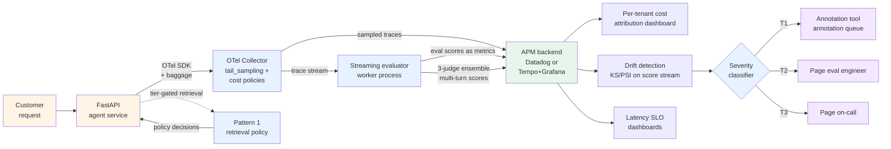

# Project 2 — OpenTelemetry observability stack

> 🔴 Advanced · ⏱ ~50 min reading · 🛠 ~4-6 day build · Verified 2026-05-26

## Project brief

You're building a vendor-neutral observability stack for an agent using OpenTelemetry GenAI conventions. Agent telemetry joins the same APM views as the rest of the platform; the eval layer is hand-rolled or via OSS frameworks (DeepEval, MLflow, RAGAS); cost attribution rolls up per-tenant.

**Deployment target**: FastAPI service in Docker; OTel Collector deployed as a sidecar or daemonset; backend is either Datadog (managed APM path) or Tempo + Grafana + Prometheus (self-hosted path). Pick one at M1 and stick with it.

**Scale assumption**: 100K-1M traces/month, 3-5 person team, existing observability infrastructure the platform team owns.

This project is the buildable form of [Recipe 2 (OpenTelemetry-native)](../recipes/02-opentelemetry-native.md). Pick this when the platform team won't tolerate agent telemetry as a special-snowflake siloed system, and your team is willing to build the eval logic rather than buy it.

## Prerequisites

Before starting, you should have completed:

- **Required Path 06 v1**: Modules 1, 3, 4, 5, 6, 7. [Labs 18](../../../labs/18-opentelemetry-portable-tracing/), [19](../../../labs/19-online-evaluation-and-sampling/), [20](../../../labs/20-drift-detection-and-calibration/), [21](../../../labs/21-cost-attribution-and-adaptive-sampling/), [22](../../../labs/22-multi-turn-evaluation/).
- **Required Batch 33 + 34**: [Recipe 2](../recipes/02-opentelemetry-native.md). [Pattern 1 (cost-aware retrieval)](../patterns/01-cost-aware-retrieval.md), [Pattern 2 (drift-triggered review)](../patterns/02-drift-triggered-review.md), [Pattern 3 (judge ensemble)](../patterns/03-judge-ensemble.md).
- **External**: an APM backend account (Datadog) OR self-hosted infrastructure (Tempo + Grafana + Prometheus running); agent code; Docker locally; the OTel Collector binary or container.

If you don't have an APM backend chosen yet, default to the self-hosted Tempo + Grafana path for the build phase — it's reproducible and cheap to teardown. Swap to managed APM once the architecture is proven.

## What you'll have when done

- A FastAPI agent service instrumented with OTel GenAI semantic conventions (`gen_ai.*`), deployed in Docker.
- An OTel Collector deployed as a sidecar (or daemonset for multi-node), receiving OTLP from the agent and exporting to your APM backend.
- Tail-sampling policies configured in the Collector: 100% errors, 100% slow traces, 100% high-cost traces, 10% baseline.
- Baggage propagation carrying `tenant.id`, `user.id`, `task.id`, `tenant.tier` across every span.
- A per-tenant cost-attribution dashboard rolling up `gen_ai.usage.*` × `tenant.id`.
- A tier-gated retrieval policy (Pattern 1) consuming the baggage signal, with the policy decisions logged as span attributes.
- A streaming evaluator worker (Recipe 2's Pattern A) running at least two evaluators against the trace stream; scores emitted as metrics.
- Drift detection running in the metrics pipeline (Lab 20 algorithms unmodified on the score arrays).
- Multi-turn evaluation scores attached as span events on thread root spans, queryable in the APM.
- A three-tier drift response wiring (Pattern 2): T1 → annotation queue (whichever tool your team uses); T2 → page eval engineer via APM-integrated paging; T3 → page on-call.
- A three-judge ensemble running as part of the streaming evaluator worker (Pattern 3); scores as span attributes.
- A runbook entry documenting the Collector configuration version, the cost-attribution dashboard query, and the drift-response playbook.

## Architecture at a glance

The Collector is the central artifact. The agent emits standards-compliant traces; the Collector decides what's sampled, attaches what gets dropped; the APM ingests like any other service.

## Build milestones

### M1 — Instrumented FastAPI + Collector deployment (~1-2 days)

**Goal**: agent emits OTel traces to the Collector, which forwards to your APM backend.

**Scope**:
- FastAPI service with OTel auto-instrumentation (`opentelemetry-instrumentation-openai`, `opentelemetry-instrumentation-fastapi`)
- Manual instrumentation on the agent-level invoke span with `gen_ai.system`, `gen_ai.request.model`, `gen_ai.usage.*` attributes
- `BatchSpanProcessor` + `OTLPSpanExporter` configured (NOT `SimpleSpanProcessor` — that's a Lab 18 didactic only)
- OTel Collector deployed as a sidecar container in docker-compose (or daemonset for multi-node K8s)
- Datadog Exporter OR OTLP exporter to your self-hosted Tempo
- TLS to backend; certs verified
- `Resource` attributes set: `service.name`, `service.version`, `deployment.environment`

**Done when**: a request to the FastAPI endpoint produces a trace visible in the APM within 30 seconds, with all `gen_ai.*` attributes populated.

→ Builds on [Lab 18](../../../labs/18-opentelemetry-portable-tracing/) and [Recipe 2 Step 1](../recipes/02-opentelemetry-native.md).

### M2 — Tail sampling + cost-driven policies (~1 day)

**Goal**: the Collector retains the right traces and drops the noise.

**Scope**:
- `tail_sampling` processor with at least four policies in priority order: errors (100%), slow (100%), high-cost (100%), probabilistic baseline (10%)
- `decision_wait: 30s` explicitly (not the 10s default — agents have long tails)
- `num_traces` sized: `traces_per_sec × decision_wait × 1.2`
- Tested by injecting an error trace + a slow trace + a normal trace; the first two retained, the third probabilistically retained
- Configuration version-controlled in the same repo as infra-as-code

**Done when**: synthetic error and slow traces are 100% retained; baseline traces are ~10% retained over a 1000-trace sample; the Collector's own metrics confirm the policies fire.

→ Builds on [Lab 19](../../../labs/19-online-evaluation-and-sampling/), [Lab 21](../../../labs/21-cost-attribution-and-adaptive-sampling/), and [Recipe 2 Step 2](../recipes/02-opentelemetry-native.md).

### M3 — Baggage propagation + cost attribution dashboard (~1 day)

**Goal**: per-tenant cost rollup queryable in the APM.

**Scope**:
- Baggage set at FastAPI request entry: `tenant.id`, `user.id`, `task.id`, `tenant.tier`
- Helper that copies baggage to span attributes on every span (`_copy_identity_to_span`)
- Tier-gated retrieval policy (Pattern 1) consuming `tenant.tier` from baggage, returning `RetrievalSettings`
- Policy decisions logged as span attributes: `retrieval.k`, `retrieval.reranked`, `retrieval.tier_applied`
- APM dashboard query: `sum(gen_ai.usage.total_cost_usd) by (tenant.id)` over rolling 30 days
- Per-tenant burn-down chart published in the team's APM workspace

**Done when**: two test tenants on different tiers produce two different rollups; the dashboard shows the difference; the retrieval policy logs show the tier-gated decisions.

→ Builds on [Lab 21](../../../labs/21-cost-attribution-and-adaptive-sampling/) + [Pattern 1 (cost-aware retrieval)](../patterns/01-cost-aware-retrieval.md) + [Recipe 2 Step 3](../recipes/02-opentelemetry-native.md).

### M4 — Streaming evaluator worker + drift detection (~1-2 days)

**Goal**: evaluators run against production traces; scores feed drift detection.

**Scope**:
- A Python worker process subscribing to the Collector's trace stream (OTLP receiver, or pulling from APM-backend query API)
- At least two evaluators running: one deterministic (output-shape validity), one LLM-as-judge (relevance/faithfulness)
- Evaluator scores emitted as APM metrics tagged by `tenant.id`, `task.id`, `model_version`
- Lab 20's KS-test / PSI / Wasserstein functions running in a separate worker (or as scheduled queries) against the metrics stream
- Worker process has its own monitoring (if the worker dies, scores stop without anyone noticing — set up a watchdog)

**Done when**: the worker produces scores on at least 1000 production traces over a 24h window; the drift detector outputs a PSI value over that window; the metric is queryable in the APM.

→ Builds on [Lab 19](../../../labs/19-online-evaluation-and-sampling/) + [Lab 20](../../../labs/20-drift-detection-and-calibration/) + [Recipe 2 Steps 4-5](../recipes/02-opentelemetry-native.md).

### M5 — Multi-turn evals + judge ensemble (~1 day)

**Goal**: conversation-level evaluation and high-stakes ensemble both work end-to-end.

**Scope**:
- `thread.id` propagated via baggage (Recipe 3 pattern; cross-applies here)
- Post-conversation worker computes [Lab 22](../../../labs/22-multi-turn-evaluation/)'s metrics (Conversation Completeness, Knowledge Retention, Role Adherence, Turn Relevancy)
- Multi-turn scores attached as span events on the thread root span: `write_span_event(thread_root_span_id, name="eval.multi_turn_completeness", attributes={"score": score})`
- For traces tagged `launch-eval`, the streaming evaluator worker runs a three-judge ensemble (Claude Sonnet 4.5 + GPT-5.1 + Gemini 2.5 Pro)
- Per-judge scores + ensemble verdict + agreement metric all emitted as APM metrics
- Disagreement routing: 2-1 splits push to the annotation tool with the `ensemble-disagreement` tag

**Done when**: a synthetic conversation produces multi-turn scores queryable in the APM; a synthetic ambiguous `launch-eval` case produces three scores plus an ensemble verdict and a disagreement-routed entry.

→ Builds on [Lab 22](../../../labs/22-multi-turn-evaluation/) + [Pattern 3 (judge ensemble)](../patterns/03-judge-ensemble.md).

### M6 — Three-tier drift response wiring (~0.5 day)

**Goal**: drift signals route to humans with severity-appropriate urgency.

**Scope**:
- A severity classifier worker (Pattern 2's `classify_drift`) reading from the APM metrics stream
- Routing wiring:
  - T1 (mild) → annotation tool with tag `drift-tier1-<metric>`
  - T2 (moderate) → page eval engineer via APM-integrated paging (Datadog incidents, PagerDuty, Opsgenie)
  - T3 (severe) → page on-call + suspend in-flight experiments + deploy fallback model (if you have one)
- Idempotent routing: a single drift event in a window doesn't multi-page
- A weekly review calendar entry for the eval engineer to clear the T1 queue

**Done when**: a synthetic injected drift event (manually skewed scores) correctly routes to T1, T2, or T3 based on severity; T2 routes reach a real human; idempotency verified by retriggering the same event.

→ Builds on [Pattern 2 (drift-triggered review)](../patterns/02-drift-triggered-review.md) + [Recipe 2 Step 5](../recipes/02-opentelemetry-native.md).

## The integration layer

| Milestone | Path 06 v1 labs | Batch 33 recipes | Batch 34 patterns | Concept pages |
|-----------|------------------|-------------------|---------------------|----------------|
| M1 — Instrumentation | Lab 18 | Recipe 2 Step 1 | — | `opentelemetry-genai-conventions.md`, `observability-three-pillars.md` |
| M2 — Tail sampling | Lab 19, Lab 21 | Recipe 2 Step 2 | — | `tail-based-sampling.md`, `adaptive-sampling.md` |
| M3 — Baggage + cost | Lab 21 | Recipe 2 Step 3 | Pattern 1 | `cost-attribution.md` |
| M4 — Evaluator worker | Lab 19, Lab 20 | Recipe 2 Steps 4-5 | — | `online-evaluator-registration.md`, `drift-detection.md` |
| M5 — Multi-turn + ensemble | Lab 22 | Recipe 2 Step 6 | Pattern 3 | `multi-turn-evaluation.md`, `agent-as-judge-calibration.md` |
| M6 — Drift response | (uses M4 outputs) | — | Pattern 2 | `drift-detection.md` |

If a milestone is hard, the right move is to revisit the lab or recipe it's built on.

## Acceptance rubric

- [ ] **OTel SDK initialized with `Resource`** carrying `service.name`, `service.version`, `deployment.environment`.
- [ ] **`BatchSpanProcessor`** in production (not `SimpleSpanProcessor`); export interval 5-10s.
- [ ] **OTLP export over TLS** to backend; certs verified.
- [ ] **Collector configuration is version-controlled** alongside infra-as-code.
- [ ] **`tail_sampling` has explicit `decision_wait: 30s`** (not default); `num_traces` sized correctly.
- [ ] **Tail-sampling policies tested**: errors and slow traces 100% retained over a sample; baseline ~10%.
- [ ] **Baggage propagation tested end-to-end**: identity at request entry visible on deepest tool-call span.
- [ ] **Per-tenant cost dashboard published**; two tiers visible with measurably different totals.
- [ ] **Streaming evaluator worker runs** against the trace stream; the worker has its own monitoring.
- [ ] **Drift detection produces alerts** at appropriate thresholds; false-positive rate < 1/week after tuning.
- [ ] **Three-tier drift response wired**: T1, T2, T3 destinations all verified live.

## Common failure modes and recoveries

**Failure: M1 spans missing `gen_ai.*` attributes.** The auto-instrumentation library version may not match the GenAI semantic-convention version you're expecting. Pin `opentelemetry-instrumentation-openai` to a specific version; read the release notes before bumping. Manual instrumentation is the fallback when auto-instrumentation lags the spec.

**Failure: M1 traces show in console but not in APM.** `BatchSpanProcessor` is batching; small test loads don't flush within the test window. Either wait for the export interval (5-10s default) or call `tracer_provider.force_flush()` in the test teardown.

**Failure: M2 tail sampling drops too aggressively.** The `num_traces` budget is too small for your traffic. The buffer fills before `decision_wait` completes, so traces get evicted before policy evaluation. Size: `traces_per_sec × decision_wait × 1.2`. If you don't know `traces_per_sec`, measure first.

**Failure: M2 errors and slow traces aren't all retained.** Policy priority order matters; `tail_sampling` is first-match-wins on retain decisions. Put probabilistic last; if it's first, errors get probabilistically dropped before the error policy evaluates.

**Failure: M3 baggage values don't appear on deep spans.** Baggage propagates via the OTel context, which propagates automatically *only* when the context is attached. The pattern: `token = otel_context.attach(ctx)`; `try: ...; finally: otel_context.detach(token)`. Forgetting the detach leaks context across requests; forgetting the attach drops baggage on the first sub-span.

**Failure: M3 baggage exceeds 4KB.** The W3C baggage limit. Baggage is for identity (tenant/user/task IDs), not for full prompts. If you find yourself stuffing content into baggage, that content belongs in span attributes instead.

**Failure: M4 evaluator worker can't keep up.** The worker is single-threaded; LLM-as-judge calls are slow. Either parallelize the worker (Python's `asyncio` or a process pool) or sample more aggressively at the worker layer (Pattern: only evaluate 20% of sampled traces, on top of the Collector's 10% tail sampling = 2% of total). The drift signal degrades gracefully with sampling.

**Failure: M4 drift detector fires constantly during the first week.** The baseline isn't stable. Lab 20's rolling-window detector needs a non-drift baseline to compare against; use the first week of production data as the baseline, not synthetic data. Recalculate the baseline once a month.

**Failure: M5 multi-turn scores attach to the wrong span.** The thread root span isn't being identified correctly. The post-conversation worker needs the trace_id and the root span_id; if `thread.id` is set on every span, querying for the parent_span_id = null span in that thread gives you the root.

**Failure: M5 ensemble cost runs hot.** The `launch-eval` tag is firing on too many traces. Audit the trigger logic; the ensemble should run on < 5% of total traffic.

**Failure: M6 paging fires on transient blips.** The `sustained_hours` threshold isn't being applied. A T2 escalation requires the signal to hold for ≥ 24h, not just fire once. Check the classifier's input: the drift detector's output should include `sustained_hours`, not just the latest p-value.

## Operational checklist (pre-launch)

- [ ] OTel SDK initialized with `Resource` (service.name, service.version, deployment.environment).
- [ ] `BatchSpanProcessor` + `OTLPSpanExporter` (not Simple + Console).
- [ ] `OTLPSpanExporter` endpoint verified; TLS certs valid.
- [ ] Collector configuration version-controlled.
- [ ] Collector deployed as sidecar or daemonset (not single instance for production).
- [ ] `loadbalancingexporter` first-tier configured if traffic > 10K traces/sec.
- [ ] `decision_wait: 30s` explicitly (not default 10s).
- [ ] `num_traces` sized: `traces_per_sec × decision_wait × 1.2`.
- [ ] All four tail-sampling policies present: errors, slow, high-cost, probabilistic baseline.
- [ ] Probabilistic policy goes LAST (priority order).
- [ ] Baggage propagation tested end-to-end.
- [ ] Span attribute size limits checked (large prompts can exceed 64KB default).
- [ ] PII redaction strategy decided per span attribute; Collector `attributes` processor configured.
- [ ] Evaluator worker has its own watchdog monitoring.
- [ ] Cost dashboard published; per-tenant burn-down visible to on-call.
- [ ] Drift detection false-positive rate tracked weekly; thresholds tuned monthly.
- [ ] Three-tier paging destinations all verified live (T2 and T3 reach real humans).
- [ ] Multi-turn scores attached as span events; queryable in APM trace view.
- [ ] Three-judge ensemble triggered only on `launch-eval` tag; trigger filter verified.

## Cost envelope

Verified 2026-05-26. APM backend costs dominate; OTel stack overhead is small.

| Component | 100K traces/mo | 1M traces/mo |
|-----------|----------------|--------------|
| OTel SDK + Collector | $0 (OSS) | $0 (OSS) |
| Collector compute (sidecar or daemonset) | ~$20-50 (one small node) | ~$200-500 (cluster) |
| Backend ingestion (Datadog) | ~$300-500 | ~$2000-4000 |
| Backend ingestion (self-hosted Tempo+Grafana+Prometheus) | ~$50-100 (compute only) | ~$300-700 (compute) |
| Evaluator worker | ~$50-100 | ~$200-500 |
| LLM-as-judge (10% sample, 2 evaluators) | ~$50-150 | ~$500-1500 |
| 3-judge ensemble (1-2% subset, launch-eval only) | ~$15-50 | ~$100-300 |
| **Total (Datadog-backed)** | **~$435-850** | **~$3000-6800** |
| **Total (self-hosted)** | **~$165-450** | **~$1100-3500** |

Tail sampling at 10% retention drops backend ingestion costs by ~85-90% vs head sampling at 100%. The Collector tier overhead is the price; it more than pays for itself above 100K traces/mo.

Self-hosting is the order-of-magnitude cheaper option if your platform team can operate it; managed APM is the order-of-magnitude faster option to ship.

## Extensions and where to go next

- **Hybrid stack (Project 3)** — add LangSmith as the eval UX layer on top of this OTel foundation. Project 2 → Project 3 is the easier migration direction (vs starting from Project 1) because the OTel layer is already correct.
- **Per-tenant SLA tracking** — extend the cost dashboard with latency SLO tracking per tenant; useful for enterprise-tier contracts.
- **Embedding-drift detection** — Lab 09 (Path 02) provides the retrieval-input-side complement to Module 5's score-side drift. Future Path 06 v2 batch will document the wiring.
- **Adversarial red-teaming at scale** — DeepTeam-style orchestration against the eval Dataset; future v2 batch.
- **OpenLLMetry attribute parity** — if your team adopts OpenLLMetry conventions for cross-tool compatibility, the agent's manual instrumentation needs alignment. Worth a separate audit pass once the OpenLLMetry spec stabilizes.
- **MLflow tracing integration** — for teams already running MLflow, the MLflow OTel-native observability layer (April 2026) lets you query agent traces alongside classical ML model traces in the same UI.

## References + further reading

- [`concepts/evaluation/opentelemetry-genai-conventions.md`](../../../concepts/evaluation/opentelemetry-genai-conventions.md), [`tail-based-sampling.md`](../../../concepts/evaluation/tail-based-sampling.md), [`cost-attribution.md`](../../../concepts/evaluation/cost-attribution.md), [`adaptive-sampling.md`](../../../concepts/evaluation/adaptive-sampling.md), [`drift-detection.md`](../../../concepts/evaluation/drift-detection.md), [`multi-turn-evaluation.md`](../../../concepts/evaluation/multi-turn-evaluation.md), [`platform-fanout-and-portability.md`](../../../concepts/evaluation/platform-fanout-and-portability.md).
- [Lab 18 — OpenTelemetry portable tracing](../../../labs/18-opentelemetry-portable-tracing/), [Lab 19 — Online evaluation and sampling](../../../labs/19-online-evaluation-and-sampling/), [Lab 20 — Drift detection and calibration](../../../labs/20-drift-detection-and-calibration/), [Lab 21 — Cost attribution and adaptive sampling](../../../labs/21-cost-attribution-and-adaptive-sampling/), [Lab 22 — Multi-turn evaluation](../../../labs/22-multi-turn-evaluation/).
- [Recipe 2 — OpenTelemetry-native](../recipes/02-opentelemetry-native.md), [Pattern 1 — Cost-aware retrieval](../patterns/01-cost-aware-retrieval.md), [Pattern 2 — Drift-triggered review](../patterns/02-drift-triggered-review.md), [Pattern 3 — Judge ensemble](../patterns/03-judge-ensemble.md).
- Datadog documentation, *Ingestion Sampling with OpenTelemetry* — [docs.datadoghq.com](https://docs.datadoghq.com/opentelemetry/ingestion_sampling/) — the canonical Collector + Datadog Exporter reference.
- MLflow (April 2026), *Top 5 LLM and Agent Observability Tools in 2026* — [mlflow.org](https://mlflow.org/top-5-agent-observability-tools/) — OTel-native platform comparison; useful for picking the backend.
- pyinns (April 2026), *LLM Deployment with FastAPI + Docker + uv in 2026* — [pyinns.com](https://www.pyinns.com/python/llm-and-generative-ai/llm-deployment-fastapi-docker-uv-python-2026-complete-guide-best-practices) — the FastAPI + Docker production deployment patterns this project's M1 milestone is built on.
- TokenMix (April 2026), *OpenLLMetry: OpenTelemetry for LLMs Explained* — [tokenmix.ai/blog](https://tokenmix.ai/blog/openllmetry-opentelemetry-for-llms-explained-2026) — OpenLLMetry attribute conventions; useful for cross-tool compatibility.
- Level Up Coding (March 2026), *What is LLM Observability? The Complete Guide (2026)* — [levelup.gitconnected.com](https://levelup.gitconnected.com/what-is-llm-observability-the-complete-guide-2026-e2fd2969b036) — the single-trace_id-through-every-layer discipline that anchors the M3 baggage work.
