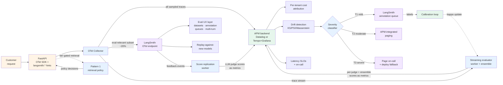

# Project 3 — Hybrid production stack

> 🔴 Advanced · ⏱ ~60 min reading · 🛠 ~5-8 day build · Verified 2026-05-26 · 📍 **The central Path 06 v2 capstone**

## Project brief

You're building the realistic mid-2026 production shape — LangSmith eval UX **and** OTel vendor-neutral telemetry, fed by a single OTel SDK instrumentation surface with Collector-routed fanout. The eval engineers get annotation queues, dataset diffs, multi-turn evals; the platform team gets standards-compliant traces in their existing APM; the FinOps team gets per-tenant cost attribution; the on-call rotation pages from the APM, not a special-snowflake siloed tool.

This project is what Project 1 and Project 2 combine into. Industry-survey data (Digital Applied April 2026) puts it bluntly: "most teams pick one primary platform and pair it with a whole-stack APM." This is the buildable form of that pattern.

**Deployment target**: FastAPI service in Docker; OTel Collector with two-pipeline fanout; LangSmith Plus (or Enterprise) for the eval UX layer; APM backend (Datadog or self-hosted Tempo+Grafana+Prometheus) for the operational layer.

**Scale assumption**: production-grade, 5+ person team, real customer traffic, both eval engineers and an on-call rotation as stakeholders.

This project is the buildable form of [Recipe 3 (Hybrid)](../recipes/03-hybrid-langsmith-and-otel.md). Pick this when **both** constraints are real: eval UX is needed (annotation queues, dataset diffs, replay-against-new-models) and vendor-neutral APM integration is mandatory.

## Prerequisites

Before starting, you should have completed:

- **Required Path 06 v1**: **All seven modules** (M1-M7). **All six Path 06 labs** ([17](../../../labs/17-langsmith-trace-ingestion/), [18](../../../labs/18-opentelemetry-portable-tracing/), [19](../../../labs/19-online-evaluation-and-sampling/), [20](../../../labs/20-drift-detection-and-calibration/), [21](../../../labs/21-cost-attribution-and-adaptive-sampling/), [22](../../../labs/22-multi-turn-evaluation/)).
- **Required Batch 33 + 34**: [Recipe 3 (Hybrid)](../recipes/03-hybrid-langsmith-and-otel.md) read end-to-end. **All three Batch 34 patterns**: [Pattern 1](../patterns/01-cost-aware-retrieval.md), [Pattern 2](../patterns/02-drift-triggered-review.md), [Pattern 3](../patterns/03-judge-ensemble.md).
- **Strongly recommended**: [Project 1](./01-langsmith-eval-stack.md) and [Project 2](./02-otel-observability-stack.md) read end-to-end (not necessarily built — this project replaces the need to build both separately).
- **External**: a LangSmith Plus or Enterprise account; APM backend (Datadog or self-hosted infrastructure); Docker locally + the OTel Collector; agent code in any framework (LangChain, LangGraph, or custom — this project framework-agnostic on purpose).

This is the largest of the three projects. If you haven't shipped Path 06 v1 + v2 work to production before, ship Project 1 or Project 2 first. Project 3 assumes you've felt the production failure modes of one of the simpler stacks already.

## What you'll have when done

- A FastAPI agent service with **single** OTel SDK instrumentation surface — no dual-emit at the app layer.
- An OTel Collector with **two-pipeline fanout**: APM gets everything sampled, LangSmith gets a further-filtered eval-relevant subset.
- A tail-sampling policy that retains 100% of errors + 100% of slow + 100% of high-cost + 10% of baseline.
- A LangSmith subset filter that routes ~20% of sampled traffic to LangSmith (errors, slow, high-cost, plus 20% of clean baseline).
- LangSmith hosting the eval UX layer: versioned Datasets, Automation Rules, annotation queues, Multi-turn Evals, Dataset diffs.
- The APM backend hosting the operational layer: per-tenant cost dashboards, drift detection on score streams, latency SLOs, the on-call view.
- A score-replication worker bridging LangSmith → APM (LLM-as-judge scores from LangSmith feedback events → APM metrics for drift detection).
- A tier-gated retrieval policy (Pattern 1) reading baggage; policy decisions visible in both views.
- A three-tier drift response (Pattern 2): T1 → LangSmith annotation queue; T2 → APM-paging; T3 → on-call.
- A three-judge ensemble (Pattern 3) running as a streaming evaluator; ensemble scores live in OTel as primary; replicated to LangSmith for annotation-queue disagreement routing.
- Multi-turn evals threading through both views: LangSmith hosts the eval workflow; APM hosts the operational metric.
- **A handoff-discipline runbook entry** — the central artifact of this project. Documents who emits what, who consumes what, where each artifact lives, and which view is the source of truth when scores appear in both places.

## Architecture at a glance

The Collector is the central artifact (as in Project 2), but its responsibility expands: it fans out to two destinations with deliberately different sampling discipline.

## Build milestones

### M1 — Single OTel SDK instrumentation surface with dual-emit shape (~1 day)

**Goal**: agent emits OTel traces once; the dual-emit happens downstream, not in app code.

**Scope**:
- FastAPI service with OTel auto-instrumentation + manual agent-level invoke span (same as Project 2's M1)
- Span attributes include both standard GenAI conventions (`gen_ai.*`) AND LangSmith hints (`langsmith.span.kind`, `langsmith.metadata.user_id`, `langsmith.metadata.session_id`)
- `langsmith` Python SDK ≥ 0.4.25 pinned (LangChain-recommended version for OTel fan-out stability per March 2026 announcement)
- `BatchSpanProcessor` + `OTLPSpanExporter` pointed at the local Collector
- Docker image with all dependencies pinned; uv as the lockfile tool

**Done when**: a request to the FastAPI endpoint produces a trace with both `gen_ai.*` and `langsmith.*` attributes visible; the trace doesn't reach LangSmith yet (that's M2), but the attribute schema is correct.

→ Builds on [Lab 17](../../../labs/17-langsmith-trace-ingestion/) + [Lab 18](../../../labs/18-opentelemetry-portable-tracing/) combined; [Recipe 3 Step 1](../recipes/03-hybrid-langsmith-and-otel.md).

### M2 — Collector with two-pipeline fanout + LangSmith subset filter (~1-2 days)

**Goal**: APM gets everything sampled; LangSmith gets a further-filtered eval-relevant subset.

**Scope**:
- Collector configuration with two exporters: `otlp/apm` to your APM backend, `otlphttp/langsmith` to `https://api.smith.langchain.com/otel/v1/traces` (with regional endpoint variants documented for EU, APAC, AWS US)
- `tail_sampling` processor: 100% errors, 100% slow (>30s), 100% high-cost (>$0.10), 10% probabilistic baseline
- `filter/langsmith_subset` processor downstream of tail sampling: keeps errors + slow + high-cost + 20% of remaining (the `sampling.langsmith` attribute as an explicit opt-in for specific traces)
- Two pipelines in the service config: `traces/apm` (receivers → tail_sampling → otlp/apm) and `traces/langsmith` (receivers → tail_sampling → filter/langsmith_subset → otlphttp/langsmith)
- Queue + retry configured on both exporters; simulated outage of one backend doesn't drop traces destined for the other
- Configuration version-controlled alongside infra-as-code

**Done when**: a synthetic error trace appears in both APM and LangSmith; a synthetic clean trace appears in APM but only ~20% of the time in LangSmith; outage simulation on LangSmith doesn't lose APM traces.

→ Builds on [Lab 19](../../../labs/19-online-evaluation-and-sampling/) + [Lab 21](../../../labs/21-cost-attribution-and-adaptive-sampling/) + [Recipe 3 Steps 2-3](../recipes/03-hybrid-langsmith-and-otel.md).

### M3 — Baggage + cost attribution + cost-aware retrieval policy (~1 day)

**Goal**: per-tenant cost attribution in APM; retrieval policy consuming the cost signal.

**Scope**:
- Baggage propagation: `tenant.id`, `user.id`, `task.id`, `tenant.tier`, `thread.id` set at FastAPI request entry
- Helper copies baggage to span attributes on every span
- The `langsmith.metadata.session_id` hint is set from the baggage `thread.id` (so threads work in LangSmith's threads view)
- Tier-gated retrieval policy (Pattern 1) reading baggage; policy decisions logged as span attributes
- APM per-tenant cost dashboard: `sum(gen_ai.usage.total_cost_usd) by (tenant.id)` over 30 days
- The same dashboard query also visible (read-only) in LangSmith via run metadata filters

**Done when**: two test tenants on different tiers produce different cost rollups; the retrieval policy logs the tier-gated decisions; threads correctly appear in LangSmith's threads view.

→ Builds on [Lab 21](../../../labs/21-cost-attribution-and-adaptive-sampling/) + [Pattern 1](../patterns/01-cost-aware-retrieval.md) + [Recipe 3](../recipes/03-hybrid-langsmith-and-otel.md).

### M4 — Drift detection (APM) + annotation queue (LangSmith) + three-tier routing (~1-2 days)

**Goal**: drift detection in APM, annotation in LangSmith, severity classifier routes between them.

**Scope**:
- Streaming evaluator worker (Project 2 M4 pattern) running at least two evaluators against the trace stream
- Evaluator scores emitted to APM metrics, also tagged for LangSmith projects (`langsmith.metadata.*`)
- Lab 20 drift algorithms (KS / PSI / Wasserstein) running against the APM metrics stream
- Severity classifier (Pattern 2's `classify_drift`) reading APM metrics; outputs `DriftEvent` with `sustained_hours` and `pass_rate_delta_pp`
- T1 routing: severity classifier creates annotation queue entries in **LangSmith** via the LangSmith API (with tag `drift-tier1-<metric>`)
- T2 routing: APM-integrated paging (Datadog incidents / PagerDuty)
- T3 routing: on-call page + suspend in-flight experiments + flag the affected runs in LangSmith for replay-against-new-model investigation
- Idempotent routing; deduplication keyed on `(metric_name, window_start, severity)`

**Done when**: synthetic drift events at each severity tier route correctly; LangSmith annotation queue receives the T1 entries; APM-paging reaches a real human on T2; T3 paging tested via simulation.

→ Builds on [Lab 20](../../../labs/20-drift-detection-and-calibration/) + [Pattern 2](../patterns/02-drift-triggered-review.md) + [Recipe 3](../recipes/03-hybrid-langsmith-and-otel.md). **This is where the hand-off discipline pays off** — T1 lives in LangSmith because annotation UX is its strength; T2/T3 live in APM because operational paging is its strength.

### M5 — Three-judge ensemble + disagreement routing across views (~1 day)

**Goal**: ensemble runs for high-stakes evaluations; scores visible in both views; disagreements route to LangSmith annotation.

**Scope**:
- Three judges in the streaming evaluator worker (Claude Sonnet 4.5 + GPT-5.1 + Gemini 2.5 Pro)
- Triggered only on traces tagged `launch-eval` (cost discipline; ensemble is 3× cost)
- Per-judge scores + ensemble verdict + agreement metric all emitted as **APM metrics** (canonical source of truth for ensemble scoring)
- Per-judge scores + ensemble verdict **also** replicated to LangSmith as run feedback (so they show in the eval UX)
- Disagreement routing (2-1 splits or 1-1-1 in 3-judge): create LangSmith annotation queue entry with `ensemble-disagreement` tag — same queue as T1 drift entries (Pattern 2 cross-applies here)
- Weighted vote if M4's calibration has produced per-judge kappa; otherwise majority vote

**Done when**: a `launch-eval` test case produces three judge scores in both APM and LangSmith; a deliberately ambiguous case routes to annotation queue; weighted-vote logic verified if kappa data exists.

→ Builds on [Pattern 3](../patterns/03-judge-ensemble.md) + [Recipe 3](../recipes/03-hybrid-langsmith-and-otel.md).

### M6 — Multi-turn evals threading through both views (~0.5 day)

**Goal**: conversation-level evaluation visible in both LangSmith (eval workflow) and APM (operational metric).

**Scope**:
- `thread.id` propagated via baggage to every span in the conversation (already done in M3 via `langsmith.metadata.session_id` hint)
- Post-conversation worker computes Lab 22's four metrics (Conversation Completeness, Knowledge Retention, Role Adherence, Turn Relevancy)
- Scores written **both** ways:
  - To APM as span events on the thread root span (`write_span_event(name="eval.multi_turn_completeness", attributes={"score": score})`)
  - To LangSmith as Multi-turn Eval feedback (using the LangSmith Multi-turn Evals API)
- Threads visible in LangSmith threads view; multi-turn metric aggregates visible in APM dashboards

**Done when**: a synthetic conversation produces multi-turn scores in both views; both views display the same numeric scores.

→ Builds on [Lab 22](../../../labs/22-multi-turn-evaluation/) + [Recipe 3](../recipes/03-hybrid-langsmith-and-otel.md).

### M7 — Smoke test + handoff-discipline runbook entry (~0.5 day)

**Goal**: end-to-end production-readiness verification + the runbook entry that documents the architecture.

**Scope**:
- Synthetic end-to-end test: a real-shaped customer conversation flows through the entire stack; every artifact appears in its expected destination
- Outage simulation: LangSmith offline → APM still receives traces; APM offline → LangSmith still receives subset; Collector offline → app continues responding (BatchSpanProcessor buffers); evaluator worker offline → drift detection stops with monitoring alert
- The **handoff-discipline runbook entry** (this project's central artifact):
  - **What the app emits** — OTel-native traces with `langsmith.*` hint attributes and baggage carrying identity
  - **What the Collector routes** — APM gets everything sampled; LangSmith gets the eval-relevant subset
  - **What lives in LangSmith** — Datasets, annotation queues, Multi-turn Evals, Dataset diffs (consumed by eval engineers)
  - **What lives in APM** — cost dashboards, drift detection, latency SLOs, on-call paging (consumed by ops)
  - **What gets replicated** — table mapping each artifact to its source of truth and replication destination
  - **Source-of-truth rule** — operational truth in APM; evaluation truth in LangSmith; replicate when both views need read access

**Done when**: smoke test passes end-to-end; outage simulation results documented; runbook entry committed to the team's wiki.

→ Builds on [Recipe 3's hand-off discipline section](../recipes/03-hybrid-langsmith-and-otel.md) — the recipe's central artifact becomes the project's central deliverable.

## The integration layer

Project 3 uses every Path 06 lab, every recipe, every pattern. The table is dense:

| Milestone | Path 06 v1 labs | Batch 33 recipes | Batch 34 patterns | Concept pages |
|-----------|------------------|-------------------|---------------------|----------------|
| M1 — Dual-emit instrumentation | Labs 17 + 18 | Recipe 3 Step 1 | — | `langsmith-tracing-shape.md`, `opentelemetry-genai-conventions.md` |
| M2 — Collector fanout | Labs 19 + 21 | Recipe 3 Steps 2-3 | — | `tail-based-sampling.md`, `platform-fanout-and-portability.md` |
| M3 — Baggage + retrieval policy | Lab 21 | Recipe 3 Step 3 | Pattern 1 | `cost-attribution.md`, `adaptive-sampling.md` |
| M4 — Drift + annotation + routing | Lab 20 | Recipe 3 Steps 4-5 | Pattern 2 | `drift-detection.md`, `agent-as-judge-calibration.md` |
| M5 — Ensemble + replication | Labs 17 + 19 | Recipe 3 Step 4 | Pattern 3 | `agent-as-judge-calibration.md`, `online-evaluator-registration.md` |
| M6 — Multi-turn threading | Lab 22 | Recipe 3 Step 6 | — | `multi-turn-evaluation.md`, `conversation-simulation.md` |
| M7 — Smoke test + runbook | (cross-cutting) | Recipe 3 hand-off discipline section | (cross-cutting) | `from-harness-to-production.md`, `observability-three-pillars.md` |

If a milestone is hard, the right move is to revisit the recipe step it's built on. Project 3 makes Recipe 3 concrete — the recipe should be your primary reference throughout the build.

## Acceptance rubric

The most comprehensive of the three projects. PR review on a deployed instance should hit each:

- [ ] **Single OTel SDK instrumentation surface** in the agent; no dual-emit in app code.
- [ ] **`langsmith` Python SDK ≥ 0.4.25 pinned** in the dependency file.
- [ ] **Span attributes include both `gen_ai.*` and `langsmith.*`** hint attributes; verified by inspecting a raw trace.
- [ ] **Collector has two pipelines** (`traces/apm` and `traces/langsmith`); configuration version-controlled.
- [ ] **Tail sampling has all four policies** in priority order; probabilistic last.
- [ ] **LangSmith subset filter routes ~20% of clean traffic** + 100% of errors/slow/high-cost; verified by counts in both views.
- [ ] **Both exporters have queue + retry**; outage of one backend doesn't lose traces destined for the other; verified by simulated outage.
- [ ] **Baggage propagation tested end-to-end**; both `gen_ai.*` and `langsmith.*` attributes carry identity downstream.
- [ ] **Per-tenant cost dashboard published in APM**; same data filterable in LangSmith via run metadata.
- [ ] **T1, T2, T3 drift routing destinations all verified live**; T1 reaches LangSmith annotation queue; T2 reaches APM-paging; T3 reaches on-call.
- [ ] **Handoff-discipline runbook entry exists** in the team's wiki, documenting the source-of-truth rule and the replication table.

## Common failure modes and recoveries

**Failure: M1 traces have `gen_ai.*` but not `langsmith.*` attributes.** The LangSmith SDK isn't picking up the OTel context. Verify `langsmith ≥ 0.4.25` is installed and the global tracer provider is set before the LangSmith SDK initializes. The init order matters; if LangSmith inits first, it claims the global tracer provider and the OTLP exporter setup fails to register.

**Failure: M2 LangSmith receives every trace, not the subset.** The filter processor isn't in the LangSmith pipeline. Two-pipeline Collector configurations are subtle — the filter is a processor; both pipelines reference the same receivers and tail_sampling processor; only the LangSmith pipeline gets the filter chained after. Re-read the YAML structure.

**Failure: M2 LangSmith subset is exactly 0% or exactly 100%.** The filter's attribute expression is malformed (0%) or always-true (100%). Test the expression in isolation; the OTel Collector docs have `filter` processor expression syntax that's stricter than it looks.

**Failure: M2 outage simulation shows traces lost.** Queue + retry isn't configured. Each exporter needs `sending_queue: { enabled: true, num_consumers: 10, queue_size: 5000 }` and `retry_on_failure: { enabled: true }`. The Collector's default behavior on backend failure is to drop, not retry — explicit configuration required.

**Failure: M3 `langsmith.metadata.session_id` isn't visible in LangSmith threads view.** The attribute name must match exactly. LangSmith's threads view keys on `langsmith.metadata.session_id` specifically — not `langsmith.session_id` or `langsmith.metadata.thread_id`. Worth double-checking against the LangSmith OTel docs (the documented schema is the source of truth, not memory).

**Failure: M3 retrieval policy doesn't see the tier.** Baggage propagation is context-scoped; if the policy is called outside the OTel context (e.g., in a background job), `baggage.get_baggage` returns `None`. Pass the context explicitly to background jobs: `with tracer.start_as_current_span("...", context=parent_context): ...`.

**Failure: M4 T1 entries don't appear in LangSmith annotation queue.** The LangSmith API requires the trace to be ingested first; if the severity classifier fires before the trace has reached LangSmith, the queue entry references a non-existent trace. Add a 30-second delay between drift detection and queue entry creation; or query LangSmith to confirm the trace exists before creating the entry.

**Failure: M4 T2 paging fires too often.** Same as Project 2's failure mode — `sustained_hours` isn't being applied. T2 requires the signal to hold for ≥ 24h; check the classifier's input includes `sustained_hours`, not just the latest p-value. Track false-positive rate weekly.

**Failure: M5 ensemble scores don't appear in LangSmith.** The replication worker isn't running, or it's writing to the wrong project. Score replication is its own moving part with its own monitoring — if the worker dies, scores live only in APM. Watchdog the worker the same way you watchdog the evaluator worker in M4.

**Failure: M6 multi-turn scores differ between APM and LangSmith.** The two write paths are computing the metric slightly differently — possibly different prompt versions or different judge models. Pin a single judge model for the multi-turn computation; have both write paths read the same computed score. The replication-vs-recomputation choice matters here; recomputation invites drift.

**Failure: M7 smoke test passes but the runbook entry is vague.** The handoff-discipline runbook entry should be specific enough that a new team member can answer "where do I find the cost dashboard" or "where do annotation labels live" without asking. If the entry says "in LangSmith" but doesn't say which project, which queue, which filter — the entry isn't done. The Recipe 3 hand-off discipline section is the template.

## Operational checklist (pre-launch)

### Instrumentation layer
- [ ] `langsmith ≥ 0.4.25` pinned in dependencies.
- [ ] OTel SDK initialized BEFORE LangSmith SDK; verified by init logs.
- [ ] `BatchSpanProcessor` + `OTLPSpanExporter` (not Simple + Console).
- [ ] Both `gen_ai.*` and `langsmith.*` attributes present on the agent-level span.
- [ ] `Resource` attributes set: service.name, service.version, deployment.environment.

### Collector layer
- [ ] Configuration version-controlled alongside infra-as-code.
- [ ] Two exporters: `otlp/apm`, `otlphttp/langsmith`.
- [ ] LangSmith OTel endpoint URL matches your region (US, EU, APAC, AWS US).
- [ ] `tail_sampling` `decision_wait: 30s` (not default 10s).
- [ ] `num_traces` sized: `traces_per_sec × decision_wait × 1.2`.
- [ ] All four sampling policies present, probabilistic last.
- [ ] LangSmith subset filter chained AFTER tail sampling.
- [ ] Queue + retry configured on both exporters; outage tested.
- [ ] `loadbalancingexporter` first-tier if traffic > 10K traces/sec.

### Identity + cost layer
- [ ] Baggage set at FastAPI request entry.
- [ ] Baggage copied to span attributes on every downstream span.
- [ ] `langsmith.metadata.session_id` populated from baggage `thread.id`.
- [ ] Per-tenant cost dashboard published in APM.
- [ ] Tier-gated retrieval policy logging decisions as span attributes.

### Eval layer
- [ ] Evaluator worker running with its own watchdog monitoring.
- [ ] At least two evaluators in production (one deterministic, one LLM-judge).
- [ ] Three-judge ensemble triggered only on `launch-eval` tag.
- [ ] Score replication worker (LangSmith feedback → APM metrics) running with watchdog.
- [ ] LangSmith Datasets versioned with documented policy.
- [ ] At least 50 examples in the regression Dataset.

### Drift response layer
- [ ] Severity classifier reading APM metrics.
- [ ] T1, T2, T3 routing destinations all verified live.
- [ ] Annotation queue has ≥ 20 calibration labels for the LLM-judge.
- [ ] False-positive rate tracked weekly; thresholds tuned monthly.
- [ ] Idempotent routing verified by retriggering the same drift event.

### Runbook
- [ ] Handoff-discipline runbook entry exists in team wiki.
- [ ] Source-of-truth rule documented for every replicated artifact.
- [ ] On-call rotation knows where to find what; verified by an unfamiliar team member walking through.

## Cost envelope

Verified 2026-05-26. The highest-cost project of the three, but explicit cost levers keep it predictable.

| Component | 100K traces/mo (20% LS subset) | 1M traces/mo (10% LS subset) |
|-----------|--------------------------------|-------------------------------|
| OTel SDK + Collector | $0 (OSS) | $0 (OSS) |
| Collector compute | ~$30-70 | ~$300-700 |
| APM ingestion (Datadog) | ~$300-500 | ~$2000-4000 |
| APM ingestion (self-hosted Tempo+Grafana) | ~$50-100 | ~$300-700 |
| LangSmith ingestion (subset only) | $39 (1 seat) | ~$100-300 + custom Enterprise |
| Evaluator worker + score replication worker | ~$80-180 | ~$400-1200 |
| LLM-as-judge (10% sample of subset, 2 evaluators) | ~$10-40 | ~$100-400 |
| Three-judge ensemble (launch-eval tag, ~1-2% of total) | ~$15-50 | ~$100-300 |
| **Total (Datadog-backed)** | **~$474-879** | **~$3000-6900 + LangSmith Enterprise** |
| **Total (self-hosted APM)** | **~$224-479** | **~$1300-3600 + LangSmith Enterprise** |

The subset-routing math: dropping LangSmith from 100% to 20% saves ~80% of LangSmith ingestion costs while keeping all eval-relevant traffic. That's what makes the hybrid economically feasible at scale.

## Extensions and where to go next

- **`evaluation-frameworks-deep-dive.md`** — once Project 3 is live, the natural follow-up is choosing the optimal eval framework (LangSmith vs Braintrust vs Langfuse vs Phoenix vs MLflow) for your specific shape. Future Path 06 v2 batch.
- **Embedding-drift detection** — RAG-input-side drift complement; lab pending. Future Path 06 v2 batch.
- **Adversarial red-teaming at scale** — DeepTeam-style orchestration on top of the eval Dataset; lab pending. Future Path 06 v2 batch.
- **Multi-region deployment** — the regional LangSmith OTel endpoints (US, EU, APAC, AWS US) support multi-region deployments; the Collector configuration needs region-aware routing. Worth a separate runbook entry.
- **Compliance evidence generation** — once the architecture is stable, the same trace stream supports EU AI Act / NIST AI RMF evidence generation. The LangSmith audit log + APM trace retention is the foundation; turning them into compliance artifacts is organizationally-specific.
- **Multi-tenant data isolation** — for enterprise tenants, the baggage `tenant.id` becomes a data-isolation key, not just a cost attribution key. Worth a security review pass.

## References + further reading

- [`concepts/evaluation/from-harness-to-production.md`](../../../concepts/evaluation/from-harness-to-production.md), [`observability-three-pillars.md`](../../../concepts/evaluation/observability-three-pillars.md), [`langsmith-tracing-shape.md`](../../../concepts/evaluation/langsmith-tracing-shape.md), [`opentelemetry-genai-conventions.md`](../../../concepts/evaluation/opentelemetry-genai-conventions.md), [`tail-based-sampling.md`](../../../concepts/evaluation/tail-based-sampling.md), [`cost-attribution.md`](../../../concepts/evaluation/cost-attribution.md), [`adaptive-sampling.md`](../../../concepts/evaluation/adaptive-sampling.md), [`drift-detection.md`](../../../concepts/evaluation/drift-detection.md), [`agent-as-judge-calibration.md`](../../../concepts/evaluation/agent-as-judge-calibration.md), [`multi-turn-evaluation.md`](../../../concepts/evaluation/multi-turn-evaluation.md), [`platform-fanout-and-portability.md`](../../../concepts/evaluation/platform-fanout-and-portability.md), [`online-evaluator-registration.md`](../../../concepts/evaluation/online-evaluator-registration.md).
- [Lab 17](../../../labs/17-langsmith-trace-ingestion/), [Lab 18](../../../labs/18-opentelemetry-portable-tracing/), [Lab 19](../../../labs/19-online-evaluation-and-sampling/), [Lab 20](../../../labs/20-drift-detection-and-calibration/), [Lab 21](../../../labs/21-cost-attribution-and-adaptive-sampling/), [Lab 22](../../../labs/22-multi-turn-evaluation/).
- [Recipe 3 — Hybrid LangSmith + OpenTelemetry](../recipes/03-hybrid-langsmith-and-otel.md) — the architectural blueprint this project ships.
- [Pattern 1 — Cost-aware retrieval](../patterns/01-cost-aware-retrieval.md), [Pattern 2 — Drift-triggered review](../patterns/02-drift-triggered-review.md), [Pattern 3 — Judge ensemble](../patterns/03-judge-ensemble.md).
- LangChain blog (March 2026), *Introducing End-to-End OpenTelemetry Support in LangSmith* — [blog.langchain.com](https://blog.langchain.com/end-to-end-opentelemetry-langsmith/) — the announcement that made Project 3 operationally feasible (the SDK ≥ 0.4.25 pin comes from this).
- LangSmith documentation, *Trace with OpenTelemetry* — [docs.langchain.com](https://docs.langchain.com/langsmith/trace-with-opentelemetry) — the canonical reference for the `langsmith.*` attribute hints and regional endpoint URLs.
- Digital Applied (April 2026), *Agent Observability Platforms 2026* — [digitalapplied.com](https://www.digitalapplied.com/blog/agent-observability-platforms-langsmith-langfuse-arize-2026) — the industry-survey data ("most teams pick one primary platform and pair it with a whole-stack APM") establishing this as the production-realistic shape.
- LiteLLM documentation, *OpenTelemetry — Tracing LLMs with any observability tool* — [docs.litellm.ai](https://docs.litellm.ai/docs/observability/opentelemetry_integration) — the canonical dual-exporter pattern (`skip_set_global=True`) referenced by Recipe 3's Collector design.
- pyinns (April 2026), *LLM Deployment with FastAPI + Docker + uv in 2026* — [pyinns.com](https://www.pyinns.com/python/llm-and-generative-ai/llm-deployment-fastapi-docker-uv-python-2026-complete-guide-best-practices) — production deployment patterns for the M1 instrumentation surface.
- Datadog documentation, *Ingestion Sampling with OpenTelemetry* — [docs.datadoghq.com](https://docs.datadoghq.com/opentelemetry/ingestion_sampling/) — Collector + Datadog Exporter integration.
