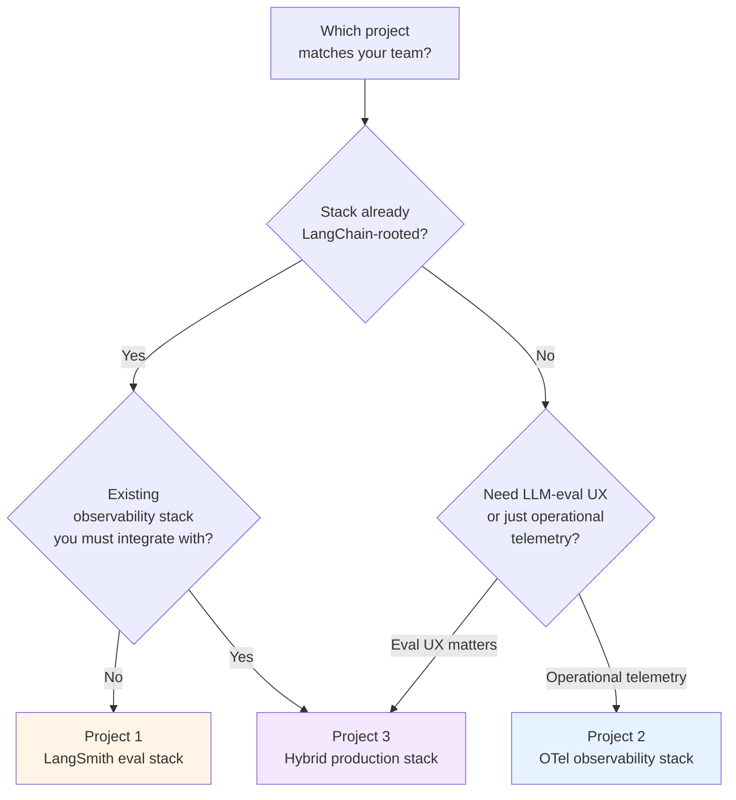

# Path 06 Projects — Production-Deployable Capstones

> 🔴 Advanced · ⏱ ~45-60 min reading per project · 🛠 ~3-8 day build per project · 📍 Read after at least one [recipe](../recipes/) and the relevant [patterns](../patterns/)

This directory contains **production-deployable capstone projects** — multi-day builds that integrate the Path 06 v1 labs, Batch 33 recipes, and Batch 34 patterns into realistic deployment stacks.

If recipes are orchestration guides and patterns are reusable mechanisms, projects are **the full builds**. A recipe tells you which modules to use in what order; a project gives you the milestones, the acceptance rubric, the failure modes, and the cost envelope for actually shipping the thing.

## The v2 ladder

Each layer answers a different question; projects sit at the top:

| Layer | Granularity | Shape | Reading time |
|-------|-------------|-------|--------------|
| [Concepts](../../../concepts/evaluation/) (v1) | One topic per page | Explanatory | ~10-15 min |
| [Labs](../../../labs/) (v1) | One executable skill per notebook | Hands-on code | ~60-110 min |
| [Recipes](../recipes/) (Batch 33) | End-to-end deployment composition | Orchestration guide | ~20-25 min |
| [Patterns](../patterns/) (Batch 34) | Cross-cutting mechanism | Mechanism documentation | ~12-15 min |
| **Projects** (Batch 35) | End-to-end capstone build | Build brief + milestones + rubric | **~45-60 min read + multi-day build** |

The projects are deliberately the longest reading time because they include the full build sequence — milestones, acceptance rubric, failure modes, cost envelope. That structure is what makes them capstone briefs rather than longer recipes.

## How projects differ from the top-level `/projects/` directory

The repo has a separate top-level [`/projects/`](../../../projects/) directory for **multi-path build challenges** (personal research assistant, PDF Q&A bot, financial research analyst, etc.) organized into beginner/intermediate/capstone tiers. Those projects span multiple paths.

Path 06 v2 projects are different: **Path-06-specific capstones** that integrate Path 06 labs + recipes + patterns into a production evaluation/observability stack. They're not multi-path crossovers; they're deep dives on one production discipline.

The two directories are orthogonal. A learner finishing a top-level capstone (e.g., financial research analyst) can use Path 06 Project 3 (Hybrid production stack) as the observability layer for it.

## The three projects

| # | Project | Build for | Built on |
|---|---------|-----------|----------|
| 1 | [LangSmith eval stack](./01-langsmith-eval-stack.md) | LangChain-rooted teams; fastest zero-to-production eval workflow | [Recipe 1](../recipes/01-langsmith-native.md) + [Pattern 2](../patterns/02-drift-triggered-review.md), [Pattern 3](../patterns/03-judge-ensemble.md) |
| 2 | [OTel observability stack](./02-otel-observability-stack.md) | Teams with existing observability stack; vendor-neutral telemetry | [Recipe 2](../recipes/02-opentelemetry-native.md) + [Pattern 1](../patterns/01-cost-aware-retrieval.md), [Pattern 2](../patterns/02-drift-triggered-review.md), [Pattern 3](../patterns/03-judge-ensemble.md) |
| 3 | [Hybrid production stack](./03-hybrid-production-stack.md) | Production teams needing both LLM-eval UX and vendor-neutral telemetry — **the realistic mid-2026 production shape** | [Recipe 3](../recipes/03-hybrid-langsmith-and-otel.md) + **all three patterns**, all seven v1 modules |

## Pick-a-project decision aid

The decision tree maps to the same shape as the recipes decision tree — by design. Each project is the buildable form of the recipe with the same name. Recipes describe the architecture; projects ship the architecture.

## What the projects share

All three projects follow the same 12-section shape:

1. **Project brief** — what you're building; deployment target; scale assumption.
2. **Prerequisites** — required Path 06 modules, labs, recipes, patterns to have completed.
3. **What you'll have when done** — concrete deliverable list.
4. **Architecture at a glance** — mermaid diagram of the full system.
5. **Build milestones** — 4-7 ordered milestones, each with goal, scope, time estimate, "done when" check.
6. **The integration layer** — table mapping each milestone to the Path 06 labs/recipes/patterns it builds on.
7. **Acceptance rubric** — 6-11 testable PR-review criteria.
8. **Common failure modes and recoveries** — 5-8 mistakes that derail teams.
9. **Operational checklist (pre-launch)** — 12-18 items.
10. **Cost envelope** — monthly cost at 10K/100K/1M traces.
11. **Extensions and where to go next** — 4-6 follow-ups.
12. **References + further reading**.

The four sections that distinguish projects from recipes — **milestones, integration layer, acceptance rubric, failure modes** — are what make them capstone briefs rather than reference docs.

## What projects are not

- **Not full Docker Compose files or Kubernetes manifests.** Projects show the structural patterns; the specific YAMLs are organizationally-specific (your cloud, your secrets manager, your security posture).
- **Not starter or solution code.** The top-level `/projects/` directory uses those; Path 06 v2 projects are documentation-only build briefs. Learners reuse the existing Path 06 lab notebooks ([Labs 17-22](../../../labs/)) as the starter.
- **Not a substitute for production engineering judgment.** The acceptance rubric is the minimum bar; your team's domain, scale, and risk tolerance will push the bar higher in places the rubric doesn't anticipate.
- **Not a deployment runbook.** Projects get you to a deployable stack; the team's own runbook covers incident response, secret rotation, model swap-outs, compliance audits.

## Reading order

If you're new to Path 06: read the [v1 modules](../README.md) first, then a [recipe](../recipes/) matching your stack, then come back here.

If you're picking a project to build: skim the three project briefs in order (1 → 2 → 3), then use the decision tree above to pick. The hybrid (Project 3) is the most realistic production target but also the largest commitment.

If you're auditing an existing production stack: read Project 3 first — its milestones and acceptance rubric form a self-audit checklist for any hybrid deployment, whether you built it from scratch following the project or built it independently.

## Version notes

Projects are classified **fast-moving** by content (tool versions, cost claims, specific pinned APIs) and **slow-moving** by structure (the milestones, the integration table, the acceptance rubric).

Each project carries a `verified YYYY-MM-DD` stamp at the top. The cost-envelope numbers carry the highest age-out risk; reverify against current vendor pricing before committing budgets. The milestone sequence and integration layer are more stable — the architecture patterns don't shift quarterly.

## Contributing

The [`_template.md`](./_template.md) walks through each section with prompts. The right time to add a fourth project is when a deployment shape isn't covered (e.g., Langfuse-native production stack; on-prem Phoenix + Tempo + Prometheus stack). Open a PR; a maintainer reviews against the shared shape.
