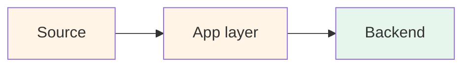

# Project N — [Project name]

> 🔴 Advanced · ⏱ ~XX min reading · 🛠 ~X-X day build · Verified YYYY-MM-DD

<!--
This is the template for adding a Path 06 production capstone project.
Copy this file, rename to NN-project-name.md, fill in each section, delete these comments.

Project shape is deliberately larger than recipes (10 sections) and patterns (8 sections):
12 sections, ~45-60 min reading, multi-day build. Four sections distinguish projects from
recipes — milestones, integration layer, acceptance rubric, failure modes — because
projects are buildable capstones rather than reference docs.

See README.md for the shape rationale and Projects 01/02/03 for examples.

PLACEHOLDER CONVENTION: For path placeholders in the body, use prose with inline-code
(e.g. "the relevant lab at `labs/NN-some-lab/`") NOT actual markdown link syntax. The
link-sweep tool flags placeholder paths inside markdown link syntax as broken — even
when they're documentation of patterns. The prose+code form sidesteps the parser false
positive. See the references section for the recommended pattern for citing real links.
-->

## Project brief

<!--
1-2 paragraphs.

What are you building? Deployment target? Scale assumption? Why pick this project over
the other two? Reference the recipe this project is the buildable form of.

Example (Project 1): "You're building a LangSmith-native production evaluation stack
for a LangChain-rooted agent. ... Deployment target: FastAPI service in a Docker
container ... Scale assumption: up to 100K traces/month ... This project is the
buildable form of Recipe 1."
-->

[1-2 paragraphs.]

**Deployment target**: [stack choice with rationale]

**Scale assumption**: [traffic / team size / framework constraint]

This project is the buildable form of Recipe N (referenced via a path like `../recipes/NN-recipe-name.md`). [Brief framing of when to pick this vs the other projects.]

## Prerequisites

<!--
- Required Path 06 v1 modules and labs
- Required recipes and patterns
- External tooling assumptions

Be explicit: "If any of these are gaps, fix them first."
-->

Before starting, you should have completed:

- **Required Path 06 v1**: [modules + labs]
- **Required Batch 33 + 34**: [recipes + patterns]
- **External**: [accounts, infrastructure, framework choices]

If any of those are gaps, fix the gaps first.

## What you'll have when done

<!--
8-12 bullets. Concrete deliverable list. Each should be testable.

Example: "A FastAPI service running [agent], instrumented with [tooling], deployed in Docker."
Not: "An understanding of how to instrument an agent."
-->

- [Concrete deliverable 1]
- [Concrete deliverable 2]
- ...

## Architecture at a glance

<!--
One detailed mermaid diagram of the full system. Includes:
- App / client / external systems
- Instrumentation layer
- Routing / Collector if applicable
- Backend(s)
- Eval workflow
- Human review path
- Cost / drift / alerting paths

Use the Batch 33 color palette:
  warm (#fff4e6)   : app / source
  cool (#e6f2ff)   : middleware / Collector / decision logic
  purple (#f3e8ff) : vendor platform / queue / human
  green (#e6f6ec)  : backend / ops / output
-->

[1-2 sentences pointing out what's specific to this architecture.]

## Build milestones

<!--
4-7 milestones in order. Each milestone has:
- **Goal**: one sentence
- **Scope**: 4-7 bullets of what's in scope
- **Done when**: one observable test that confirms completion
- Cross-link to the labs / recipes / patterns the milestone builds on

The milestone list is the central artifact distinguishing projects from recipes.
-->

### M1 — [First milestone name] (~X-X days)

**Goal**: [one sentence]

**Scope**:
- [In-scope item 1]
- [In-scope item 2]
- ...

**Done when**: [observable test]

→ Builds on [Lab NN, Recipe N Step X, Pattern N].

### M2 — [Second milestone name] (~X-X days)

...

## The integration layer

<!--
Table mapping each milestone to the v1 labs, Batch 33 recipes, Batch 34 patterns,
and concept pages it builds on. This is the proof that the project is a capstone
rather than a fresh build.
-->

| Milestone | Path 06 v1 labs | Batch 33 recipes | Batch 34 patterns | Concept pages |
|-----------|------------------|-------------------|---------------------|----------------|
| M1 — [name] | [Lab NN] | [Recipe N Step X] | [Pattern N] | [concept-page.md] |
| ... | ... | ... | ... | ... |

[1 paragraph reminding readers: if a milestone is hard, revisit the underlying lab/recipe.]

## Acceptance rubric

<!--
6-11 testable criteria. PR-review-ready. Each should be confirmable by inspecting
the deployed instance.

Format as markdown checkboxes - [ ].
-->

- [ ] [Testable criterion 1]
- [ ] [Testable criterion 2]
- ...

## Common failure modes and recoveries

<!--
5-8 failure modes that derail teams during the build, each with a recovery path.
These are the things that cost a day if you don't know them, and 15 minutes if
you do. Be specific about the symptom and the fix.
-->

**Failure: [symptom]**. [What's happening; the recovery path.]

**Failure: [symptom]**. [Recovery.]

...

## Operational checklist (pre-launch)

<!--
12-18 items. Runnable as a pre-deployment gate. Group by layer if helpful
(instrumentation, Collector, identity, eval, drift, runbook).
-->

- [ ] [Pre-launch item 1]
- [ ] [Pre-launch item 2]
- ...

## Cost envelope

Verified YYYY-MM-DD. Reverify against current vendor pricing before committing budgets.

<!--
Cost table at 10K/100K/1M traces, broken out by component. Same format as
Projects 01/02/03. Include both managed and self-hosted variants where
applicable.
-->

| Component | 10K traces/mo | 100K traces/mo | 1M traces/mo |
|-----------|----------------|------------------|---------------|
| [Component A] | $X | $Y | $Z |
| ... | ... | ... | ... |
| **Total** | **$X** | **$Y** | **$Z** |

[1-2 sentences on which component dominates costs at which scale.]

## Extensions and where to go next

<!--
4-6 ideas for extending the project, plus pointers to future Path 06 v2 batches
that will extend it further.
-->

- **[Extension idea 1]** — [why; how it extends the project].
- **[Extension idea 2]** — [why].
- ...

## References + further reading

<!--
Repo-internal first, then external sources. Use markdown link syntax in the
actual published file — see Projects 01/02/03 for the format.

External sources should be verified via web search; carry their publication date
implicitly through the citation.
-->

- Concept page references at paths like `concepts/evaluation/relevant-page.md` — see Projects 01/02/03 for the exact link format.
- Lab references at paths like `labs/NN-some-lab/`.
- Recipe and pattern references via paths like `../recipes/NN-recipe.md` and `../patterns/NN-pattern.md`.
- External sources — vendor docs, engineering blogs, industry surveys.

<!--
DELETE BEFORE COMMITTING:

Pre-publication checklist:
- [ ] All `[bracketed placeholders]` replaced with real content.
- [ ] Placeholder paths in prose use inline code (e.g. `concepts/evaluation/example.md`)
      and NOT markdown link syntax (which trips the link checker).
- [ ] Real concept-page, lab, recipe, pattern, and external links use proper
      markdown syntax.
- [ ] Mermaid diagram syntax verified (paste into GitHub preview to confirm).
- [ ] Reading time estimate matches actual length (heuristic: 1500 chars/min;
      projects are usually 60-90KB).
- [ ] Build time estimate calibrated (multiple of milestone time estimates).
- [ ] At least 5 external references, each verified to exist.
- [ ] Word-discipline check: scan against the locked forbidden-vocabulary list
      in CONTRIBUTING.md (no filler-grade hedges or marketing-tone superlatives).
- [ ] Integration-layer table populated for every milestone (no empty cells).
- [ ] PR title: "Path 06 v2: Add [project name] project".
- [ ] Link the new project in projects/README.md's table.

Once those are done, delete this entire HTML comment block.
-->
