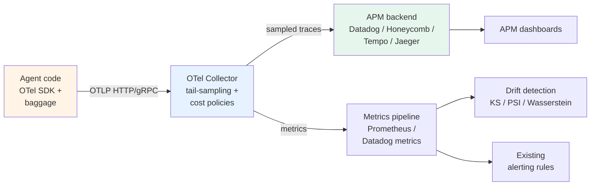

# Recipe 2 — OpenTelemetry-native production composition

> 🟡 Slow-moving · ⏱ ~22 min · 🛠 Verified 2026-05-26 · 📍 Read after Modules 3, 4, 6, 7 of Path 06 v1

## When this recipe fits

Your team already has an observability stack — Datadog, Honeycomb, self-hosted Grafana Tempo, Jaeger, New Relic, or similar — and the platform team wants agent telemetry joining the same APM views. You care about vendor-neutral instrumentation: agents shouldn't be an observability island that requires its own dedicated tool. You're willing to build evaluation logic yourself or use OSS frameworks (DeepEval, MLflow, RAGAS) rather than buy a closed eval UX.

This is the right recipe if you're going to fail an audit asking "can you show us all agent traces in the same APM view as the rest of the stack." If your team is LangChain-rooted and that constraint doesn't apply, see [Recipe 1](./01-langsmith-native.md). If you need both vendor-neutral telemetry **and** an LLM-eval UX, see [Recipe 3](./03-hybrid-langsmith-and-otel.md).

## What you'll have when you're done

- Agent traces flowing through an OpenTelemetry Collector to your existing observability backend.
- GenAI semantic conventions applied uniformly across all agent spans (`gen_ai.system`, `gen_ai.request.model`, `gen_ai.usage.*`).
- Cost attribution per tenant/user/task via OTel baggage propagation.
- Collector-level tail-sampling policies: errors retained 100%, slow traces 100%, high-cost traces routed for review, baseline sampled.
- Drift detection running against the trace stream in your metrics pipeline (Prometheus, Datadog metrics, etc.).
- Multi-turn evaluation scores attached as span attributes; queryable in the APM the same way latency metrics are.
- No vendor coupling above the GenAI semantic conventions layer.

## Architecture at a glance



The Collector is the central artifact. The app emits standards-compliant traces; the Collector decides what's retained, sampled, redirected. Your existing APM consumes them like any other service's traces. Nothing platform-specific lives in the app code.

## Step-by-step assembly

### Step 1 — Instrument with OTel GenAI semantic conventions (Module 3; Lab 18 patterns)

The agent code emits OTel spans with `gen_ai.*` attribute names. The two paths to get there:

**Auto-instrumentation** (preferred when available):

```python
from opentelemetry.instrumentation.openai import OpenAIInstrumentor
OpenAIInstrumentor().instrument()  # Every openai.chat.completions.create now emits a span
```

**Manual instrumentation** (for the agent-level invoke span and any non-instrumented LLM SDK):

```python
from opentelemetry import trace
from opentelemetry.trace import SpanKind, Status, StatusCode

tracer = trace.get_tracer(__name__)

with tracer.start_as_current_span(
    "invoke_agent",
    kind=SpanKind.CLIENT,
    attributes={
        "gen_ai.system": "openai",
        "gen_ai.request.model": model_name,
        "gen_ai.operation.name": "agent.invoke",
    },
) as span:
    result = agent.invoke(task)
    span.set_attribute("gen_ai.usage.prompt_tokens", result.usage.prompt_tokens)
    span.set_attribute("gen_ai.usage.completion_tokens", result.usage.completion_tokens)
```

The OTel GenAI semantic conventions evolve — the `gen_ai.*` prefix is stable, the specific attribute names occasionally rename as the spec firms up. Pin your `opentelemetry-instrumentation-openai` version and read its release notes before bumping.

→ See [`concepts/evaluation/opentelemetry-genai-conventions.md`](../../../concepts/evaluation/opentelemetry-genai-conventions.md) and [Lab 18](../../../labs/18-opentelemetry-portable-tracing/).

### Step 2 — Configure the Collector with tail-sampling + cost-driven policies (Modules 4, 6; Lab 19 + Lab 21 YAMLs)

The Collector is where you encode "errors always retained, slow traces always retained, baseline at 10%, high-cost flagged" without touching app code. The policy stack runs in priority order:

```yaml
processors:
  tail_sampling:
    decision_wait: 30s              # Agents have long-tail latency; 10s default is too short
    num_traces: 360000              # traces_per_sec × decision_wait × 1.2 (safety margin)
    expected_new_traces_per_sec: 12000
    policies:
      - name: errors
        type: status_code
        status_code: { status_codes: [ERROR] }
      - name: slow-traces
        type: latency
        latency: { threshold_ms: 30000 }
      - name: high-cost
        type: numeric_attribute
        numeric_attribute:
          key: gen_ai.usage.total_cost_usd
          min_value: 0.10
      - name: enterprise-tier
        type: string_attribute
        string_attribute:
          key: tenant.tier
          values: [enterprise]
      - name: probabilistic-baseline
        type: probabilistic
        probabilistic: { sampling_percentage: 10 }
```

The policy order is the priority order — `tail_sampling` is first-match-wins on retain decisions. Probabilistic goes last so errors and high-cost traces aren't dropped randomly before policy evaluation.

→ See [`concepts/evaluation/tail-based-sampling.md`](../../../concepts/evaluation/tail-based-sampling.md), [Lab 19](../../../labs/19-online-evaluation-and-sampling/), and [Lab 21](../../../labs/21-cost-attribution-and-adaptive-sampling/).

### Step 3 — Propagate baggage for cost attribution (Module 6; Lab 21 patterns)

OTel baggage carries identity (`tenant.id`, `user.id`, `task.id`, `tenant.tier`) across every span in a trace without being passed as an argument. Set at request entry, propagated implicitly through the agent's downstream calls:

```python
from opentelemetry import baggage, context as otel_context

def handle_request(req):
    ctx = otel_context.get_current()
    ctx = baggage.set_baggage("tenant.id", req.tenant_id, ctx)
    ctx = baggage.set_baggage("user.id", req.user_id, ctx)
    ctx = baggage.set_baggage("task.id", req.task_id, ctx)
    ctx = baggage.set_baggage("tenant.tier", req.tier, ctx)
    token = otel_context.attach(ctx)
    try:
        return agent.invoke(req)
    finally:
        otel_context.detach(token)
```

In every span downstream, copy the baggage values to span attributes (redundant on purpose — baggage is the propagation mechanism; attributes are the searchable index in your trace store):

```python
def _copy_identity_to_span(span):
    for key in ("tenant.id", "user.id", "task.id", "tenant.tier"):
        val = baggage.get_baggage(key)
        if val:
            span.set_attribute(key, val)
```

→ See [`concepts/evaluation/cost-attribution.md`](../../../concepts/evaluation/cost-attribution.md). Baggage's W3C 4KB limit means **only identity goes in baggage** — full prompt/completion content goes in span attributes.

### Step 4 — Run evaluators against the trace stream (Module 4)

Without a LangSmith-style Rules UI, you run evaluators yourself. Two patterns:

**Pattern A — Streaming evaluator service**: a small worker process subscribes to the trace stream (via OTLP from the Collector to your service, or via APM-backend query API). It runs the evaluator and writes scores back as span events or as a separate metrics stream.

**Pattern B — Backend-side evaluator**: some APM backends now run evaluators in-platform (Datadog LLM Observability, Honeycomb's BubbleUp, MLflow tracing). Configure via the backend's UI rather than running your own worker.

Both patterns produce the same artifact: an evaluator score linked back to the trace. Pattern A keeps you portable; Pattern B is faster to set up if your backend supports it.

The evaluator implementations from [Lab 19](../../../labs/19-online-evaluation-and-sampling/) (reference-free patterns, JSON-shape validity, output-length sanity) transfer directly. The Lab 22 multi-turn metrics (Conversation Completeness, Knowledge Retention, Role Adherence) also transfer — they're pure-Python functions that operate on a trace dict.

### Step 5 — Drift detection on the metrics pipeline (Module 5)

The score-stream output from Step 4 feeds your metrics pipeline (Prometheus, Datadog metrics, Honeycomb derived columns). Lab 20's KS-test / PSI / Wasserstein algorithms run unmodified on the score arrays — they don't depend on LangSmith for anything.

Two operational patterns:

**Rolling-window detector** (Lab 20's pattern): the worker process from Step 4 maintains a rolling window of recent scores, runs KS-test against a fixed baseline, alerts on `p < 0.001`.

**Backend-native drift**: Datadog Anomaly Detection, New Relic Applied Intelligence, and similar features detect distribution shifts on any metric. Configure them on the evaluator-score metric and let the backend page you.

→ See [`concepts/evaluation/drift-detection.md`](../../../concepts/evaluation/drift-detection.md) and [Lab 20](../../../labs/20-drift-detection-and-calibration/).

### Step 6 — Multi-turn evaluation via span-attached scores (Module 7)

Multi-turn metrics produce per-conversation scores. The OTel-native pattern: attach them as attributes to the root span of the thread, or emit them as a separate per-thread metric.

```python
# After the conversation completes
score = conversation_completeness(thread.turns)["score"]
# Attach to the thread's root span (requires re-finding the span; in practice
# this runs in a post-processing worker that has the trace_id + span_id)
write_span_event(
    thread_root_span_id,
    name="eval.multi_turn_completeness",
    attributes={"score": score, "thread_id": thread.id},
)
```

In your APM, the score becomes a queryable attribute on the trace — same shape as latency or token count. Aggregate views across all threads work like aggregate views across any other metric.

→ See [Lab 22](../../../labs/22-multi-turn-evaluation/) for the metric implementations.

## Lab-shape vs production-shape

| Module | Lab shape | Production shape (this recipe) |
|---|---|---|
| M3 — Instrumentation | `SimpleSpanProcessor` + `ConsoleSpanExporter` for inline visibility | `BatchSpanProcessor` + `OTLPSpanExporter` to the Collector; no console output |
| M3 — Fanout | Optional Jaeger as a third backend | Single Collector ingest; the Collector handles fanout to multiple backends |
| M4 — Tail sampling | Policy logic simulated in Python | Real Collector with the `tail_sampling` processor; policies loaded from YAML |
| M6 — Cost attribution | 200-trace synthetic burn-down in a notebook | Live tenant cost streams aggregated in the metrics pipeline; alerting on threshold |
| M5 — Drift | KS/PSI/Wasserstein on synthetic streams | Same algorithms; running on production score streams in a worker process or backend feature |
| M7 — Multi-turn | Three from-scratch metrics applied to hand-crafted conversations | Same metric implementations; running in a post-conversation worker that writes scores back as span events |

The labs build the metrics and policies; production deploys them against real traffic via the Collector.

## Hand-off points

| Artifact | Emitted by | Consumed by | Lives in |
|----------|-----------|-------------|----------|
| Raw trace data | Agent app (OTel SDK) | Collector | OTLP wire |
| Baggage (identity) | App at request entry | Every downstream span | Trace context |
| Sampling decisions | Collector `tail_sampling` processor | Backend exporter | Collector config (YAML) |
| Evaluator scores | Worker process or backend-native eval | Metrics pipeline | Backend metrics store |
| Drift alerts | Drift detector | Alerting system | Backend alerting rules |
| Multi-turn scores | Post-conversation worker | APM trace view | Span attributes / events |

The two-tier topology (Collector tier 1 = `loadbalancingexporter`; tier 2 = `tailsamplingprocessor`) becomes mandatory above ~10K traces/sec. See [Lab 21](../../../labs/21-cost-attribution-and-adaptive-sampling/) for the tier YAMLs.

## What this recipe doesn't give you

- **LLM-eval UX.** No annotation queues, no dataset diffs, no replay-against-new-model UI. You build these in your APM (Datadog can host annotation workflows; Honeycomb can host dataset comparison via boards) or in a dedicated eval tool (Confident AI, MLflow, DeepEval).
- **Out-of-the-box trajectory evaluators.** LangSmith's `agentevals` package doesn't apply here directly. The Lab 17 patterns (`graph_trajectory_strict_match`) are LangSmith-specific; OTel-native trajectory evaluation is hand-rolled or via a third-party package.
- **Easy migration to LangSmith later.** If you want both, start with Recipe 3 — adding LangSmith on top of a pure-OTel stack means re-instrumenting some surfaces.
- **Built-in cost dashboards.** OTel gives you the cost attribute on spans; building the per-tenant burn-down dashboard is your APM team's work. Datadog has LLM-cost dashboards out of the box now; other APMs are catching up.

## Operational checklist (pre-launch)

- [ ] OTel SDK initialized with a `Resource` carrying `service.name`, `service.version`, `deployment.environment`.
- [ ] `BatchSpanProcessor` (not `Simple`) configured with a reasonable export interval (5-10s).
- [ ] `OTLPSpanExporter` configured with the Collector endpoint and TLS certs verified.
- [ ] Collector configuration version-controlled in the same repo as infra-as-code.
- [ ] Collector deployed as a sidecar or daemonset (not as a single instance) — `loadbalancingexporter` first-tier for multi-node tail sampling.
- [ ] `decision_wait` set explicitly to 30s (or your trace duration P99 × 1.5) — not the 10s default.
- [ ] `num_traces` budget sized: `traces_per_sec × decision_wait × 1.2`.
- [ ] Baggage propagation tested end-to-end: identity set at request entry, visible on the deepest tool-call span.
- [ ] Span attribute size limits checked: large prompts can exceed default 64KB limits; configure `attribute_size_limit` if needed.
- [ ] PII redaction strategy decided: which span attributes carry prompts/completions, which are redacted via a Collector `attributes` processor.
- [ ] Evaluator worker (Pattern A) has its own monitoring — if the worker dies, your scores stop without anyone noticing.
- [ ] Drift detection alert thresholds tuned: false-positive rate < 1/month is the target.
- [ ] Cost dashboard published; per-tenant burn-down visible to the on-call rotation.

## Cost envelope

Verified 2026-05-26. APM backend costs vary widely; below is the OTel-stack overhead, not the backend.

| Component | Cost at 100K traces/mo | Cost at 1M traces/mo |
|-----------|------------------------|----------------------|
| OTel SDK + Collector | $0 (OSS) | $0 (OSS) |
| Collector compute (sidecar or daemonset) | ~$20-50 (one small node) | ~$200-500 (cluster of small nodes) |
| Backend ingestion (Datadog example) | ~$300-500 | ~$2000-4000 |
| Evaluator worker | ~$50-100 (one small node) | ~$200-500 (cluster) |
| LLM-as-judge calls (10% sample, 2 evaluators) | ~$50-150 | ~$500-1500 |
| **Total (Datadog-backed)** | ~$420-800 | ~$2900-6500 |
| **Total (self-hosted Tempo+Grafana)** | ~$70-150 (compute only) + LLM judge | ~$400-1000 + LLM judge |

The backend dominates costs at production scale. Self-hosting (Tempo + Grafana + Prometheus) is the order-of-magnitude cheaper option if your platform team can operate it; managed APM (Datadog, Honeycomb) is the order-of-magnitude faster option to ship.

Tail sampling at 10% retention drops backend ingestion costs by ~85-90% compared to head sampling at 100%. The Collector tier overhead is the price you pay; it more than pays for itself above ~100K traces/mo.

## References + further reading

- [`concepts/evaluation/opentelemetry-genai-conventions.md`](../../../concepts/evaluation/opentelemetry-genai-conventions.md) — the GenAI semantic conventions.
- [`concepts/evaluation/platform-fanout-and-portability.md`](../../../concepts/evaluation/platform-fanout-and-portability.md) — the fanout pattern.
- [`concepts/evaluation/tail-based-sampling.md`](../../../concepts/evaluation/tail-based-sampling.md) — the Collector tail-sampling pattern.
- [`concepts/evaluation/cost-attribution.md`](../../../concepts/evaluation/cost-attribution.md) — the baggage propagation pattern.
- [`concepts/evaluation/adaptive-sampling.md`](../../../concepts/evaluation/adaptive-sampling.md) — cost-driven sampling.
- [Lab 18](../../../labs/18-opentelemetry-portable-tracing/), [Lab 19](../../../labs/19-online-evaluation-and-sampling/), [Lab 21](../../../labs/21-cost-attribution-and-adaptive-sampling/) — the labs this recipe assembles.
- Datadog documentation, *Ingestion Sampling with OpenTelemetry* — [docs.datadoghq.com/opentelemetry/ingestion_sampling](https://docs.datadoghq.com/opentelemetry/ingestion_sampling/) — the official Collector + Datadog Exporter integration.
- MLflow documentation (April 2026), *Top 5 LLM and Agent Observability Tools in 2026* — [mlflow.org/top-5-agent-observability-tools](https://mlflow.org/top-5-agent-observability-tools/) — OTel-native platform comparison.
- TokenMix blog (April 2026), *OpenLLMetry: OpenTelemetry for LLMs Explained* — [tokenmix.ai/blog](https://tokenmix.ai/blog/openllmetry-opentelemetry-for-llms-explained-2026) — the OpenLLMetry attribute conventions used in this recipe.
- DEV Community (April 2026), *AI Agent Observability in 2026: OpenAI Agents SDK, LangSmith, and OpenTelemetry* — [dev.to/chunxiaoxx](https://dev.to/chunxiaoxx/ai-agent-observability-in-2026-openai-agents-sdk-langsmith-and-opentelemetry-3ale) — the "agents shouldn't be an observability island" framing.
