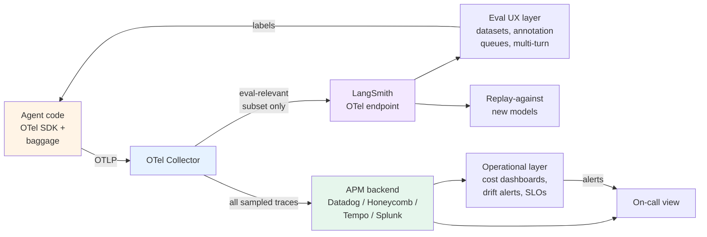

# Recipe 3 — Hybrid LangSmith + OpenTelemetry production composition

> 🟡 Slow-moving · ⏱ ~25 min · 🛠 Verified 2026-05-26 · 📍 Read after all Path 06 v1 modules; Recipes 1 and 2 first if you're new to the choice

## When this recipe fits

Your production deployment needs **both** ends of the trade-off:
- **LangSmith's eval UX** — annotation queues, dataset diffs, the `agentevals` library, the Multi-turn Evals workflow, replay-against-new-models. Your eval engineers and domain experts want a tool built for the job.
- **Vendor-neutral telemetry** — your existing APM stack (Datadog, Honeycomb, Tempo+Grafana, Splunk) needs the same traces; the platform team isn't going to let agent telemetry be a special-snowflake siloed system; compliance audits ask for full-stack tracing.

This is the most realistic mid-2026 production shape. Industry-survey data (Digital Applied, April 2026) puts it this way: "most teams pick one primary platform and pair it with a whole-stack APM." LangSmith now offers end-to-end OpenTelemetry support (LangChain blog, March 2026; SDK ≥ 0.4.25) which makes the dual-emit pattern operationally feasible — what was custom plumbing 12 months ago is now a documented integration.

If your team only needs one of the two, see [Recipe 1](./01-langsmith-native.md) (LangSmith only) or [Recipe 2](./02-opentelemetry-native.md) (OTel only). The hybrid earns its complexity only when both constraints are real.

## What you'll have when you're done

- A single agent instrumentation surface (the OTel SDK) emitting traces in GenAI semantic-convention shape.
- A Collector pipeline that fans out to **two** destinations: your APM backend (Datadog/Honeycomb/etc.) and LangSmith.
- A sampling policy that routes the eval-relevant trace subset to LangSmith and everything else to the APM only.
- LangSmith hosting the eval UX layer: datasets, annotation queues, dataset diffs, Multi-turn Evals.
- The APM hosting the operational layer: cost attribution dashboards, drift alerting, latency SLOs, the on-call view.
- Span-attached evaluator scores visible in both views, with the APM as primary and LangSmith as eval-UX-replicated.
- Explicit hand-off discipline documented in your team's runbook — the central artifact of this recipe.

## Architecture at a glance



The Collector is the cost lever. It decides which traces are eval-relevant (and therefore worth LangSmith's per-trace pricing) and which are operational-only (and therefore APM-only).

## The hand-off discipline (the central artifact)

This recipe's most useful section. Production hybrid deployments fail when ownership is fuzzy — when nobody can answer "who owns the score" or "where do I add a new evaluator" without a meeting. The discipline below is what makes the architecture work.

### What the app emits

The agent code emits **once**, in OTel-native shape. Everything else is downstream:

```python
from opentelemetry import trace, baggage, context as otel_context
from opentelemetry.trace import SpanKind

tracer = trace.get_tracer(__name__)

def handle_request(req):
    # 1. Baggage carries identity for cost attribution (Lab 21 pattern)
    ctx = otel_context.get_current()
    for key, val in [
        ("tenant.id", req.tenant_id),
        ("user.id", req.user_id),
        ("task.id", req.task_id),
        ("tenant.tier", req.tier),
        ("thread.id", req.session_id),     # M7 — thread identity
    ]:
        ctx = baggage.set_baggage(key, val, ctx)
    token = otel_context.attach(ctx)
    try:
        # 2. Agent-level span with GenAI conventions + LangSmith hints
        with tracer.start_as_current_span(
            "invoke_agent",
            kind=SpanKind.CLIENT,
            attributes={
                "gen_ai.system": "openai",
                "gen_ai.operation.name": "agent.invoke",
                "gen_ai.request.model": req.model,
                # LangSmith hints — picked up by LangSmith OTel ingestion to populate the eval UX
                "langsmith.span.kind": "AGENT",
                "langsmith.metadata.user_id": req.user_id,
                "langsmith.metadata.session_id": req.session_id,
            },
        ) as span:
            result = agent.invoke(req)
            span.set_attribute("gen_ai.usage.prompt_tokens", result.usage.prompt_tokens)
            span.set_attribute("gen_ai.usage.completion_tokens", result.usage.completion_tokens)
            return result
    finally:
        otel_context.detach(token)
```

The `langsmith.*` attributes are LangSmith's documented OTel hints (verified against LangSmith docs 2026-05-26). They tell LangSmith's OTel ingestion how to map the trace into its data model. The `gen_ai.*` attributes are the GenAI semantic conventions; they tell every OTel-compliant backend the same thing.

### What the Collector receives, processes, and routes

The Collector is the single point where the dual-emit decision happens. Two exporters in the same pipeline:

```yaml
# Simplified — real config also needs receivers, resource processors, etc.
exporters:
  # APM backend — receives everything that passes tail-sampling
  otlp/apm:
    endpoint: "${env:APM_OTLP_ENDPOINT}"
    headers: { "x-api-key": "${env:APM_API_KEY}" }
    tls: { insecure: false }

  # LangSmith — receives only the eval-relevant subset
  otlphttp/langsmith:
    endpoint: "https://api.smith.langchain.com/otel/v1/traces"
    headers:
      x-api-key: "${env:LANGSMITH_API_KEY}"
      Langsmith-Project: "${env:LANGSMITH_PROJECT}"

processors:
  # Stage 1: cost-driven tail sampling (Lab 21 pattern)
  tail_sampling:
    decision_wait: 30s
    num_traces: 360000
    policies:
      - name: errors
        type: status_code
        status_code: { status_codes: [ERROR] }
      - name: slow-traces
        type: latency
        latency: { threshold_ms: 30000 }
      - name: high-cost
        type: numeric_attribute
        numeric_attribute:
          key: gen_ai.usage.total_cost_usd
          min_value: 0.10
      - name: probabilistic-baseline
        type: probabilistic
        probabilistic: { sampling_percentage: 10 }

  # Stage 2: LangSmith subset — eval-relevant traces only
  # Routes errors + slow + high-cost + 20% of baseline to LangSmith
  # Everything sampled goes to APM regardless
  filter/langsmith_subset:
    traces:
      span:
        - 'attributes["error"] == true'
        - 'duration > 30000ms'
        - 'attributes["gen_ai.usage.total_cost_usd"] > 0.10'
        - 'attributes["sampling.langsmith"] == true'   # explicitly tagged for eval

service:
  pipelines:
    # Pipeline 1: APM (gets everything sampled)
    traces/apm:
      receivers: [otlp]
      processors: [tail_sampling]
      exporters: [otlp/apm]

    # Pipeline 2: LangSmith (gets the eval-relevant subset of sampled)
    traces/langsmith:
      receivers: [otlp]
      processors: [tail_sampling, filter/langsmith_subset]
      exporters: [otlphttp/langsmith]
```

The key idea: **APM gets everything that survives tail-sampling. LangSmith gets a further-filtered subset of that.** The Collector decides; the app doesn't know which destination its trace lands in.

### What lives in LangSmith

The eval UX layer. LangSmith is consumed by eval engineers and domain experts, not by the on-call rotation:

- **Datasets** — versioned eval sets; replay-against-new-models lives here (Recipe 1's Step 2).
- **Annotation queues** — human calibration of evaluator scores; the agree-rate calibration loop (Recipe 1's Step 5).
- **Multi-turn Evals** — threaded conversation evaluation; runs automatically when `thread.id` matches and the thread is marked complete (Recipe 1's Step 6).
- **Dataset diffs** — week-over-week regression detection on dataset runs; complements but doesn't replace the drift detection in the APM.

LangSmith is **not** consumed for:
- Cost dashboards (that's the APM).
- Latency SLO tracking (that's the APM).
- Production alerting (that's the APM).
- Multi-team incident view (that's the APM).

### What lives in the APM

The operational layer. The APM is consumed by the on-call rotation, the platform team, and the FinOps function:

- **Cost dashboards** — per-tenant burn-down rolled up from `gen_ai.usage.*` + baggage `tenant.id` (Recipe 2's Step 3).
- **Drift detection** — Lab 20 algorithms running on the evaluator-score metrics stream emitted by the worker (Recipe 2's Step 5).
- **Latency SLOs** — agent end-to-end latency P50/P95/P99; the same view that hosts non-agent service latency.
- **Production alerting** — paging policies, escalation, runbooks. Linked to the same on-call system as everything else.
- **Cross-service trace correlation** — when the agent calls a downstream microservice that lives in the APM already, the trace stitches together.

The APM is **not** consumed for:
- Replay-against-new-models (that's LangSmith — replay requires the eval-UX semantic model).
- Annotation workflows (LangSmith — domain experts shouldn't be in the on-call APM).
- Multi-turn LLM-as-judge runs (LangSmith — the prompt-driven workflow is built into Multi-turn Evals).

### What stays in the app

Some things don't fan out because they shouldn't:
- **Secrets and credentials**. Never in span attributes, never in baggage. The W3C 4KB baggage limit makes this an enforced rule.
- **Full chain-of-thought completions for high-risk tenants**. Compliance-sensitive content stays in the app's redaction layer; the span carries a hash or a truncated version.
- **Decision tables that affect routing**. The Collector's policy decisions are config; the app's request-routing decisions live in the app.

### What gets replicated, what's the source of truth

The trickiest hand-off question is: when a score lives in both places, which is the source of truth?

| Artifact | Source of truth | Replicated to |
|---|---|---|
| Raw trace data | APM (full retention) | LangSmith (eval subset only) |
| Cost attribution rollups | APM (continuous metrics stream) | not replicated |
| Evaluator scores (rule-based) | APM (where they're computed by the worker) | LangSmith (replicated as span attribute) |
| Evaluator scores (LLM-as-judge) | LangSmith (where the judge runs against Multi-turn Evals) | APM (replicated as metrics for drift detection) |
| Annotation labels (human) | LangSmith (where annotation queues live) | not replicated |
| Dataset versions | LangSmith | not replicated |
| Drift alerts | APM | not replicated |
| Thread completion signals | App (explicit) | LangSmith (Multi-turn Evals trigger) + APM (span event) |

Rule of thumb: **operational truth in APM; evaluation truth in LangSmith; replicate when both views need read access**.

## Step-by-step assembly

### Step 1 — Establish the dual-emit pattern (Modules 2, 3 combined)

Set up the OTel SDK as in Recipe 2 (Step 1) — manual + auto instrumentation, GenAI semantic conventions. Add the `langsmith.*` hint attributes to the agent-level spans (the code block in "What the app emits" above).

Pin `langsmith ≥ 0.4.25` (the LangChain-recommended version for OTel fan-out stability per the March 2026 LangChain blog). Pin `opentelemetry-instrumentation-openai` to a verified version; bumping the OTel SDK is a deliberate operation.

→ See [Lab 17](../../../labs/17-langsmith-trace-ingestion/) and [Lab 18](../../../labs/18-opentelemetry-portable-tracing/).

### Step 2 — Configure the Collector with the two-pipeline shape

The Collector configuration in "What the Collector receives" above. Three things to verify in production:

1. **The two pipelines see the same upstream receiver.** Don't duplicate the receiver; share it.
2. **The LangSmith filter applies after tail sampling**, not before. Tail sampling is the cost lever for the APM; the LangSmith subset is a further filter.
3. **Both exporters have retry + queue configuration.** A LangSmith outage shouldn't drop APM traces; an APM outage shouldn't break LangSmith ingestion.

The `loadbalancingexporter` first-tier pattern from Lab 21 applies here too if you're above ~10K traces/sec — same as Recipe 2.

### Step 3 — Define the eval-relevant subset policy (Module 4)

The `filter/langsmith_subset` processor in the Collector config decides what reaches LangSmith. The default policy:
- 100% of errors
- 100% of slow traces (P95+)
- 100% of high-cost traces
- 100% of explicitly-tagged-for-eval traces (`sampling.langsmith=true`)
- 20% of clean baseline (cost lever — adjust to your LangSmith budget)

The 20% baseline isn't an accident — it's high enough to catch quality regressions in normal traffic, low enough to keep LangSmith ingestion cost-bounded. Lower it to 5-10% if cost is the binding constraint; raise it to 30-50% if you're in a tight quality regression cycle.

For traces you explicitly want in LangSmith regardless of policy (a known-bad case you're tracking; a customer-reported issue you're replaying), tag in app code:

```python
span.set_attribute("sampling.langsmith", True)
```

### Step 4 — Set up the eval UX layer in LangSmith (Module 5, M7)

Once LangSmith is receiving its subset of traces, the Recipe 1 workflow applies — but adapted because traces arrive via OTel ingest rather than via native LangChain auto-tracing:

- **Datasets** — create from incoming OTel traces using LangSmith's "Add to Dataset" UI (works on OTel-ingested traces identically to native).
- **Automation Rules** — register against the LangSmith project; only see the subset that arrived. Sample rate at this layer is "of the LangSmith subset", not "of all traffic". Set accordingly.
- **Annotation queues** — same as Recipe 1; the routing is on evaluator score thresholds.
- **Multi-turn Evals** — depends on `thread.id` being set on the span via the `langsmith.metadata.session_id` hint. Verify the threads-view shows expected conversations.

### Step 5 — Set up the operational layer in the APM (Modules 5, 6)

The Recipe 2 workflow applies — but with the awareness that some scores are coming from LangSmith via the replication boundary, not just from local workers:

- **Cost dashboards** — per-tenant burn-down on `gen_ai.usage.total_cost_usd` × `tenant.id`. Straight Lab 21 pattern.
- **Drift detection** — Lab 20 algorithms on the evaluator-score metrics stream. The stream includes both local-worker-computed scores and LangSmith-replicated scores; the math doesn't care about source.
- **Latency SLOs** — agent end-to-end latency in the same view as your other service latencies. Existing APM alerting rules apply.
- **Cross-service correlation** — if the agent calls a downstream service, the OTel context propagation links the traces. Test this end-to-end.

### Step 6 — Replicate scores between the two views

For scores computed in LangSmith (LLM-as-judge, multi-turn metrics), replicate to APM as metrics:

```python
# In a worker subscribing to LangSmith feedback events
def on_langsmith_feedback(event):
    apm.metric(
        name=f"eval.langsmith.{event.key}",
        value=event.score,
        tags={
            "tenant.id": event.run.metadata.get("tenant.id"),
            "task.id": event.run.metadata.get("task.id"),
        },
    )
```

For scores computed by local workers (rule-based evaluators, drift detection inputs), the APM already has them. Optional reverse-replication to LangSmith if eval engineers want a unified view — only if it's worth the bidirectional plumbing.

## Lab-shape vs production-shape

| Module | Lab shape | Production shape (hybrid) |
|---|---|---|
| M2 — LangSmith ingestion | Auto-tracing via env vars; LangChain-rooted | OTel ingestion via the LangSmith OTel endpoint; framework-agnostic |
| M3 — OTel instrumentation | Direct OTLP export from app | Same; the Collector decides what fans out where |
| M4 — Online eval | Either LangSmith Rules OR SDK polling | **Both** — Rules on the LangSmith subset; SDK polling / workers on the APM trace stream |
| M5 — Drift | KS/PSI/Wasserstein on synthetic streams | Same algorithms; running on the merged score stream (APM + LangSmith feedback) |
| M5 — Calibration | Simulated judge against a gold set | LangSmith annotation queue is the production form; APM doesn't host this |
| M6 — Cost attribution | Baggage propagation through agent steps | Same; APM hosts the dashboard, LangSmith doesn't see the rollups |
| M7 — Multi-turn | Three from-scratch metrics + ConversationSimulator | LangSmith Multi-turn Evals is the production form; the lab's metrics are what they implement under the hood |

## What this recipe doesn't give you

- **A simpler deployment than Recipe 1 or Recipe 2.** This is the most complex of the three; only earn it if both constraints are real.
- **Free LangSmith.** The subset routing controls cost but doesn't eliminate it. LangSmith pricing still applies to the traces in the subset.
- **Vendor independence end-to-end.** You're still committed to LangSmith for the eval UX layer. The OTel layer is vendor-neutral; the LangSmith layer is not.
- **Off-the-shelf framework-bridge magic.** The `langsmith.*` attribute hints work for the documented schema; if LangSmith adds new UX features that depend on attributes not yet in the documented schema, the OTel-ingested traces may not pick them up automatically.
- **Compliance evidence generation.** LangSmith has audit-log features; turning them into EU AI Act / NIST AI RMF evidence is organizationally-specific.
- **Migration path from Recipe 1.** If you're already deep into LangSmith-native and need to add the OTel side, you'll be re-instrumenting some surfaces. The bigger migration is the reverse: Recipe 2 → Recipe 3 is easier (you're adding a Collector exporter) than Recipe 1 → Recipe 3.

## Operational checklist (pre-launch)

- [ ] LangSmith Python SDK ≥ 0.4.25 pinned.
- [ ] OTel SDK + Collector configured as in Recipe 2's checklist, plus:
- [ ] Collector has both exporters configured: APM and LangSmith.
- [ ] LangSmith OTel endpoint URL pinned (different per region: US, EU, APAC, AWS US).
- [ ] LangSmith subset filter tested: errors, slow, high-cost, and 20% baseline reach LangSmith; the rest only APM.
- [ ] Both pipelines have queue + retry configuration; tested by simulating one backend offline.
- [ ] `langsmith.*` hint attributes set on agent-level spans; verified in LangSmith UI.
- [ ] `thread.id` propagated to LangSmith via `langsmith.metadata.session_id`.
- [ ] APM dashboards pull from `gen_ai.*` attributes uniformly; no LangSmith-specific attributes appear in APM views.
- [ ] LangSmith dashboards show the subset; annotation queues route correctly.
- [ ] Multi-turn Evals run against threads; verified by completing a synthetic thread end-to-end.
- [ ] Score replication worker (LangSmith feedback → APM metrics) deployed and monitored.
- [ ] Both views' on-call rotations documented: APM → ops; LangSmith → eval engineering.
- [ ] Budget alerts configured on both: LangSmith trace count + APM ingestion volume.
- [ ] Subset routing policy reviewed quarterly — the right baseline percentage drifts with traffic mix.
- [ ] Hand-off discipline section (this recipe's central artifact) lives in the team runbook, not just here.

## Cost envelope

Verified 2026-05-26. This is the most expensive of the three recipes — the cost of having both views.

| Component | Cost at 100K traces/mo (20% LS subset) | Cost at 1M traces/mo (10% LS subset) |
|-----------|-----------|------------|
| OTel SDK + Collector | $0 (OSS) | $0 (OSS) |
| Collector compute | ~$30-70 | ~$300-700 |
| APM ingestion (Datadog example) | ~$300-500 | ~$2000-4000 |
| LangSmith ingestion (subset only) | ~$0-39 (1 seat) | ~$100-300 + custom enterprise |
| Worker processes (eval + replication) | ~$50-150 | ~$300-700 |
| LLM-as-judge calls (subset only) | ~$25-75 | ~$100-400 |
| **Total** | ~$405-834 | ~$2800-6100 + custom LS |
| **Total (self-hosted APM)** | ~$80-300 | ~$400-1800 + custom LS |

The subset-routing math: dropping LangSmith from 100% to 20% saves ~80% of LangSmith ingestion costs while keeping all the eval-relevant traffic. That's what makes the hybrid economically practical at scale.

The "self-hosted APM" row (Tempo+Grafana+Prometheus) is the cost-optimal hybrid. The "Datadog APM" row is the time-to-ship-optimal hybrid. Pick based on which constraint binds.

## References + further reading

- [`concepts/evaluation/platform-fanout-and-portability.md`](../../../concepts/evaluation/platform-fanout-and-portability.md) — the fanout pattern this recipe operationalizes.
- [`concepts/evaluation/online-evaluator-registration.md`](../../../concepts/evaluation/online-evaluator-registration.md) — the LangSmith Rules vs SDK polling trade-off; this recipe uses both.
- [`concepts/evaluation/cost-attribution.md`](../../../concepts/evaluation/cost-attribution.md) — baggage is the dual-view enabler.
- [Lab 17](../../../labs/17-langsmith-trace-ingestion/), [Lab 18](../../../labs/18-opentelemetry-portable-tracing/), [Lab 19](../../../labs/19-online-evaluation-and-sampling/), [Lab 21](../../../labs/21-cost-attribution-and-adaptive-sampling/), [Lab 22](../../../labs/22-multi-turn-evaluation/) — the labs this recipe assembles.
- LangChain blog (March 2026), *Introducing End-to-End OpenTelemetry Support in LangSmith* — [blog.langchain.com](https://blog.langchain.com/end-to-end-opentelemetry-langsmith/) — the announcement that made this recipe operationally feasible.
- LangSmith documentation, *Trace with OpenTelemetry* — [docs.langchain.com](https://docs.langchain.com/langsmith/trace-with-opentelemetry) — the canonical reference for the `langsmith.*` attribute hints and the OTel endpoint URLs per region.
- Digital Applied (April 2026), *Agent Observability Platforms 2026* — [digitalapplied.com](https://www.digitalapplied.com/blog/agent-observability-platforms-langsmith-langfuse-arize-2026) — the industry survey establishing "most teams pick one primary platform and pair it with a whole-stack APM" as the production-realistic shape.
- DEV Community (April 2026), *AI Agent Observability in 2026* — [dev.to/chunxiaoxx](https://dev.to/chunxiaoxx/ai-agent-observability-in-2026-openai-agents-sdk-langsmith-and-opentelemetry-3ale) — the framing that agents shouldn't be an observability island.
- LiteLLM documentation, *OpenTelemetry — Tracing LLMs with any observability tool* — [docs.litellm.ai](https://docs.litellm.ai/docs/observability/opentelemetry_integration) — the canonical dual-exporter pattern (`skip_set_global=True`) referenced in Collector design.
