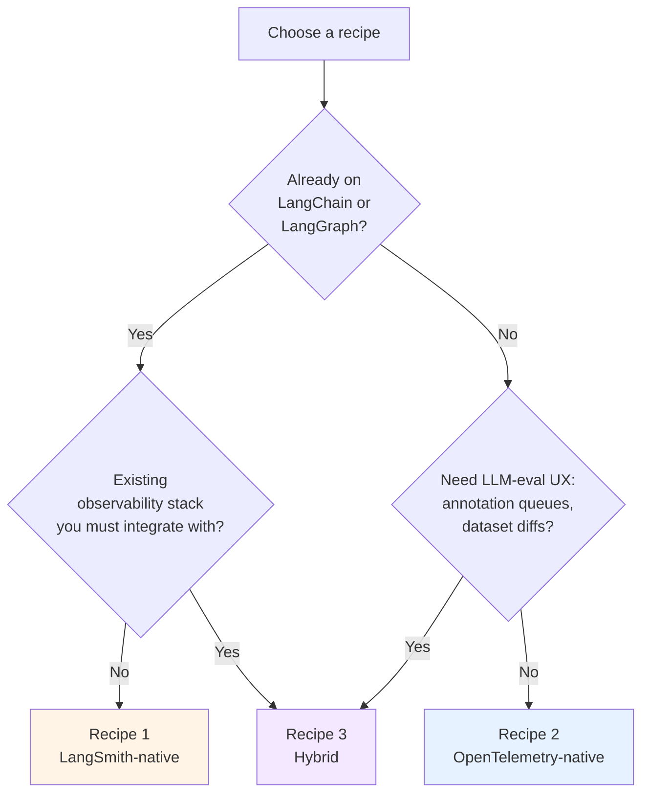

# Path 06 Recipes — Production Compositions

> 🟡 Slow-moving (architecture-stable) · ⏱ 20-25 min per recipe · 📍 Read after at least Modules 2-3 of Path 06 v1

This directory contains opinionated **production composition recipes** — orchestration guides showing how the seven Path 06 v1 modules assemble into real deployment shapes, given a team's existing stack.

These are different from the [top-level `/recipes/`](../../../recipes/) directory. Those are 5-minute copy-paste fixes ("how do I add retry-with-backoff"). These are 20-30 minute walkthroughs answering "given my existing stack and constraints, which Path 06 modules apply and in what order."

## The three recipes

| # | Recipe | Best for | Modules used |
|---|--------|----------|--------------|
| 1 | [LangSmith-native](./01-langsmith-native.md) | Teams already on LangChain/LangGraph; want fastest zero-to-production; OK with vendor coupling to LangSmith | M1, M2, M4 (LangSmith side), M5, M7 |
| 2 | [OpenTelemetry-native](./02-opentelemetry-native.md) | Teams with existing observability stack (Datadog, Honeycomb, self-hosted Grafana); want vendor-neutral telemetry; willing to build evaluation logic themselves | M1, M3, M4 (Collector side), M5, M6, M7 |
| 3 | [Hybrid LangSmith + OpenTelemetry](./03-hybrid-langsmith-and-otel.md) | Production teams needing both LLM-eval UX **and** vendor-neutral telemetry; the most realistic mid-2026 production shape | **All seven** + explicit hand-off discipline |

## How to choose between them

The branching is real, not cosmetic. As of mid-2026, the industry-survey data shows most production teams converge on the hybrid (Digital Applied, April 2026: "most teams pick one primary platform and pair it with a whole-stack APM"). Recipes 1 and 2 are the simpler edge cases; Recipe 3 is the practical middle that earns its longer write-up.

## What recipes are not

- **Not labs.** Recipes are documentation. No executable notebooks here. The labs they reference (Labs 17-22) remain the place where you run code.
- **Not deployment guides.** Recipes show YAML patterns and instrumentation shapes; they don't cover Docker, Kubernetes, your specific cloud, or your security posture. Those are organizationally-specific.
- **Not exhaustive.** Other production shapes exist (Langfuse-native, Arize-native, MLflow-native). The three here cover the dominant patterns; the [`_template.md`](./_template.md) lets contributors add others using the same shape.

## The shared shape

Every recipe follows the same 10-section structure:

1. **When this recipe fits** — team profile (existing stack, scale, constraints)
2. **What you'll have when you're done** — concrete deliverable list
3. **Architecture at a glance** — mermaid diagram of the data flow
4. **Step-by-step assembly** — Path 06 modules mapped to production actions
5. **Lab-shape vs production-shape** — table of what changes from the lab pattern to the real deployment
6. **Hand-off points** — explicit ownership of each artifact
7. **What this recipe doesn't give you** — anti-scope
8. **Operational checklist** — pre-launch sequence
9. **Cost envelope** — dollar estimates at 10K / 100K / 1M traces/month
10. **References + further reading**

The shape is documented in [`_template.md`](./_template.md). Contributing a fourth recipe (e.g., Langfuse-native) is a copy-paste-and-customize job.

## Reading order

If you're new to Path 06: read the [v1 modules first](../README.md). Recipes assume you've at least skimmed Modules 1-3 and understand the LangSmith-native vs OTel-portable choice.

If you're picking a production stack: start with the decision tree above, then read the relevant recipe end-to-end, then dip back into the v1 modules and labs as the recipe references them.

If you're auditing an existing deployment: read Recipe 3 first — its hand-off-discipline section documents the artifacts that production systems need explicit ownership over, regardless of which platform you ended up on.

## Version notes

Recipes are classified **slow-moving** for the same reason concept pages are: the architecture patterns change slowly, even if the specific tools shift. Each recipe carries a `verified YYYY-MM-DD` stamp at the top. If a tool's API moves out from under a recipe's example, please open an issue with the `bug` label.

Cost envelopes carry the most age-out risk (model pricing changes monthly). The numbers in each recipe are presented as ranges with their verification date; readers should re-verify against current vendor pricing before committing budgets.

## Contributing

The [`_template.md`](./_template.md) walks through each section with prompts. The right time to add a fourth recipe is when a deployment shape isn't covered by 1, 2, or 3 (e.g., self-hosted MLflow + OTel; Langfuse + OTel hybrid). Open a PR; a maintainer reviews against the shared shape.
