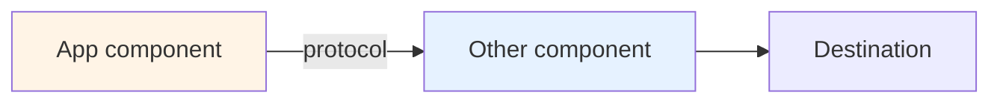

# Recipe N — [Stack name] production composition

> 🟡 Slow-moving · ⏱ ~XX min · 🛠 Verified YYYY-MM-DD · 📍 Read after Modules [X, Y, Z] of Path 06 v1

<!--
This is the template for adding a Path 06 production composition recipe.
Copy this file, rename to NN-stack-name.md, fill in each section, delete these
comments. The shape is deliberate — readers expect the same 10 sections across
all recipes. Departures should have a stated reason.

See README.md in this directory for the shared shape rationale and for examples
of how the existing three recipes (01, 02, 03) instantiate the template.
-->

## When this recipe fits

<!--
2-3 sentences profiling the team. What's their existing stack? What's their
scale? What's the constraint that pushes them toward this specific composition
rather than one of the other recipes?

Example (Recipe 1): "Your team is already building on LangChain or LangGraph;
the agent surfaces are LangChain primitives. Adding LangSmith costs you near-zero
instrumentation effort because the integration is automatic via environment
variables. You're OK with proprietary platform coupling because the LLM-eval UX
earns the vendor commitment."

Bad: "Your team wants observability." (Too generic — doesn't differentiate from
other recipes.)
-->

If [specific other constraint applies], link to a sibling recipe in this directory (e.g., `./0X-other-recipe.md`) and explain why.

## What you'll have when you're done

<!--
Concrete deliverable list. Not "you'll understand X"; "you'll have a deployment
that does Y." Each bullet should be testable — could the reader confirm they
have it by looking at their running system?

Aim for 6-8 bullets.
-->

- A [thing] doing [specific function].
- A [second thing] integrated with [system].
- ...

## Architecture at a glance



<!--
One mermaid diagram showing the data flow. Boxes are components; arrows are
data flows; labels on arrows name the protocol/format. Keep it under 12 boxes
or it stops being a "glance".

Use the fill colors from the existing recipes for consistency:
  app/source        : fill:#fff4e6  (warm)
  middleware/coll   : fill:#e6f2ff  (cool)
  vendor platform   : fill:#f3e8ff  (purple)
  ops/backend       : fill:#e6f6ec  (green)
-->

[1-2 sentences explaining what the diagram shows that's specific to this recipe.]

## Step-by-step assembly

### Step 1 — [Action] (Module M; Lab N patterns)

<!--
Each step maps a Path 06 module to a concrete production action. The mapping
is what makes the recipe earn its place — without it, the recipe is generic
advice. Every step should link to:
- The relevant concept page in concepts/evaluation/
- The relevant lab in labs/

Provide a code snippet or YAML block where it's useful. Keep snippets bounded
(<30 lines) and reference the lab for the full implementation.

Aim for 5-7 steps total.
-->

[Description of what this step does.]

```python
# Code snippet if relevant
```

→ Link to the relevant concept page (e.g. `concepts/evaluation/some-page.md`) and the relevant lab (e.g. `labs/NN-some-lab/`). Use standard markdown link syntax — see Recipe 1 / 2 / 3 for live examples.

### Step 2 — [Next action] (Module M)

...

## Lab-shape vs production-shape

<!--
A table contrasting what the labs do (simple, didactic, synthetic) with what
production does (full-stack, real traffic, operational discipline). This is
the section that prevents the recipe from reading like the lab.

Aim for 5-7 rows. Pick the modules where lab vs production differs meaningfully.
-->

| Module | Lab shape | Production shape (this recipe) |
|---|---|---|
| M[X] — [topic] | [Lab simplification] | [Production reality] |
| ... | ... | ... |

## Hand-off points

<!--
Table of artifacts: who emits, who consumes, where it lives. This is the
single most useful section for production teams — it disambiguates ownership.

Aim for 5-8 rows.
-->

| Artifact | Emitted by | Consumed by | Lives in |
|----------|-----------|-------------|----------|
| [Trace data] | [Agent app] | [Backend] | [Backend store] |
| ... | ... | ... | ... |

## What this recipe doesn't give you

<!--
Anti-scope. The recipe doesn't cover [X], [Y], [Z]. Be specific. The reader
should know what they still need to figure out on their own.

5-7 bullets. Each should be something a reasonable person might expect but
that this recipe deliberately omits.
-->

- **[Thing not in scope]** — [why; where to look instead].
- **[Another thing]** — [why].

## Operational checklist (pre-launch)

<!--
10-15 items. Each one should be a runnable check: not "consider X" but
"verify X". The list as a whole is the pre-launch gate.

Format as markdown checkboxes - [ ].
-->

- [ ] [Concrete check 1]
- [ ] [Concrete check 2]
- ...

## Cost envelope

Verified YYYY-MM-DD. Re-verify against current vendor pricing before committing.

<!--
Cost estimates at three traffic scales. Use a table with concrete dollar ranges,
not vague qualitative descriptions.

If the recipe uses paid vendors, link to their current pricing. If self-hosted,
include rough compute estimates.

ALWAYS include a verification date — cost numbers are the highest-age-out
content in the repo.
-->

| Traffic | Component A | Component B | Total /month |
|---------|-------------|-------------|--------------|
| 10K traces/mo | $X | $Y | $X+Y |
| 100K traces/mo | $X | $Y | $X+Y |
| 1M traces/mo | $X | $Y | $X+Y |

[1-2 sentences on which component dominates costs at which scale.]

## References + further reading

<!--
Repo-internal references first (concept pages, labs), then external sources.

External sources should be:
- Vendor documentation when documenting their product's behavior
- Reputable engineering blogs (LangChain, OpenAI, Datadog, etc.) when documenting
  patterns or research
- Industry surveys when documenting "what teams are actually doing"

Verified-via-web-search is the standard; use the existing recipes as the
reference shape for citation format.
-->

- Link relevant concept pages (e.g. paths under `concepts/evaluation/`) using markdown link syntax — see Recipes 1, 2, 3 for live examples.
- Link relevant labs (e.g. paths under `labs/`) using markdown link syntax.
- [Vendor docs] — [vendor.com/docs](https://vendor.com/docs) — [the canonical reference for X].
- [Engineering blog] — [blog.example.com](https://blog.example.com) — [the source of pattern Y].

<!--
DELETE BEFORE COMMITTING:

Pre-publication checklist:
- [ ] All `[bracketed placeholders]` replaced with real content
- [ ] Mermaid diagram syntax verified (paste into the GitHub preview to confirm)
- [ ] All concept-page and lab links resolve (no `[Lab NN]` placeholders)
- [ ] Cost envelope has a verification date
- [ ] At least 3 external references, each verified to exist
- [ ] Word-discipline check: scan against the locked forbidden-vocabulary list in `CONTRIBUTING.md` (no filler-grade hedges or marketing-tone superlatives)
- [ ] Reading time estimate matches actual length (rough heuristic: 1500 chars/min)
- [ ] PR title: "Path 06 v2: Add [Stack name] production recipe"
- [ ] Link the new recipe in recipes/README.md's table

Once those are done, delete this entire HTML comment block.
-->
