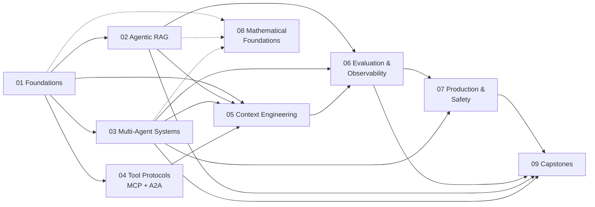

# Learning paths

Nine curated paths through the material. Each path is a reading list across the rest of the repo — it doesn't duplicate content, it sequences it.

If you're new to the repo, read [`docs/start-here.md`](../docs/start-here.md) first.

---

## How paths work

A path is a folder containing a single `README.md` that links to concepts, labs, recipes, patterns, and projects elsewhere in the repo. The path tells you:

- Who it's for and what you'll be able to do at the end.
- What you need to know before starting (prerequisites).
- The recommended order — usually a concept, then a lab, then sometimes a recipe or a small Build Challenge.
- Stretch goals and where to go next.

Paths overlap deliberately. The Multi-Agent path reuses concept pages from Foundations. The Production path leans on Evaluation. Reading two adjacent paths is expected, not wasteful.

---

## The nine paths at a glance

| # | Path | Who it's for | Difficulty | Status |
|---|---|---|---|---|
| 01 | [Foundations](./01-foundations/) | Engineers building their first real agent | 🟢 Beginner-friendly | ✅ Content shipped |
| 02 | [Agentic RAG](./02-agentic-rag/) | Anyone building retrieval-heavy agents | 🟡 Intermediate | ✅ Content shipped |
| 03 | [Multi-Agent Systems](./03-multi-agent-systems/) | Engineers orchestrating cooperating agents | 🟡 Intermediate | ✅ v1 complete + v2 patterns (6) shipped |
| 04 | [Tool Protocols (MCP + A2A)](./04-tool-protocols-mcp-a2a/) | Engineers wiring agents to tools and other agents | 🟡 Intermediate | ✅ All 7 modules shipped (Batches 43-50) — path complete |
| 05 | [Context Engineering](./05-context-engineering/) | Engineers fighting context-window problems | 🟡 Intermediate | 📋 Scaffold (Batch 42); modules planned |
| 06 | [Evaluation & Observability](./06-evaluation-observability/) | Engineers shipping agents they need to measure | 🔴 Advanced | ✅ v1 + v2 complete (recipes, patterns, projects, frameworks deep dive, embedding drift, adversarial red-teaming) |
| 07 | [Production & Safety](./07-production-and-safety/) | Engineers taking agents to production | 🔴 Advanced | 📋 Scaffold (Batch 42); `production/` + `security/` playbooks already authored |
| 08 | [Mathematical Foundations](./08-mathematical-foundations/) | Anyone who wants the theory behind the engineering | 🟢 → 🔴 (mixed) | 📋 Scaffold (Batch 42); 4 of 13 math pages authored |
| 09 | [Capstones](./09-capstones/) | Anyone ready to build something portfolio-worthy | 🔴 Advanced | 📋 Scaffold (Batch 42); 8 projects catalogued |

¹ Status indicators: ✅ shipped (content authored) · 📋 scaffold (landing README documents planned structure and existing related artifacts). Every link in this table resolves to a real, authored README. The paths will firm up these numbers as content lands and we see real completion data.

---

## Prerequisite graph

Solid arrows are real prerequisites. Dotted arrows indicate that the Math Foundations path runs *alongside* the others — you can read it in parallel, before, or never, depending on your taste for theory.

---

## Recommended order

There's no single right order, but two sequences cover most readers:

### The general-purpose sequence

For engineers who want broad agentic-AI capability:

1. **Foundations** — agent loop, tools, memory, first frameworks.
2. **Agentic RAG** — retrieval as a tool, not a pipeline.
3. **Multi-Agent Systems** — supervisor, hierarchical, swarm.
4. **Tool Protocols (MCP + A2A)** — interoperability.
5. **Context Engineering** — make agents efficient with their token budget.
6. **Evaluation & Observability** — measure quality and debug failures.
7. **Production & Safety** — ship it.
8. **Capstones** — combine everything in a portfolio project.

The **Mathematical Foundations** path is woven in via cross-links throughout. Read math pages as the concepts come up, or skip them and return when something surprises you.

### The "going to production this quarter" sequence

For engineers who already have a working agent and need to harden it:

1. **Evaluation & Observability** — measure what you have.
2. **Context Engineering** — cut cost and latency.
3. **Production & Safety** — deployment, guardrails, red-teaming.
4. Backfill from **Foundations**, **Agentic RAG**, or **Multi-Agent Systems** as gaps appear.

---

## Who each path is for

### 01 — Foundations

You've called LLM APIs and built simple chat features, but you haven't built a real agent with tools, memory, and a control loop. Start here. You'll build a ReAct-style agent from scratch (no framework), then move to LangGraph and Google ADK.

**Prerequisite knowledge:** Python at intermediate level. Familiarity with LLM APIs (OpenAI, Anthropic, or Google). Comfortable reading async code.

**At the end you can:** explain the agent loop in your own words, build a single agent that uses tools, manage short-term memory, and pick between LangGraph and ADK for a given problem.

### 02 — Agentic RAG

You've heard of RAG, possibly built a vanilla pipeline. This path takes you to *agentic* RAG, where retrieval is a tool the agent chooses to use — not a fixed step in a pipeline.

**Prerequisite knowledge:** Foundations path complete. Comfortable with vector embeddings as a concept.

**At the end you can:** design chunking strategies that don't lose meaning, build hybrid search, implement retrieval as an agent tool, and diagnose RAG failure modes.

### 03 — Multi-Agent Systems

You have a single agent that's getting too complex. This path covers the three main multi-agent topologies — supervisor, hierarchical, swarm — and when each is the right choice.

**Prerequisite knowledge:** Foundations path complete. Helpful to have read the **Tool Protocols** path if your agents will use MCP/A2A.

**At the end you can:** decompose a complex problem into agent specializations, pick the right topology, implement hand-offs cleanly, and avoid the common multi-agent failure modes.

### 04 — Tool Protocols (MCP + A2A)

You need agents to talk to external tools (MCP) or to each other (A2A) without writing bespoke integrations for every combination. This path covers the two protocols that matter, with code, plus the composition pattern that uses both together.

**Prerequisite knowledge:** Foundations path complete. Familiarity with JSON-RPC and HTTP is helpful but not required.

**At the end you can:** build an MCP server and client, expose tools to multiple agents, set up an A2A endpoint at production depth (signed cards, persistent task store, auth, streaming, observability), compose MCP with A2A in the canonical orchestrator pattern, and decide which protocol fits which problem.

### 05 — Context Engineering

Your agent works but is slow or expensive or both. This path treats the context window as a constrained resource and shows the techniques — selection, compression, summarization — that get more value per token.

**Prerequisite knowledge:** Foundations + one of {Agentic RAG, Multi-Agent Systems}.

**At the end you can:** profile token usage, design compression strategies, and meaningfully reduce cost and latency.

### 06 — Evaluation & Observability

You can't ship what you can't measure. This path covers tracing (LangSmith and OpenTelemetry), golden datasets, LLM-as-judge with calibration, and RAG-specific evaluation.

**Prerequisite knowledge:** Foundations + at least one of {Agentic RAG, Multi-Agent Systems}.

**At the end you can:** instrument an agent end-to-end, build a real evaluation dataset, implement LLM-as-judge with a sanity-checked judge, and produce report cards for your agents.

### 07 — Production & Safety

You have an evaluated agent and a deployment target. This path covers cost engineering, latency, streaming, async concurrency, guardrails, prompt-injection defenses, and the pre-launch checklist.

**Prerequisite knowledge:** Evaluation & Observability path complete. Real-world deployment experience helps.

**At the end you can:** estimate and reduce production cost, design defense-in-depth against prompt injection, deploy a stateful agent with durable execution, and run a red-team pass.

### 08 — Mathematical Foundations

You want to understand the math behind agentic AI without reading a textbook. This path covers autoregressive generation, embeddings, RAG marginalization, agent-as-policy, MDPs, evaluation metrics, and context-window optimization — each with the *what / why / where / source* template.

**Prerequisite knowledge:** Undergraduate-level probability and linear algebra. No reinforcement-learning background required.

**At the end you can:** read an agentic-AI paper without getting stuck on notation, reason about retrieval quality formally, and debug agent behavior with the right vocabulary.

### 09 — Capstones

You're past the learning phase and want a portfolio project. This path is a set of substantial Build Challenges and Capstone Projects, each combining work from multiple paths.

**Prerequisite knowledge:** At least three of paths 01–07 complete, plus a real deployment target.

**At the end you have:** one or more end-to-end agentic systems with traces, evals, deployment, and a write-up you can put in front of a recruiter or a tech lead.

---

## Path content status

This repo is built incrementally. Some paths will reach full coverage before others. The table below tracks where each path is — content is added continuously between releases, so check the latest [`CHANGELOG.md`](../CHANGELOG.md) for the current state.

| Path | Scaffold | Concepts | Labs | Recipes | Patterns | Projects |
|---|---|---|---|---|---|---|
| 01 Foundations | ☑ | ● | ● | ☐ | ☐ | ☐ |
| 02 Agentic RAG | ☑ | ● | ● | ☐ | ☐ | ☐ |
| 03 Multi-Agent Systems | ☑ | ● | ● | ☐ | ● | ☐ |
| 04 Tool Protocols (MCP + A2A) | ☑ | ● (7 of ~10) | ● (6 of ~5) | ☐ | ☐ | ☐ |
| 05 Context Engineering | ☑ | ☐ | ☐ | ☐ | ☐ | ☐ |
| 06 Evaluation & Observability | ☑ | ● | ● | ● | ● | ● |
| 07 Production & Safety | ☑ | ☐ | ☐ | ☐ | ☐ | ☐ |
| 08 Mathematical Foundations | ☑ | ● (4 of 13) | n/a | n/a | n/a | n/a |
| 09 Capstones | ☑ | n/a | n/a | n/a | n/a | ☐ |

Checkbox status is updated at each release. **All nine paths now have authored landing READMEs as of Batch 42; Path 04 is complete — all 7 modules shipped (the MCP build-consume-secure trio + A2A foundations + A2A production depth + MCP+A2A composition) as of Batch 50; the top-level [`patterns/`](../patterns/) catalog has 9 of 12 pages authored (Patterns 01, 03, 04, 05, 06, 07, 10, 11, 12) as of Batch 51.** Paths 05, 07, 08, 09 remain scaffolds — the path README documents the planned structure and links to the existing repo artifacts each path will build on. Paths 01, 02, 03 (v1 + v2 patterns), 06 (v1 + v2) have substantial content; Path 04 is the second path complete after Path 01; Path 08 has 4 of 13 math pages authored. If you want to help fill in a row, [`CONTRIBUTING.md`](../CONTRIBUTING.md) walks you through the workflow for each content type.

---

## Picking your first path

If you only do one thing: start with [Foundations](./01-foundations/). It's the only path that's a true prerequisite for the rest, and it ends with a working agent you can extend. Everything else is meaningfully easier once Foundations is done.

If you're impatient: [Lab 01](../labs/01-first-agent-from-scratch/) is a 60-minute taste of Foundations that gives you something running before you commit to the full path.
